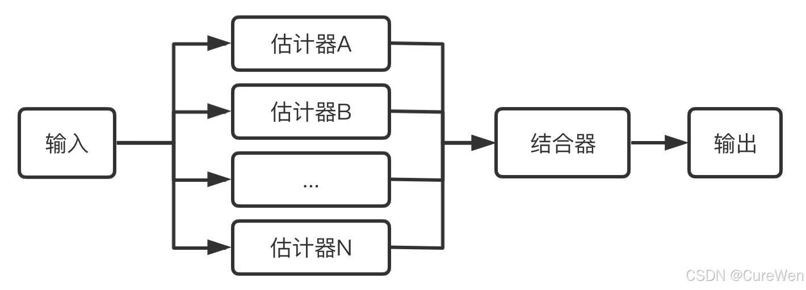
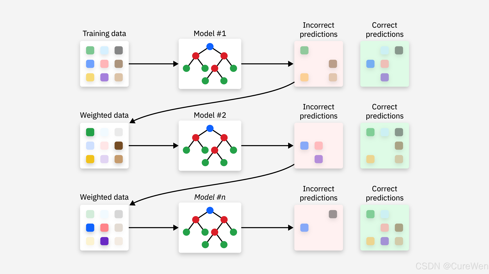
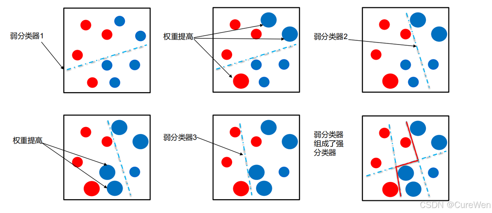
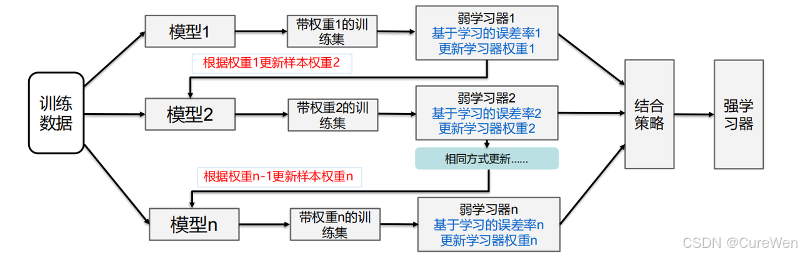
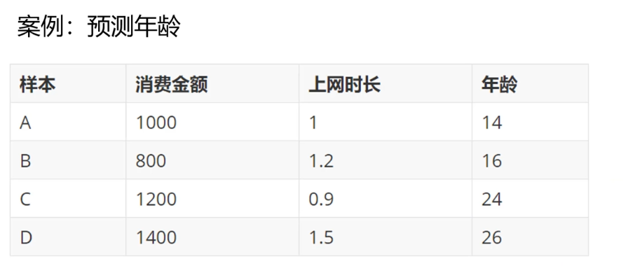
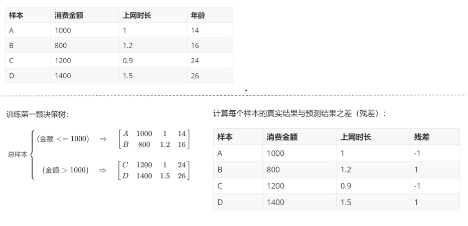
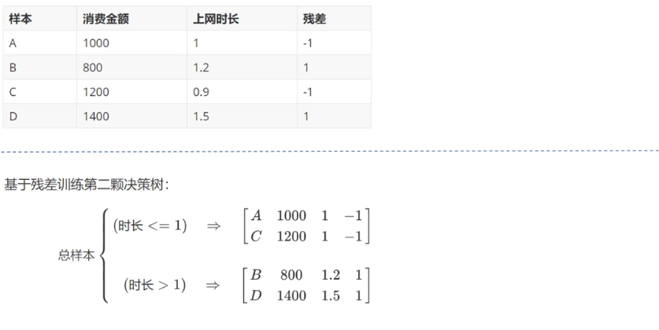
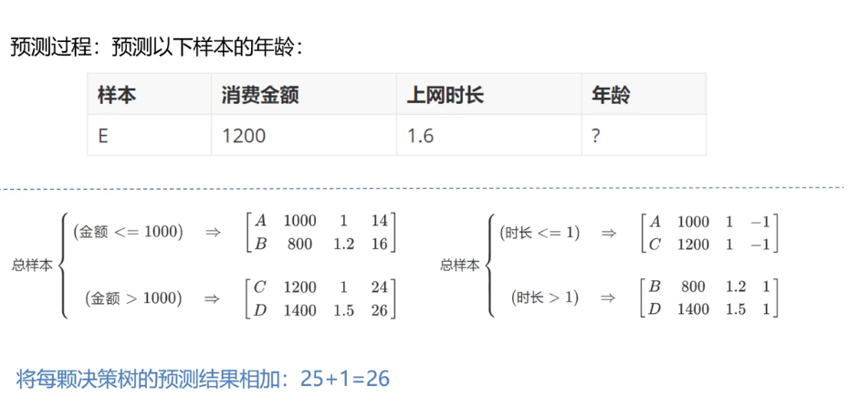
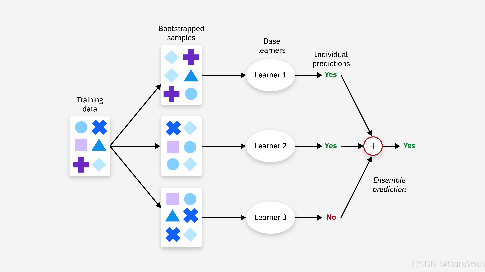
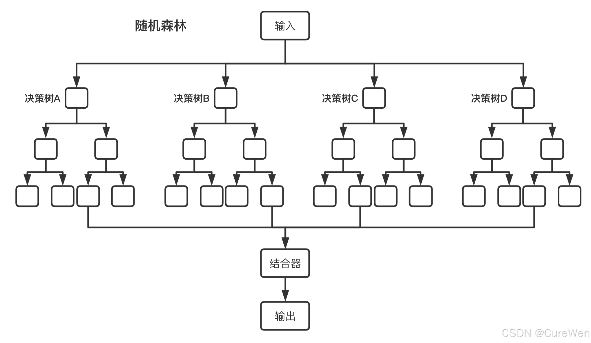

# 1. 集成学习

## 1.1 概述

集成学习（ensemble learning）是一种经典的机器学习范式，它的核心思想是“三个臭皮匠顶个诸葛亮”，即通过构建并合并多个单模型（通常叫做"弱学习器"或"基学习器"）来完成学习任务，从而获得比单一学习模型更显著优越的泛化性能，简言之，集成学习就是利用模型的“集体智慧”，提升预测的准确率。



**集成学习的核心原理：为何 “组合” 能提升性能？**

集成学习的有效性源于对 **偏差（Bias） 和 方差（Variance）** 的协同优化，这两个指标是衡量模型泛化能力的关键：

- **偏差**：模型对数据真实规律的拟合能力不足，表现为 “欠拟合”（如简单线性模型无法捕捉非线性数据）。
- **方差**：模型对训练数据的波动过于敏感，表现为 “过拟合”（如复杂决策树在训练集上准确率极高，但在测试集上大幅下降）。

单个模型往往难以同时降低偏差和方差（例如，增加模型复杂度会降低偏差但升高方差），而集成学习通过以下逻辑实现优化：

1. **降低方差**：多个弱学习器的预测结果存在随机性差异，“多数投票” 或 “结果平均” 能抵消个体模型的极端误差（类似 “集体决策优于个人判断”）。
2. **降低偏差**：通过对弱学习器的迭代优化（如 Boosting），逐步修正前期模型的错误，迫使后续模型聚焦于难分样本，从而整体提升拟合能力。

## 1.2 集成学习的核心范式

根据弱学习器的生成方式和组合策略，集成学习主要分为三大类：**Bagging、Boosting、Stacking**，三者在原理、流程和适用场景上差异显著。

### 1.2.1 Boosting

#### 1.2.1.1 什么是Boosting

Boosting是集成学习方法中的一个大类，其目标是通过减少整体的偏差来提高系统的性能。具体来讲，这类集成学习方法会依次训练若干个“基学习器”，其中每个“基学习器”都试图纠正前一个“基学习器”的错误，最后通过对所有“基学习器”的结果以加权投票的方式进行结合得到最终结果。因此，这类集成学习方法中的“基学习器”之间存在强依赖的串行关系。



其工作原理是：

- 先训练出一个初始模型；
- 根据模型的表现进行调整，使得模型预测错误的数据获得更多的关注，再重新训练下一个模型；
- 不断重复第二步，直到模型数量达到预先设定的数目T，最终将这T个模型**加权结合**（所有弱学习器按各自权重加权投票（分类）或加权平均（回归），得到最终结果）。

#### 1.2.1.2 AdaBoost算法

AdaBoost是Boosting算法族中最著名的算法，它根据每次训练集之中每个样本的分类是否正确，以及上次的总体分类的准确率，来确定每个样本的权值。将修改过权值的新数据集送给下层分类器进行训练，最后将每次训练得到的分类器最后融合起来，作为最后的决策分类器。



**具体来讲，AdaBoost的工作原理可概括为：**

**Step1（初始化权重）**：首先，为数据集中的每个样本分配相同的初始权重，确保所有样本在第一次迭代时都被平等对待。

**Step2（迭代训练“基学习器”）**：

- 在每一轮迭代中，使用当前权重分布的数据集来训练一个“基学习器”。

- 根据该“基学习器”的表现调整样本的权重。具体来说，如果某个样本被正确分类，则降低其权重；若被错误分类，则增加其权重。这样做是为了让下一轮“基学习器”更多地关注那些之前被误分类的样本。

**Step3（计算“基学习器”的重要性）**：每个“基学习器”都会根据其准确率获得一个权重值，这个值决定了它在最终决策中的话语权。准确率越高的“基学习器”将获得更高的权重。

**Step4（组合“基学习器”）**：最后，所有训练好的“基学习器”按照各自的重要性进行加权投票或加权求和，形成最终的“强学习器”。



**实现AdaBoost**

sklearn中，AdaBoost相关API：

```python
import sklearn.tree as st
import sklearn.ensemble as se

# model: 决策树模型（单个模型，基学习器）
model = st.DecisionTreeRegressor(max_depth=4)

# n_estimators：构建400棵不同权重的决策树，训练模型
model = se.AdaBoostRegressor(model, # 单模型
                             n_estimators=400, # 决策树数量
                             random_state=7)# 随机种子

# 训练模型
model.fit(train_x, train_y)

# 测试模型
pred_test_y = model.predict(test_x)
```

代码：

```python
# AdaBoosting示例
# 使用AdaBoosting预测波士顿房价
import sklearn.datasets as sd
import sklearn.utils as su
import sklearn.tree as st
import sklearn.ensemble as se
import sklearn.metrics as sm

# 加载boston地区房价数据
boston = sd.fetch_openml(name='boston', version=1, as_frame=True)  
print(boston.feature_names)
print(boston.data.shape)
print(boston.target.shape)

random_seed = 7  # 随机种子，计算随机值，相同的随机种子得到的随机值一样
x, y = su.shuffle(boston.data, boston.target, random_state = random_seed)
# 计算训练数据的数量
train_size = int(len(x) * 0.8) # 以boston.data中80%的数据作为训练数据
# 构建训练数据、测试数据
train_x = x[:train_size]  # 训练输入, x前面80%的数据
test_x = x[train_size:]   # 测试输入, x后面20%的数据
train_y = y[:train_size]  # 训练输出
test_y = y[train_size:]   # 测试输出

model2 = se.AdaBoostRegressor(st.DecisionTreeRegressor(max_depth=4),
                              n_estimators=400,   # 决策树数量
                              random_state=random_seed) # 随机种子
# 训练
model2.fit(train_x, train_y)
# 预测
pre_test_y2 = model2.predict(test_x)
# 打印预测输出和实际输出的R2值
print(sm.r2_score(test_y, pre_test_y2))
```

执行结果：

```
['CRIM' 'ZN' 'INDUS' 'CHAS' 'NOX' 'RM' 'AGE' 'DIS' 'RAD' 'TAX' 'PTRATIO'
 'B' 'LSTAT']
(506, 13)
(506,)
0.9068598725149652
```

可以看到，通过AdaBoost算法，回归模型获得了更高的R2值.

#### 1.2.1.3 GBDT算法

GBDT（Gradient Boosting Decision Tree 梯度提升树）通过多轮迭代，每轮迭代产生一个弱分类器，每个分类器在上一轮分类器的残差**（残差在数理统计中是指实际观察值与估计值（拟合值）之间的差）**基础上进行训练。基于预测结果的残差设计损失函数。GBDT训练的过程即是求该损失函数最小值的过程。

**具体来讲，GBDT的工作原理可概括为：**

**Step1（初始化模型）**：首先，初始化一个简单的模型（通常是一个常数值），作为初始预测结果。

**Step2（计算负梯度/伪残差）**：对于每个样本，基于当前模型的预测值计算损失函数相对于预测值的负梯度。这个负梯度在GBDT中充当了“残差”的角色，表示模型预测与真实值之间的差异。

**Step3（拟合“基学习器”到负梯度）**：使用当前的负梯度作为目标变量，训练一个新的决策树来拟合这些值。这一步的目标是找到能够最好解释负梯度（即残差）的模型。

**Step4（更新模型）**：将新训练的决策树添加到现有模型中，并根据学习率调整其贡献程度。学习率是一个介于0和1之间的参数，用于控制每棵新树对整体模型的影响大小。

**Step5（重复步骤2-4）**：重复上述过程，直到达到预设的最大迭代次数或满足其他停止条件（如模型不再显著改善）。



原理1：



原理2：



原理3：



```python
import sklearn.tree as st
import sklearn.ensemble as se
# 自适应增强决策树回归模型	
# n_estimators：构建400棵不同权重的决策树，训练模型
model = se.GridientBoostingRegressor(
    	max_depth=10, n_estimators=1000, min_samples_split=2)
# 训练模型
model.fit(train_x, train_y)
# 测试模型
pred_test_y = model.predict(test_x)
```

```python
import numpy as np
import matplotlib.pyplot as plt
import sklearn.datasets as sd
import sklearn.model_selection as ms
import sklearn.ensemble as se
import sklearn.metrics as sm
import sklearn.inspection as si

# 设置字体为 SimHei（黑体），支持中文显示
plt.rcParams["font.family"] = ["SimHei"]

# 1. 准备数据
# 加载鸢尾花数据集
iris = sd.load_iris()
X = iris.data[:, :2]  # 只使用前两个特征，便于可视化
y = iris.target

# 将其转换为二分类问题（类别0 vs 类别1和2）
y = np.where(y == 0, 0, 1)  # np.where(condition,x,y) 判断条件，为True的地方设置为x,否则为y
# print(y)

# 划分训练集和测试集
X_train, X_test, y_train, y_test = ms.train_test_split(
    X, y, test_size=0.3, random_state=7
)

# 2. 创建并训练GBDT模型
gbdt = se.GradientBoostingClassifier(
    n_estimators=100,  # 弱学习器的数量
    learning_rate=0.1,  # 学习率
    max_depth=3,  # 决策树的最大深度
    random_state=7
)

# 训练模型
gbdt.fit(X_train, y_train)

# 3. 模型评估
# 在测试集上进行预测
y_pred = gbdt.predict(X_test)

# 计算准确率
accuracy = sm.accuracy_score(y_test, y_pred)
print(f"准确率: {accuracy:.4f}")

# 打印分类报告
print("\n分类报告:")
print(sm.classification_report(y_test, y_pred))

# 4. 特征重要性分析
feature_importance = gbdt.feature_importances_
feature_names = iris.feature_names[:2]

print("\n特征重要性:")
for name, importance in zip(feature_names, feature_importance):
    print(f"{name}: {importance:.4f}")

# 5. 可视化决策边界
_, ax = plt.subplots(figsize=(10, 6))
si.DecisionBoundaryDisplay.from_estimator(
    gbdt, X, ax=ax, response_method="predict",
    cmap=plt.cm.Paired, alpha=0.8,
    xlabel=feature_names[0], ylabel=feature_names[1]
)

# 绘制训练点
plt.scatter(X_train[:, 0], X_train[:, 1], c=y_train, cmap=plt.cm.Paired, edgecolors="k", label="训练集")
# 绘制测试点
plt.scatter(X_test[:, 0], X_test[:, 1], c=y_test, cmap=plt.cm.Paired, edgecolors="r", marker="s", label="测试集")

plt.title("GBDT分类决策边界")
plt.legend()
plt.show()

# 6. 观察不同数量的弱学习器对性能的影响
train_errors = []
test_errors = []
n_estimators_range = range(1, 101)

for n_estimators in n_estimators_range:
    gbdt = se.GradientBoostingClassifier(
        n_estimators=n_estimators,
        learning_rate=0.1,
        max_depth=3,
        random_state=42
    )
    gbdt.fit(X_train, y_train)

    # 计算训练误差
    y_pred_train = gbdt.predict(X_train)
    train_errors.append(1 - sm.accuracy_score(y_train, y_pred_train))

    # 计算测试误差
    y_pred_test = gbdt.predict(X_test)
    test_errors.append(1 - sm.accuracy_score(y_test, y_pred_test))

# 绘制误差曲线
plt.figure(figsize=(10, 6))
plt.plot(n_estimators_range, train_errors, label="训练误差")
plt.plot(n_estimators_range, test_errors, label="测试误差")
plt.xlabel("弱学习器数量")
plt.ylabel("误差率")
plt.title("不同数量的弱学习器对GBDT性能的影响")
plt.legend()
plt.grid(True)
plt.show()
```

### 1.2.2 Bagging

#### 1.2.2.1 什么是Bagging

Bagging（Bootstrap Aggregating）是集成学习方法中的一个大类，其目标是通过减少整体的方差来提高系统的性能。具体来讲，这类集成学习方法通过自助采样法（Bootstrap Sampling，随机有放回的抽样）生成多个训练集，然后在每个训练集上训练出一个“基学习器”，最后通过对所有“基学习器”的结果进行投票（分类问题）或平均（回归问题）的方式得到最终结果。因此，这类集成学习方法中的“基学习器”之间不存在依赖关系。



#### 1.2.2.2 随机森林（Random Forest）

##### 什么是随机森林

随机森林（Random Forest，简称RF）是专门为决策树设计的一种集成方法，是Bagging法的一种拓展，它是指每次构建决策树模型时，不仅随机选择部分样本，而且还随机选择部分特征来构建多棵决策树.  这样不仅规避了强势样本对预测结果的影响，而且也削弱了强势特征的影响，使模型具有更强的泛化能力。

随机森林简单、容易实现、计算开销小，在很多现实任务中展现出强大的性能，被誉为“代表集成学习技术水平的方法”。



**具体来讲，Random Forest的工作原理可概括为：**

**Step1（数据采样）**：首先，从原始训练集中使用Bootstrap方法生成多个不同的子集。这一步骤有助于增加模型之间的多样性，若每棵树的样本集都一样，训练得到的每棵决策树都将会是一样的；若不放回抽样，每个训练样本集及其分布都不一样，可能导致训练的各决策树差异性很大，最终将难以进行结果汇总。

**Step2（特征选择）**：对于每棵决策树，在每一个节点上，不是考虑所有特征，而是随机选择一个特征子集，并从中选择最佳分割点。这一步骤有助于增加模型之间的多样性，从而提高整体模型的泛化能力和抗噪能力。

**Step3（构建决策树**）：在每个子集上构建一棵决策树。通常，这些树会生长到最大深度，不做剪枝处理。这是因为随机森林依赖于多棵树的平均效果来减少过拟合的风险，而不是单棵树的表现。

**Step4（结果汇总）**：

- 对于分类问题，最终输出是各个决策树预测结果的多数投票。

- 对于回归问题，最终输出是各个决策树预测结果的平均值。

##### 如何实现随机森林

sklearn中，随机森林相关API：

```python
import sklearn.ensemble as se

model = se.RandomForestRegressor(
    max_depth, # 决策树最大深度
    n_estimators, # 决策树数量
    min_samples_split)# 子表中最小样本数 若小于这个数字，则不再继续向下拆分
```

以下是利用随机森林实现波士顿房价预测的代码：

```python
# 使用随机森林预测波士顿房价
import sklearn.datasets as sd
import sklearn.utils as su
import sklearn.tree as st
import sklearn.ensemble as se
import sklearn.metrics as sm

# 加载boston地区房价数据
boston = sd.fetch_openml(name='boston', version=1, as_frame=True)   
print(boston.feature_names)
print(boston.data.shape)
print(boston.target.shape)

random_seed = 7  # 随机种子，计算随机值，相同的随机种子得到的随机值一样
x, y = su.shuffle(boston.data, boston.target, random_state=random_seed)
# 计算训练数据的数量
train_size = int(len(x) * 0.8)  # 以boston.data中80%的数据作为训练数据
# 构建训练数据、测试数据
train_x = x[:train_size]  # 训练输入, x前面80%的数据
test_x = x[train_size:]  # 测试输入, x后面20%的数据
train_y = y[:train_size]  # 训练输出
test_y = y[train_size:]  # 测试输出

# 创建随机森林回归器，并进行训练
model = se.RandomForestRegressor(max_depth=10,  # 最大深度
                                 n_estimators=1000,  # 树数量
                                 min_samples_split=2)  # 最小样本数量，小于该数就不再划分子节点
model.fit(train_x, train_y)  # 训练

# 基于天统计数据的特征重要性
fi_dy = model.feature_importances_
# print(fi_dy)
pre_test_y = model.predict(test_x)
print(sm.r2_score(test_y, pre_test_y))  # 打印r2得分
```

打印输出：

```
['CRIM' 'ZN' 'INDUS' 'CHAS' 'NOX' 'RM' 'AGE' 'DIS' 'RAD' 'TAX' 'PTRATIO'
 'B' 'LSTAT']
(506, 13)
(506,)
0.9271955403309159
```

