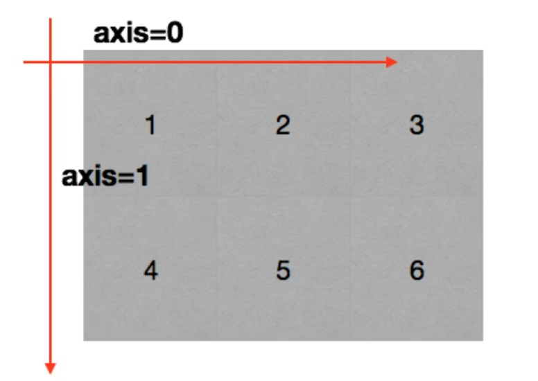
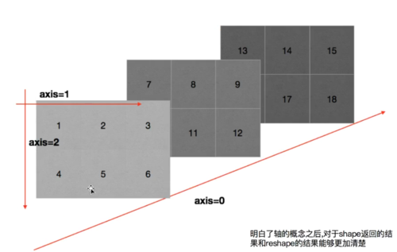

# 1. Python 科学计算库 - Numpy

## 1.1 Numpy 概述

- **什么是 Numpy**

  一个在 Python 中做科学计算的基础库，重在数值计算，也是大部分 Python 科学计算库（pandas、scikit-learn 等）的基础库，多用于在大型、多维数组上执行数值运算。

  Numpy 的底层核心用 C 实现，并调用高度优化的数学库，运行效率极高。

- **Numpy 的安装**

  ```python
  python -m pip install numpy
  ```

- **Numpy 的核心：多维数组 + 数值计算**

  代码简洁：减少 Python 代码中的循环

  ```python
  import numpy as np
  
  # 创建ndarray数组
  ary = np.array([1,2,3,4,5,6])
  print(ary,type(ary))
  
  list01 = [1,2,3,4,5,6]
  for i in range(len(list01)):
      list01[i] += 3
  print(list01)
  
  # 与列表的区别 - 给每一个元素加3，需要通过for循环遍历然后逐个加3
  # ndarray的运算  - 直接在ndarray数组对象上加3
  print(ary + 3)
  print(ary + ary)
  print(ary * 2)
  print(ary > 3)
  
  ary1 = np.array([[1,2,3],[4,5,6]])
  print(ary1,type(ary1))
  print(ary1 + 3)
  ```

## 1.2 Numpy 基础

### 1.2.1 ndarray 数组

用 np.ndarray 类的对象表示 n 维数组

```python
import numpy as np
ary = np.array([1,2,3,4,5,6])
print(type(ary))
```

#### 1.2.1.1 内存中的 ndarray 对象

- **元数据（metadata）**

  存储对目标数组的描述信息，如：ndim、shape、size、dtype、data 等。

- **实际数据**

  完整的数组数据。


将实际数据与元数据分开存放设计的核心特性称为**视图机制**。**视图是共享原始数据、但有自己的元数据（shape、strides、dtype 等）的新数组对象**。优势如下：

- **内存高效的数据共享**

  多个 `ndarray` 可以共享同一份数据，只修改各自的元数据。

  ```python
  import numpy as np
  
  arr = np.array([1, 2, 3, 4, 5, 6])
  view1 = arr[::2]   # 步长2，取[1,3,5]
  view2 = arr[1::2]  # 步长2，取[2,4,6]
  
  # 三个对象共享同一块内存
  # .data 属性是访问原始数据缓冲区
  print(arr.data)      # 内存地址: 0x7f8a1c000000
  print(view1.data)    # 相同地址
  print(view2.data)    # 相同地址
  
  # 修改视图会影响原数组
  view1[0] = 100
  print(arr[0])  # 100
  ```

- **减少对实际数据的访问频率，提高性能**

  通过元数据中的 `strides`（步长），可以实现转置、广播等高维操作，不移动数据。转置、广播、扩展维度都只是元数据的变化，性能极高。

  > NumPy 数组的数据实际存储在一块连续的一维内存中。`strides` 是一个元组，其中的每个整数对应数组的一个维度，代表沿着该维度**前进一个位置**所需的字节数。
  >
  > 定位一个多维数组元素 `a[i, j, k]` 在内存中的位置，可以通过如下公式计算：
  >
  > > ```
  > > offset = i * strides[0] + j * strides[1] + k * strides[2]
  > > ```
  >
  > 这个 `offset` 是相对于数组数据起始位置的字节偏移量。

  ```python
  import numpy as np
  
  arr = np.arange(6).reshape(2, 3)
  print(arr.strides)  # (24, 8)  - 行间步长24字节，列间步长8字节
  
  # 转置 - 只交换元数据中的shape和strides
  transposed = arr.T
  print(transposed.strides)  # (8, 24)  - 步长交换了
  print(transposed.base is arr)  # True - 共享数据
  
  # 广播
  a = np.array([1,2,3])
  b = np.array([[1],[2],[3]])
  c = a + b  # 不复制数据，通过strides实现广播
  ```

#### 1.2.1.2 ndarray 数组对象的特点

1. Numpy 数组是同质数组，即所有元素的数据类型必须相同。
2. Numpy 数组的下标从 0 开始，最后一个元素的下标为数组长度减 1 。

#### 1.2.1.3 ndarray 数组对象的创建

- np.array(任何可被解释为 Numpy 数组的逻辑结构)

```python
# np.array(任何可被解释为Numpy数组的逻辑结构)
t1 = np.array([[[1,2],[3,4]],[[5,6],[7,8]]])
print(t1,type(t1))

# np.array({"a":1,"b":2,"c":3}) 
# 有些版本的numpy会报错
# 字典被当作一个标量对象，NumPy 试图把它塞进数组的一个元素里。
# 因为只有一个元素（整个字典），它会创建一个 0 维数组，shape = ()。
# 因为 0 维 object 数组在打印时，会直接调用该对象的 __repr__ 方法。而你存的恰好是字典，所以输出就是字典的字符串
# 取单个元素：0 维数组可以用 [()] 取出值
```

- np.arange(起始值(0),终止值,步长(1))

```python
# np.arange(起始值(0)，终止值，步长(1))
t2 = np.arange(0,5,1)
print(t2,type(t2))
t3 = np.arange(0,10,2)
print(t3)
```

- np.zeros(shape,dtype='类型')

```python
# np.zeros(shape，dtype="类型")
t4 = np.zeros(10,dtype='int32')
print(t4)
```

- np.ones(shape,dtype='类型')

```python
# np.ones(shape，dtype="类型")
t5 = np.ones(10,dtype='bool_')
print(t5)

# 创建一个2行4列的全1数组
t6 = np.ones((2,4),dtype='int32')
print(t6)
```

- np.zeros_like(ary)   np.ones_like(ary)

```python
# np.zeros_like(ary)  np.ones_like(ary)
t7 = np.ones_like(t1)
print(t7)
```

- np.linspace(起始值,终止值,个数)

```python
# np.linspace(起始值,终止值,个数)
t8 = np.linspace(-10,10,200)
print(t8)
```

- np.random.normal(期望值,标准差,个数)

  生成正态分布（高斯分布）随机数

```python
# np.random.normal(期望值,标准差,个数)
t9 = np.random.normal(0,1,100) # 标准正态分布，均值为0标准差为1
print(t9)
```

思考：创建一个 5 个 0.2 的数组

```python
t10 = np.ones(5) / 5
print(t10)
```

#### 1.2.1.4 Numpy 的内部基本数据类型

| 类型名       | 类型表示符                              | 字符码            |
| ------------ | --------------------------------------- | ----------------- |
| 布尔型       | bool_                                   | ？                |
| 有符号整数型 | int8(-128~127) / int16 / int32 / int64  | i1 / i2 / i4 / i8 |
| 无符号整数型 | uint8(0~255) / uint16 / uint32 / uint64 | u1 / u2 / u4 / u8 |
| 浮点型       | float16 / float32 / float64             | f2 / f4 / f8      |
| 复数型       | complex64 / complex128                  | c8 / c16          |
| 字串型       | str_，每个字符用32位Unicode编码表示     | U                 |

#### 1.2.1.5 ndarray 对象属性的基本操作

- **数组的维度：**np.ndarray.shape

```python
import numpy as np

# shape属性
a = np.arange(1,9)
print(a,a.shape)     # (8,)  一维8个数据的数组
# a.shape = (2,4)      # 修改一个数组的shape属性
a.shape = (2,2,2)
print(a,a.shape)

# 二维数组
ary = np.array([
    [1,2,3,4],
    [5,6,7,8]
])
print(type(ary), ary, ary.shape)

# 数组维度的操作
# 1. 视图变维(共享数据) reshape() 与 ravel()
import numpy as np
a = np.arange(1, 9)
b = a.reshape(2, 4)		# 视图变维:变为2行4列的二维数组
c = b.reshape(2, 2, 2)  # 视图变维:变为2页2行2列的三维数组
d = c.ravel()			# 视图变维:变为1维数组

print("a:",a)
print("b:",b)
print("c:",c)
print("d:",d)

# base 属性是 NumPy 数组的一个重要元数据属性，它指向数组数据的原始拥有者。简单说，它告诉你当前数组的数据是从哪个数组"借来"的。
print("a.base:", a.base)        # None (a 是原始数据)
print("b.base is a:", b.base is a)  # True
print("c.base is a:", c.base is a)  # True
print("d.base is a:", d.base is a)  # True

# 2. 复制变维（数据独立） flatten()
e = c.flatten()
print("e:",e)
a += 10
print("a:",a)
print("e:",e)
print("e.base is a:", e.base) # None
print("b:",b) # ？

# 3. 就地变维
# resize直接改变原数组对象的维度，不返回新数组
a.shape = (2, 4)
print("a:",a)
a.resize(2, 2, 2)
print("a:",a)
```

- **元素的类型：**np.ndarray.dtype

```python
import numpy as np
ary = np.array([1, 2, 3, 4, 5, 6])
print(type(ary), ary, ary.dtype)
# 转换ary元素的类型
b = ary.astype(float)
print(type(b), b, b.dtype)
# 转换ary元素的类型
c = ary.astype(str)
print(type(c), c, c.dtype)
```

- **数组元素的个数：**np.ndarray.size

```python
import numpy as np
ary = np.array([
    [1,2,3,4],
    [5,6,7,8]
])
# 观察维度，size，len的区别
# len() 函数只考虑最外层的元素个数
print(ary.shape, ary.size, len(ary))
```

- **数组元素索引(下标)**

  数组对象[..., 页号, 行号, 列号]

  下标从0开始，到数组len-1结束。

```python
import numpy as np
a = np.array([[[1, 2],
               [3, 4]],
              [[5, 6],
               [7, 8]]])
print(a, a.shape)
print(a[0])
print(a[0][0])
print(a[0][0][0])
print(a[0, 0, 0])

# 打印每一个元素值
for i in range(a.shape[0]):
    for j in range(a.shape[1]):
        for k in range(a.shape[2]):
            print(a[i, j, k])
```

#### 1.2.1.6 轴（axis）

在 numpy 中可以理解为方向，使用0,1,2...数字表示，对于一个一维数组，只有一个0轴，对于2维数组(shape(2,2))，有0轴和1轴，对于三维数组(shape(2,2,3))，有0,1,2轴

有了轴的概念之后，我们计算会更加方便，比如计算一个二维数组的平均值，必须指定是计算哪个方向上面的平均值






**沿轴操作的本质：**

​	"沿某个轴操作" = "这个轴被压缩（消失），其他轴保留"

​	axis=0：沿着垂直方向操作，压缩行

​	axis=1：沿着水平方向操作，压缩列

**轴 = 数组的第几个维度，axis=k 的聚合操作会把第 k 个维度"压缩掉"（对应 shape 中该位消失），而运算本质上就是沿着这个方向把元素合并成一个。**

#### 1.2.1.7 ndarray 数组切片操作

对于刚加载出来的数据，我如果想选择其中的某一列或行或页我们应该怎么做？

二维数组[行的切片，列的切片]

三维数组[页的切片，行的切片，列的切片]

```python
# 数组对象切片的参数设置与列表切片参数类似
# 步长+：默认切从首到尾
# 步长-：默认切从尾到首
# 默认位置步长：1
数组对象[起始位置:终止位置:步长, ...]
```

```python
import numpy as np
a = np.arange(1, 10)
print(a)  # 1 2 3 4 5 6 7 8 9
print(a[:3])  # 1 2 3
print(a[3:6])   # 4 5 6
print(a[6:])  # 7 8 9
print(a[::-1])  # 9 8 7 6 5 4 3 2 1
print(a[:-4:-1])  # 9 8 7
print(a[-4:-7:-1])  # 6 5 4
print(a[-7::-1])  # 3 2 1
print(a[::])  # 1 2 3 4 5 6 7 8 9
print(a[:])  # 1 2 3 4 5 6 7 8 9
print(a[::3])  # 1 4 7
print(a[1::3])  # 2 5 8
print(a[2::3])  # 3 6 9
```

**多维数组的切片操作**

```python
import numpy as np
a = np.arange(1, 28)
a.resize(3,3,3)
print(a)
# 切出1页 
print(a[1, :, :])		
# 切出所有页的1行
print(a[:, 1, :])		
# 切出0页的1行1列
print(a[0, :, 1])
```

#### 1.2.1.8 ndarray 数组的掩码操作

数据很大情况下是凌乱的，并且含有空白的或者无法处理的字符，掩码式数组可以很好的忽略残缺的或者是无效的数据点。掩码分为：布尔掩码 和 索引掩码。布尔掩码是掩出位置为True的值 ，从大数据集中抽取出一小部分。索引掩码是按对应下标的元素输出出来。

```python
import numpy as np
# 布尔掩码
a = np.arange(1, 10)
mask = [True, False,True, False,True, False,True, False,True, False]
print(a[mask])
mask = d % 2 == 0
print(a[mask])

# 索引掩码
products = np.array(['Apple','Mi','Huawei','Oppo'])
inds = [1,3,2,0]
print(products[inds])
```

#### 1.2.1.9  多维数组的组合拆分

假设：现在有两个表，一个表三列存放三个同学的语数外三科成绩，另外一张表三列存放这三个同学的史地生成绩，现在将这三个同学的成绩合并在一起，那这个就是水平方向的一个合并

假设：现在有两个表，一个表存放三名同学所有成绩，另一张表存放其他三名同学所有成绩，现将这六名同学合并在同一个表，那这个就算是垂直方向的一个合并

**垂直方向操作：**


```python
import numpy as np
a = np.arange(1, 7).reshape(2, 3)
b = np.arange(7, 13).reshape(2, 3)
# 垂直方向完成组合操作，生成新数组
c = np.vstack((a, b))
# 垂直方向完成拆分操作，生成两个数组
d, e = np.vsplit(c, 2)
```

**水平方向操作：**


```python
import numpy as np
a = np.arange(1, 7).reshape(2, 3)
b = np.arange(7, 13).reshape(2, 3)
# 水平方向完成组合操作，生成新数组 
c = np.hstack((a, b))
# 水平方向完成拆分操作，生成两个数组
d, e = np.hsplit(c, 2)
```

**多维数组组合与拆分的相关函数：**

```python
# 通过axis作为关键字参数指定组合的方向，取值如下：
# 若待组合的数组都是二维数组：
#	0: 垂直方向组合
#	1: 水平方向组合
# 若待组合的数组都是三维数组：
#   0: 深度方向组合（堆平面）
#   1: 垂直方向组合（堆行）
#   2: 水平方向组合（拼列）
np.concatenate((a, b), axis=0)
# 通过给出的数组与要拆分的份数，按照某个方向进行拆分，axis的取值同上
np.split(c, 2, axis=0)
```

> 上述方法都属于拼接，不增加维度，它是把现有维度拉长。

**深度方向操作：**

```python
import numpy as np
a = np.arange(1, 7).reshape(2, 3)
b = np.arange(7, 13).reshape(2, 3)
# 深度方向（3维）完成组合操作，生成新数组
# dstack是堆叠，增加维度 相当于stack(...,axis=2)
# stack()：把 K 个形状相同的 N 维数组，沿某个新轴堆叠，得到形状为 (...) 的 (N+1) 维数组。新轴的大小等于 K，位置由 axis 决定。

i = np.dstack((a, b))
# 深度方向（3维）完成拆分操作，生成两个数组
k, l = np.dsplit(i, 2)
```

#### 1.2.1.10 自定义复合类型(结构化数组)

结构化数组允许你在一个 NumPy 数组中存储**不同类型**的数据。

```python
# 自定义复合类型
import numpy as np

data=[
	('zs', [90, 80, 85], 15),
	('ls', [92, 81, 83], 16),
	('ww', [95, 85, 95], 15)
]
#第一种设置dtype的方式
a = np.array(data, dtype='U3, 3int32, int32')   # U3：每个元素最多 3 个 Unicode 字符
print(a)
# 字段名自动生成：'f0','f1','f2'
print(a[0]['f0'], ":", a[1]['f1'])
print("=====================================")

#第二种设置dtype的方式-字典格式
c = np.array(data, dtype={'names': ['name', 'scores', 'ages'],
                    'formats': ['U3', '3int32', 'int32']})
print(c[0]['name'], ":", c[0]['scores'], ":", c.itemsize)
print("=====================================")
```

#### 1.2.1.11 ndarray 数组对象的其他属性

- shape - 维度
- dtype - 元素类型
- size - 元素数量
- ndim - 维数，len(shape)
- itemsize - 元素字节数
- nbytes - 总字节数 = size x itemsize
- real - 复数数组的实部数组
- imag - 复数数组的虚部数组
- T - 数组对象的转置视图
- flat - 扁平迭代器

```python
import numpy as np
a = np.array([[1 + 1j, 2 + 4j, 3 + 7j],
              [4 + 2j, 5 + 5j, 6 + 8j],
              [7 + 3j, 8 + 6j, 9 + 9j]])
print(a.shape)
print(a.dtype)
print(a.ndim)
print(a.size)
print(a.itemsize)
print(a.nbytes)
print(a.real, a.imag, sep='\n')
print(a.T)
print([elem for elem in a.flat])
b = a.tolist()  # list(arr) 只转最外层，内部仍是ndarray  arr.tolist() 递归全部转换，全部转为Python原生类型
print(b)
```

### 1.2.2 广播机制

广播的核心原则是：当两个数组的维度形状不匹配时，NumPy 会自动扩展较小数组的维度，使其与较大数组的形状兼容。这种扩展仅发生在虚拟层面，不会实际复制数据，这使得 NumPy 操作既内存高效又计算快速。

- **广播机制核心规则**

  广播机制遵循以下规则：

  1. **维度扩展**：若数组维度数不同，较小维度数组的形状会在前面补1，直到维度数相同。
  2. **维度兼容**：从最后一个维度开始向前比较，若两个数组的维度大小相等或其中一个为1，则兼容；否则报错。
  3. **虚拟扩展**：兼容后，NumPy 会在运算时逻辑上扩展大小为1的维度，使其与另一个数组的维度大小相同，但不会实际复制数据。

- **广播示例详解**

  - 示例1：标量与数组

    ```python
    import numpy as np
    
    a = np.array([1, 2, 3])
    b = 10  # 标量 → 视为 shape ()
    
    result = a + b  # [11 12 13]
    ```

    - `a.shape = (3,)`
    - `b.shape = ()` → 自动扩展为 `(1,)` → 再广播为 `(3,)`

  - 示例2：一维与二维

    ```python
    A = np.array([[1, 2, 3],
                  [4, 5, 6]])    # shape (2, 3)
    v = np.array([10, 20, 30])   # shape (3,)
    
    C = A + v
    print(C)
    # [[11 22 33]
    #  [14 25 36]]
    ```

    **广播过程**：

    - 对齐维度：`A: (2, 3)` vs `v: (3,)` → 补全为 `(1, 3)`
    - 比较各维度：
      - 第 1 维：`2` vs `1` → 允许（1 可扩展为 2）
      - 第 2 维：`3` vs `3` → 相等
    - 结果形状：`(2, 3)`

    > 💡 `v` 被“复制”到每一行，但**没有实际复制内存**！（**没有**在内存中分配一个 `(2, 3)` 的新数组来存放重复的 `v`）

  - 示例3：列向量与行向量

    ```python
    row = np.array([1, 2, 3])      # shape (3,)
    col = np.array([[10], [20]])   # shape (2, 1)
    
    result = row + col
    print(result)
    # [[11 12 13]
    #  [21 22 23]]
    ```

    **广播过程**：

    - `row`: (3,) → (1, 3)
    - `col`: (2, 1)
    - 对齐后：
      - 第 1 维：`1` vs `2` → 扩展为 2
      - 第 2 维：`3` vs `1` → 扩展为 3
    - 结果：`(2, 3)`

  - 示例4：广播失败的案例

    维度不兼容

    ```python
    a = np.array([1, 2])        # (2,)
    b = np.array([[1, 2, 3]])   # (1, 3)
    
    # a + b → 报错！
    # 维度对齐：(1,2) vs (1,3)
    # 最后一维：2 ≠ 3，且都不为1 → 无法广播
    ```

    中间维度冲突

    ```python
    A = np.random.rand(2, 3, 4)
    B = np.random.rand(2, 5, 4)
    
    # A + B → 报错！
    # 第2维：3 vs 5 → 无法广播
    ```

### 1.2.3 numpy 常用统计方法

- **获取最大值最小值位置**    np.argmax(ary,axis=0)    np.argmin(ary,axis=1)

```python
import numpy as np

a = np.arange(1,7).reshape(2,3)
print(a)
print(np.argmax(a,axis=0))
print(np.argmax(a,axis=1))

b = np.array([2,6,3,1,9,5]).reshape(2,3)
print(b)
print(np.argmin(b,axis=0))
print(np.argmin(b,axis=1))
```

- **求和**   ary.sum(axis=None)

```python
import numpy as np

a = np.array([10,5,3,7,4,6]).reshape(2,3)
print(a)
# 将所有元素求和
print(a.sum())
# 将列方向的元素求和
print(a.sum(axis=0))
# 将行方向的元素求和
print(a.sum(axis=1))
```

- **均值**   ary.mean(axis=None)

```python
# 将所有元素求均值
print(a.mean())
# 将列方向的元素求均值
print(a.mean(axis=0))
# 将行方向的元素求均值
print(a.mean(axis=1))
```

- **中值（中位数）**  np.median(ary,axis=None) 

中位数指数组中的各个元素值按大小顺序排列起来,形成一个数列,处于数列中间位置的变量值就称为中位数。当数列的元素个数N为奇数时,处于中间位置的变量值即为中位数；当N为偶数时,中位数则为处于中间位置的2个变量值的平均数。

```python
# 将所有元素求中值
print(np.median(a))
# 将列方向的元素求中值
print(np.median(a,axis=0))
# 将行方向的元素求中值
print(np.median(a,axis=1))
```

- **最大值最小值**   ary.max(axis=None)     ary.min(axis=None)  

```python
# 将所有元素求最大值
print(a.max())
# 将列方向的元素求最大值
print(a.max(axis=0))
# 将行方向的元素求最大值
print(a.max(axis=1))
```

- **极值**  最大值与最小值之差  np.ptp(ary,axis=None)

```python
# 将所有元素求极值
print(np.ptp(a))
# 将列方向的元素求极值
print(np.ptp(a,axis=0))
# 将行方向的元素求极值
print(np.ptp(a,axis=1))
```

- **标准差 **   ary.std(axis=None)

标准差是一组数据平均值分散程度的一种度量。一个较大的标准差，代表大部分数值和其平均值之间差异较大；一个较小的标准差，代表这些数值较接近平均值反映出数据的波动稳定情况，越大表示波动越大，越不稳定。

```python
# 将所有元素求标准差
print(a.std())
# 将列方向的元素求标准差
print(a.std(axis=0))
# 将行方向的元素求标准差
print(a.std(axis=1))
```

