# 一、pandas概述

Python Data Analysis Library

pandas 是基于 Numpy 的一种工具，该工具是为了解决数据分析任务而创建的。Pandas 纳入了大量库和一些标准的数据模型，提供了高效地操作大型结构化数据集所需的工具。

安装 pandas ：

```shell
python -m pip install pandas -i https://pypi.tuna.tsinghua.edu.cn/simple/
```

# 二、pandas 核心数据结构

数据结构是计算机存储、组织数据的方式。通常情况下，精心选择的数据结构可以带来更高的运行或者存储效率。数据结构往往同高效的检索算法和索引技术相关。

## 2.1 数据结构之一 --- Series

Series 可以理解为一个一维的数组，只是 index 名称可以自己改动。类似于定长的有序字典，有 index 和 value。

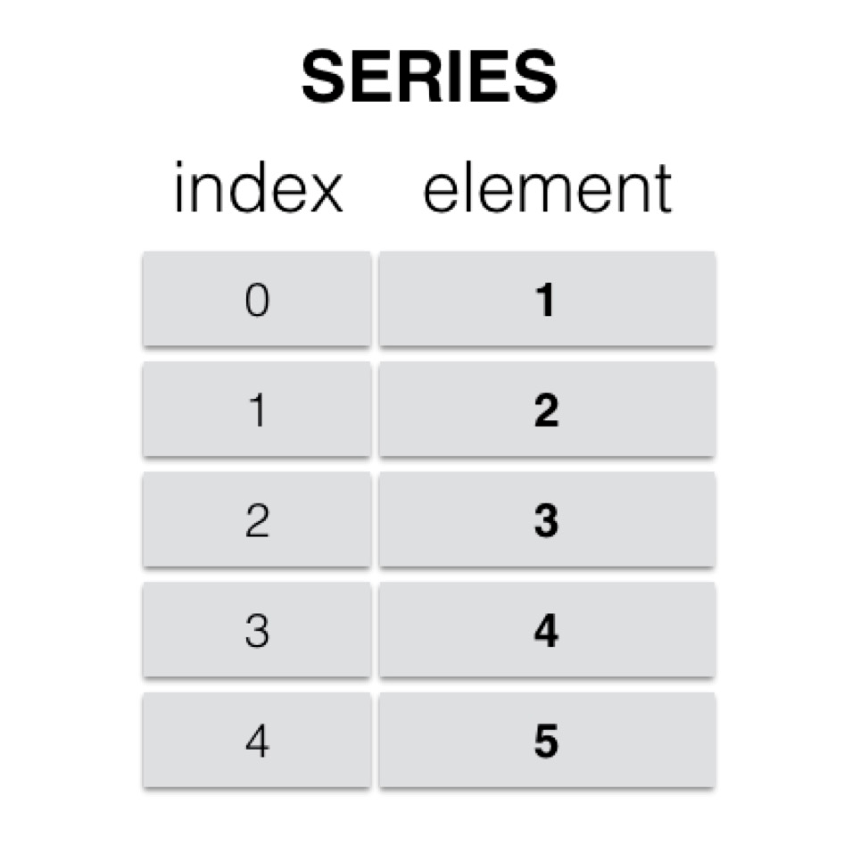

### 2.1.1 series的创建

```python
import pandas as pd

# 创建一个空的Series
s1 = pd.Series()
print(s1,type(s1))

# 使用ndarray创建一个Series，不指定索引
s2 = pd.Series([1,2,3,4,5])
print(s2,type(s2))

# 使用ndarray创建一个Series 
s3 = pd.Series(['张三','李四','王五','赵柳'],index=['s01','s02','s03','s04'])
print(s3,type(s3))

# 从字典创建一个Series
s4 = pd.Series({"name":'张三',"age":16,"score":90})
print(s4,type(s4))

# 从标量创建一个Series
s5 = pd.Series(5, index=[0, 1, 2, 3])
print(s5,type(s5))
```

### 2.1.2 访问Series中的数据

```python
# 访问Series中的数据
print(s3['s02'])     # 使用标签检索数据
print(s3[1])         # 使用索引检索元素，新版本会出现keyerror，要用iloc
print(s3[1:3])
print(s3.iloc[1:3])           # 推荐
print(s3['s01':'s03'])
print(s3.loc['s01':'s03'])    # 推荐
print(s3[['s01','s03']])
print(s3.loc[['s01','s03']])  # 推荐
print(s3[[True,True,False,True]])
```

> **注意**  index 参数默认从 0 开始的整数，也是 Series 的绝对位置，即使 index 被赋值之后，绝对位置不会被覆盖。

### 2.1.3 Series常用属性

```python
s3.values   所有的值，返回一个ndarray
s3.index    所有的索引
s3.dtype    元素类型
s3.size     元素个数
s3.ndim     维数，一维
s3.shape    形状
```

## 2.2 数据结构之二 --- DataFrame

DataFrame 是一个类似于表格的数据类型，可以理解为一个二维数组，索引有两个维度，可更改。DataFrame 具有以下特点：

1. 列可以是不同的类型：不同的列的数据类型可以不同
2. 大小可变（扩容）
3. 标记轴（行级索引和列级索引）
4. 针对行与列进行轴向统计（水平 ，垂直 ）

### 2.2.1 DataFrame的创建

```python
import pandas as pd

# 创建一个空的DataFrame
df = pd.DataFrame()
print(df)

# 通过列表创建DataFrame   列表创建  列表中一个元素为一行数据
data1 = [1,2,3,4,5]
df1 = pd.DataFrame(data1)
print(df1)

data2 = [['Alex',10],['Bob',12],['Clarke',13]]
df2 = pd.DataFrame(data2)
print(df2)

df3 = pd.DataFrame(data2,index=['S01','S02','S03'],columns=['Name','Age'])
print(df3)

data3 = [{'a': 1, 'b': 2},{'a': 5, 'b': 10, 'c': 20}]
df4 = pd.DataFrame(data3)
print(df4)

# 通过字典创建DataFrame  字典创建  一个键值对是一列数据
data4 = {'Name':['Tom', 'Jack', 'Steve', 'Ricky'],'Age':[28,34,29,42]}
df5 = pd.DataFrame(data4)
print(df5)
```

### 2.2.2 DataFrame常用属性

| 编号 | 描述      | 属性或方法                     |
| ---- | --------- | ------------------------------ |
| 1    | `axes`    | 返回 行/列 标签（index）列表。 |
| 2    | `columns` | 返回列标签                     |
| 3    | `index`   | 返回行标签                     |
| 4    | `values`  | 将系列作为`ndarray`返回。      |
| 5    | `head(n)` | 返回前`n`行。                  |
| 6    | `tail(n)` | 返回最后`n`行。                |

实例代码：

```python
# DataFrame属性 
print(df5.axes)
print(df5.index)
print(df5.columns)
print(df5.values)
print(df5.head(2))
print(df5.tail(2))
```

### 2.2.3 核心数据结构操作


#### 1. **列访问**

   DataFrame 的单列数据为一个 Series 。根据 DataFrame 的定义可以知晓 DataFrame 是一个带有标签的二维数组，每个标签相当每一列的列名。

```python
import pandas as pd

data = {'one' : pd.Series([1, 2, 3], index=['a', 'b', 'c']),
     'two' : pd.Series([1, 2, 3, 4], index=['a', 'b', 'c', 'd']),
     'three' : pd.Series([1, 3, 4], index=['a', 'c', 'd'])}
df = pd.DataFrame(data)
print(df)

# 列访问
print(df['one'])   # 访问one这一列
print(df.one)      # 访问one这一列
print(df[['one','two']])
print(df[df.columns[:2]])    # df.columns[:2] = ['one','two']
print(df.iloc[:, 1])    # 取所有行的第2列
```

#### 2. **列添加**

   DataFrame 添加一列的方法非常简单，只需要新建一个列索引。并对该索引下的数据进行赋值操作即可(如果列标签已经存在则为修改一列)。

```python
# 列添加
df['four'] = pd.Series([90,80,70,60],index=['a','b','c','d'])
df['five'] = pd.Series([1,2,3,4])  # 数据没有添加进去，Series创建默认数据索引为0,1,2,3，与原始的行级索引匹配不上
df['six'] = [10,20,30,40] # pandas内部处理，四个元素正好对应四行
# df['seven'] = [21,31,41]  # 报错，索引对应不起来
df['seven'] = pd.Series([21,31,41],index=['b','c','d'])
print(df)
```

#### 3. **列删除**

   删除某列数据需要用到 pandas 提供的方法 pop，pop 方法的用法如下：

```python
# 列删除
df.pop('one')   # 删除一列
# f.pop(['two','five']) # 删除多列  报错，无法删除
print(df)
df1 = df.drop(['four'],axis=1)  # 返回新数组
df2 = df.drop(['three','five'],axis=1)  # 可删除多列
print(df1)
print(df2)
```

#### 4. **行访问**

   **loc** 是针对 DataFrame 索引名称的切片方法。loc 方法使用方法如下：

   只支持索引名称，不支持索引位置

```python
# 行访问
print(df.loc['a'])        # 访问一行
print(df.loc[['a','b']])  # 访问多行
print(df.loc['a':'c'])    # 可以取到c行
```

​	**iloc** 和 **loc** 区别是 iloc 接收的必须是行索引和列索引的位置。

​	iloc方法的使用方法如下：

```python
print(df.iloc[0])     # 访问第1行
print(df.iloc[[0,2]]) # 访问第1,3行
print(df.iloc[0:2])   # 访问第1,2行，取不到第3行
```
 
#### 5. **行添加**

```python
# 行添加
print(df)
# 方式1：通过 Series 添加一行（需先转成 DataFrame）
newline = pd.Series([1,2,3,4,5,6,7], index=['one','two','three','four','five','six','seven'], name='e') # 列名设为e
# 三种写法等价，推荐前两种
df = pd.concat([df, newline.to_frame().T])     # 写法1：转DataFrame再转置
df = pd.concat([df, pd.DataFrame([newline])]) # 写法2：直接包在列表里构造
# df = pd.concat([df, pd.DataFrame(newline).T]) # 写法3：构造函数再转置
print(df)

# 方式2：追加自身（拼接两份）
df = pd.concat([df, df], ignore_index=True) # 默认为False，True会重新编号
print(df)

# 索引有重复的情况，希望重建索引
df.index = ['a','b','c','d','e','f','g','h','j','k']
print(df)
```

#### 6. **行删除**

   使用索引标签从 DataFrame 中删除或删除行。 如果标签重复，则会删除多行。

```python
# 删除行
df = df.drop(['j','k']) # axis 没写，默认 0 → 删行 ✅

print(df)
```

#### 6-1. **插入与拼接**

##### 插入列：`insert()` ✅ 内置方法

```python
# df.insert(位置, 列名, 数据)
df.insert(1, 'new_col', [10, 20, 30, 40])
# 在第1列之后插入 'new_col'
```

##### 插入行：无内置方法 ❌

只能切两半再拼接：

```python
# 在第2行之后插入一行
top = df.iloc[:2]            # 前两行
bottom = df.iloc[2:]         # 位置2及之后
new_row = pd.DataFrame({'A': [99], 'B': [88]}, index=['new'])
df = pd.concat([top, new_row, bottom])
```

##### 行列拼接对照

| 操作 | 列 | 行 |
|------|------|------|
| **末尾追加** | `df['new'] = 值` | `pd.concat([df, new_row])` |
| **中间插入** | `df.insert(pos, 名, 值)` | 切片 + `concat` |
| **删除** | `df.drop('列', axis=1)` | `df.drop('行')` |
| **追加自身** | — | `pd.concat([df, df])` |

> DataFrame 底层按列存储，列操作更原生；行操作跨越所有列，通常靠 `concat` 拼凑。

#### 7. **DataFrame元素的访问及修改**

```python
# DataFrame元素的访问
print(df['seven']['g'])       # 先取列后取行
print(df.loc['g']['seven'])   # 先取行后取列
print(df.loc['g','seven'])

# DataFrame元素的修改
df['seven']['g'] = 12
print(df)
df.loc['g','five'] = 99
print(df)
```

# 三、数据加载

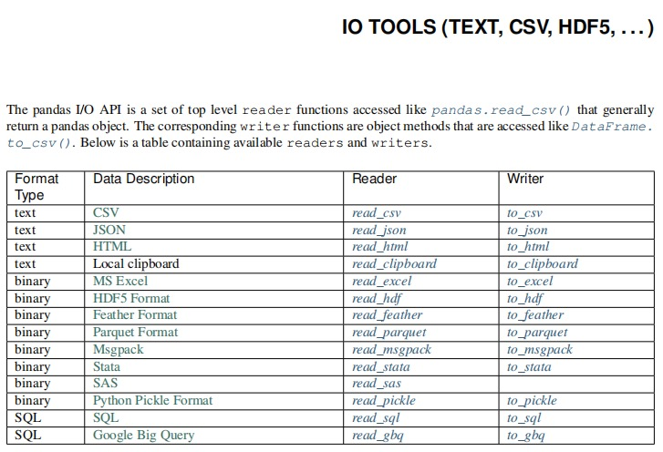

## 3.1 处理普通文本

### 3.1.1 csv读取文本：read_csv() 

  csv文件 逗号分隔符文件   数据与数据之间使用逗号分隔

| 方法参数           | 参数解释                                         |
| ------------------ | ------------------------------------------------ |
| filepath_or_buffer | 文件路径                                         |
| sep                | 列之间的分隔符。read_csv()默认为‘,’              |
| header             | 默认将行首设为列名。header=None时应手动给出列名  |
| names              | header=None时上设置此字段使用列表初始化列名      |
| index_col          | 将某一列作为行级索引。                           |
| usecols            | 选择读取文件中的某些列。设置为相应列的索引列表。 |
| skiprows           | 跳过行。可选择跳过前n行或给出跳过的行索引列表    |
| encoding           | 编码。                                           |

### 3.1.2 csv写入文本：DataFrame.to_csv()

| 方法参数           | 参数解释                                        |
| ------------------ | ----------------------------------------------- |
| filepath_or_buffer | 文件路径                                        |
| sep                | 列之间的分隔符。read_csv()默认为‘,’             |
| na_rep             | 写入文件时dataFrame中缺失值的内容。默认空字符串 |
| columns            | 定义需要写入文件的列                            |
| header             | 是否需要写入表头。默认为True。                  |
| index              | 是否需要写入行索引。默认为True。                |
| encoding           | 编码。                                          |

### 3.1.3 excel读取文本：read_excel()

| 方法参数           | 参数解释                                                     |
| ------------------ | ------------------------------------------------------------ |
| filepath_or_buffer | 文件路径                                                     |
| sheet_name         | None、string、int、字符串列表或整数列表，默认为0。字符串用于工作表名称,整数用于零索引工作表位置,字符串列表或整数列表用于请求多个工作表，为None时获取所有工作表。 |
| header             | 默认将行首设为列名。header=None时应手动给出列名              |
| names              | header=None时上设置此字段使用列表初始化列名                  |
| index_col          | 将某一列作为行级索引。                                       |
| usecols            | 选择读取文件中的某些列。设置为相应列的索引列表。             |
| skiprows           | 省略指定行数的数据,从第一行开始。                            |
| skipfooter         | 省略指定行数的数据，从尾部数的行开始。                       |

### 3.1.4 excel写入文本：dataFrame.to_excel()

| 方法参数   | 参数解释                                  |
| ---------- | ----------------------------------------- |
| filename   | 新的文件对象或已存在文件路径              |
| sheet_name | 内容写入到的sheet名称。默认值为“sheet1”。 |
| na_rep     | 缺失数据的表示方式，默认 “”。             |
| columns    | 要编写的列                                |
| header     | 是否需要写入表头。默认为True。            |
| index      | 是否需要写入行索引。默认为True。          |

### 3.1.5 读取 JSON数据  read_json()

| 方法参数           | 参数解释 |
| ------------------ | -------- |
| filepath_or_buffer | 文件路径 |
| encoding           | 编码     |

### 3.1.6 写入 JSON数据 to_json()

| 方法参数               | 参数解释                                               |
| ------------------ | -------------------------------------------------- |
| filepath_or_buffer | 文件路径； 若设置为None，则返回json字符串                          |
| orient             | 设置面向输出格式：['records', 'index', 'columns', 'values'] |

案例：

```python
data = {'Name':['Tom', 'Jack', 'Steve', 'Ricky'],'Age':[28,34,29,42]}
df = pd.DataFrame(data, index=['s1','s2','s3','s4'])
df.to_json(orient='records')
```

其他文件读取方法参见：<https://www.pypandas.cn/docs/user_guide/io.html>

# 四、数值型描述统计

## 4.1 算数平均值

$S = [s_1, s_2, ..., s_n] $

$mean = \frac{(s_1 + s_2 + ... + s_n) }{n}$

算数平均值表示对真值的无偏估计。反映一个数据集的集中趋势或一般水平的代表性数值。

```python
m = np.mean(array)
m = array.mean()
m = df.mean(axis=0)
```

案例：针对电影评分数据做均值分析

```python
import pandas as pd
import numpy as np
ratings = pd.read_json('ratings.json')
mean = ratings['John Carson'].mean()
mean = np.mean(ratings['John Carson'])
means = ratings.mean(axis=1)
```

## 4.2 加权平均值

求平均值时，考虑不同样本的重要性，可以为不同的样本赋予不同的权重。

样本：$S = [s_1, s_2, s_3 ... s_n]$

权重：$W =[w_1, w_2, w_3 ... w_n]$

加权平均值：
$$
a = \frac{s_1w_1 + s_2w_2 + ... + s_nw_n}{w_1+w_2+...+w_n}
$$
代码实现：

```python
a = np.average(array, weights=volumes)
```

案例：自定义权重，求加权平均。

```python
# 加权均值
samples = ratings.loc['Fracture']
weights = np.array([2,2,2,1,1,1,1])
np.average(samples,weights=weights)
```

## 4.3 最值

**np.max() / np.min() / np.ptp()：** 返回一个数组中最大值/最小值/极差（最大值减最小值）

```python
import numpy as np
# 产生9个介于[10, 100)区间的随机数
a = np.random.randint(10, 100, 9)
print(a)
print(np.max(a), np.min(a), np.ptp(a))
```

**np.argmax() / np.argmin()：** 返回一个数组中最大/最小元素的下标

```python
#在np中，使用argmax获取到最大值的下标（位置索引）
print(np.argmax(a), np.argmin(a))
#在pandas中，使用idxmax获取到最大值的下标（标签索引）
print(series.idxmax(), series.idxmin())
print(dataframe.idxmax(), dataframe.idxmin())
```

```python
import pandas as pd
import numpy as np

data = pd.read_json('../data_test/ratings.json')
fracture = data.loc['Fracture']

print(fracture)
print(f'{np.argmax(fracture)}对Fracture这部电影打了最高分为:{fracture.max()}')
print(f'{fracture.idxmax()}对Fracture这部电影打了最高分为:{fracture.max()}')
```

**np.maximum() / np.minimum()：** 将两个同维数组中对应元素中最大/最小元素构成一个新的数组

```python
b = np.random.randint(10,100,9)
print(b)
print(np.maximum(a,b),np.minimum(a,b),sep='\n')
```

## 4.4 中位数

将多个样本按照大小排序，取中间位置的元素。

**若样本数量为奇数，中位数为最中间的元素**

$[1, 2000, 3000, 4000, 10000000]$

**若样本数量为偶数，中位数为最中间的两个元素的平均值**

$[1,2000,3000,4000,5000,10000000]$

```python
print(np.median(a))

DataFrame.median()
DataFrame.median(axis=1)
```

## 4.5 频数与众数

频数指一组数据中各离散值出现的次数，而众数则是指一组数据中出现次数最多的值。

```python
cars = np.array(['bmw', 'bmw', 'bz', 'audi', 'bz', 'bmw'])
cars = pd.Series(cars)
cars.value_counts()
cars.mode()
```

## 4.6 宏观数值统计

```python
DataFrame.describe()
```

## 4.7 排序

pandas有两种排序方式，它们分别是按标签与按实际值排序。

```python
import numpy as np

d = {'Name':pd.Series(['Tom','James','Ricky','Vin','Steve','Minsu','Jack','Lee','David','Gasper','Betina','Andres']),
 'Age':pd.Series([25,26,25,23,30,29,23,34,40,30,51,46]),
 'Rating':pd.Series([4.23,3.24,3.98,2.56,3.20,4.6,3.8,3.78,2.98,4.80,4.10,3.65])}
unsorted_df = pd.DataFrame(d)
```

### 1. 按标签排序

使用`sort_index()`方法，通过传递`axis`参数和排序顺序，可以对`DataFrame`进行排序。默认情况下，按照升序对标签进行排序。

```python
# 按照行标进行排序
sorted_df=unsorted_df.sort_index()
print(sorted_df)

# 控制排序顺序
sorted_df = unsorted_df.sort_index(ascending=False)
print(sorted_df)

# 按照列标签进行排序
sorted_df=unsorted_df.sort_index(axis=1)
print(sorted_df)
```

### 2. 按某列值排序

像索引排序一样，`sort_values()`是按值排序的方法。它接受一个参数`by`参数，它将使用要与其排序值的`DataFrame`的列名称。

```python
sorted_df = unsorted_df.sort_values(by='Age')
print (sorted_df)
# 先按Age进行升序排序，然后按Rating降序排序
sorted_df = unsorted_df.sort_values(by=['Age', 'Rating'], ascending=[True, False])
print (sorted_df)
```

# 五、merge & join

为了方便维护，一般公司的数据都是分表存储的，比如用一个表存储所有用户的基本信息，一个表存储用户的消费情况。所以，在日常的数据处理中，经常需要将两张表拼接起来使用。拼接时自然就需要将用户的信息一一对应的进行拼接，所以进行拼接的两张表需要有一个共同的识别用户的键(key)。这样的操作在pandas则是用`merge`来实现，整个`merge`的过程就是将信息一一对应匹配的过程。

```python
pd.merge(left, right, how='inner', on=None, left_on=None, right_on=None,
         left_index=False, right_index=False, sort=True,suffixes=('_x', '_y'),         			copy=True, indicator=False,validate=None)
```

**常用参数说明**

| 参数名称    | 说明                                                         |
| ----------- | ------------------------------------------------------------ |
| left        | 接收DataFrame或Series。表示要添加的新数据。无默认。          |
| right       | 接收DataFrame或Series。表示要添加的新数据。无默认。。        |
| how         | 接收inner，outer，left，right。表示数据的连接方式。默认为inner。 |
| on          | 接收string或sequence。表示外键字段名。默认为None。           |
| left_on     | 接收string或sequence。关联操作时左表中的关联字段名。         |
| right_on    | 接收string或sequence。关联操作时右表中的关联字段名。         |
| left_index  | 接收boolean。表示是否将left参数接收数据的index作为连接主键。默认为False。 |
| right_index | 接收boolean。表示是否将right参数接收数据的index作为连接主键。默认为False。 |
| sort        | 接收boolean。表示是否根据连接键对合并后的数据进行排序。默认为False。 |
| suffixes    | 接收tuple。表示用于追加到left和right参数接收数据重叠列名的尾缀默认为('*x', '*y')。 |

## 5.1 how参数取值说明

### **1）inner**

`merge`的`inner`类型称为**内连接**，它在拼接的过程中会取**两张表的键(key)的交集**进行拼接。

首先我们有以下的数据，左侧和右侧的数据分别代表了用户的基础信息和消费信息，连接两张表的键是`userid`。

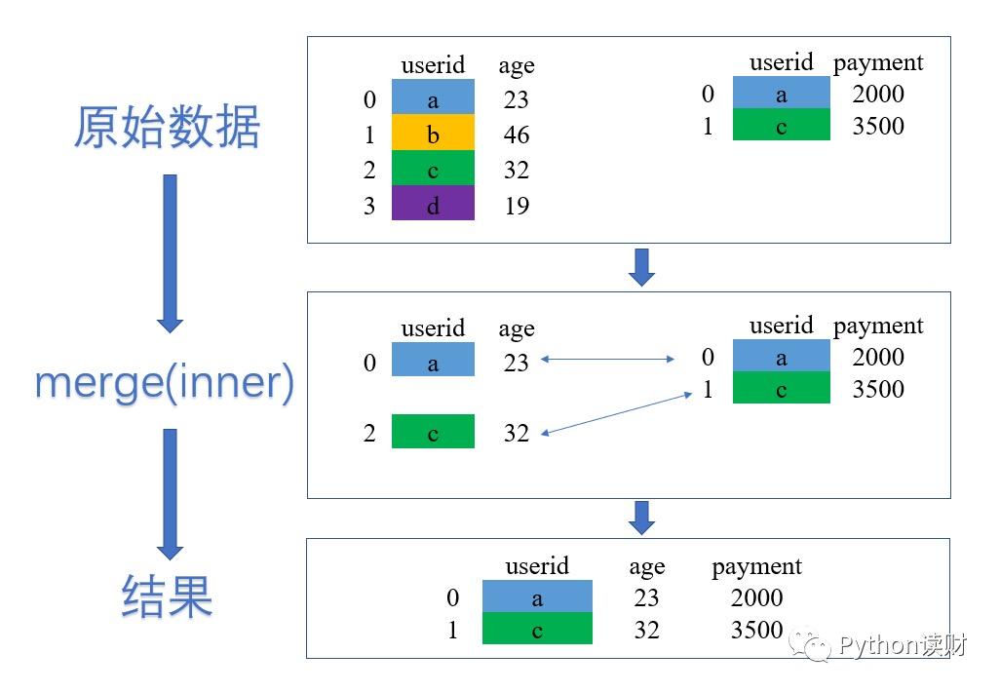

假设现在的数据变成了下面的样子，在df_2中，有两条和a对应的数据，此时应该怎么拼接：

数据：

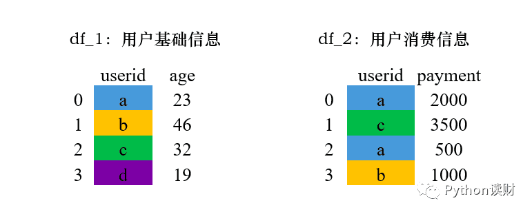

首先取两张表的键的交集

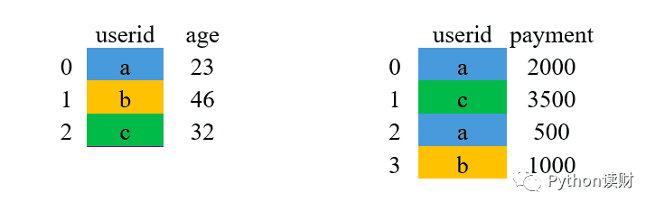

对应匹配，由于这里的a有对应的两条消费记录，故在拼接时，会将用户信息表中a对应的数据复制多一行来和右边进行匹配

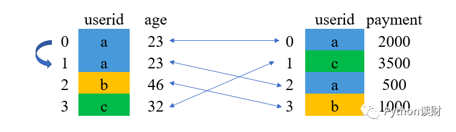

结果

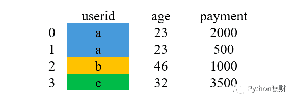

### **2）left 和 right **

`left`和`right`的merge方式类似，分别被称为**左连接**和**右连接**。

`left`，左连接，连接时以**左表表格的键为基准**进行匹配，如果左边表格中的键在右边不存在，则用缺失值NaN填充。

`right`，右连接，连接时以**右表表格的键为基准**进行匹配，如果右边表格中的键左边不存在，则用缺失值NaN填充。

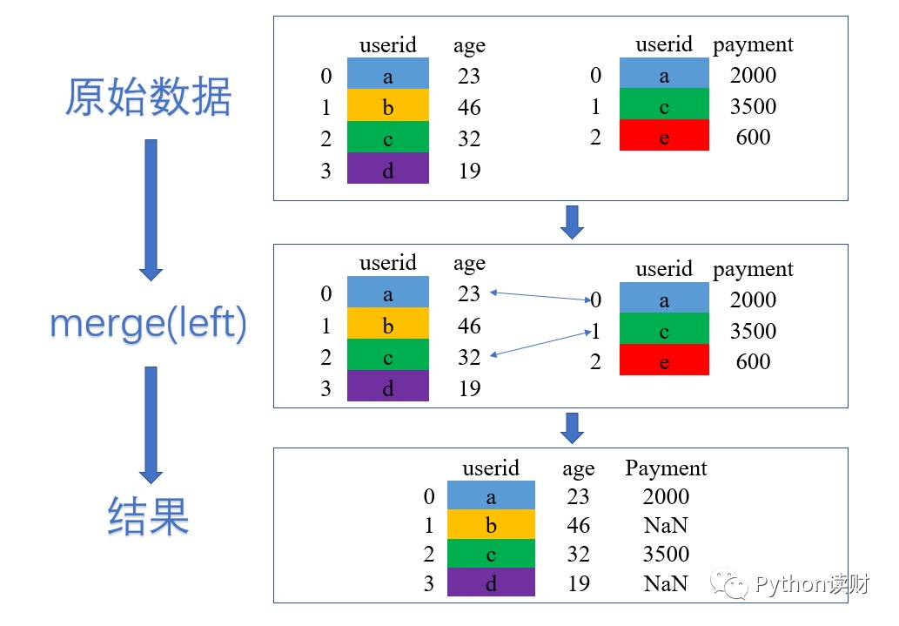

### **3）outer**

`outer`是外连接，在拼接的过程中它会取两张表的键(key)的并集进行拼接。

数据：

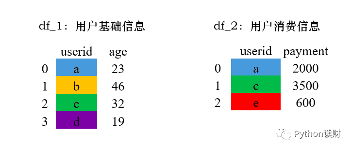

首先取两张表的键的并集

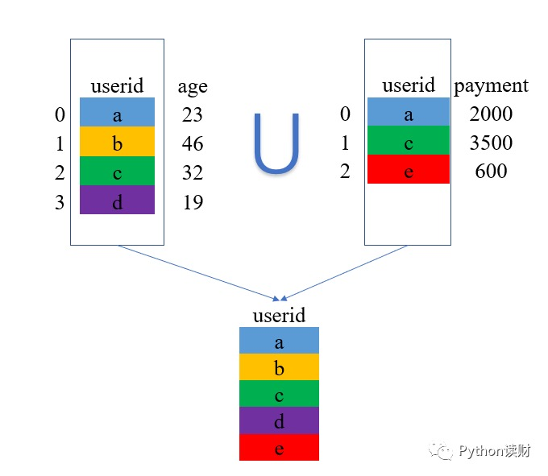

然后将两张表的数据列拼起来，对于没有匹配到的地方，使用缺失值NAN进行填充。

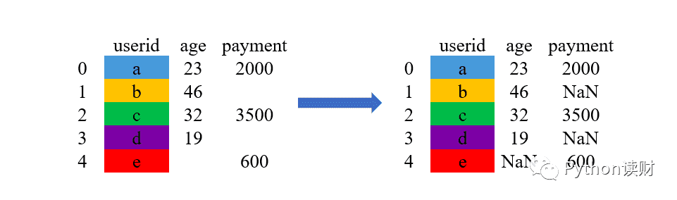

案例：

合并两个DataFrame对象：

```python
import pandas as pd
left = pd.DataFrame({
         'student_id':[1,2,3,4,5,6,7,8,9,10,11,12,13,14,15,16,17,18,19,20],
         'student_name': ['Alex', 'Amy', 'Allen', 'Alice', 'Ayoung', 'Billy', 'Brian', 'Bran', 'Bryce', 'Betty', 'Emma', 'Marry', 'Allen', 'Jean', 'Rose', 'David', 'Tom', 'Jack', 'Daniel', 'Andrew'],
         'class_id':[1,1,1,2,2,2,3,3,3,4,1,1,1,2,2,2,3,3,3,2], 
         'gender':['M', 'M', 'F', 'F', 'M', 'M', 'F', 'F', 'M', 'M', 'F', 'F', 'M', 'M', 'F', 'F', 'M', 'M', 'F', 'F'], 
         'age':[20,21,22,20,21,22,23,20,21,22,20,21,22,23,20,21,22,20,21,22], 
         'score':[98,74,67,38,65,29,32,34,85,64,52,38,26,89,68,46,32,78,79,87]})
right = pd.DataFrame(
         {'class_id':[1,2,3,5],
         'class_name': ['ClassA', 'ClassB', 'ClassC', 'ClassE']})
```

```python
# 合并两个DataFrame
data = pd.merge(left,right)  # 默认使用内连接
print(data)
```

```python
pd.merge(left,right,how='left')   # 左外连接 保留左表完整数据
pd.merge(left,right,how='right')   # 右外连接 保留右表完整数据
pd.merge(left,right,how='outer')   # 外连接
```

```Python
# on参数：
# 假设左表学生表中有两个字段class_id和desc（学生描述信息），右表班级表中也有class_id和desc（班级描述信息）字段，此时就需要指定on参数
pd.merge(left,right,on='class_id')
```

```python
# left_on  right_on
# 如果左右表中没有相同的关联字段，此时on就不能用了，那进行关联时需要指定左表和右表中的关联字段名
pd.merge(left,right,left_on='cid'，right='id')
```

```python
# left_index   right_index
# 默认为False。表示是否将left/right参数接收数据的index作为连接主键
# 我们一般用不到，使用默认值即可
```

# 六、apply 函数

pandas提供了apply函数方便的处理Series与DataFrame；apply函数支持逐一处理数据集中的每个元素都会执行一次目标函数，把返回值存入结果集中。

```python
# series.apply()
ary = np.array(['80公斤','83公斤','78公斤','74公斤','84公斤'])
s = pd.Series(ary)
def func(x):
    return x[:2]
s.apply(func)

# DataFrame.apply()
ratings = pd.read_json('ratings.json')
ratings
def func(x):
    x[x.isna()] = x.mean()
    return x
ratings.apply(func,axis=0)
```

# 七、案例 - 使用 pandas 做数据处理与清洗

> **数据集**：`taobao_user_behavior.csv`（约 52,200 条用户行为记录）

数据集字段说明：

| 字段名        | 类型   | 说明                                                         |
| ------------- | ------ | ------------------------------------------------------------ |
| user_id       | 字符串 | 用户唯一标识（如 U025795）                                   |
| item_id       | 字符串 | 商品唯一标识（如 I6773950）                                  |
| item_category | 字符串 | 商品类别（家居 / 图书 / 食品 / 美妆 / 玩具 / 女装 等 12 类） |
| behavior_type | 字符串 | 行为类型：`pv`（浏览）/ `fav`（收藏）/ `cart`（加购）/ `buy`（购买） |
| timestamp     | 字符串 | 行为发生时间（格式：YYYY-MM-DD HH:MM:SS）                    |

- **数据获取与探索分析**

  ```python
  # 导入需要用到的库
  import pandas as pd
  import numpy as np
  import matplotlib.pyplot as plt
  
  # 设置图表中文显示，防止中文变成方块
  plt.rcParams['font.sans-serif'] = ['SimHei']
  plt.rcParams['axes.unicode_minus'] = False
  
  # 读取淘宝用户行为数据
  df = pd.read_csv('taobao_user_behavior.csv')
  
  # 看一下读取成功没有，打印总行数和列数
  print("数据读取成功！")
  print("总行数：", len(df))
  print("总列数：", len(df.columns))
  
  # 查看数据的前5行
  df.head()
  
  # 查看数据类型和缺失值情况
  df.info()
  
  # 查看各列的统计信息（均值、最大值、最小值等）
  # describe() 方法主要用于生成数值列的描述性统计，快速了解数据的分布和集中趋势。
  df.describe()
  ```

- **数据处理与清洗**

  1. 检查缺失值

     `pandas` 中的 `isnull()` 方法用于**检测数据中的缺失值**。

     - **识别缺失值**：将每个元素与缺失值（`None` 或 `NaN`）进行比较
     - **返回布尔值**：是缺失值返回 `True`，不是缺失值返回 `False`

     常用搭配方法：

     `isnull().sum()` —— 统计每列缺失值数量

     `isnull().sum().sum()` —— 统计总缺失值个数

     `isnull().any()` —— 检查每列是否有缺失值

     ```python
     # 统计每列的缺失值数量
     missing_count = df.isnull().sum()
     
     print("各列缺失值数量：")
     print(missing_count)
     ```

  2. 删除含缺失值的行

     `pandas` 中的 `dropna()` 方法用于**删除包含缺失值（NaN）的行或列**。

     核心作用

     - **删除缺失值**：根据规则移除包含 `None`、`NaN`、`NaT` 的行或列（`NaT` 是 `pandas` 中专门用于表示**时间类型数据的缺失值**。）
     - **返回新 DataFrame**：默认不修改原数据，可通过参数控制
     - **空字符串** `''` 或空格 `' '` 不被视为缺失值，`dropna()` 不会删除
     - `df.dropna(inplace=True)` ， 直接修改原DataFrame，不返回新对象
     - `df.dropna(axis=0)` ， 0 或 'index' ：删除行；1 或 'columns' ：删除列

     ```python
     # 删除前，记录原始行数
     rows_before = len(df)
     
     # 删除含有缺失值的行
     df = df.dropna()
     
     # 删除后，看看少了多少行
     rows_after = len(df)
     print("删除前行数：", rows_before)
     print("删除后行数：", rows_after)
     print("共删除：", rows_before - rows_after, "行")
     ```

  3. 填充含缺失值的列

      `pandas` 中的 `fillna()` 方法用于**填充缺失值（NaN）**的方法。

     核心作用

     - **填充缺失值**：用指定值或计算方法替换 `None`、`NaN`、`NaT`
     - **返回新 DataFrame**：默认不修改原数据，可通过参数控制
     - **空字符串** `''` 或空格 `' '` **不被视为缺失值**，`fillna()` 不会填充它们
     - `df.fillna(value, inplace=True)`：**直接修改原DataFrame，不返回新对象**

     ```python
     # 所有缺失值填充为同一个值
     df.fillna(value)
     # 字典填充（不同列填不同值）
     df.fillna({"字段1":"值1","字段2":"值2",...})
     # 统计量填充
     df["字段"] = df["字段"].fillna(df["字段"].mean())
     ```

     ```python
     df['behavior_type'] = df['behavior_type'].fillna(df['behavior_type'].mode()[0])
     df.info()
     ```

  4. 检查并删除重复行

     `pandas` 中的 `duplicated()` 方法用于**检测重复的行**。

     核心作用

     - **识别重复行**：返回布尔值的 Series，标记每一行是否为重复行
     - **首次出现规则**：默认第一次出现的行标记为 `False`（保留），后续相同的行标记为 `True`（重复）

     语法

     ```Python
     df.duplicated(subset=None,    # 指定检查哪些列，默认所有列，指定列用列表
                   keep='first')   # 保留哪个版本：'first'、'last'、False(所有重复行都标记为True)
     ```

     `pandas` 中的 `drop_duplicates()` 方法用于**删除重复的行**。

     核心作用

     - **删除重复行**：根据指定列判断重复，默认保留第一次出现的行
     - **返回新 DataFrame**：默认不修改原数据，可通过参数控制

     语法

     ```python
     df.drop_duplicates(subset=None,      # 指定检查哪些列，默认所有列
                        keep='first',     # 保留哪个：'first'、'last'、False
                        inplace=False,    # True：修改原数据；False：返回新数据
                        ignore_index=False)  # True：重新生成索引
     ```

     ```python
     # 统计重复行数量
     dup_count = df.duplicated().sum()
     print("重复行数量：", dup_count)
     
     # 删除重复行
     df = df.drop_duplicates()
     print("去重后行数：", len(df))
     ```

  5. 检查 behavior_type 列是否有非法值

     `pandas` 中的 `unique()` 方法用于**获取列中的唯一值数组**。

     核心作用

     - **返回唯一值**：去除重复值，返回所有不重复的元素
     - **保持出现顺序**：按数据首次出现的顺序返回结果
     - **适用于 Series**：通常对 DataFrame 的某一列使用

     `pandas` 中的 `isin()` 方法用于**检查数据是否包含在指定值集合中**。

     核心作用

     - **成员资格判断**：判断 Series 或 DataFrame 中的每个元素是否属于给定的值列表/集合
     - **返回布尔值**：存在返回 `True`，不存在返回 `False`
     - **支持多种数据类型**：列表、集合、字典、Series 等

     ```python
     # 定义合法的行为类型
     valid_behaviors = ['pv', 'buy', 'cart', 'fav']
     
     # 查看当前有哪些行为类型
     print("当前行为类型：")
     print(df['behavior_type'].unique())
     
     # 只保留合法行为的行
     df = df[df['behavior_type'].isin(valid_behaviors)]
     
     print("过滤后行数：", len(df))
     ```

  6. 转换时间戳为可读时间

     `pandas` 中的 `to_datetime()` 函数用于**将参数转换为 datetime 类型**。

     核心作用

     - **类型转换**：将时间字符串、时间戳、时间列表、Series 等转换为 pandas 的 datetime 类型
     - **统一时间格式**：支持多种时间格式的自动识别

     ```python
     # 把时间戳（整数）转换成 datetime 格式
     df['datetime'] = pd.to_datetime(df['timestamp'])
     
     # 看一下转换效果
     print("转换后的时间列（前5行）：")
     print(df['datetime'].head())
     ```

  7. 从时间中提取日期、小时、星期

     获取时间的某个日历字段的数值

     Series.dt 提供了很多日期相关操作，如下：

     ```text
     Series.dt.year	The year of the datetime.
     Series.dt.month	The month as January=1, December=12.
     Series.dt.day	The days of the datetime.
     Series.dt.hour	The hours of the datetime.
     Series.dt.minute	The minutes of the datetime.
     Series.dt.second	The seconds of the datetime.
     Series.dt.week	The week ordinal of the year.
     Series.dt.weekofyear	The week ordinal of the year.
     Series.dt.dayofweek	The day of the week with Monday=0, Sunday=6.
     Series.dt.weekday	The day of the week with Monday=0, Sunday=6.
     Series.dt.dayofyear	The ordinal day of the year.
     Series.dt.quarter	The quarter of the date
     ```

     ```python
     # 提取日期（年-月-日）
     df['date'] = df['datetime'].dt.date
     
     # 提取小时（0~23）
     df['hour'] = df['datetime'].dt.hour
     
     # 提取星期几（0=周一, 6=周日）
     df['weekday'] = df['datetime'].dt.dayofweek
     
     print("新增列后的列名：")
     print(df.columns.tolist())
     
     # 查看前3行确认
     df.head(3)
     ```
