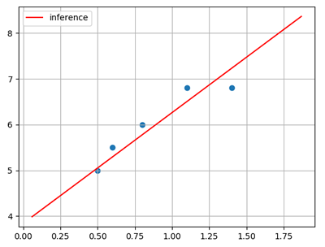
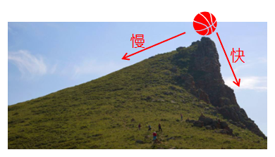
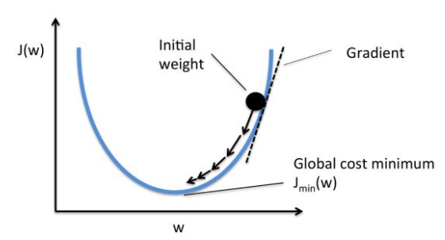
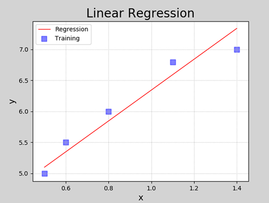
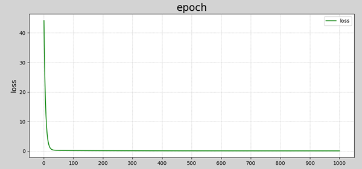
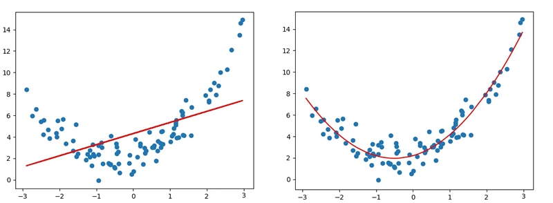
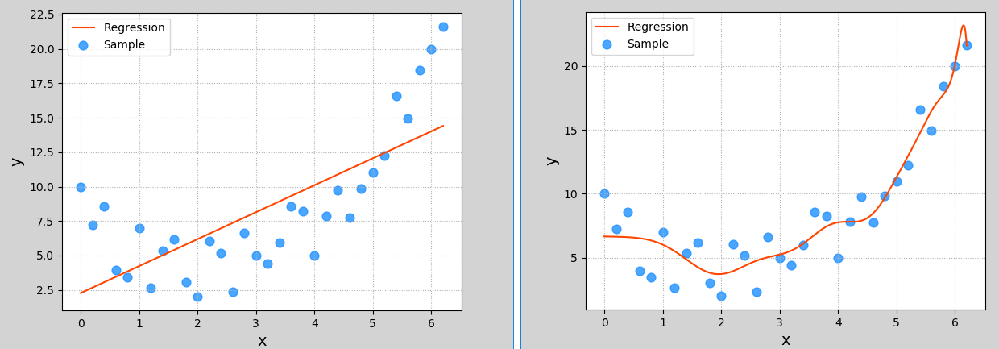
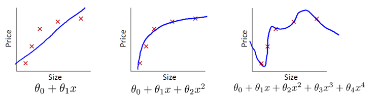

# 线性回归

## 1. 线性模型

### 1.1 概述

线性模型是自然界最简单的模型之一，它描述了一个（或多个）自变量对另一个因变量的影响是呈简单的比例、线性关系。例如：

- 住房每平米单价为 1 万元，100 平米住房价格为 100 万元，120 平米住房为 120 万元；
- 一台挖掘机每小时挖 $100m^3$ 沙土，工作 4 小时可以挖掘 $400m^3$ 沙土。

线性模型在二维空间内表现为一条直线，在三维空间内表现为一个平面，更高维度下的线性模型很难用几何图形来表示（称为超平面）。如下图所示：


<center><font size=2>二维空间下线性模型表现为一条直线</font></center>


<center><font size=2>三维空间下线性模型表现为一个平面</font></center>

线性回归是要根据一组输入值和输出值（称为样本），寻找一个线性模型，能最佳程度上拟合于给定的数值分布，从而再给定新的输入时预测输出。样本如下表所示：

| 输入(x) | 输出(y) |
| ----- | ----- |
| 0.5   | 5.0   |
| 0.6   | 5.5   |
| 0.8   | 6.0   |
| 1.1   | 6.8   |
| 1.4   | 6.8   |

根据样本拟合的线性模型如下图所示：



### 1.2 线性模型定义

设给定一组属性$x, x=(x_1;x_2;...;x_n)$，线性方程的一般表达形式为：
$$
y = w_1x_1 + w_2x_2 + w_3x_3 + ... + w_nx_n + b
$$
写成向量形式为：
$$
y = w^T * x + b
$$
其中，$w=(w_1;w_2;...;w_n), x=(x_1;x_2;...;x_n)$，$w$和$b$经过学习后，模型就可以确定。当自变量数量为 1 时，上述线性模型即为平面下的直线方程：
$$
y = wx + b
$$
线性模型形式简单、易于建模，却蕴含着机器学习中一些重要的基本思想。许多功能强大的非线性模型可以在线性模型基础上引入层级结构或高维映射而得。此外，由于 $w$ 直观表达了各属性在预测中的重要性，因此线性模型具有很好的可解释性。例如，判断一个西瓜是否为好瓜，可以用如下表达式来判断：
$$
f_{好瓜}(x) = 0.2x_{色泽} + 0.5x_{根蒂} + 0.3x_{敲声} + 1
$$
上述公式可以解释为，一个西瓜是否为好瓜，可以通过色泽、根蒂、敲声等因素共同判断，其中根蒂最重要(权重最高)，其次是敲声和色泽。

### 1.3 模型训练

在二维平面中，给定两点可以确定一条直线。但在实际工程中，可能有很多个样本点，**无法找到一条直线精确穿过所有样本点**，只能找到一条与样本”足够接近“或”距离足够小“的直线，近似拟合给定的样本。如下图所示：


如何确定直线到所有样本足够近呢？可以使用损失函数来进行度量。

#### 1.3.1 损失函数

损失函数用来度量真实值（由样本中给出）和预测值（由模型算出）之间的差异。损失函数值越小，表明模型预测值和真实值之间差异越小，模型性能越好；损失函数值越大，模型预测值和真实值之间差异越大，模型性能越差。在回归问题中，均方差是常用的损失函数，其表达式如下所示：
$$
E = \frac{1}{2}\sum_{i=1}^{n}{(y - y')^2}
$$
其中，$y$ 为模型真实值，$y'$ 为预测值。 均方差具有非常好的几何意义，对应着常用的欧几里得距离（简称欧式距离）。线性回归的任务是要寻找最优线性模型，使得损失函数值最小，即：
$$
\begin{aligned}
(w^*, b^*) &= arg \min \frac{1}{2}\sum_{i=1}^{n}{(y - y')^2} \\
&= arg \min \frac{1}{2}\sum_{i=1}^{n}{(y - wx_i - b)^2}
\end{aligned}
$$
基于均方误差最小化来进行模型求解的方法称为“最小二乘法”。 线性回归中，最小二乘法就是试图找到一条直线，使所有样本到直线的欧式距离之和最小。可以将损失函数对 $w$ 和 $b$ 分别求导，得到损失函数的导函数，并令导函数为 0 即可得到 $w$ 和 $b$ 的最优解。

#### 1.3.2 梯度下降法

- **为什么使用梯度下降法**

  在实际计算中，通过最小二乘法求解最优参数有一定的问题：

  1. 最小二乘法需要计算逆矩阵，有可能逆矩阵不存在；
  2. 当样本特征数量较多时，计算逆矩阵非常耗时甚至不可行。 

  所以，在实际计算中，通常采用梯度下降法来求解损失函数的极小值，从而找到模型的最优参数。

- **什么是梯度下降法**

  梯度（gradient）是一个向量（矢量，有方向），表示某一函数在该点处的方向导数沿着该方向取得最大值，即函数在该点处沿着该方向（此梯度的方向）变化最快，变化率最大。
  损失函数沿梯度相反方向收敛最快（即能最快找到极值点）。当梯度向量为零（或接近于零），说明到达一个极值点，这也是梯度下降算法迭代计算的终止条件。

  这种按照负梯度不停地调整函数权值的过程就叫作“梯度下降法”。通过这样的方法，改变权重让损失函数的值下降得更快，进而将值收敛到损失函数的某个极小值。

  通过损失函数，我们将“寻找最优参数”问题，转换为了“寻找损失函数最小值”问题。梯度下降法算法描述如下：

  1. 损失是否足够小？如果不是，计算损失函数的梯度；
  2. 按梯度的反方向走一小步，以缩小损失；
  3. 循环到1。



梯度下降法中通过沿着梯度负方向不断调整参数，从而逐步接近损失函数极小值所在点。如下图所示：



#### 1.3.3 参数更新法则

$目标函数：y = w_1*x + w_0$

$损失函数：loss=\frac{1}{2}\sum(w_1*x+w_0 - y)^2$

$梯度：[ \frac{\partial loss}{\partial w_0}, \frac{\partial loss}{\partial w_1}]$

在直线方程中，有两个参数需要学习，$w_0$和$w_1$，梯度下降过程中，分别对这两个参数单独进行调整，调整法则如下：
$$
w_0 = w_0 + \Delta w_0\\
w_1 = w_1 + \Delta w_1
$$
$\Delta w_0$和$\Delta w_1$可表示为：
$$
\Delta w_0 = -\eta \frac{\partial loss}{\partial w_0}\\
\Delta w_1 = -\eta \frac{\partial loss}{\partial w_1}\\
$$
其中，$\eta$称为学习率，$\frac{\partial loss}{\partial w_i}$为梯度（即损失函数关于参数$w_i$的偏导数）。损失函数表达式为：
$$
loss =\frac{1}{2}\sum(y - y')^2 =  \frac{1}{2}\sum((y-(w_0+w_1x))^2)
$$
对损失函数求导，可得$w_0, w_1$的偏导数为：
$$
\frac{\partial loss}{\partial w_0} = \sum((y - y')(-1)) = -\sum(y - y')\\
\frac{\partial loss}{\partial w_1} = \sum((y - y')(-x)) = -\sum(x(y - y'))
$$
**补充**：

学习率在机器学习和优化算法中是一个重要的超参数，它决定了模型权重更新的步长大小。学习率的作用是控制每次根据估计误差对模型权重更新的多少。

较大的学习率可能会导致模型在最小化损失函数的过程中“跳跃”过远，而较小的学习率可能导致训练过程过于缓慢。选择合适的学习率，可以使模型在训练过程中更快地收敛，同时避免陷入局部最小值。

此外，学习率也会影响模型的泛化能力。如果学习率设置得过高，可能会导致模型在训练数据上表现良好，但在测试数据上表现较差；如果学习率设置得过低，则可能使模型过于复杂，导致过拟合。

因此，在训练模型时，需要根据具体情况调整学习率，以获得最佳的训练效果。

### 1.4 实现线性回归

- **自己编码实现**

```python
# 线性回归示例
import numpy as np
import matplotlib.pyplot as mp
from mpl_toolkits.mplot3d import Axes3D
import sklearn.preprocessing as sp

# 训练数据集
train_x = np.array([0.5, 0.6, 0.8, 1.1, 1.4])  # 输入集
train_y = np.array([5.0, 5.5, 6.0, 6.8, 7.0])  # 输出集

n_epochs = 1000  # 迭代次数
lrate = 0.01  # 学习率
epochs = []  # 记录迭代次数
losses = []  # 记录损失值

w0, w1 = [1], [1]  # 模型初始值

for i in range(1, n_epochs + 1):
    epochs.append(i)  # 记录第几次迭代

    y = w0[-1] + w1[-1] * train_x  # 取出最新的w0,w1计算线性方程输出
    # 损失函数(均方差)
    loss = (((train_y - y) ** 2).sum()) / 2
    losses.append(loss)  # 记录每次迭代的损失值

    print("%d: w0=%f, w1=%f, loss=%f" % (i, w0[-1], w1[-1], loss))

    # 计算w0,w1的偏导数
    d0 = -(train_y - y).sum()
    d1 = -(train_x * (train_y - y)).sum()

    # 更新w0,w1
    w0.append(w0[-1] - (d0 * lrate))
    w1.append(w1[-1] - (d1 * lrate))
```

程序执行结果：

```
1 w0=1.00000000 w1=1.00000000 loss=44.17500000
2 w0=1.20900000 w1=1.19060000 loss=36.53882794
3 w0=1.39916360 w1=1.36357948 loss=30.23168666
4 w0=1.57220792 w1=1.52054607 loss=25.02222743
5 w0=1.72969350 w1=1.66296078 loss=20.71937337
......
996 w0=4.06506160 w1=2.26409126 loss=0.08743506
997 w0=4.06518850 w1=2.26395572 loss=0.08743162
998 w0=4.06531502 w1=2.26382058 loss=0.08742820
999 w0=4.06544117 w1=2.26368585 loss=0.08742480
1000 w0=4.06556693 w1=2.26355153 loss=0.08742142
```

可以给数据加上可视化，让结果更直观.添加如下代码：

```Python
###################### 训练过程可视化 ######################
# 训练过程可视化
## 损失函数收敛过程
w0 = np.array(w0[:-1])
w1 = np.array(w1[:-1])

mp.figure("Losses", facecolor="lightgray")  # 创建一个窗体
mp.title("epoch", fontsize=20)
mp.ylabel("loss", fontsize=14)
mp.grid(linestyle=":")  # 网格线：虚线
mp.plot(epochs, losses, c="blue", label="loss")
mp.legend()  # 图例
mp.tight_layout()  # 紧凑格式

## 显示模型直线
pred_y = w0[-1] + w1[-1] * train_x  # 根据x预测y
mp.figure("Linear Regression", facecolor="lightgray")
mp.title("Linear Regression", fontsize=20)
mp.xlabel("x", fontsize=14)
mp.ylabel("y", fontsize=14)
mp.grid(linestyle=":")
mp.scatter(train_x, train_y, c="blue", label="Traing")  # 绘制样本散点图
mp.plot(train_x, pred_y, c="red", label="Regression")
mp.legend()

# 显示梯度下降过程(复制粘贴即可，不需要编写)
# 计算损失函数曲面上的点 loss = f(w0, w1)
arr1 = np.linspace(0, 10, 500)  # 0~9间产生500个元素的均匀列表
arr2 = np.linspace(0, 3.5, 500)  # 0~3.5间产生500个元素的均匀列表

grid_w0, grid_w1 = np.meshgrid(arr1, arr2)  # 产生二维矩阵

flat_w0, flat_w1 = grid_w0.ravel(), grid_w1.ravel()  # 二维矩阵扁平化
loss_metrix = train_y.reshape(-1, 1)  # 生成误差矩阵（-1,1）表示自动计算维度
outer = np.outer(train_x, flat_w1)  # 求外积（train_x和flat_w1元素两两相乘的新矩阵）
# 计算损失：((w0 + w1*x - y)**2)/2
flat_loss = (((flat_w0 + outer - loss_metrix) ** 2).sum(axis=0)) / 2
grid_loss = flat_loss.reshape(grid_w0.shape)

mp.figure('Loss Function')
ax = mp.gcf().add_subplot(111, projection='3d')
mp.title('Loss Function', fontsize=14)
ax.set_xlabel('w0', fontsize=14)
ax.set_ylabel('w1', fontsize=14)
ax.set_zlabel('loss', fontsize=14)
ax.plot_surface(grid_w0, grid_w1, grid_loss, rstride=10, cstride=10, cmap='jet')
ax.plot(w0, w1, losses, 'o-', c='orangered', label='BGD', zorder=5)
mp.legend(loc='lower left')

mp.show()
```

数据可视化结果如下图所示：



<center><font size=2>回归得到的线性模型</font></center>



<center><font size=2>损失函数收敛过程</font></center>


<center><font size=2>梯度下降过程</font></center>

- **使用sklearn API实现**

同样，可以使用 sklearn 库提供的 API 实现线性回归。

代码如下：

```python
# 利用LinearRegression实现线性回归
import numpy as np
import sklearn.linear_model as lm  # 线性模型
import sklearn.metrics as sm  # 模型性能评价模块
import matplotlib.pyplot as mp

train_x = np.array([[0.5], [0.6], [0.8], [1.1], [1.4]])  # 输入集
train_y = np.array([5.0, 5.5, 6.0, 6.8, 7.0])  # 输出集

# 创建线性回归器
model = lm.LinearRegression()
# 用已知输入、输出数据集训练回归器
model.fit(train_x, train_y)
# 根据训练模型预测输出
pred_y = model.predict(train_x)

print("coef_:", model.coef_)  # 系数
print("intercept_:", model.intercept_)  # 截距

# 可视化回归曲线
mp.figure('Linear Regression', facecolor='lightgray')
mp.title('Linear Regression', fontsize=20)
mp.xlabel('x', fontsize=14)
mp.ylabel('y', fontsize=14)
mp.tick_params(labelsize=10)
mp.grid(linestyle=':')

# 绘制样本点
mp.scatter(train_x, train_y, c='blue', alpha=0.8, s=60, label='Sample')

# 绘制拟合直线
mp.plot(train_x,  # x坐标数据
        pred_y,  # y坐标数据
        c='orangered', label='Regression')

mp.legend()
mp.show()
```

执行结果：


### 1.5 模型评价指标

- 平均绝对误差（Mean Absolute Deviation）：是预测值与真实值之间绝对差异的平均值。它衡量的是预测误差的**平均水平**。
  $$
  \text{MAE} = \frac{1}{n} \sum_{i=1}^{n} |y_i - \hat{y}_i|
  $$

- 均方误差：均方误差是预测值与真实值之间差异的**平方和**的平均值。
  $$
  \text{MSE} = \frac{1}{n} \sum_{i=1}^{n} (y_i - \hat{y}_i)^2
  $$

- MAD (中位数绝对偏差)：中位数绝对偏差是指所有绝对误差的**中位数**。
  $$
  \text{MAD} = \text{median} \left( |y_1 - \hat{y}_1|, |y_2 - \hat{y}_2|, \ldots, |y_n - \hat{y}_n| \right)
  $$


- R2 决定系数：趋向于 1，模型越好；趋向于 0，模型越差。

```python
# 测试集
# 假设，我们拿到的测试数据，没有参加过训练
test_x = train_x.iloc[::4]
test_y = train_y[::4]
# 预测
pred_test_y = model.predict(test_x)

# 模型的评估
import sklearn.metrics as sm #评估模块
# 平均绝对误差
print(sm.mean_absolute_error(test_y,pred_test_y))
# 均方误差
print(sm.mean_squared_error(test_y,pred_test_y))
# 中位数绝对偏差
print(sm.median_absolute_error(test_y,pred_test_y))
# R2得分
print(sm.r2_score(test_y,pred_test_y))
```

## 2. 模型保存与加载

可以使用 Python 提供的功能对模型对象进行保存。使用方法如下：

```python
import pickle
# 保存模型
pickle.dump(模型对象, 文件对象)   
# 加载模型
model_obj = pickle.load(文件对象)
```

保存训练模型应该在训练完成或评估完成之后，完整代码如下：

```python
# 模型的保存
import pickle
with open('linear_model.pkl','wb') as f:
    pickle.dump(model,f)

print('模型保存成功')
```

执行完成后，可以看到与源码相同目录下多了一个名称为`linear_model.pkl`的文件，这就是保存的训练模型。使用该模型代码：

```python
# 模型的加载
with open('./linear_model.pkl', 'rb') as f:
    new_model = pickle.load(f)

result = new_model.predict([[1.1]])
print(result)
```

## 3. 多项式回归

### 3.1 什么是多项式回归

线性回归适用于数据呈线性分布的回归问题。如果数据样本呈明显非线性分布，线性回归模型就不再适用（下图左），而采用多项式回归可能更好（下图右）。例如：



### 3.2 多项式模型定义

与线性模型相比，多项式模型引入了高次项，自变量的指数大于1，例如一元二次方程：
$$
y = w_0 + w_1x + w_2x^2
$$
一元三次方程：
$$
y = w_0 + w_1x + w_2x^2 + w_3x ^ 3
$$
推广到一元n次方程：
$$
y = w_0 + w_1x + w_2x^2 + w_3x ^ 3 + ... + w_nx^n
$$
上述表达式可以简化为：
$$
y = \sum_{i=1}^N w_ix^i
$$

### 3.3 与线性回归的关系

多项式回归可以理解为线性回归的扩展，在线性回归模型中添加了新的特征值。例如，要预测一栋房屋的价格，有$x_1, x_2, x_3$三个特征值，分别表示房子长、宽、高，则房屋价格可表示为以下线性模型：
$$
y = w_1 x_1 + w_2 x_2 + w_3 x_3 + b
$$
对于房屋价格，也可以用房屋的体积，而不直接使用$x_1, x_2, x_3$三个特征：
$$
y = w_0 + w_1x + w_2x^2 + w_3x ^ 3
$$
相当于创造了新的特征$x, x$ = 长 * 宽 * 高。  以上两个模型可以解释为：

- 房屋价格是关于长、宽、高三个特征的线性模型
- 房屋价格是关于体积的多项式模型

因此，可以将一元n次多项式变换成n元一次线性模型。

### 3.4 多项式回归实现

通过特征扩展引入高次项和交叉项，将非线性关系转化为线性问题。

对于一元n次多项式，同样可以利用梯度下降对损失值最小化的方法，寻找最优的模型参数$w_0, w_1, w_2, ..., w_n$。可以将一元n次多项式，变换成n元一次线性模型，求线性回归。以下是一个多项式回归的实现。

```python
# 自己手动实现扩维
# 通过对线性模型增加高次项，实现多项式模型
import numpy as np
import pandas as pd
import sklearn.linear_model as lm #线性模型
import matplotlib.pyplot as plt

data = pd.read_csv('../data_test/Salary_Data.csv')
# print(data.head())

#整理输入和输出
x = data.iloc[:,:-1]
y = data.iloc[:,-1]

x['x2'] = x['YearsExperience']**2
x['x3'] = x['YearsExperience']**3

#构建模型
model = lm.LinearRegression()
#训练
model.fit(x,y)

pred_y = model.predict(x)

plt.plot(x['YearsExperience'],pred_y,color='orangered')
plt.scatter(x['YearsExperience'],y)

# plt.show()


# 特征扩展
# 通过生成原始特征的幂次组合和交互项，将特征空间从低维映射到高维。
# 单个特征：[x] → [x, x², x³, ..., x^degree]
# 两个特征：degree=2   [a, b] → [a, b, a², ab, b²]
# 		  degree=3   [a, b] → [a, b, a², ab, b², a³, a²b, ab², b³]
import sklearn.preprocessing as sp

raw_sample = np.arange(1,4).reshape(1,3)

encoder = sp.PolynomialFeatures(degree=3)
res = encoder.fit_transform(raw_sample)
print(res.shape)
print(encoder.get_feature_names_out())
```

```python
# 使用sklearn实现多项式回归示例
import pandas as pd
import numpy as np
# 线性模型
import sklearn.linear_model as lm
# 模型性能评价模块
import sklearn.metrics as sm
import matplotlib.pyplot as plt
# 管线模块
import sklearn.pipeline as pl
import sklearn.preprocessing as sp

#数据准备
data = pd.read_csv('./data/Salary_Data.csv')

train_x = data.iloc[:,:-1]
train_y = data.iloc[:,-1]

# 将多项式特征扩展预处理，和一个线性回归器串联为一个管线
# 多项式特征扩展：对现有数据进行的一种转换，通过将数据映射到更高维度的空间中
# 进行多项式扩展后，我们就可以认为，模型由以前的直线变成了曲线
# 从而可以更灵活的去拟合数据
# pipeline连接两个模型
model = pl.make_pipeline(sp.PolynomialFeatures(3), # 多项式特征扩展，扩展最高次项为3
                         lm.LinearRegression())

# 用已知输入、输出数据集训练回归器
model.fit(train_x, train_y)
# print(model[1].coef_)
# print(model[1].intercept_)

# 根据训练模型预测输出
pred_train_y = model.predict(train_x)

# 评估指标
err4 = sm.r2_score(train_y, pred_train_y)  # R2得分, 范围[0, 1], 分值越大越好
print(err4)

# 在训练集之外构建测试集
test_x = np.linspace(train_x.min(), train_x.max(), 1000)
pre_test_y = model.predict(test_x.reshape(-1, 1)) #reshape(-1,1)行无所谓，只要1列   对新样本进行预测

# 可视化回归曲线
plt.figure('Polynomial Regression', facecolor='lightgray')
plt.title('Polynomial Regression', fontsize=20)
plt.xlabel('x', fontsize=14)
plt.ylabel('y', fontsize=14)
plt.tick_params(labelsize=10)
plt.grid(linestyle=':')
plt.scatter(train_x, train_y, c='dodgerblue', alpha=0.8, s=60, label='Sample')

plt.plot(test_x, pre_test_y, c='orangered', label='Regression')

plt.legend()
plt.show()
```

打印输出：

```
0.9224401504764776
```

执行结果：


### 3.5 过拟合与欠拟合

- **什么是过拟合、欠拟合**

在上一小节多项式回归示例中，多项特征扩展器`PolynomialFeatures()`进行多项式扩展时，指定了最高次数为 3，该参数为多项式扩展的重要参数，如果选取不当，则可能导致不同的拟合效果。下图显示了该参数分别设为1、20时模型的拟合图像：



这两种其实都不是好的模型。 前者没有学习到数据分布规律，模型拟合程度不够，预测准确度过低，这种现象称为“欠拟合”；后者过于拟合更多样本，以致模型泛化能力（新样本的适应性）变差，这种现象称为“过拟合”。 **欠拟合模型一般表现为训练集、测试集下准确度都比较低；过拟合模型一般表现为训练集下准确度较高、测试集下准确度较低。  **一个好的模型，不论是对于训练数据还是测试数据，都有接近的预测精度，而且精度不能太低。

【思考1】以下哪种模型较好，哪种模型较差，较差的原因是什么？

| 训练集R2值 | 测试集R2值 |
| ---------- | ---------- |
| 0.6        | 0.5        |
| 0.9        | 0.6        |
| 0.9        | 0.88       |

【答案】第一个模型欠拟合；第二个模型过拟合；第三个模型适中，为可接受的模型。

【思考2】以下哪个曲线为欠拟合、过拟合，哪个模型拟合最好？



【答案】第一个模型欠拟合；第三个模型过拟合；第二个模型拟合较好。

- **如何处理欠拟合、过拟合**

1. 欠拟合：提高模型复杂度，如增加特征、增加模型最高次幂等等；
2. 过拟合：降低模型复杂度，如减少特征、降低模型最高次幂等等。

## 4. 线性回归模型变种

$$
loss = \frac{1}{2}\sum_{i=1}^{n}(y_i - \hat{y_i})^2 + \lambda \sum{\omega}_i^2
$$

### 1.3.1 正则化

- **什么是正则化**

过拟合还有一个常见的原因，就是模型参数值太大，所以可以通过抑制参数的方式来解决过拟合问题。如下图所示，右图产生了一定程度过拟合，可以通过弱化高次项的系数（但不删除）来降低过拟合。 


例如，可以通过在 $\theta_3, \theta_4$ 的系数上添加一定的系数，来压制这两个高次项的系数，这种方法称为正则化。 但在实际问题中，可能有更多的系数，我们并不知道应该压制哪些系数，所以，可以通过收缩所有系数来避免过拟合。

- **正则化的定义**

  正则化是指，在目标函数后面添加一个正则项，来防止过拟合的手段

  - 当p=1时，称为L1范数（即所有系数绝对值之和）
    $$
    ||x||_1 = (\sum_{i=1}^N |x|)
    $$

    - **特点**

      会将部分参数 “压缩至 0”，实现**自动特征选择**（参数为 0 的特征可视为被舍弃）；

      得到的模型更稀疏（参数非零的特征少），解释性更强。

    - **应用场景**：高维数据（如基因数据、文本特征），需要筛选关键特征时。

  - 当p=2是，称为L2范数（即所有系数平方之和再开方）
    $$
    ||x||_2 = (\sum_{i=1}^N |x|^2)
    $$

    - **特点**

      会将参数值 “整体缩小”（但不会变为 0），使模型更稳定；

      适用于解决**多重共线性**（特征间高度相关）问题，降低参数波动。

    - **应用场景**：线性回归、逻辑回归、神经网络等，希望保留所有特征但抑制参数过大时。

  通过对目标函数添加正则项，整体上压缩了参数的大小，从而防止过拟合。

### 1.3.2 Lasso回归与岭回归

Lasso 回归和岭回归（Ridge Regression）都是在标准线性回归的基础上修改了损失函数的回归算法。 Lasso回归全称为 Least absolute shrinkage and selection operator，又译“最小绝对值收敛和选择算子”、”套索算法”，其损失函数如下所示：
$$
E = \frac{1}{n}\sum_{i=1}^N(y_i - y_i')^2 + \lambda ||w||_1
$$
岭回归损失函数为：
$$
E = \frac{1}{n}\sum_{i=1}^N(y_i - y_i')^2 + \lambda ||w||_2
$$
从逻辑上说，Lasso 回归和岭回归都可以理解为通过调整损失函数，减小函数的系数，从而避免过于拟合于样本，降低偏差较大的样本的权重和对模型的影响程度。

线性模型变种模型： 在损失函数后面 + 正则项	

​					损失函数  + L1范数  ----》  Lasso回归

​					损失函数  + L2范数  ----》  岭回归				

以下关于Lasso回归和岭回归的sklearn实现：

```python
import numpy as np
# 导入线性模型
import sklearn.linear_model as lm
import matplotlib.pyplot as plt
import pandas as pd

# 忽略警告
import warnings
warnings.filterwarnings('ignore')

Salary=pd.read_csv('data/Salary_Data2.csv')

# 特征
X=Salary['YearsExperience']

# 标签
y=Salary['Salary']

# plt.scatter(X,y)

# 生成特征及标签
train_x=pd.DataFrame(X)
train_y=y

# 构建线性回归模型
model=lm.LinearRegression()
# 训练
model.fit(train_x,train_y)
# 预测
pred_y=model.predict(train_x)

# 构建邻回归模型
# alpha:正则化力度
# 正则化力度的选择对于模型的性能和稳定性至关重要。如果正则化力度过小，可能无法有效控制模型的复杂度，导致过拟合。如果正则化力度过大，则可能会导致模型过于简单，无法捕获数据的复杂模式，即欠拟合。
# alpha = 0：无正则化，等价于普通线性回归（可能过拟合）。
# alpha > 0：值越大，正则化强度越强，对模型参数的惩罚越重（参数被压缩得更小）。
# alpha 过大：参数被过度压缩，模型简化到近乎常数预测（可能欠拟合）。
# 差异：
# 岭回归（L2 正则化）：alpha 增大时，参数整体缩小但不会变为 0（保留所有特征）。
# Lasso 回归（L1 正则化）：alpha 增大到一定程度时，部分参数会被压缩至 0（实现特征选择）
model_ridge=lm.Ridge(alpha=150)
# 训练
model_ridge.fit(train_x,train_y)
# 预测
pred_ridge_y=model_ridge.predict(train_x)

# 构建lasso回归模型
# alpha:正则化力度
model_lasso=lm.Lasso(alpha=10000)
# 训练
model_lasso.fit(train_x,train_y)
# 预测
pred_lasso_y=model_lasso.predict(train_x)

# 可视化样本数据
plt.figure(facecolor='lightgray',figsize=(8,6),dpi=100)
# 绘制散点图
plt.scatter(train_x,train_y,c='y',s=60,marker='*',
           label='sample')

# 绘制线性回归拟合直线
plt.plot(X,pred_y,c='r',label='LR')

# 绘制邻回归拟合直线
plt.plot(X,pred_ridge_y,c='g',label='ridge')

# 绘制lasso回归拟合直线
plt.plot(X,pred_lasso_y,c='b',label='lasso')

# 显示图例
plt.legend()
# 显示图像
plt.show()
```

```python
综合案例：
'''
波士顿房屋价格数据预测
'''
import sklearn.datasets as sd  # 数据集合
import sklearn.model_selection as ms  # 模型选择
import sklearn.metrics as sm  # 评估模块
import sklearn.linear_model as lm  # 线性模型
import sklearn.pipeline as pl  # 数据管线
import sklearn.preprocessing as sp  # 数据预处理

# sklearn > 1.2
boston = sd.fetch_openml(name='boston', version=1, as_frame=True)

# sklearn<1.2
# boston = sd.load_boston()

# print(boston.keys())
# print(boston.filename)
# print(boston.DESCR)
# print(boston.feature_names)
# print(boston.data.shape) #输入x
# print(boston.target.shape)

# 整理输入和输出
x = boston.data
y = boston.target
# 查看数据形状
print("特征数据形状:", x.shape)  # 应该是 (506, 13)，表示506个样本，13个特征

# 划分训练集和测试集
# 训练数据不能有顺序(随机打乱)
train_x, \
    test_x, \
    train_y, \
    test_y = ms.train_test_split(x, y,
                                 test_size=0.2,
                                 random_state=7)

# random_state实际应用价值：
#可复现性：在调试、对比不同模型或分享代码时，固定 random_state 能确保其他人运行相同代码时得到相同的训练集和测试集，结果可复现。
#稳定性：在调参过程中，保持数据划分不变可以排除数据拆分差异对模型性能的干扰，更准确地比较不同参数的效果。
# print(data[0].shape) #训练集的输入
# print(data[1].shape) #测试集的输入
# print(data[2].shape) #训练集的输出
# print(data[3].shape) #测试集的输出

# 特征标准化
# 对于岭回归和 Lasso 回归，需要对特征进行标准化处理，因为正则化对特征的尺度非常敏感。
train_x = sp.scale(train_x)
test_x =sp.scale(test_x)


# 根据训练集训练模型，根据测试集去评估模型
def get_model(name, model):
    print('-------------------', name, '---------------')
    model.fit(train_x, train_y)
    # 训练集的预测值
    pred_train_y = model.predict(train_x)
    # 测试集的预测值
    pred_test_y = model.predict(test_x)
    # 评估
    print('训练集:', sm.r2_score(train_y, pred_train_y))
    print('测试集:', sm.r2_score(test_y, pred_test_y))


model_dic = {'线性回归': lm.LinearRegression(),
             '岭回归': lm.Ridge(),
             '多项式回归': pl.make_pipeline(sp.PolynomialFeatures(2), lm.Ridge())}

for name, model in model_dic.items():
    get_model(name, model)
```

# 补充知识

## 1. R2系数详细计算

R2系数详细计算过程如下：

若用$y_i​$表示真实的观测值，用$\bar{y}​$表示真实观测值的平均值，用$\hat{y_i}​$表示预测值则，有以下评估指标：

- 回归平方和（SSR）

$$
SSR = \sum_{i=1}^{n}(\hat{y_i} - \bar{y})^2
$$

​	估计值与平均值的误差，反映自变量与因变量之间的相关程度的偏差平方和。

- 残差平方和（SSE）

$$
SSE = \sum_{i=1}^{n}(y_i-\hat{y_i} )^2
$$

​	即估计值与真实值的误差，反映模型拟合程度。

- 总离差平方和（SST）

$$
SST =SSR + SSE= \sum_{i=1}^{n}(y_i - \bar{y})^2
$$

​	即平均值与真实值的误差，反映与数学期望的偏离程度。

- R2_score计算公式

  R2_score，即决定系数，反映因变量的全部变异能通过回归关系被自变量解释的比例.计算公式：

$$
R^2=1-\frac{SSE}{SST}
$$
即：
$$
R^2 = 1 - \frac{\sum_{i=1}^{n} (y_i - \hat{y}_i)2}{\sum_{i=1}^{n} (y_i - \bar{y})^2}
$$
​	R2_score = 1，样本中预测值和真实值完全相等，没有任何误差，表示回归分析中自变量对因变量的解释越好。

​	R2_score = 0，此时分子等于分母，样本的每项预测值都等于均值。

## 2. 线性回归损失函数求导过程

线性函数定义为：
$$
y' = w_0 + w_1 x_1
$$
采用均方差损失函数：
$$
loss = \frac{1}{2} (y - y')^2
$$
其中，y为真实值，来自样本；y'为预测值，即线性方程表达式，带入损失函数得：
$$
loss = \frac{1}{2} (y - (w_0 + w_1 x_1))^2
$$
将该式子展开：
$$
loss = \frac{1}{2} (y^2 - 2y(w_0 + w_1 x_1) + (w_0 + w_1 x_1)^2) \\
\frac{1}{2} (y^2 - 2y*w_0 - 2y*w_1x_1 + w_0^2 + 2w_0*w_1 x_1 + w_1^2x_1^2) \\
$$
对$w_0$求导：
$$
\frac{\partial loss}{\partial w_0} = \frac{1}{2}(0-2y-0+2w_0 + 2w_1 x_1 +0) \\
=\frac{1}{2}(-2y + 2 w_0 + 2w_1 x_1) \\
= \frac{1}{2} * 2(-y + (w_0 + w_1 x_1)) \\
=(-y + y') = -(y - y')
$$
对$w_1$求导：
$$
\frac{\partial loss}{\partial w_1} = \frac{1}{2}(0-0-2y*x_1+0+2 w_0 x_1 + 2 w_1 x_1^2) \\
= \frac{1}{2} (-2y x_1 + 2 w_0 x_1 + 2w_1 x_1^2) \\
= \frac{1}{2} * 2 x_1(-y + w_0 + w_1 x_1) \\
= x_1(-y + y') = - x_1(y - y')
$$
推导完毕。