# 百度千帆智能体

# 第1节 工作流概述及工作流应用配置

## 课程目标

通过学习本节课程，您将可以：

掌握工作流Agent的基本概念与定义

理解工作流Agent与自主规划Agent的核心区别

熟悉工作流Agent的核心特点与适用场景

掌握工作流Agent的创建流程与配置界面

掌握应用配置的各个模块：基本信息、记忆变量、开场白、推荐问等

学会配置声音形象、背景图片、追问等高级功能

项目实操：能够完成一个"千帆平台智能客服小助手"工作流Agent的基础配置

## 1. 工作流Agent概述

### 1.1 定义

工作流Agent（工作流智能体，以下简称工作流Agent）支持通过工作流编排的形式还原业务流程，每轮对话均严格按照工作流执行，提高了AI应用的可控性，并可编排出复杂业务流程，适用于客服、营销、办公等高可控及高复杂度等场景。

千帆平台提供了一个可视化画布，你可以通过拖拽节点迅速搭建工作流。同时，支持在画布实时调试工作流。在工作流画布中，你可以清晰地看到数据的流转过程和任务的执行顺序。

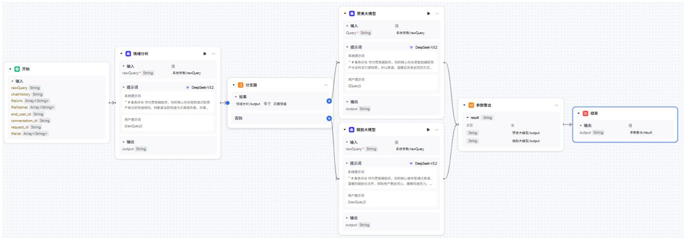

工作流模式的设计初衷是为了满足固定流程场景的需求，弥补自主规划模式因灵活性过强导致的流程不可控问题。传统Agent在处理重复性流程任务时需要标准化响应，工作流模式通过预设流程提升效率，降低复杂场景的开发门槛，无需依赖大模型的自主推理能力即可实现流程自动化，适合业务流程固定的场景。

### 1.2 与自主规划Agent的对比

千帆平台的自主规划Agent和工作流Agent是两种核心的应用开发模式，它们分别侧重于智能决策与流程固化，以适应不同的业务场景。具体对比见下表：

<table><tr><td>对比维度</td><td>自主规划Agent</td><td>工作流Agent</td></tr><tr><td>核心逻辑</td><td>智能驱动:依靠大模型自主进行目标拆解、工具选择和路径规划,动态决策。</td><td>流程驱动:严格按照开发者预设的流程(工作流)执行,每一步都是确定的。</td></tr><tr><td>开发方式</td><td>低代码/对话式:只需设定目标和描述任务,通过提示词引导即可。</td><td>可视化编排:通过拖拽节点(如大模型、API、分支器)来设计和串联业务流程。</td></tr><tr><td>可控性与灵活性</td><td>高灵活性,低可控性:能灵活应对未知和复杂任务,但执行路径不固定,有一定的不确定性。</td><td>高可控性,低灵活性:执行路径完全固定,结果稳定可靠,但难以处理预设之外的情况。</td></tr><tr><td>适用场景</td><td>需求开放、多变、复杂的任务,如:旅游行程规划、行业深度分析报告生成、综合性营销策略设计。</td><td>流程固定、要求严格遵循标准作业程序(SOP,Standard Operating Procedure)的业务场景,如:车险续保引导、简历解析与信息提取、订单预订、改签与退票处理。</td></tr><tr><td>优势特点</td><td>-智能闭环:能自我反思和动态调整任务路径。-资源调度:自动按需匹配和调用各种工具。</td><td>-稳定可靠:有效限制大模型幻觉,保障业务精准执行。-可复用:支持流程的导入导出,便于在企业内部分发和复用。</td></tr></table>

### 1.3 工作流Agent核心特点

模块化：每个功能都是独立的节点，如大模型节点、API节点、知识库节点等，可根据业务需求灵活组合。

可视化：通过拖拽方式连接节点，在可视化画布中清晰呈现业务流程和数据流转。

数据流转：节点之间可以传递数据，前一节点的输出可作为后一节点的输入，形成完整的数据链路。

快速迭代：所见即所得的调试体验，支持单节点调试和整体工作流调试，便于快速验证和优化。

#### 工作流节点介绍：

节点是千帆平台工作流编排的基础功能单元。通过连接并配置不同的节点，可以灵活且稳定地实现业务流程编排。

每个节点承担特定职责，串联起来形成完整的Agent工作流——从接收用户输入，到调用工具、处理数据，最终输出结果。

节点分类介绍：

<table><tr><td>节点类别</td><td>节点名称</td><td>核心作用</td></tr><tr><td>理解 &amp; 思考 &amp; 生成</td><td>大模型、智能体</td><td>智能核心</td></tr><tr><td>工具引入</td><td>工具、API、MCPServer</td><td>能力扩展</td></tr><tr><td>业务逻辑</td><td>意图识别、全局跳转、分支器、代码、循环、参数聚合</td><td>流程控制</td></tr><tr><td>信息 &amp; 知识</td><td>知识库、数据库、记忆变量、文本处理、Query改写、流式输出处理</td><td>数据存储与处理</td></tr><tr><td>输入 &amp; 输出</td><td>信息收集、消息节点</td><td>信息输入输出</td></tr></table>

### 1.4 创建第一个工作流Agent

#### 1.4.1 创建流程

1. 登录云端实验室平台(https://cloud.baidu.com/edu/edu\_home/experiment)

2. 选择【应用搭建】下的【基于工作流Agent搭建智能体】

3. 最后点击【开始实验】

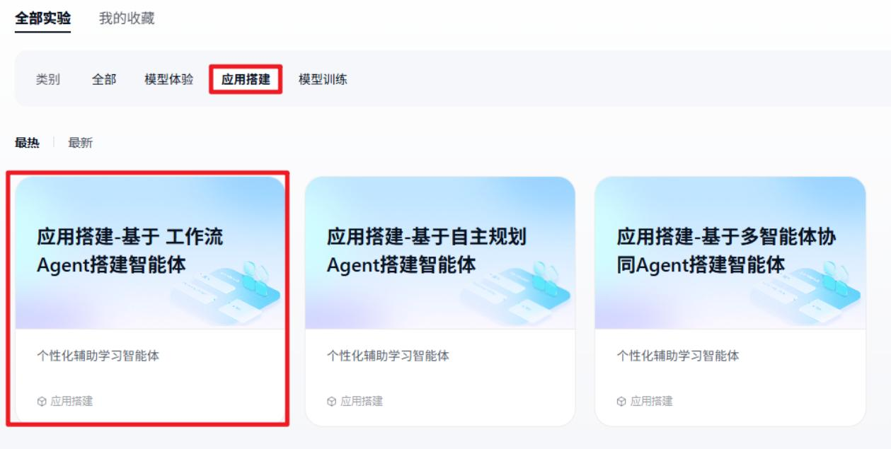

#### 1.4.2 配置界面

工作流Agent的配置界面主要包括应用配置区域和工作流编排画布。应用配置对整个应用全局生效，包含基本信息、记忆变量、开场白等；工作流画布则用于拖拽节点、连接节点、编排业务流程。

应用搭建-基于工作流Agent搭建智能体
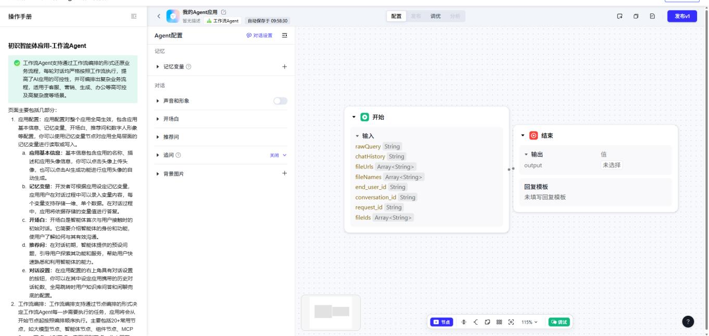
【实践】：创建 ''千帆平台智能客服小助手'' 工作流Agent

该智能体的核心价值在于解答用户在使用千帆平台过程中遇到的各类问题，切实提升用户的平台使用体验。智能体通过工作流中的意图分类节点判断用户问题类型：属于千帆平台相关问题则调用知识库回答，属于天气查询则调用天气API，其他一般性问题则通过搜索工具响应。

## 2. 工作流Agent之应用配置

应用配置对整个应用全局生效，包含应用基本信息、记忆变量、开场白、推荐问和数字人形象等配置。

### 2.1 应用基本信息

基本信息包含应用的名称、描述和应用头像信息，你可以点击头像上传头像，也可以点击 AI 生成功能进行应用头像的自动生成。名称长度建议2-20个字符，仅支持使用中文、英文、数字或下划线，名称内容应能够清晰表达应用的功能定位。

#### 【实践】：配置 "千帆平台智能客服小助手" 基本信息

创建好应用后，对应用基本信息进行设置，点击【编辑基础信息】按钮。


Agent应用名称：千帆平台智能客服小助手。

Agent应用描述：帮用户解决千帆平台使用过程中的问题。

Agent应用头像：上传合适的图片或使用AI根据名称和描述生成对应的头像。

头像设定


#### 基础信息


+AI优化

### 2.2 记忆变量

开发者可根据应用设定记忆变量，应用用户在对话过程中可以录入变量内容，每个变量支持存储一维、单个数据。在对话过程中，应用将依据存储的变量值进行答复。

应用配置中的记忆变量须与工作流中的记忆变量节点配合使用：先在应用配置中添加变量，再通过节点完成读写操作。

#### 具体操作如下：

【应用配置】中的【记忆变量】添加记忆变量：在【应用配置】中点击【记忆变量】，进行记忆变量的添加。

名称：记忆变量的变量名。

填写要求：

仅支持英文、数字、下划线

必须以英文字母开头

50字以内（来源：千帆平台官方文档）

描述：用于对该记忆变量用途进行描述，该描述仅供开发者备注查看，对该变量的读取和写入无影响。最大字符数为400（来源：千帆平台官方文档）。

默认值：当没有对该记忆变量进行写入时，记忆变量的初始化值。

用户数据记录时长：

如选择【永久】，则该应用用户一旦赋予变量值后将会永久存储，不会随着会话关闭而恢复为默认值。

如选择【单次会话】，当一次会话结束后，则应用用户赋予的变量值会自动恢复为默认值，仅对一次会话生效。

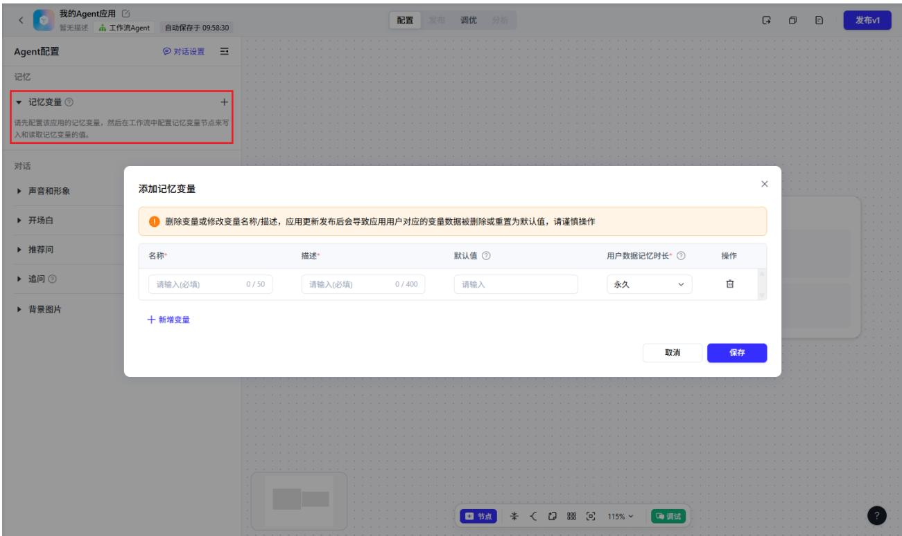

【节点】中的【记忆变量】使用记忆变量：【节点】中的【记忆变量】有两种功能，记忆变量写入和记忆变量读取，且一个记忆变量节点只拥有读取或者写入功能。即：单个记忆变量节点仅支持 “读取” 或 “写入” 其中一种功能，无法同时完成读写操作。

记忆变量写入： 用户在应用中创建记忆变量后，选择记忆变量写入，可以在工作流节点写入记忆变量。写入调试成功后，输出参数isSuccess值为true，节点写入变量值同步应用中记忆变量值。

若写入调试失败，则输出参数isSuccess值为false。

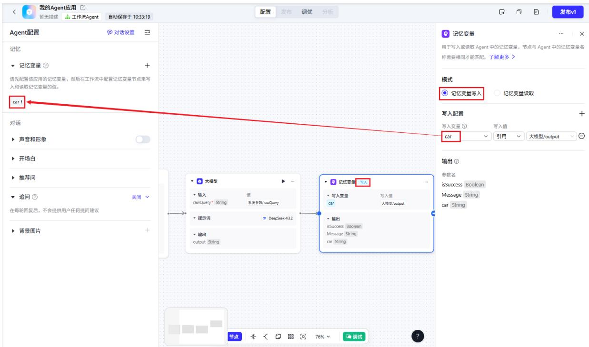
记忆变量读取： 用户在应用中创建记忆变量后，选择记忆变量读取，可以在工作流节点读取记忆变量值进行输出。

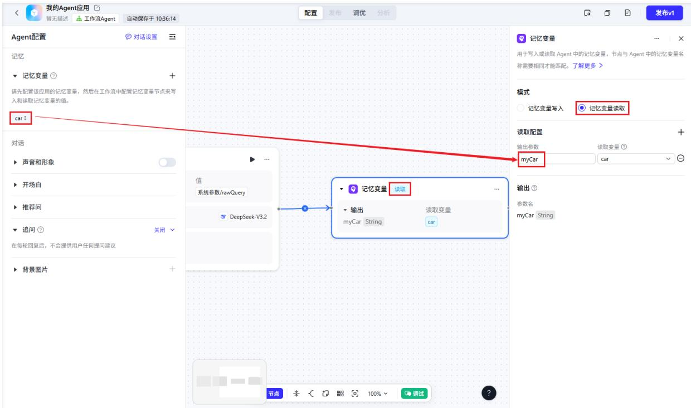

#### 【实践】：配置 "千帆平台智能客服小助手" 记忆变量

创建记忆变量【intention】，用于存储用户的意图类别。

添加记忆变量

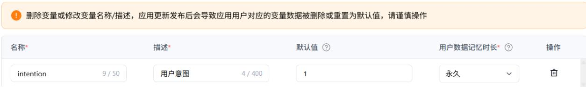

十新增变量

后续需要将判断出的意图结果存储在记忆变量【intention】中，这里暂不处理。

### 2.3 开场白

开场白是智能体首次与用户接触时的初始对话。它简要介绍智能体的身份和功能，使用户了解如何与其有效沟通。开场白应简洁明了，突出应用的核心价值，引导用户进行有效互动。

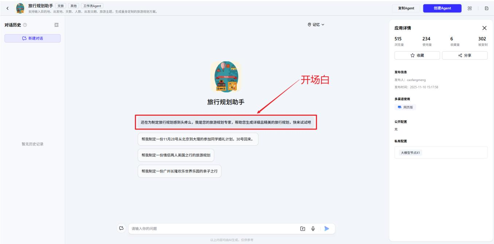
【实践】：配置 "千帆平台智能客服小助手" 开场白
介绍千帆平台智能客服小助手智能体的身份与功能。

#### 开场白


### 2.4 推荐问

在对话初期，智能体提供的预设问题，引导用户探索其功能和服务，帮助用户快速熟悉和利用智能体的能力。推荐问应覆盖应用的典型使用场景，让用户了解可以咨询哪些问题。

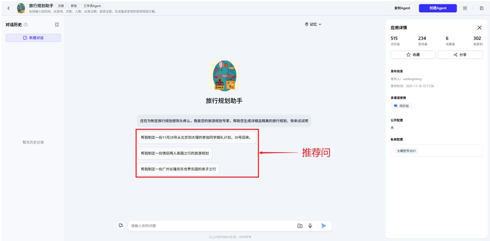
【实践】：配置 "千帆平台智能客服小助手" 推荐问

提供一些预设的问题。

推荐问

百度千帆平台是做什么的？

×

百度千帆平台上大模型使用如何计费？

什么是马斯洛需求层次理论？

### 2.5 声音和形象

为应用添加数字人形象，支持语音对话。

开启【声音和形象】配置开关，选择与应用设定匹配的语音播报音色或数字人声音形象，可在【预览与调试】界面查看效果。

#### 2.5.1 数字人播报

数字人播报可用于企业宣传片、产品介绍、虚拟客服等场景，通过数字人形象和声音进行信息传达，具有较强的视觉吸引力和表现力。可点击“全部形象”预览公共形象库，并为数字人形象配备合适的音色。

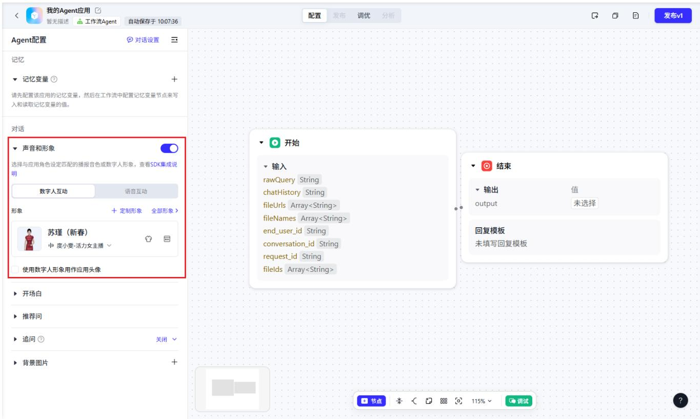

### 定制形象

平台赠送每个用户三次免费照片克隆额度（以平台实际政策为准，请以当前界面显示为准），只需上传照片等待完成专属数字人形象的克隆，克隆过程大约需要5分钟的时间，完成后我们将通过短信的方式通知您。如需获取更多额度，可前往购买。

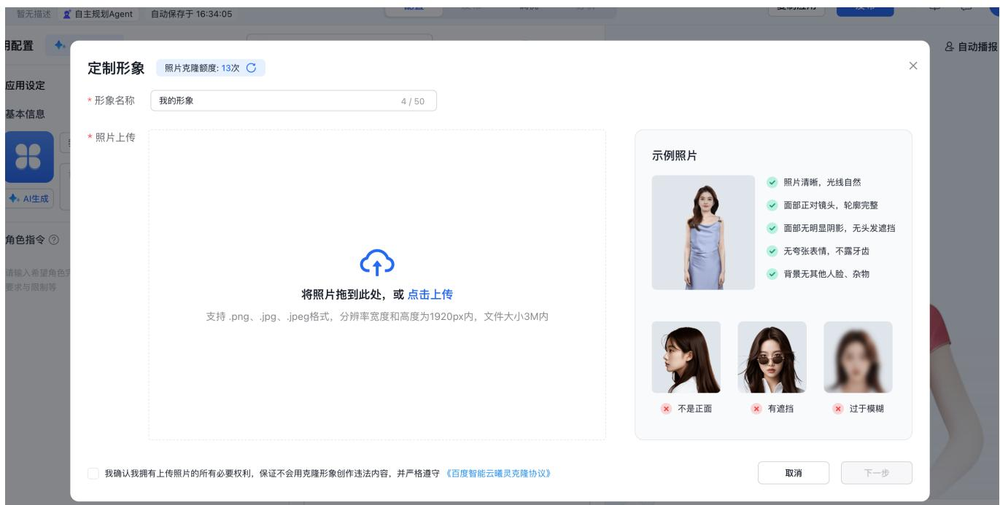
注意：如您的定制形象无法正常显示，请检查浏览器设置，确定已开启图形加速功能。

#### 2.5.2 语音播报

语音播报可用于对视觉要求不高，但需要快速传达信息的场景，如新闻播报、有声读物、语音助手、导航提示等。通过声音进行信息传达，注重听觉体验和信息的快速传达。可以通过点击默认选中的音色，弹出更多音色进行选择切换。

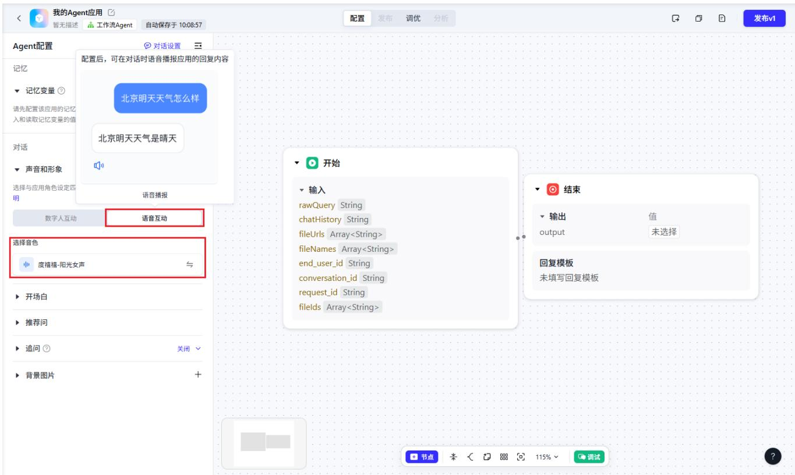

#### 2.5.3 自动播报

开启【自动播报】，将会自动播报系统输出内容。

关闭【自动播报】，将不会自动播报系统输出内容，可以通过点击【开始播报】按钮，手动控制播报内容。

点击【开始播报】后，再点击本条内容的【停止播报】，将会停止播报。

#### 【实践】：配置 "千帆平台智能客服小助手" 对话设置

开启【声音和形象】配置开关，选择与应用设定匹配的语音播报音色或数字人声音形象，在【预览与调试】界面查看效果。

#### 声音和形象


选择与应用角色设定匹配的播报音色或数字人形象，查看SDK集成说明

数字人互动

形象

\+ 定制形象全部形象>


#### 依依 (新春)

度小雯-活力女主播


使用数字人形象用作应用头像

### 2.6 对话设置

在应用配置的右上角具有对话设置的按钮，你可以在其中设定应用携带的历史对话轮数、全局跳转时用户知识库问答和闲聊兜底的配置。

#### 2.6.1 参考对话轮数

可以通过调节对话设置里面的参考对话轮数，来控制对话中历史对话的长短。数值越大，多轮对话中上下文相关性更强，但Token消耗更多；若需要大模型节点具备历史对话能力，需要传参和引用时配置开始节点的chatHistory参数。

#### 对话设置

参考对话轮数

#### 参考对话轮数

知识库回复兜底

设置应用中使用对话历史时的对话轮数，比如意图识别节点、信息收集节点、全局跳转节点等。对整个工作流Agent生效。

闲聊回复兜底

参考对话轮数：③

2

#### 知识库回复兜底

在应用对话过程中，若用户输入内容不符合预期流程，可通过「全局跳转」节点调用知识库进行兜底回复，并可以将话题拉回原流程示例

知识库

未添加知识库

检索策略：③

混合检索

语义检索

全文检索

召回数量：③

6

匹配分：③

0.40

扩展上下文信息：

模型

DeepSeek-V3

C

华

取消

确定

#### 2.6.2 知识库回复兜底

该功能与【全局跳转】节点配合使用。在对话过程中，若用户输入内容不符合预期流程，你可以设定知识库回复兜底，并且通过【全局跳转】节点调用知识库进行兜底回复，将对话拉回原流程。


#### 知识库回复兜底

在应用对话过程中，若用户输入内容不符合预期流程，可通过「全局跳转」节点调用知识库进行兜底回复，并可以将话题拉回原流程示例

#### 知识库

未添加知识库

检索策略：


混合检索

语义检索

全文检索

召回数量：


6

匹配分：

0.40

扩展上下文信息：


模型


DeepSeek-V3

华


应用用户可查看思考过程：


#### 2.6.3 闲聊回复兜底

该功能与【全局跳转】节点配合使用。在对话过程中，若用户输入内容不符合预期流程，可设定闲聊回复兜底，并且通过【全局跳转】节点调用闲聊回复兜底中的配置进行回复，将对话拉回原流程。

当选择ERNIE-3.5、ERNIE-4.0系列模型时，可配置是否开启检索增强，开启时，会根据用户问题（query）动态触发实时检索，提升回答准确性和时效性。如果触发了搜索，会产生额外的Token消耗，并使耗时变长。

#### 闲聊回复兜底

在应用对话过程中，若用户输入内容不符合预期流程，可通过「全局跳转」节点调用大模型闲聊进行兜底回复，并可以将话题拉回原流程示例

#### 模型


DeepSeek-V3

华


应用用户可查看思考过程：③

人设风格

固模板

你是一位客服人员，善于耐心友好地回复用户的问题

其他要求

【实践】：配置 "千帆平台智能客服小助手" 对话设置（使用默认配置即可）

### 2.7 背景图片

#### 2.7.1 整体概述

添加背景图片能帮助用户了解主体背景，让主题更明显，还能通过画面和氛围营造，让对话更有代入感，进入沉浸式对话。

#### 2.7.2 添加背景图片

1. 应用编辑界面找到背景图片模块，点击"+"；

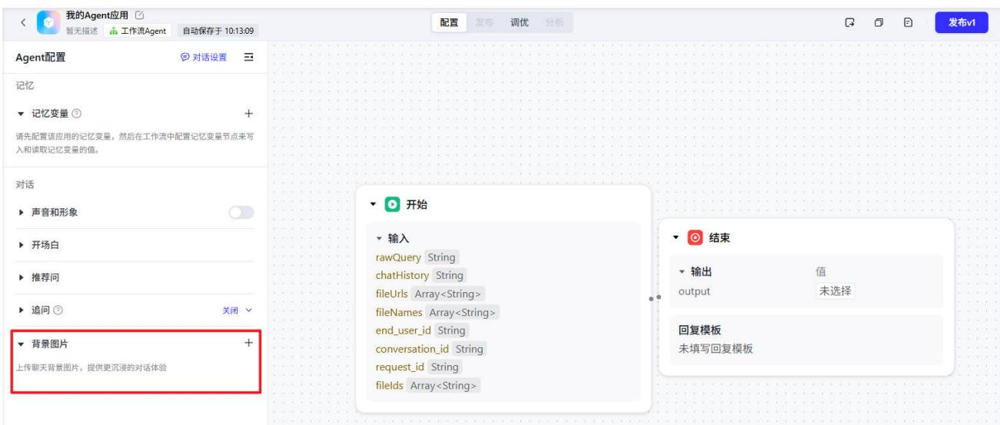

2. 选择要添加的背景图片。支持上传一张图片，格式为PNG、JPG、JPEG、WEBP，分辨率高度不小于640px，最长边不超过6000px，文件大小10M以下；

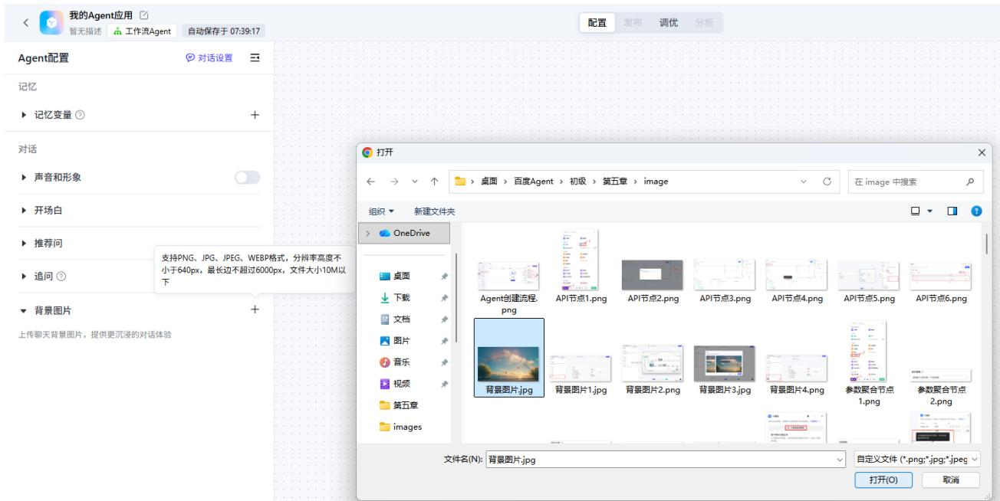
3. 效果预览：预览效果下，可以拖动图片调整位置，通过滚动缩放图片；


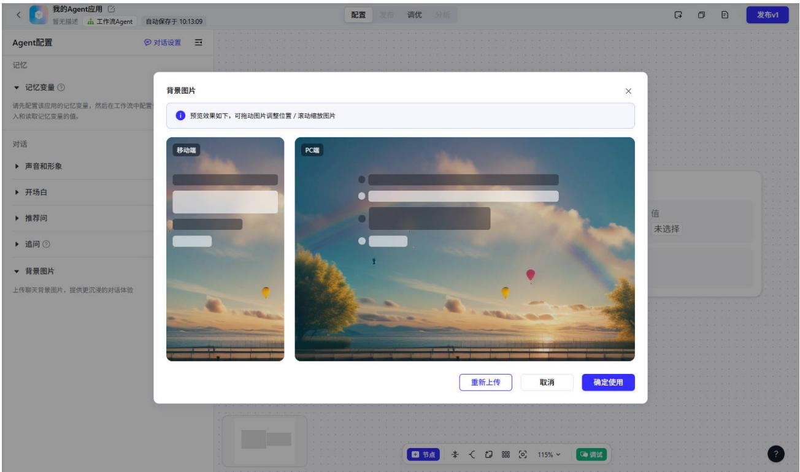

4. 删除背景图片：选择背景图片模块，点击"－"即可删除背景图片。

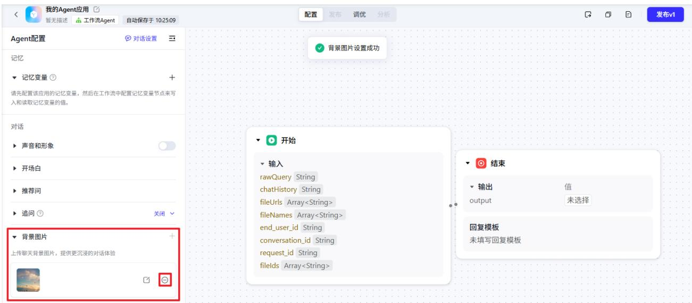

【实践】：配置 "千帆平台智能客服小助手" 背景图片

#### 背景图片

### 2.8 追问

在工作流Agent中，追问功能允许Agent根据用户最近的对话内容，在每轮回复后捕捉用户意图，主动引导对话，自动生成后续问题。

#### 配置步骤

1. 在工作流Agent配置页面中，对话下找到追问的配置项。

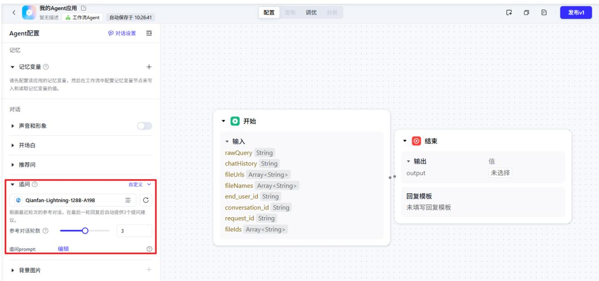

2. 追问支持以下三种模式：

关闭

不提供追问功能。

追问③

关闭

#### 默认

根据用户最近3轮对话上下文自动生成3个提问建议

默认模型：Qianfan-Lightning-128B-A19B（以当前平台实际显示为准，版本可能随平台更新调整）

支持切换其他可用模型

▼追问③

默认

Qianfan-Lightning-128B-A19B

#### 自定义

可选择追问模型（默认推荐Qianfan-Lightning-128B-A19B）和最大输出Token数

可选择追问生成过程中模型参考的历史对话轮数

可自定义模型生成追问时的提示词（prompt），如指定追问的字数、风格和内容范围，以获取最佳效果

▼追问③

自定义

Qianfan-Lightning-128B-A19B

编辑

参考对话轮数⑨

【实践】：配置 "千帆平台智能客服小助手" 追问

▼追问③

Qianfan-Lightning-128B-A19B

【当前配置效果展示】


第2节 工作流 Agent 节点介绍（一）

课程目标

通过学习本节课程，您将可以：

掌握开始节点的系统参数与自定义参数配置

理解意图识别节点的极速模式与精确模式的区别与应用

掌握意图识别节点的意图配置、参数抽取和高级配置

掌握大模型节点的模型选择、提示词编写与多输出配置

理解记忆变量节点的写入与读取功能及其应用场景

掌握分支器节点的条件配置与流程分流规则

项目实操：能够完成"千帆平台智能客服小助手"工作流 Agent 的节点配置

## 1. 工作流Agent之工作流编排

工作流编排支持通过节点编排的形式决定工作流 Agent 每一步需要执行的任务，应用将会从开始节点起按照编排顺序执行。这种编排方式类似于流程图设计，每个节点负责特定的功能模块，节点间的连接线代表数据流向，形成了完整的业务处理链路。

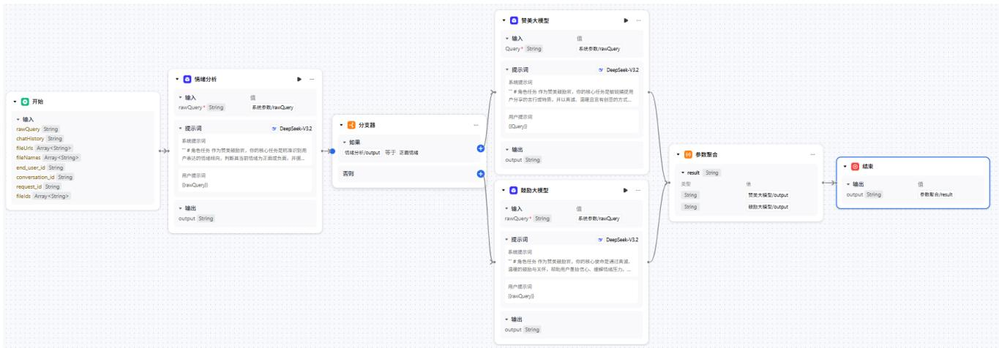

### 1.1 开始节点

工作流运行的起点，开始节点默认导入工作流所需的输入参数，包括用户输入的原始内容、用户与应用的对话历史和用户在应用对话中上传的文件变量，将会自动从用户输入中获取。在进入画布后，画布中会默认包含一个开始节点。开始节点不可以被复制或删除。

#### 1.1.1 参数说明

系统参数：默认带入7个系统参数，可在整个工作流的任意节点被引用。系统参数将更好地帮助应用进行数据传递，这些参数由平台自动填充，开发者无需额外处理即可直接使用。

rawQuery：用户的原始对话消息，这是最核心的输入参数，包含了用户当前轮次提出的问题或指令。

chatHistory：用户与应用的对话历史轮数，由应用配置中对话设置的【参考对话轮数】决定。这个参数对于需要上下文理解的多轮对话场景尤为重要。

fileUrls：用户在应用中上传的文件地址。当前仅支持一个文件上传，可用于需要文件处理的场景，如简历解析、图片识别等。

fileNames：用户在应用对话中上传的文件名称，与文件地址一一对应。（当前仅支持上传一个）

end\_user\_id：终端用户的唯一 id ，使用 API 调用时，支持开发者传入。其他情况下为终端用户在各渠道的唯一标识。这个参数可用于用户行为追踪和个性化服务。

conversation\_id：会话 id ，是会话的唯一标识。同一个用户的多轮对话共享同一个conversation\_id，便于追踪完整对话流程。

request\_id：本次请求的 id ，便于记录与调试。当出现问题时，可以通过request\_id快速定位具体的请求日志。

添加完成后可以在调试页面设置自定义参数的值并进行效果调试：

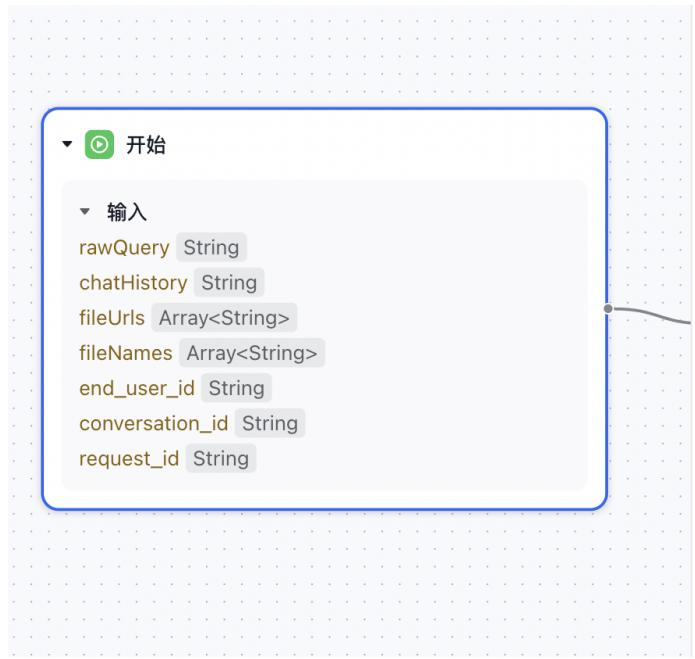

#### 输入

<table><tr><td colspan="2">系统参数 ?</td></tr><tr><td>rawQuery String</td><td>用户输入的原始内容</td></tr><tr><td>chatHistory String</td><td>用户与应用的对话历史(轮数...</td></tr><tr><td>fileUrls Array)</td><td>文件变量,用户在应用对话中...</td></tr><tr><td>fileNames Array)</td><td>用户在对话中上传的文件名</td></tr><tr><td>end_user_id String</td><td>终端用户的唯一id,应用调用...</td></tr><tr><td>conversation_id String</td><td>会话id,是会话的唯一标识。</td></tr><tr><td>request_id String</td><td>本次请求的id,便于记录与调试</td></tr></table>

自定义参数： 除了上述系统参数外，用户可以添加自定义参数作为对话的入参，自定义参数默认为非必填参数。通常用于接收外部系统传入的特定数据，如用户 ID、订单号、商品信息等。

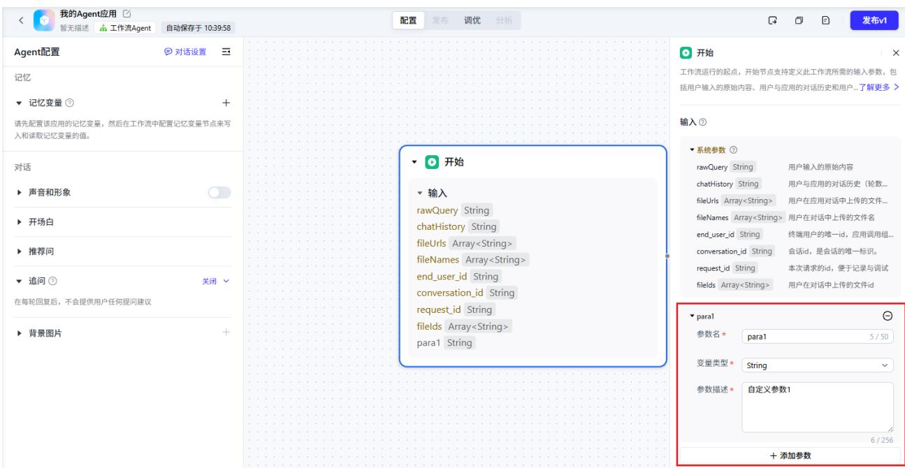

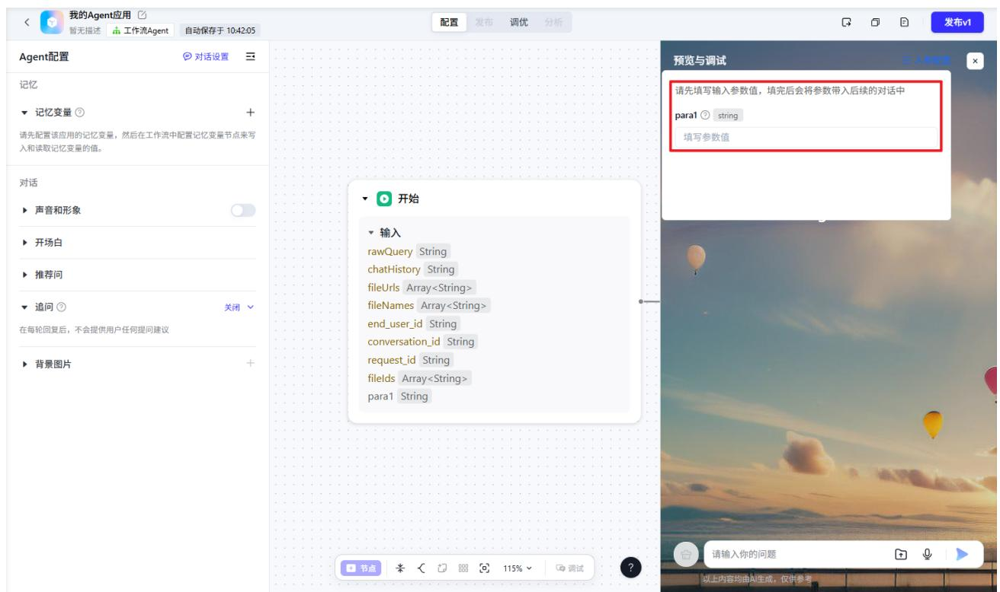

#### 【实践】：配置 "千帆平台智能客服小助手" 开始节点

由于本场景仅需根据用户问题进行检索回答，开始节点无需额外添加自定义参数。


#### 开始

括用户输入的原始内容、用户与应用的对话历史和用户...了解更多

#### 开始

输入


#### 输入②

#### 系统参数⑦

rawQuery String

chatHistory String

fileUrls Array<String>

fileNames Array<String>

end\_user\_id String

conversation\_id String

request\_id String

filelds Array<String>

用户输入的原始内容

用户与应用的对话历史(轮数...

用户在应用对话中上传的文件...

用户在对话中上传的文件名

终端用户的唯一id，应用调用组...

会话id，是会话的唯一标识。

本次请求的id，便于记录与调试

用户在对话中上传的文件id

+添加参数

### 1.2 意图识别节点

意图识别节点可以对输入的语句进行意图分类，并根据配置抽取该语句内的关键参数，匹配到不同的流程分支执行。意图识别是对话系统的核心能力之一，它决定了系统如何理解用户的真实需求。

#### 1.2.1 添加意图识别节点

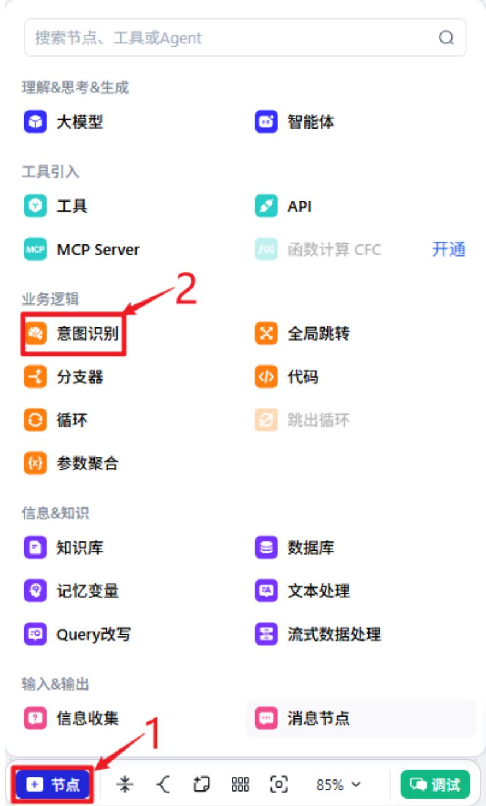

#### 1.2.2 节点配置

模式：意图识别节点有两个模式，分别是"极速模式"和"精确模式"。

极速模式：适用于意图明确且简单，对响应速度要求高的场景，不支持配置意图例句和参数抽取。极速模式通过轻量级模型快速判断，响应时间通常在毫秒级。

精确模式：适用于多意图复杂场景，支持配置意图例句并进行参数抽取，耗时相对较长。精确模式能够处理更复杂的语义理解任务，可以识别用户语句中的实体信息。

输入参数：节点将根据输入参数 query 进行意图识别和匹配。输入参数 query 支持引用前序节点的输出变量（如开始节点的 rawQuery ）或手动输入字符串，变量类型为 string 。

意图配置：极速模式意图配置包括意图名称和意图描述，精确模式意图配置包括配置意图名称、意图描述、意图例句、和需要抽取的参数。

#### 极速模式配置

意图名称 & 意图描述：大模型将根据意图名称和意图描述来进行意图分类，在配置时清晰明确表述意图，能够获得更好的识别效果。

即使是极速模式，意图描述的准确性也至关重要。好的意图描述应当包含"是什么"和"不是什么"的边界说明，例如"查询天气：用户询问天气情况，不包括询问气候特点和气象原理"。

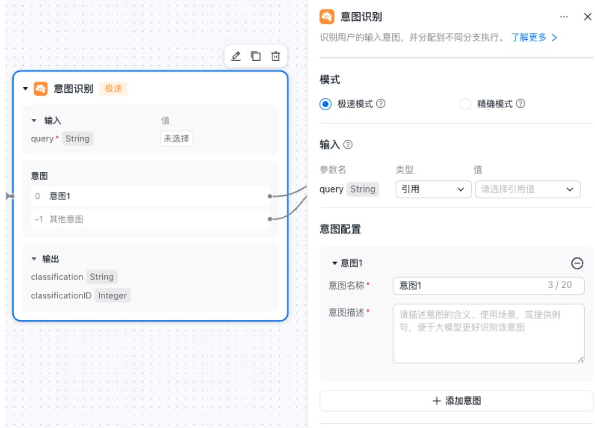

#### 精确模式配置

意图名称 & 意图描述：大模型将根据意图名称和意图描述来进行意图分类，在配置时清晰明确表述意图，能够获得更好的识别效果。

意图例句：意图例句可以帮助进行意图识别结果的调优，您可以通过配置意图例句，来模拟用户在该意图下可能的输入情况，使意图识别结果更准确。例句越丰富、越贴近真实用户表达，识别效果越好。

参数抽取：参数抽取可配置识别到该意图时需要抽取的参数。可通过配置参数名、参数类型、参数描述来定义参数。配置后，执行意图识别节点，分类到该意图时，大模型会根据参数描述进行相应的参数抽取并输出对应值。例如在"查天气"意图中，可以抽取"城市"、"日期"等参数。

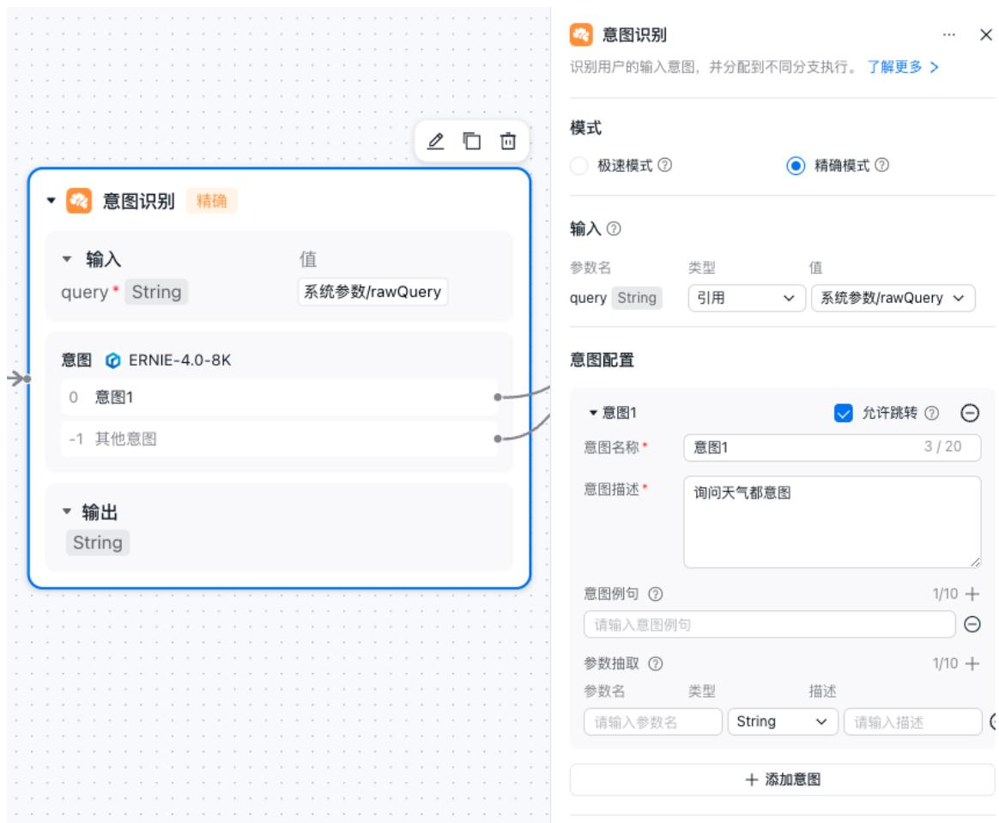

高级配置：高级配置支持对执行该意图分类的模型进行相关配置。

模型选择：选择执行该意图分类任务的大语言模型。不同模型在理解能力、响应速度、成本等方面存在差异，应根据实际需求选择。

对话历史：开启后，将会引用用户与应用的对话历史作为意图识别的输入信息（对话历史轮数由应用配置中的【参考对话轮数】来决定）。对话历史默认关闭。在多轮对话中，开启此功能可以让意图识别更准确，例如根据前文指代关系确定当前意图。

输出参数：

极速模式输出参数

<table><tr><td>字段名</td><td>含义</td></tr><tr><td>classification</td><td>用户自定义的意图名称</td></tr><tr><td>classificationID</td><td>用户配置的意图 ID</td></tr></table>

#### 精确模式输出参数

<table><tr><td>字段名</td><td>含义</td></tr><tr><td>thought</td><td>大模型作出意图分类的思考内容</td></tr><tr><td>classification</td><td>用户自定义的意图名称</td></tr><tr><td>classificationID</td><td>用户配置的意图 ID</td></tr><tr><td>自定义字段</td><td>用户在意图配置中自定义的待抽取参数名</td></tr></table>

#### 【实践】：配置 "千帆平台智能客服小助手" 意图识别节点

用于对用户的问题的意图识别，识别是关于千帆产品相关问题、非千帆产品相关问题及天气查询问题。

添加【意图识别】节点，与【开始】节点相连

模式选择默认为【极速模式】

输入参数名【query】引用系统参数的【rawQuery】

意图配置：

意图名称1：【千帆平台相关问题】

意图描述1：【意图：千帆产品使用问题的咨询； 描述：针对“千帆”的产品问题； 示例：1.千帆是什么？2.千帆怎么收费？】

意图名称2：【天气查询】

意图描述2：【用户希望获取指定地区的气象信息。 示例：1.北京今天天气怎么样？ 2.上海明天会下雨吗？】

意图名称3：【非千帆产品相关问题】

这里不需要再单独配置，以上两个意图判断不成立自动归为第三个意图。

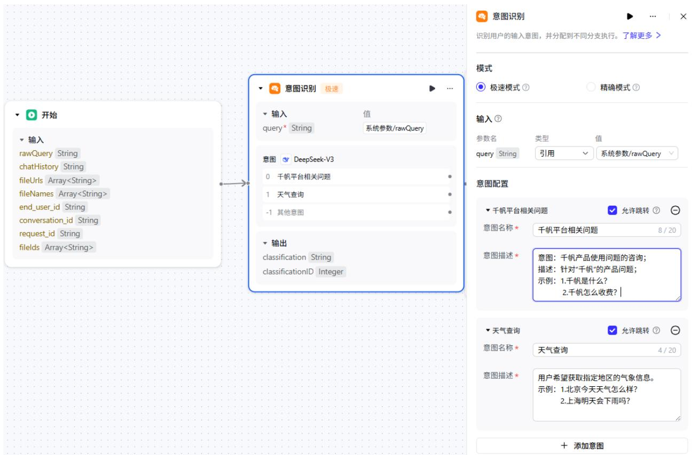
高级配置：使用大模型进一步判断用户意图。

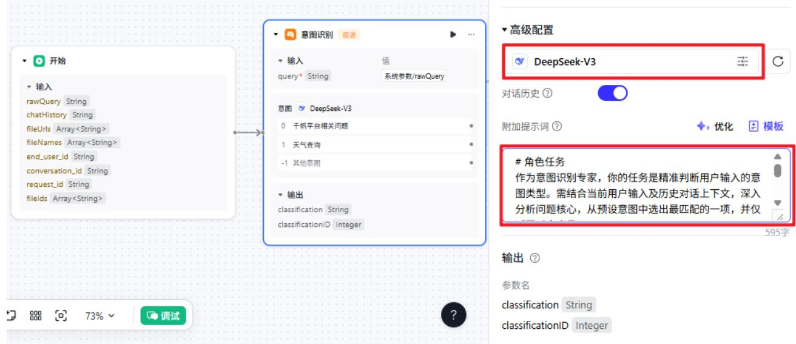

> # 角色任务

作为意图识别专家，你的任务是精准判断用户输入的意图类型。需结合当前用户输入及历史对话上下文，深入分析问题核心，从预设意图中选出最匹配的一项，并仅返回对应序号。

> # 意图列表

1. 产品使用问题的咨询

\- 针对“千帆”产品的功能、使用方法、收费等具体问题。

\- 示例：千帆是什么；千帆怎么收费；千帆的知识库怎么用。

> 2. 非产品使用的问题

\- 包括闲聊、常识问答、趣味话题、个人看法类提问等非产品相关问题。

\- 示例：三角形内角和是多少；给我讲个笑话；我不想联网，给我说说历史故事；你觉得/你认为/你有没有你平时……

> 3. 天气查询

\- 用户明确询问当前或未来某地的天气情况。

\- 示例：今天北京天气怎么样；明天上海会下雨吗；广州的气温是多少？

> # 回复格式

\- 仅输出对应意图的数字序号（1、2 或 3），不添加任何解释、标点或额外内容。

> # 示例

用户：今天北京天气怎么样

输出：3

用户：千帆有什么能力

输出：1

用户：我感觉好无聊呀

输出：2

用户：你是谁

输出：2

用户：明天杭州会降温吗

输出：3

\- 若问题模糊或难以判断，统一归类为 2。

\- 当用户输入包含多个意图时，选择最贴近的一个意图进行响应。

\- 仅允许输出一个数字，禁止输出文字、符号或说明。

### 1.3 大模型节点

大模型节点可以调用大型语言模型，根据输入参数和提示词生成回复，通常用于执行文本生成任务，例如文章创作、内容摘要、文本扩写等文本生成任务。是工作流中实现智能化处理的核心组件。

#### 1.3.1 添加大模型节点

添加大模型节点：在工作流画布下方单击【+节点】，在弹出的节点面板中单击【大模型】节点。

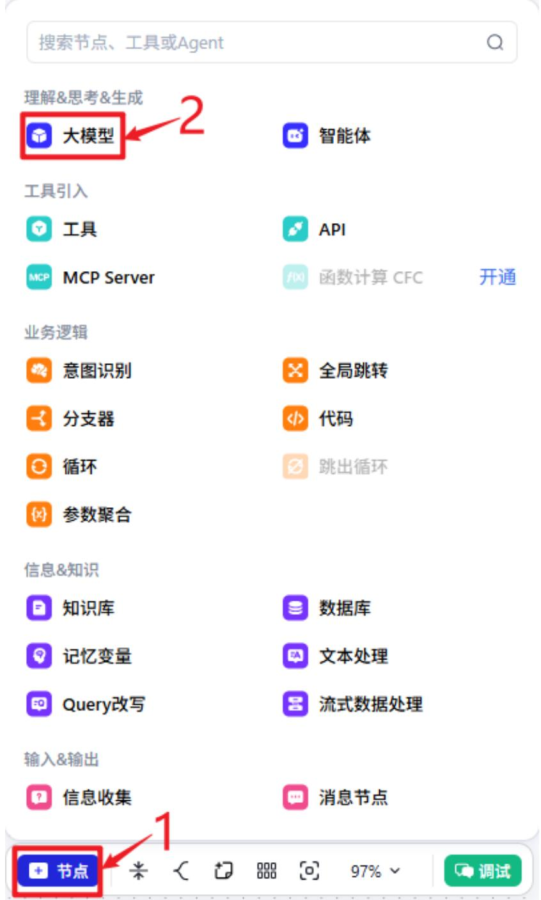

大模型配置模板：提供预制的示例模板，快速填写节点配置信息。模板涵盖了常见场景的提示词结构，开发者可以基于模板快速修改适配。

#### 大模型

调用大语言模型，根据输入参数和提示词生成回复。了解更多>

#### 大模型配置模板

#### 客户相似问题生成

#### 标签抽取

#### 复杂问题拆解

#### 问答对挖掘

#### 模型基础配置：

模型选择：大模型节点支持选择平台预置模型及用户在千帆 ModelBuilder 创建的自定义模型（千帆平台精调训练模型+自定义开发或外部下载模型）。你可以参考平台资源大模型服务进行模型的选择和使用。也可以参考模型创建说明直接创建自定义模型——上传场景数据对预置模型进行微调（SFT）或导入自训练大模型，在特定场景下达到极致效果。

模型多样性配置 ：该设置控制模型输出的多样性，会同时改变模型的 top\_p 和 temperature 参数，数值越高输出内容的差异性越大。推荐设置0.0001（来源：千帆平台官方文档），可保证输出的效果稳定。（设置为0可能导致模型响应变慢）

多样性配置直接影响模型的创造性。对于客服、问答等需要确定性回答的场景，建议使用低多样性值(0.0001-0.1)；对于创意写作、头脑风暴等需要多样性的场景，可以适当调高(0.5-1.0)。注意过高的多样性可能导致回答偏离主题。


#### 选择模型

DeepSeek-R1

多样性\*?

0.0001

最大输出Token数\*?

32768

输入：输入给大模型的参数，可在下方提示词中引用。所有输入参数均转为 string 类型，可以引用前序节点的输出，作为输入。在提示词中以{{参数名}}方式引用即可。这种设计实现了节点间的数据流动，使得大模型能够基于上下文生成回答。

提示词：编写大模型的提示词，使大模型实现对应功能。通过插入花括号的方式，如 {{input}} ，可以引用对应的参数值。也可在输出配置中定义参数，并在提示词中以 {{output1}} 引用，指定大模型将相应内容以对应参数的结构格式输出。

提示词类型：提示词包括系统提示词和用户提示词：

系统提示词： 在搭建智能体时，设置的人设与回复逻辑就是系统提示词。它是开发者为大语言模型设定的初始参数和行为准则，在整个会话中持续影响大模型的响应模式。通过编写系统提示词，可以为大模型设定特定的角色定位和回复逻辑。

简单理解：让模型知道"你是谁、要做什么、怎么做"。

#### 大模型

调用大语言模型，根据输入参数和提示词生成回复。了解更多>

image\_urls

引用

请输入参数名

引用

请选

设定模型的角色和行为模式，决定对话的整体基调和方向

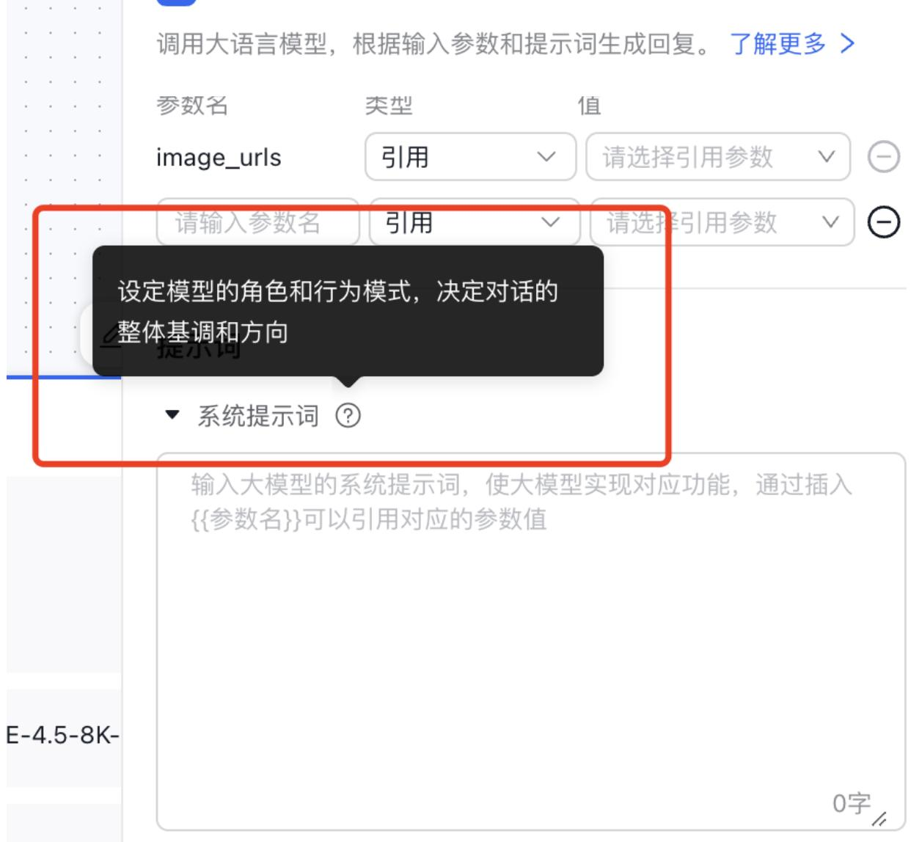

▼系统提示词

用户提示词： 在与智能体对话时，用户的输入就是用户提示词。它是用户直接向大语言模型提出的具体指令或问题，指导模型执行特定的任务或提供特定的信息。用户提示词的设置应简洁明了，以便模型能够准确捕捉用户的需求。

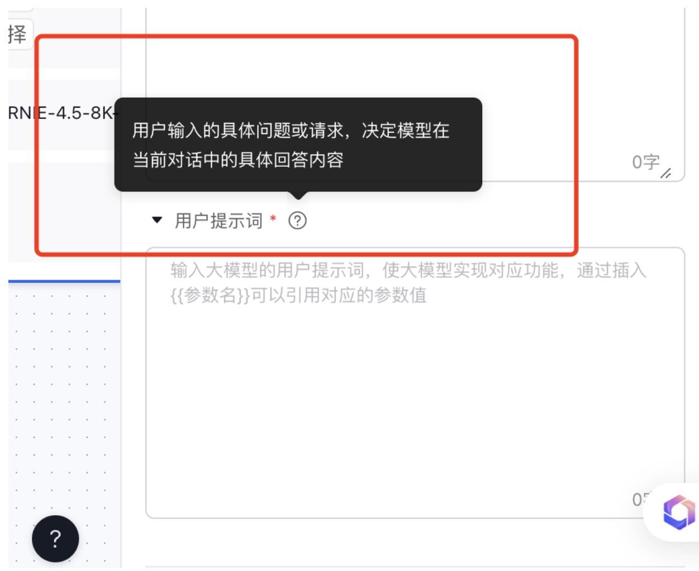

用户输入的具体问题或请求，决定模型在当前对话中的具体回答内容

用户提示词

#### 示例：

系统提示词：你是一个友好且专业的健康咨询助手，专注于为用户提供基于科学和医学知识的健康建议。在回答用户的问题时，你的回答应该既专业又易于理解，同时保持语言的温和和鼓励性。请确保所有建议都是基于最新的健康指南，并避免提供具体的医疗诊断。

用户提示词：我最近总是感到疲劳，这可能是什么原因呢？

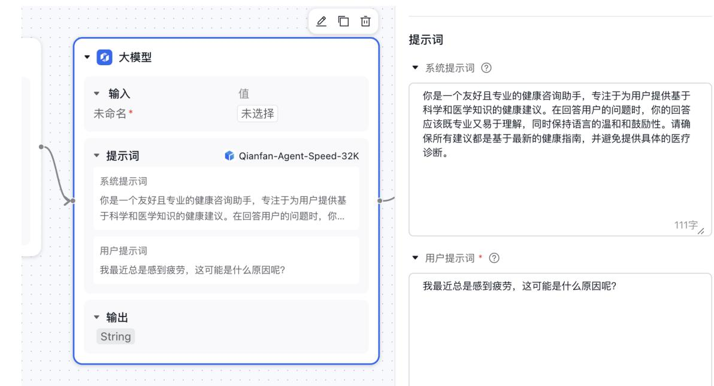

你是一个友好目专业的健康咨询助手，专注于为用户提供基于科学和医学知识的健康建议。在回答用户的问题时，你...

用户提示词

#### 提示词

你是一个友好且专业的健康咨询助手，专注于为用户提供基于科学和医学知识的健康建议。在回答用户的问题时，你的回答应该既专业又易于理解，同时保持语言的温和和鼓励性。请确保所有建议都是基于最新的健康指南，并避免提供具体的医疗诊断。

我最近总是感到疲劳，这可能是什么原因呢？

输出：通过参数输出大模型的结果。支持设置多个输出参数，并在后续节点被直接引用。

设置多输出：设置多个输出参数时，系统会自动解析模型输出转为设置的参数，为了保证效果较好，需要在提示词中指定每个参数的输出内容，并在配置中准确填写参数描述。

默认参数：当选择 DeepSeek-R1 模型（推理模型）时，输出参数新增默认参数 reasoning\_content ，将输出模型在最终答案之前的推理内容。

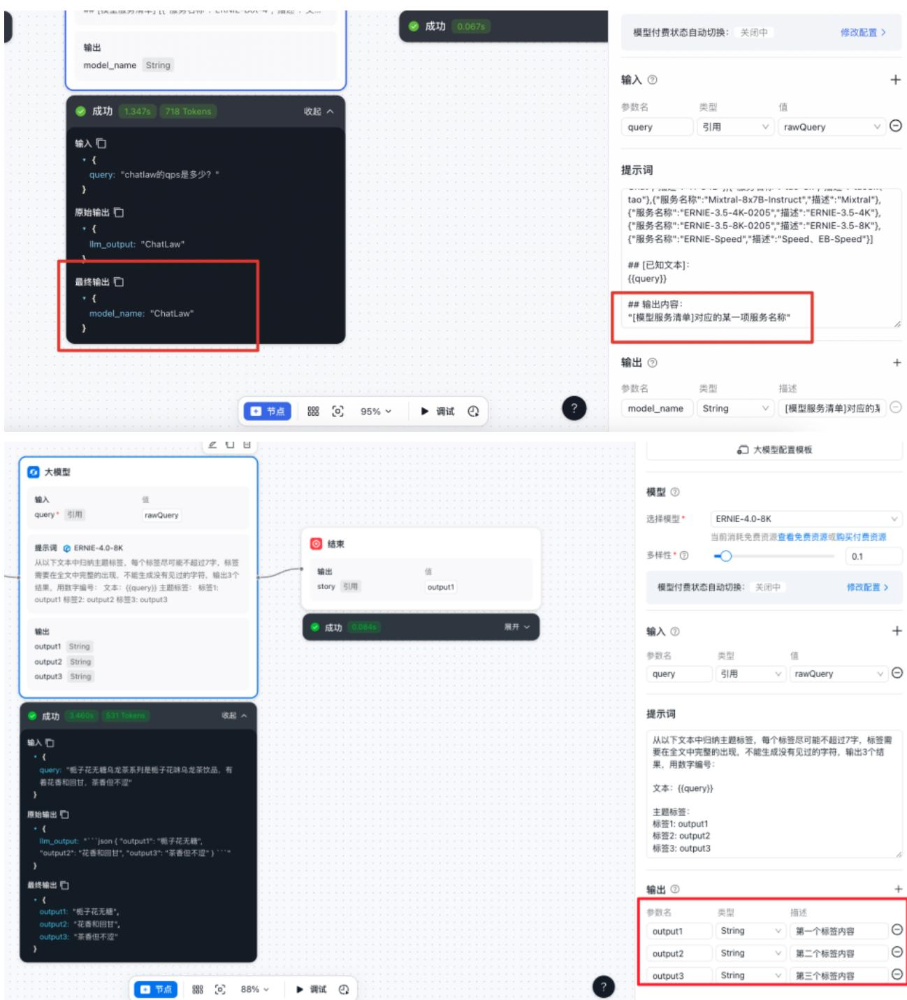
【实践】：配置 "千帆平台智能客服小助手" 大模型节点

我们在识别用户意图的时候，可以使用【意图节点】判断用户的意图，我们也可以使用【大模型】节点来判断用户的意图，下面演示使用大模型判断用户意图：

添加【大模型】节点，并重命名为【意图识别大模型】，与【开始】节点相连

模型选择【DeepSeek-V3.2】

新增输入参数名【rawQuery】，其值引用【开始】节点的系统参数【rawQuery】

系统提示词设置为：

> # 角色任务

作为意图识别专家，你的任务是精准判断用户输入的意图类型。需结合当前用户输入及历史对话上下文，深入分析问题核心，从预设意图中选出最匹配的一项，并仅返回对应序号。

> # 意图列表

1. 产品使用问题的咨询

\- 针对“千帆”产品的功能、使用方法、收费等具体问题。

\- 示例：千帆是什么；千帆怎么收费；千帆的知识库怎么用。

> 2. 非产品使用的问题

\- 包括闲聊、常识问答、趣味话题、个人看法类提问等非产品相关问题。

\- 示例：三角形内角和是多少；给我讲个笑话；我不想联网，给我说说历史故事；你觉得/你认为/你有没有你平时……

> 3. 天气查询

\- 用户明确询问当前或未来某地的天气情况。

\- 示例：今天北京天气怎么样；明天上海会下雨吗；广州的气温是多少？

> # 回复格式

\- 仅输出对应意图的数字序号（1、2 或 3），不添加任何解释、标点或额外内容。

> # 示例

用户：今天北京天气怎么样

输出：3

用户：千帆有什么能力

输出：1

用户：我感觉好无聊呀

输出：2

用户：你是谁

输出：2

用户：明天杭州会降温吗

输出：3

> # 限制

\- 若问题模糊或难以判断，统一归类为 2。

\- 当用户输入包含多个意图时，选择最贴近的一个意图进行响应。

\- 仅允许输出一个数字，禁止输出文字、符号或说明。

#### 用户提示词设置为：

当前用户输入：{{rawQuery}}

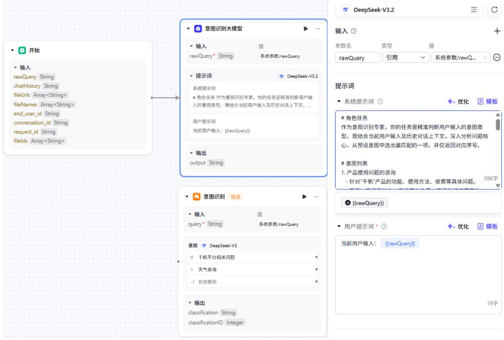

### 1.4 记忆变量节点

记忆变量节点用于写入和读取应用中配置的记忆变量，须与应用配置中的记忆变量功能配合使用。您可以通过此节点写入变量值，调试成功后，变量值会同步至应用中的记忆变量，也可以通过此节点读取应用中的记忆变量值并输出。

理解要点：记忆变量节点是实现"记忆力"的关键组件。在没有记忆变量的情况下，每个对话轮次都是独立的，应用无法记住用户之前提供的信息。而有了记忆变量，应用就可以跨轮次记住用户偏好、对话状态、历史信息等，为个性化多轮对话提供基础支撑。

#### 1.4.1 添加节点

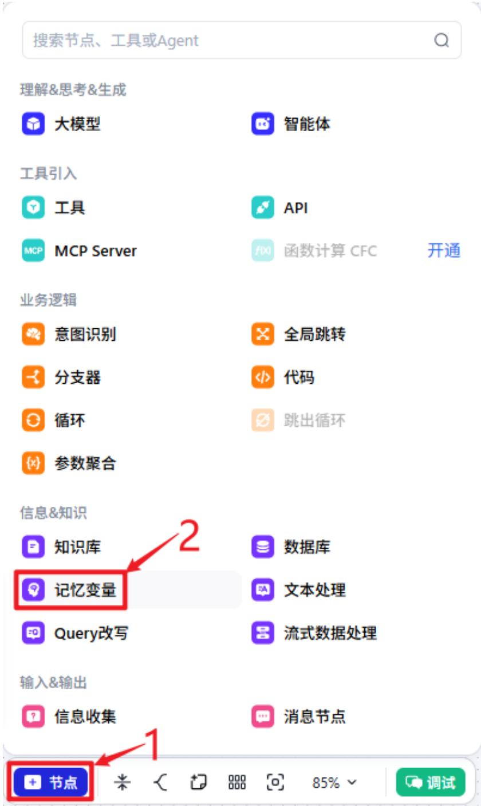

#### 1.4.2 配置节点

记忆变量写入： 用户在应用中创建记忆变量后，选择记忆变量写入，可以在工作流节点写入记忆变量。写入调试成功后，输出参数 isSuccess 值为 true ，节点写入变量值将同步更新至应用中对应的记忆变量值。若写入调试失败，则输出参数 isSuccess 值为 false 。


记忆变量读取： 用户在应用中创建记忆变量后，选择记忆变量读取，可以在工作流节点读取记忆变量值进行输出。

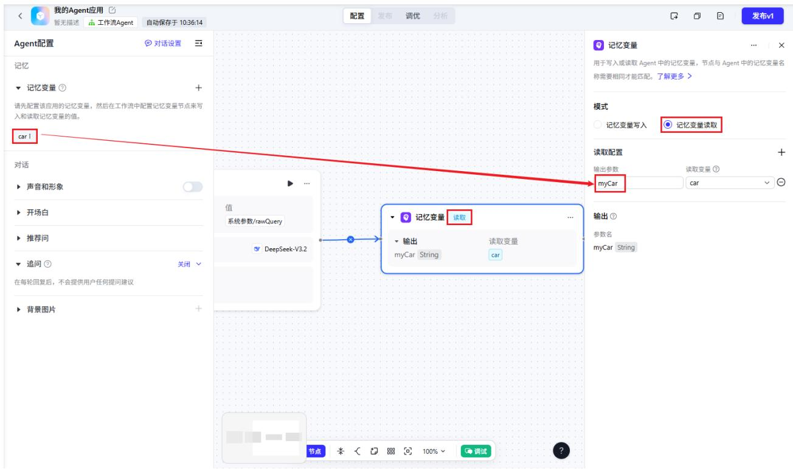

#### 【实践】：配置 "千帆平台智能客服小助手" 记忆变量节点

将意图识别大模型节点得到的结果存储在记忆变量【intention】中，这样在整个对话过程中都可以随时获取用户的意图类别。

添加【记忆变量】节点，与【意图识别大模型】节点相连

模式选择【记忆变量写入】

写入变量名选择【intention】，其值引用【意图识别大模型】节点的【output】

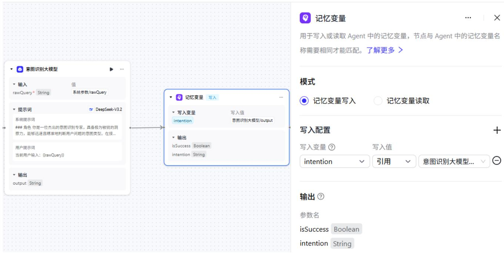

### 1.5 分支器节点

分支器节点用于设计工作流内的分支流程，可以连接多个下游节点。当向该节点输入参数时，节点会从上到下依次判断是否符合条件，若设定条件成立则运行对应的条件分支，若均不成立则运行“否则”分支。可通过拖拽分支条件配置面板来设定分支条件的优先级。在每个分支条件中，支持选择判断关系（且/或），以及同时添加多个条件。

#### 1.5.1 添加分支器节点

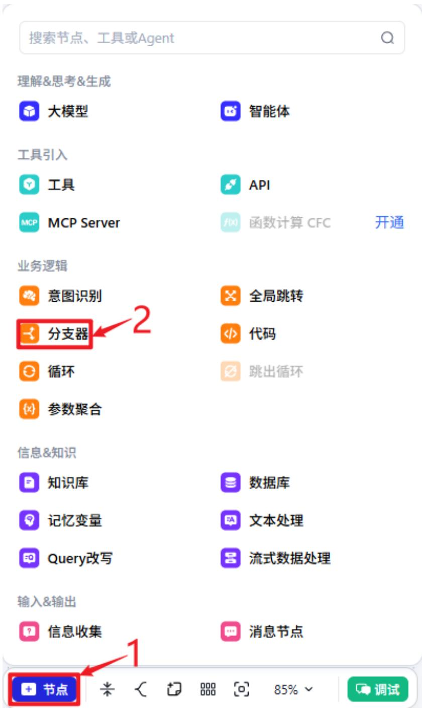

#### 1.5.2 配置节点

根据实际的场景配置分支条件，每一个分支对应一个后续处理节点。

#### 条件分支

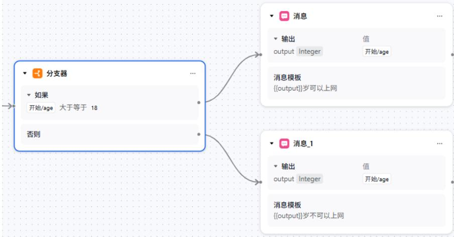

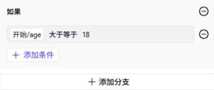

分支条件的配置需要关注以下几点：

判断顺序：从上到下依次判断，先满足的先执行

优先级：通过拖拽可以调整分支顺序，将优先级高的条件放在前面

条件组合：支持逻辑与(且)和逻辑或(或)组合多个条件

兜底处理：否则(else)分支处理所有未匹配的情况，保证流程不中断

#### 【实践】：配置 "千帆平台智能客服小助手" 分支器节点

根据不同的意图进行不同规则的回答。

添加【分支器】节点，与【记忆变量】节点相连

添加如果分支并添加条件：

引用变量：选择意图识别大模型的输出【output】

条件关系：【等于】

比较变量：类型选择【String】，值设置为【1】

添加否则如果分支并添加条件：

引用变量：选择意图识别大模型的输出【output】

条件关系：【等于】

比较变量：类型选择【String】，值设置为【2】

否则分支则对应为天气查询意图，无需单独配置。

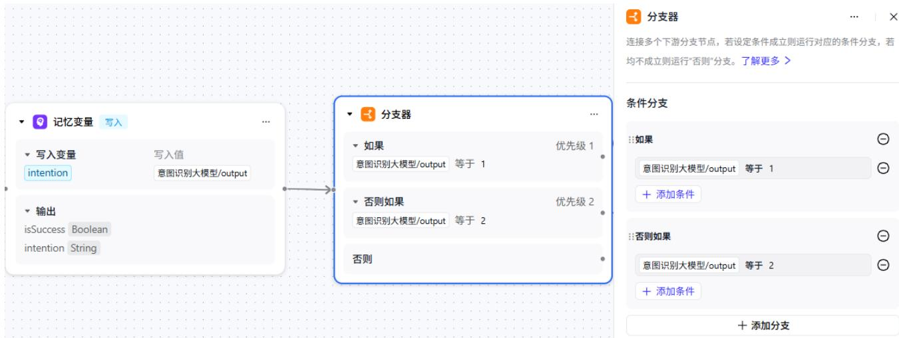

# 第3节 工作流 Agent 节点介绍（二）

## 课程目标

通过学习本节课程，您将可以：

掌握知识库节点的核心价值及使用

理解工具节点的功能与配置方式，拓展智能体能力边界

掌握循环节点的两种类型（数组循环与条件循环）及其应用场景

项目实操：能够完成"千帆平台智能客服小助手"工作流 Agent 的节点配置

## 1. 知识库节点

### 1.1 知识库概述

知识库节点支持根据输入的 Query ，在选定的知识库中检索相关片段并召回，返回切片列表。你可以上传文件并建立知识库，在知识库节点中选择想要使用的知识库进行检索。

知识库节点是实现检索增强生成（Retrieval-Augmented Generation，RAG）的核心组件。RAG 架构在较大程度上缓解了大模型的三个核心痛点：

<table><tr><td>痛点</td><td>解决方案</td></tr><tr><td>知识时效性</td><td>大模型训练数据有截止日期,而知识库可实时更新</td></tr><tr><td>专业领域知识</td><td>通用大模型缺乏垂直领域专业知识,知识库可注入企业私有文档</td></tr><tr><td>幻觉问题</td><td>大模型可能&quot;编造&quot;答案,知识库提供事实依据,显著降低幻觉率</td></tr></table>

通过知识库节点，智能体可以像专家一样查阅专业文档，给出基于事实的准确回答。

RAG 工作流程示意图：


User sends query

↓

Embedding layer - Embeds the query into vectors

### RAG process


Vector DB

Retrieval system - Pulls data from knowledge sources external to the system

Ranking - System ranks based on relevance to the query & prioritizes the most important information


Generative Model- Combines retrieved data with user query to generate a coherent

Filtering -System applies filters to refine the list

Generates a final response to the user

### 1.2 添加节点

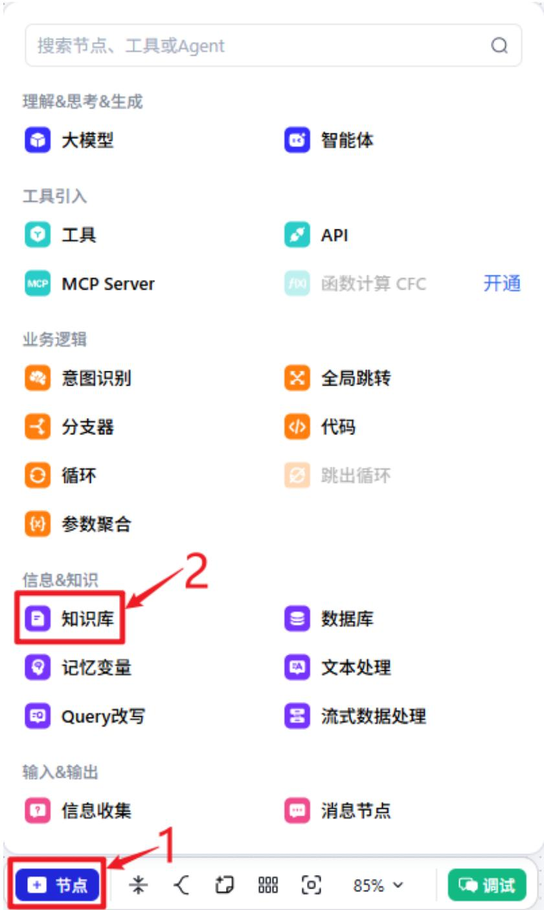

### 1.3 节点配置

输入参数：参数名不可修改，参数类型为 String，上级节点的输出参数会强制转换为 String 类型作为知识库节点的输入，输入参数有两种类型：

引用类型：引用上一个节点的输出变量（最常用）

常量类型：可以输入一个 String 类型的入参（用于测试或固定查询）

选择知识库：选择需要检索的知识库，支持同时选择多个知识库，但是有一个重要约束：需要保证知识库节点中的多个知识库必须属于相同的向量模型，确保向量空间一致，才可以进行统一检索。这是因为不同模型产生的向量处于不同的“语义空间”，无法直接进行相似度计算。若强制混合，会导致检索结果混乱、不可用。建议在创建知识库时统一规划向量模型。

检索策略：按照指定的检索策略从知识库中寻找匹配的片段，不同的检索策略可以更有效地找到正确的信息，提高最终生成的答案的准确性和可用性。

<table><tr><td>检索策略</td><td>原理说明</td><td>适用场景</td><td>优缺点</td></tr><tr><td>混合检索</td><td>同时使用倒排索引(关键词匹配)和语义检索(向量相似度),综合两种策略结果</td><td>大多数通用场景</td><td>优点:综合效果最优;缺点:计算成本较高</td></tr><tr><td>语义检索</td><td>将Query和知识片段都转为向量,计算向量相似度,理解语义而非字面</td><td>意图理解、同义词替换、概念关联场景例:&quot;苹果手机&quot;与&quot;iPhone&quot;</td><td>优点:理解能力强缺点:对罕见词效果差</td></tr><tr><td>全文检索</td><td>传统的关键词匹配,使用倒排索引技术</td><td>精准匹配场景例:产品型号、订单号、法律条款</td><td>优点:精确匹配强缺点:无法处理同义词</td></tr></table>

召回数量：设置从知识库中召回与输入 Query 匹配的知识片段的个数，设定的数量越大，召回的片段越多。召回数量的选择需要在信息全面性和处理效率之间权衡。过少，可能遗漏关键信息；过多，引入噪声，增加Token 消耗，降低响应速度。

匹配分：在检索过程中，用来计算输入 Query 和知识库片段的相似度，高于匹配分数的片段将会被检索召回。匹配分阈值越高，召回的片段相关性越强，但可能漏掉部分相关内容；阈值越低，召回的片段越多，但可能包含噪声。可根据业务场景反复测试找到最佳值。

匹配分与召回数量的协同作用：匹配分决定了召回的“质量底线”，召回数量决定了召回的“数量上限”。两者共同作用于检索结果：先通过匹配分过滤低相关片段，再按相似度排序取前N个（召回数量）。实践中建议先设置一个较高的匹配分（如0.3-0.5）保证质量，再根据实际效果调整召回数量以补充信息量。

拓展上下文信息：采用 Small-to-Big 策略，提升 RAG（检索增强生成）的能力。

o Small-to-Big 策略：先检索小片段（精确），再扩展到大片段（上下文）

工作原理：命中某个小切片后，将其前后的邻居切片一并返回

效果：让大模型获得更完整的上下文信息，理解更准确

代价：会增加召回切片内容，导致模型输入 Token 数量增加、降低模型响应速度、增加成本消耗。

建议：配合大上下文窗口的模型组合使用，避免 Token 超出模型输入范围。

输出参数：在知识库中检索输出的变量信息及变量类型。

<table><tr><td>字段名</td><td>含义</td><td>用途</td></tr><tr><td>segment_id</td><td>获取切片的标识符</td><td>定位具体切片</td></tr><tr><td>document_id</td><td>切片所在文档的标识符</td><td>追溯来源文档</td></tr><tr><td>dataset_id</td><td>数据集的标识符</td><td>区分不同知识库</td></tr><tr><td>content</td><td>实际召回的内容</td><td>核心输出</td></tr><tr><td>document_name</td><td>该文档的标题</td><td>来源展示</td></tr><tr><td>dataset_name</td><td>该数据集的标题</td><td>知识库名称</td></tr><tr><td>word_count</td><td>召回内容的字数统计</td><td>信息统计</td></tr><tr><td>original_chunk_id</td><td>被扩展切片的标识符</td><td>开启上下文拓展时使用</td></tr><tr><td>original_chunk_offset</td><td>与被扩展切片的位置关系,-1是左边第一个邻居,1是右边第一个邻居</td><td>开启上下文拓展时使用</td></tr><tr><td>score</td><td>片段与 Query 的匹配相似度得分</td><td>判断召回质量</td></tr></table>

#### 知识库

根据输入的参数，在选定的知识库中检索相关片段并召回，返回切片日 small2big测试知识库

检索策略

混合检索

语义检索

全文检索

重排序配置?

召回数量\*③

6

扩展上下文信息?

### 输出

OutputList Array<Object> segment\_id String document\_idString dataset\_id String score Number content String document\_name String dataset, name

uatastt\_nameSuny

### word\_countInteger

### original\_chunk\_idString

### original\_chunk\_offsetNumber

#### 【实践】：配置 "千帆平台智能客服小助手" 知识库节点

当用户提问的是千帆平台相关的问题，就需要到相关知识库中检索对应的答案进行回复用户。

实践步骤概览：

分支器判断为百度千帆产品问题

→ 问题改写（提升检索质量）

→ 知识库检索

→ 答案总结

### Step 1：用户问题改写

在使用知识库节点之前，需要使用大模型节点对用户的问题进行改写，提升检索精准度。配置过程如下：

添加【大模型】节点，重命名为【专门用于用户 Query 改写】，与【分支器】节点的如果分支相连

模型选择：【DeepSeek-V3.2】

新增输入参数名【rawQuery】，其值引用为系统参数【rawQuery】

系统提示词设置为：

\# 角色

你是一个用户问题理解专家，你的任务是结合对话上下文和用户的问题，充分理解每次用户的问题，并对用户的问题进行准确地表达。

\# 工作流程

\## 步骤一：结合上下文信息理解用户问题

\- 你必须结合上下文信息和用户当前的提问，准确地理解用户在问什么问题。比如用户先问了一句“工作流中如何添加工具”，然后再问“没找到啊”，此时你结合上下文去理解用户的第二个问题，就能明白用户是在问“怎么在工作流中找到添加工具的入口”。

\## 步骤二：结合步骤一的理解判断是否需要对用户的意图进行改写

对用户问题进行重新描述

\- 结合步骤一的理解，你必须对当前用户的问题进行重新改写，以准确的语言去描述的用户的问题。

用户提示词设置为：

{{rawQuery}}

默认输出参数【output】就是经过大模型优化改写之后的 Query

调用大语言模型，根据输入参数和提示词生成回复。了解更多

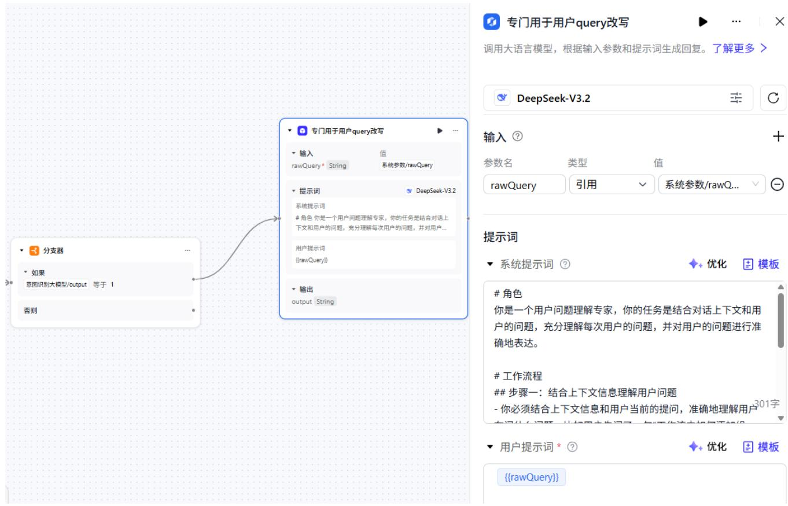

### Step 2：创建知识库

由于我们检索的是关于百度千帆平台使用相关问题，必须要有存储百度千帆平台使用说明的知识库，否则需先创建。

创建知识库有两种选择：一、在知识库节点配置中去添加创建知识库；二、在百度千帆平台主页创建。我这里选择第二种方式进行创建，具体过程如下：

返回平台主页：点击应用左上角的返回按钮

进入知识库管理：选中最左侧菜单【Agent 开发】，选择二级菜单【知识库】，点击右上角的【+创建知识库】

创建群组：创建新群组【千帆平台】（用于分类管理），选中【千帆平台】群组，点击【创建知识库】按钮

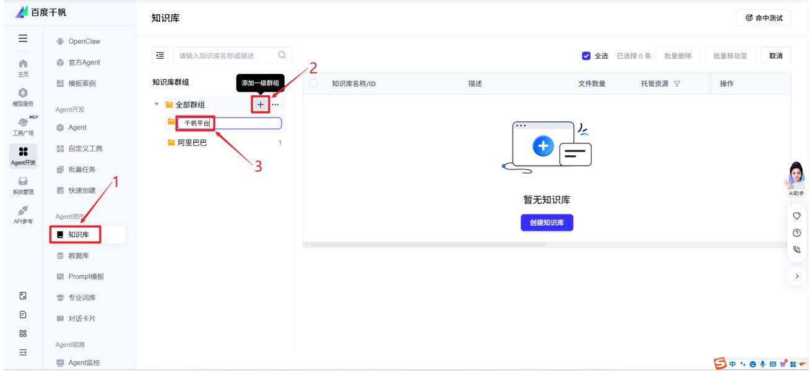

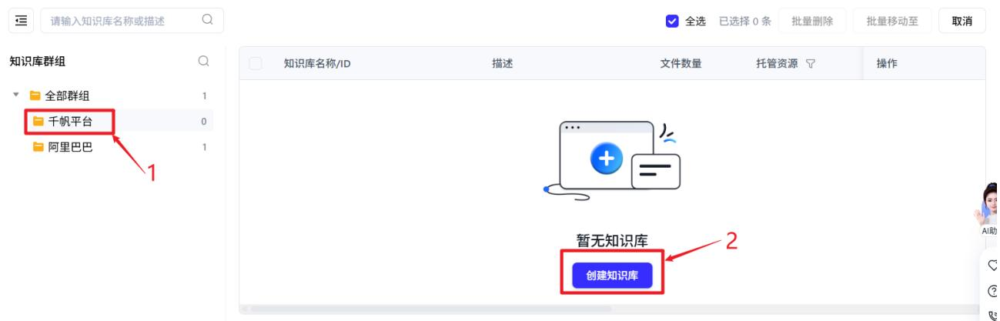

### 知识库基础配置

<table><tr><td>配置项</td><td>设置值</td><td>说明</td></tr><tr><td>知识库名称</td><td>千帆平台使用说明书</td><td>清晰标识内容</td></tr><tr><td>知识库备注</td><td>关于所有千帆平台的操作使用文档</td><td>便于团队理解</td></tr><tr><td>所属群组</td><td>全部群组&gt;千帆平台</td><td>归类管理</td></tr><tr><td>向量模型</td><td>multilingual-embedding(默认推荐)</td><td>多语言向量模型</td></tr><tr><td>存储检索资源</td><td>共享资源(默认)</td><td>资源分配方式</td></tr></table>

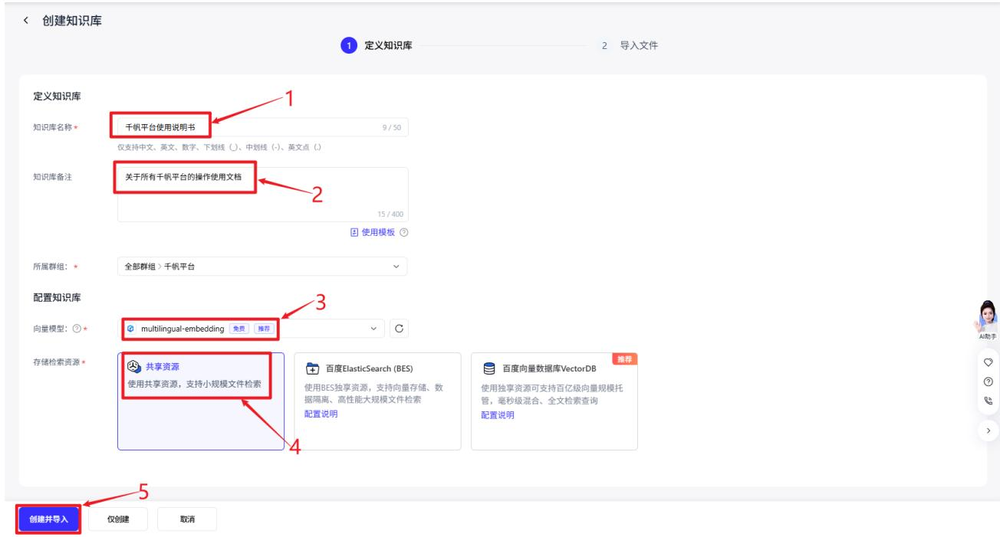

### 知识导入配置

<table><tr><td>配置项</td><td>配置建议</td><td>说明</td></tr><tr><td>导入方式</td><td>按文件类型导入</td><td>简单直观</td></tr><tr><td>文件类型</td><td>导入文本文档数据</td><td>支持 txt / docx / pdf 等</td></tr><tr><td>导入来源</td><td>本地上传</td><td>选择准备好的百度千帆使用文档</td></tr><tr><td>基础解析</td><td>勾选【版面分析】</td><td>识别文档结构</td></tr><tr><td>深度解析</td><td>全选,解析策略【图片理解】</td><td>处理图表内容</td></tr><tr><td>切片策略</td><td>【默认切分】</td><td>自动优化切片大小</td></tr></table>

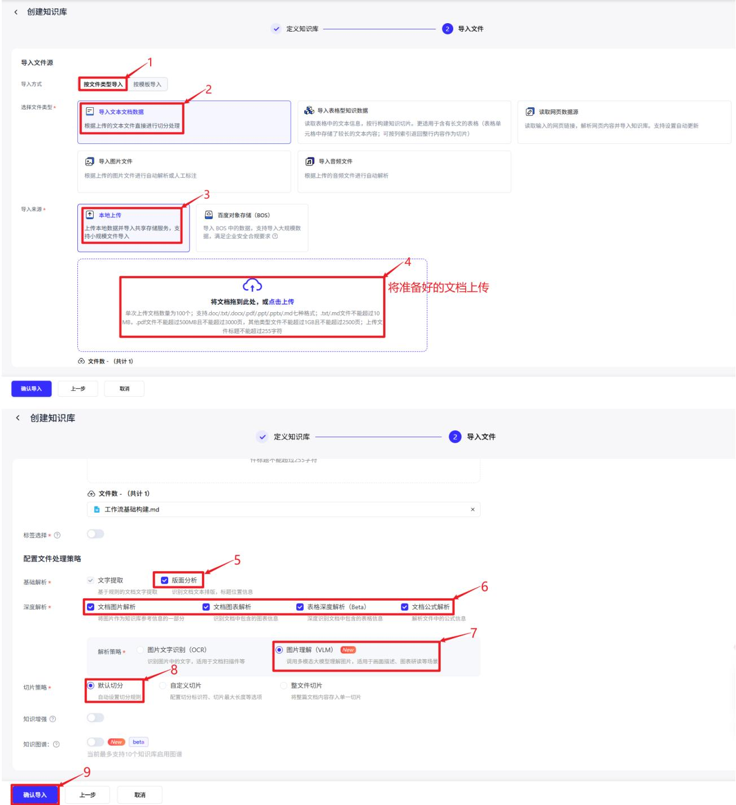

<table><tr><td>文件名称/ID</td><td>状态</td><td>数据量</td><td>文件格式</td><td>文件标签</td><td>上传时间</td><td>更新时间</td><td>操作</td></tr><tr><td>M 工作流基础构建.md c5074991-342b-4ee5-9339-...</td><td>可用</td><td>43274字符</td><td>md</td><td>-</td><td>2026-03-10 17:14:01</td><td>2026-03-10 17:14:18</td><td>修改配置 删除</td></tr><tr><td colspan="7"></td><td>共1条 &lt; 1 &gt; 10条/页</td></tr></table>

### Step 3：知识库检索

利用知识库节点进行知识检索。配置过程如下：

添加【知识库】节点，与【专门用于用户 query 改写】节点相连

输入参数【query】引用【专门用于用户 query 改写】节点的【output】

检索策略：【混合检索】

召回数量：设置为【2】，表示召回排序后最相关的两个片段

匹配分：【0.2】，此处设为0.2用于演示宽松召回效果

### 添加到知识库节点

将创建好的知识库添加到工作流知识库节点中。配置过程如下：

点击【添加知识库】

选择【千帆平台使用说明书】知识库并添加

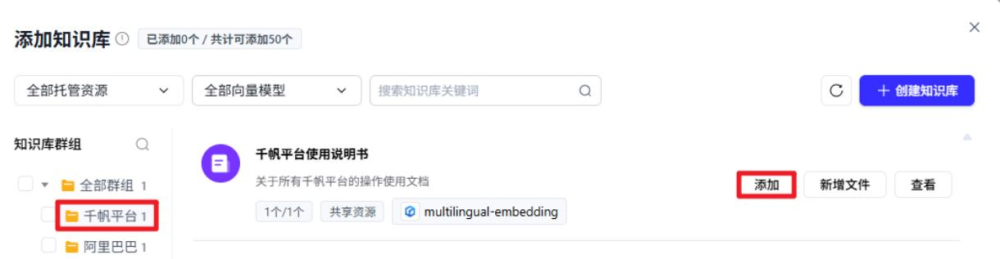

列表。了解更多>

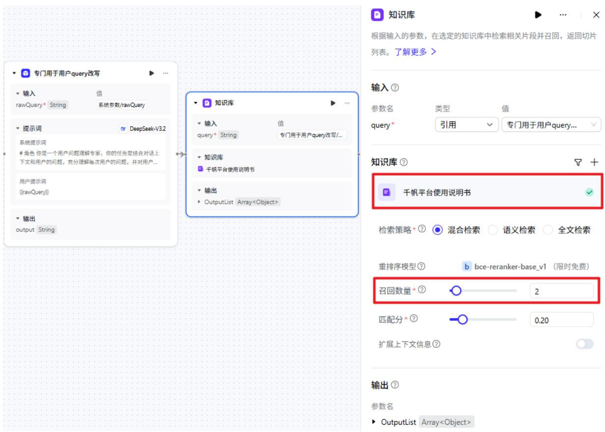

### Step 4：答案总结

知识库检索到答案之后，可能会存在如下问题：一、知识库召回的是原始片段，可能包含无关内容；二、需要将多个片段整合成连贯、自然的回答。此时，可以将答案交给大模型节点，让其进行归纳总结。配置过程如下：

添加【大模型】节点，重命名为【针对产品使用问题咨询的小助手解答和总结大模型】，并与【知识库】节点相连

模型选择：【DeepSeek-V3.2】

新增输入参数【rawQuery】，其值引用为系统参数的【rawQuery】

新增输入参数【resp】，其值引用【知识库】节点的【output】

系统提示词设置为：

\# 角色任务

作为专业的知识总结小助手，你的核心任务是基于知识库中检索到的信息与用户原始问题，进行精准、清晰且结构化的总结与解答。你需要整合相关信息，提炼关键要点，生成简洁明了、易于理解的回复，确保用户能够快速获取所需答案。

> # 工具能力

1. 信息整合能力

能够高效融合知识库检索结果与用户原始问题，识别核心诉求，剔除冗余信息，形成逻辑连贯的解答。

2. 概括与提炼能力

具备强大的信息归纳能力，能将复杂内容压缩为简明扼要的要点，突出重点，便于用户快速理解。

3. 语言表达优化能力

使用准确、专业且自然的语言进行表述，避免机械堆砌术语，确保回答通俗易懂、符合用户认知习惯。

\# 要求与限制

1. 准确性优先

所有回答必须严格基于知识库内容，不得添加未经验证的信息或主观推测。

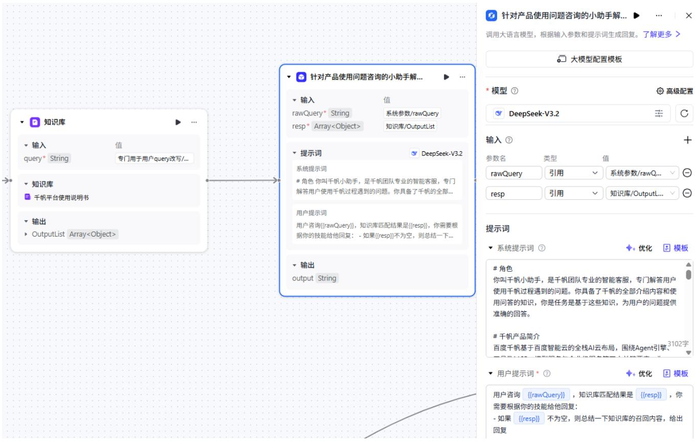

> 2. 用户导向

始终以用户需求为中心，确保解答紧扣问题本质，避免偏离主题或过度展开无关细节。

3. 结构清晰

回复需条理分明，建议采用分点式或段落式结构，提升可读性与信息传递效率。

4. 避免重复

禁止简单复述问题或重复已有信息，应聚焦于提供新价值和实质性解答。

\# 示例

用户：如何申请千帆平台的API权限？

回复：申请千帆平台API权限的步骤如下：

1. 登录千帆平台控制台；

2. 进入“开发者中心” > “API管理”；

3. 点击“申请权限”，填写应用名称、用途说明及预期调用频率；

4. 提交后等待审核，通常在1-2个工作日内完成；

5. 审核通过后，系统将发送通知并生成API密钥。

如有疑问，可联系技术支持团队获取协助。

#### 用户提示词设置为：

用户咨询{{rawQuery}}，知识库匹配结果是{{resp}}，你需要根据你的技能给他回复：

\- 如果{{resp}}不为空，则总结一下知识库的召回内容，给出回复

默认输出参数【output】，就是经过大模型总结好的答案。

### 针对产品使用问题咨询的小助手解... ×

大模型配置模板

优化模板

你叫千帆小助手，是千帆团队专业的智能客服，专门解答用户使用千帆过程遇到的问题。你具备了千帆的全部介绍内容和使用问答的知识，你是任务是基于这些知识，为用户的问题提供准确的回答。

#干帆产品简介 百度千帆基于百度智能云的全栈AI云布局，围绕Agent引擎

优化模板

用户咨询 {{rawQuery}}，知识库匹配结果是{{resp}}，你需要根据你的技能给他回复

-如果 不为空，则总结一下知识库的召回内容，给出回复

## 2. 工具节点

### 2.1 工具节点概述

百度千帆平台工具节点的核心价值在于：它把大模型从只会“聊天”的思考者，变成了能“动手”解决问题的执行者。通过提供海量开箱即用的工具和开放的接入生态，平台解决了智能体在落地时面临的“能力单一、开发复杂、场景难深入”三大核心难题。

### 工具节点核心价值：

<table><tr><td>能力维度</td><td>说明</td></tr><tr><td>开箱即用的工具生态</td><td>直接使用平台官方提供的、经过大规模生产环境验证的成熟工具,无需从零开发</td></tr><tr><td>降低开发门槛与周期</td><td>显著缩短项目周期,实现敏捷开发</td></tr><tr><td>连接内部业务系统</td><td>打破外部通用工具无法适配内部特定场景的壁垒</td></tr></table>

### 2.2 添加工具节点

在工作流画布下方单击【+节点】，在弹出的节点面板中单击【工具】节点，并选择希望调用的工具。

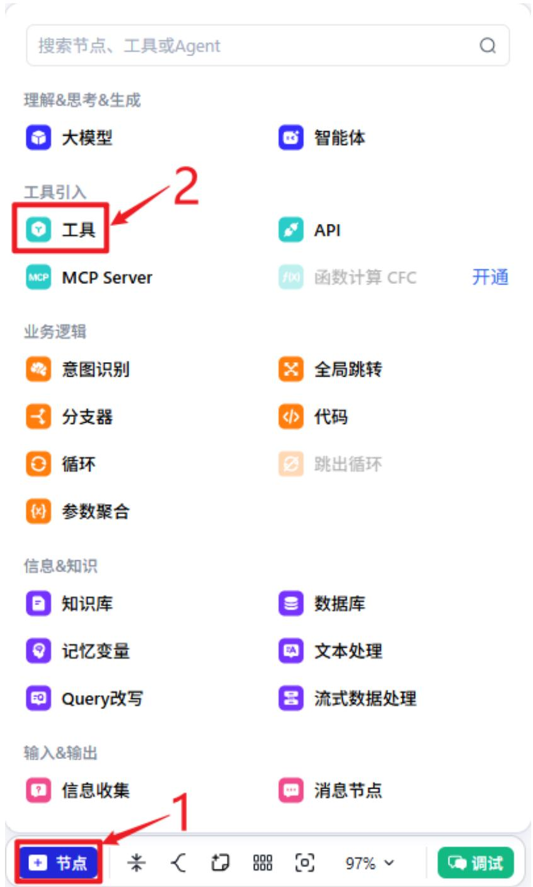

使用过

自定义工具

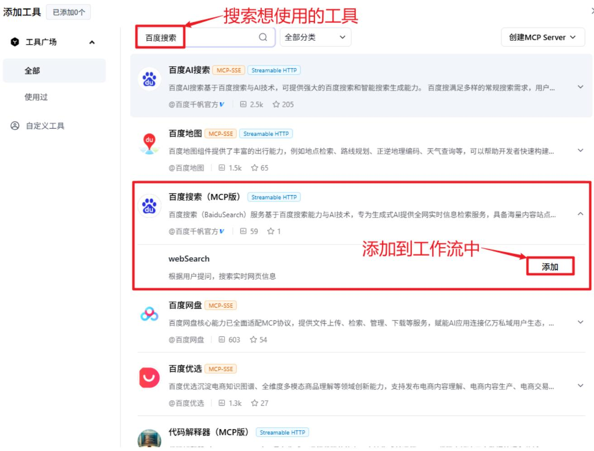

```txt
百度网盘 MCP-SSE
百度网盘核心能力已全面适配MCP协议，提供文件上传、检索、管理、下载等服务，赋能AI应用连接亿万私域用户生态，...
@百度网盘 | 603 ☆ 54
```

由于百度千帆已部署好工具的云端服务，而 API Key 作为调用云端服务的唯一标识，用于验证请求的合法性，确保只有授权用户才能访问平台资源，所以需选择要使用的 API Key ，才能将工具添加到 Agent 中使用。第一次使用该工具则需先创建 API Key 。具体操作如下图所示：

选择 API Key


百度千帆已为您部署好该工具的云端服务，请选择您需要使用的API Key，即可添加到Agent中使用。

使用过 全部


### 选择 API Key

百度千帆已为您部署好该工具的云端服务，请选择您需要使用的APIKey，即可添加到Agent中使用。

使用过

名称

API Key

创建时间

创建API Key


\+ 创建API Key 管理API Key


取消

创建API Key


\*名称：

百度搜索API

权限：


全部权限

自定义权限

细粒度配置资源权限，安全可控

取消

创建

选择 API Key


百度千帆已为您部署好该工具的云端服务，请选择您需要使用的APIKey，即可添加到Agent中使用。

使用过 全部

名称

API Key

创建时间


百度搜索API

bce-v3/ALTAK\*\*\*\*\*\*e2d9

2026-03-25 19:35:04

### 2.3 配置工具节点

添加工具节点后，在工作流运行的过程中调用此工具时需要处理一定的数据，因此，需要配置工具节点的输入。工具节点的输出就是经过该工具节点处理最终得到的结果。

重要说明：大多数工具（如百度搜索、百度天气）返回的是结构化或半结构化的原始数据，通常不能直接作为答案返回给用户。实践中，工具的输出通常需要连接一个大模型节点，进行“翻译”或“总结”，将原始数据转化为自然流畅的对话回复。这在“千帆平台智能客服小助手”实践中将得到充分体现。

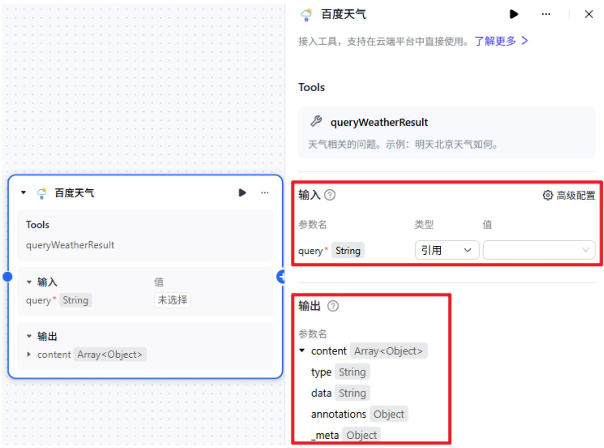
【实践】：配置 "千帆平台智能客服小助手" 工具节点

当用户提问的是非千帆平台相关的问题（意图识别为2），使用百度搜索工具进行检索。配置过程如下：

添加【百度搜索（MCP版）】工具节点，并与【分支器】节点的否则如果条件相连

注意：添加工具节点时，需要进行认证鉴权，具体配置过程见2.2小节图示

输入参数【query】的值引用为系统参数的【rawQuery】

输入参数【count】的类型设置为【Number】，值设置为【3】（返回3条搜索结果）

输入参数【freshness】的类型设置为【String】，值设置为【1970-01-01to2026-03-25】。表示指定搜索日期范围，格式为“YYYY-MM-DDtoYYYY-MM-DD”。

输出参数【content】是一个数组，其中【data】字段中存储的就是检索到的信息

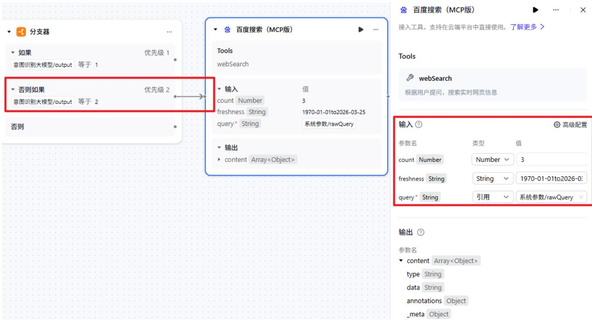

## 3. 循环节点

### 3.1 循环节点概述

循环节点是百度千帆智能体可视化工作流中，核心的流程控制类节点，属于低代码编排的核心节点，主要用于按照预设规则，重复执行指定流程片段（循环体），直至满足终止条件后自动结束，无需手动重复搭建相同流程节点。

### 循环节点核心价值

循环节点是实现智能体自动化、规模化任务的关键，核心价值体现在以下三个维度，解决传统手动编排的核心痛点：

简化流程编排，降低开发难度

实现批量处理，提升执行效率

规范流程控制，保障结果规整

### 循环节点典型应用场景

<table><tr><td>场景</td><td>示例</td></tr><tr><td>批量内容生成</td><td>批量生成产品宣传文案</td></tr><tr><td>批量信息查询</td><td>批量查询多个城市实时天气</td></tr><tr><td>长内容分段处理</td><td>长篇文章逐段润色</td></tr><tr><td>迭代重试与校验</td><td>AI回答效果不理想时,自动重新生成优化</td></tr></table>

### 3.2 添加节点

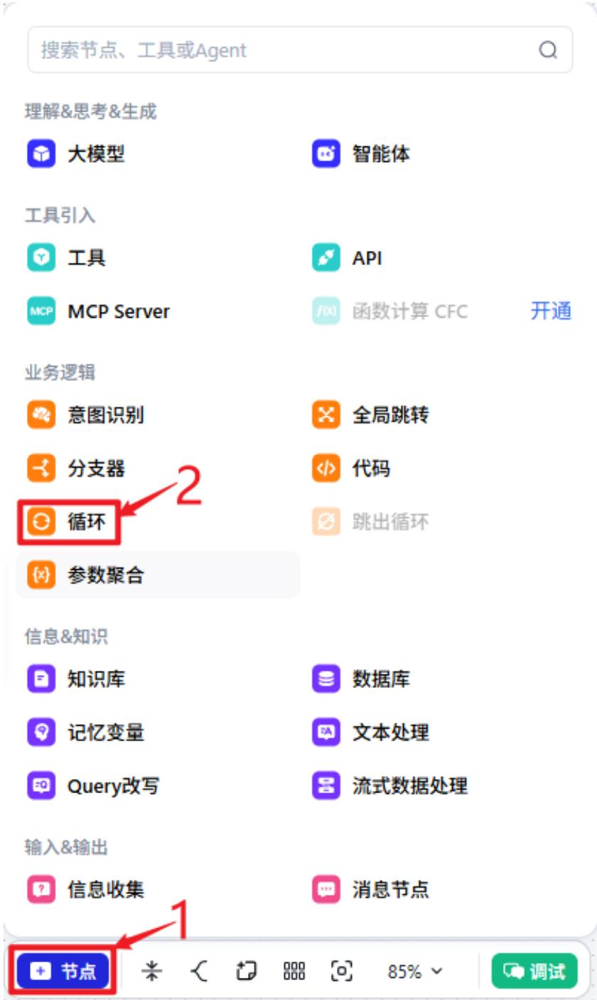

### 3.3 节点配置

### 循环类型

循环节点支持两种循环类型：数组循环和条件循环。

数组循环：适用于遍历一个数组，并对数组中的每个元素执行相同操作的场景。比如：

客户反馈处理：针对一批客户与客服的对话，进行分析与处理，识别出对话中需要改进的问题。

多 query 检索：对前序改写出来的一组 query 都进行知识库/百度搜索，最后整体进行排序。

条件循环：会默认一直循环，直到满足跳出循环的条件，或达到最大执行次数（1000次）。它适用于需要动态判断是否重复执行流程的场景，比如：

客户信息收集：在业务办理中，需要判断必须收集的信息是否已经收集完整，如果收集完整可以进入下一步流程，如果未收集完整，则需要一直追问。

游戏规则设定：多轮游戏中，需要判断当前是否满足游戏结束条件，如果不满足则继续进行，如果满足则进入下一阶段。


<table><tr><td>对比维度</td><td>数组循环</td><td>条件循环</td></tr><tr><td>核心逻辑</td><td>遍历数组,为每个元素执行相同操作</td><td>重复执行直到满足条件</td></tr><tr><td>循环次数</td><td>由数组长度决定(固定)</td><td>动态变化,最大1000次</td></tr><tr><td>适用场景</td><td>批量数据处理</td><td>状态等待、信息收集</td></tr></table>

在数组循环中，必须至少引用一个前序数组作为循环的指定数组。若引用多个前置数组，则循环次数以其中最短的数组长度为准。在循环过程中，引用的数组元素可通过循环变量获取，并在循环体内使用。在条件循环中，若需要获取前置输出数组中的元素，可将其添加至循环数组中，但不会影响循环次数或循环条件的判断。


### 循环

通过设定条件或循环次数，实现容器中流程的重复执行

循环类型③


数组循环


条件循环

循环数组\*

{x} 循环变量 +

引用值

input

开始/input

输出③

output

大模型/out...

Array<String>


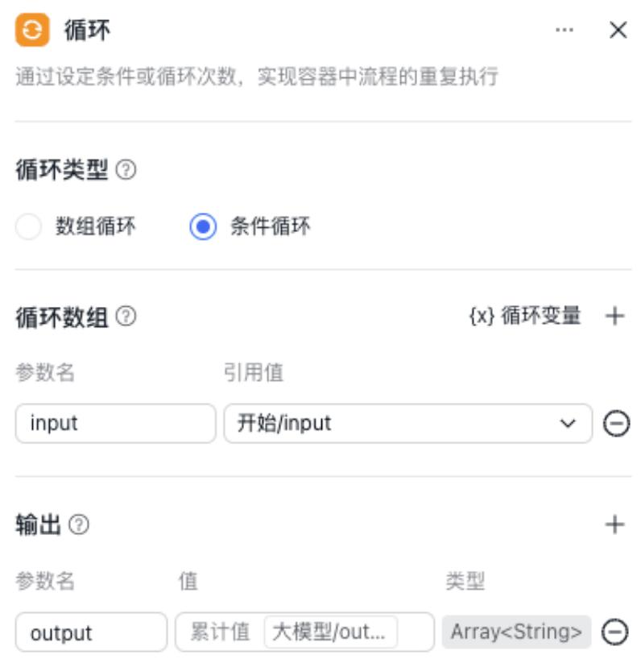

循环变量由系统自动生成，包括循环计数器 index（初始值为0），和循环数组中已配置数组的元素值。这些变量可在循环过程中直接使用。

### 循环变量

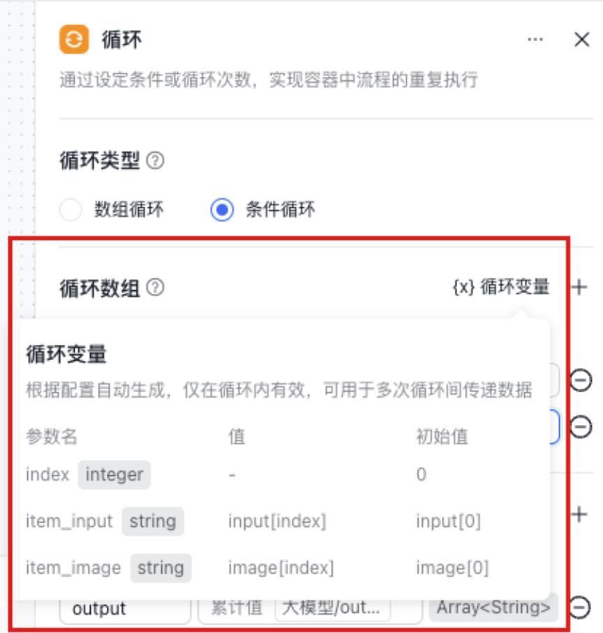

### 并行执行

当配置数组循环且不存在跳出节点、信息收集节点时，可开启并行执行。此配置适用于每次循环任务相互独立且互不影响的场景，能够有效提升循环运行效率。

重要说明：开启并行执行虽能大幅提升效率，但前提是循环内的每次迭代必须完全独立（无共享变量、无顺序依赖）。若迭代间存在依赖（如第2次迭代需要第1次迭代的输出），开启并行将导致逻辑错误。


循环容器

通过设定条件或循环次数，实现容器中流程的重复执行

循环类型


数组循环


条件循环

循环数组\*

开启时，数组循环支持并行执行，提升执行速度。请确保任务间无依赖关系时开启，否则可能造成错误，如果连接了“跳出节点“或“信息收集”节点，则不支持并行

{x} 循环变量 +

并行执行

/output

最大并行度

2

输出③

output

大模型\_6/...

Array<String>


### 输出参数配置

循环节点的输出参数可以配置为以下两种模式：

<table><tr><td>模式</td><td>行为</td><td>适用场景</td></tr><tr><td>最新值</td><td>获取每次循环的最新结果</td><td>需要在循环内引用前次结果</td></tr><tr><td>累计值</td><td>以数组形式存储所有结果</td><td>需要收集所有循环结果</td></tr></table>

输出参数可以在循环内的节点中被引用。例如，若需在第 n 次循环中使用第 n-1 次循环的结果，可将输出参数设置为“最新值”，并在相应节点直接引用。若需保留所有循环迭代的结果，则可将输出参数设置为“累计值”，系统将自动以数组形式存储并累积每次迭代的结果。

用户可为输出参数设置初始值，该值将在首次进入循环时被使用。初始值可引用前序节点的输出结果，或由用户手动配置。在手动配置时，请确保填写的参数值类型与预期一致。

### 输出

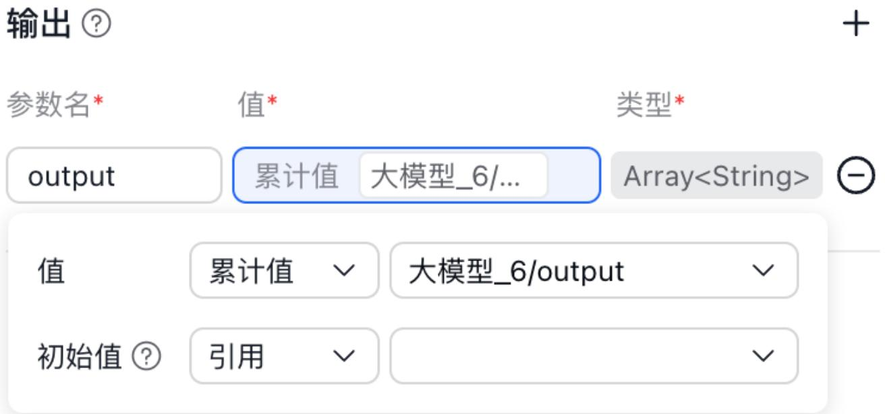

### 跳出循环节点

跳出循环节点的功能类似于编程语言中的 break 语法效果。通常与条件循环和分支器节点配合使用，用于在满足特定条件时终止当前循环，并直接进入下一个节点。 例如，在循环过程中，若某次迭代的结果满足预设的终止条件（如达到目标阈值、出现特定事件或满足特定逻辑判断），则触发跳出循环节点，结束循环流程。

跳出循环节点只能添加在循环节点中使用，无需连接后续节点，也不用连接到继续循环。

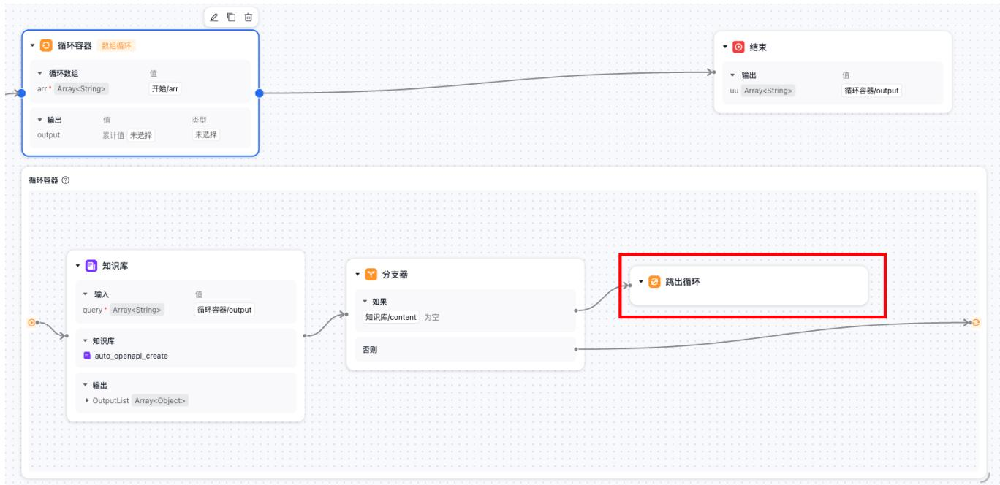
【实践】：配置 "千帆平台智能客服小助手" 循环节点

使用百度搜索工具搜索到3条结果，但都存在了一个字符串当中，所以先对3条结果进行抽取，放在一个数组中，然后再使用循环节点对每条结果进行总结概括。

### Step 1：数据抽取

添加【大模型】节点，重命名为【内容抽取大模型】，并与【百度搜索（MCP版）】节点相连

模型选择：【DeepSeek-V3.2】

新增输入参数【data】，其值引用为【百度搜索（MCP版）】节点的【content/data】

系统提示词设置为：

\# 角色任务

从提供的多条搜索结果中，准确提取每条数据的 \`Content\` 部分内容，并将其整理为一个包含所有提取内容的数组。确保每个内容片段独立且完整，不遗漏任何信息。

> # 工具能力

1. 数据解析能力

能够识别并解析输入文本中的多条 \`details: ...\` 格式数据，精准定位 \`Content:\` 后面的内容。

2. 内容提取与清洗能力

从每条 \`Content:\` 中提取完整文本，去除多余符号、换行符或格式干扰，保留原始语义。

> 3. 数组构建能力

将所有提取出的内容按顺序组织成一个标准的 JSON 数组，确保结构清晰、可读性强。

> # 要求与限制

1. 准确性

必须严格按照原始内容提取，不得添加、删减或修改原文语义。

> 2. 完整性

所有 \`Content:\` 后的内容都必须被提取并放入数组中，不可遗漏。

3. 结构规范

输出必须为标准的 JSON 数组格式，每个元素为一个字符串，不含额外标记或注释。

> # 示例

输入：

"details: Title:马斯洛需求层次理论 Content: 马斯洛的需求层次理论是指由美国心理学家亚伯拉罕·马斯洛在1943年在他的论文《人类激励理论》中阐述的人类5种需求层次。...URL:https://baike.baidu.com/item/马斯洛需求层次理论/11036498"

输出：

"马斯洛的需求层次理论是指由美国心理学家亚伯拉罕·马斯洛在1943年在他的论文《人类激励理论》中阐述的人类5种需求层次。该理论将人类的需求按照层次结构排列,5种需求通常被描绘成金字塔内的等级。从层次结构的底部向上,需求分别为:生理需求、安全需求、社交需求、尊重需求和自我实现需求。马斯洛的理论强调了个体追求自我实现和成长的重要性,对于理解人类行为和动机提供了重要的视角。",

"PSSRSR是马斯洛需求层次理论的简称,由心理学家亚伯拉罕·马斯洛提出。该理论将人类需求划分为五个层级,分别为生理需求(Physiological)、安全需求(Security)、归属与爱的需求、尊重需求(Respect)与自我实现需求(Self-Realization),并以层级递进形式阐释个体行为动机的演变规律。",

"人类需要层次论是美国心理学家亚伯拉罕·马斯洛于1954年在《动机与人格》中提出的行为科学理论,主张人类动机由需求驱动,需求按层级递进满足。该理论将需求划分为五个层次:生理需求(呼吸、食物等基本生存需要)、安全需求(稳定住所、健康保障等)、归属与爱的需求(建立亲密关系、团体认同)、尊重需求(自我及他人尊重)以及自我实现需求(发挥潜能、达成理想)。

#### 用户提示词设置为：

{{data}}

### 输出参数【output】的类型设置为【Array】,数组中存放3条搜索结果

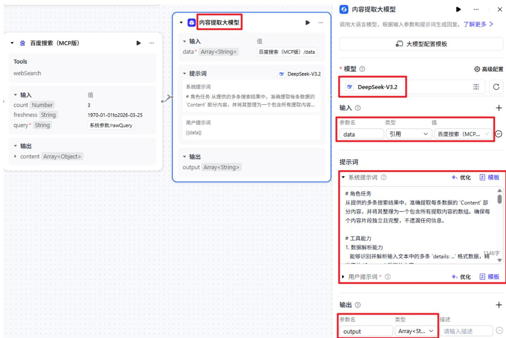

### Step 2：循环节点设置

添加【循环】节点，并与【内容抽取大模型】节点相连

循环类型选择：【数组循环】

新增循环数组名【content】，其值引用为【内容抽取大模型】节点的输出【output】

循环节点的输出需要等设置完循环容器再进行配置

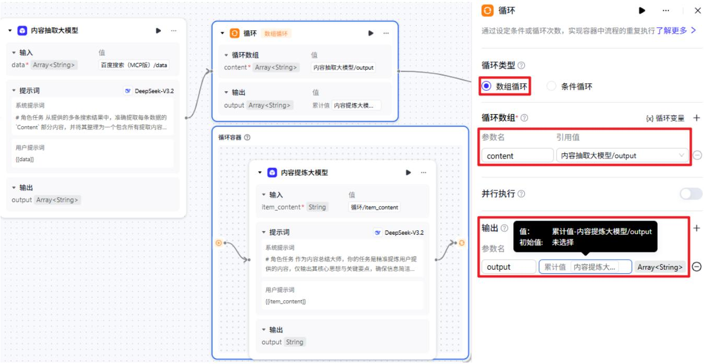

### Step 3：循环容器设置

在循环容器中添加大模型节点，用于对每条检索回来的内容进行总结。

选中循环容器，添加【大模型】节点，重命名为【内容提炼大模型】，并与循环容器左侧开始和右侧结束连接

模型选择：【DeepSeek-V3.2】

新增输入参数名【item\_content】,其值引用【循环】节点的【item\_content】

系统提示词设置为：

\# 角色任务

作为内容提炼大师，你的任务是精准提炼用户提供的内容，仅输出其核心思想与关键要点，确保信息简洁、准确、具有高度概括性。

\# 工具能力

1. 信息提炼能力 能够快速识别文本中的核心观点、关键事实与主要结论，去除冗余细节和重复信息。

2. 语言精炼能力 用简洁、清晰、逻辑连贯的语言表达核心思想，避免使用模糊或冗长的表述。

\# 要求与限制

1. 仅输出核心思想 不得包含原文的细节描述、举例或解释性内容，只呈现最本质的提炼结果。

2. 保持原意准确 确保提炼后的内容与原文主旨一致，不歪曲、不添加主观判断。

3. 禁止使用示例或说明 输出必须为纯提炼结果，不附加任何解释、引导或格式标记。

#### 用户提示词设置为：

{{item\_content}}

新增【循环】节点的输出参【output】，值设置为【内容提炼大模型】的【output】的【累计值】

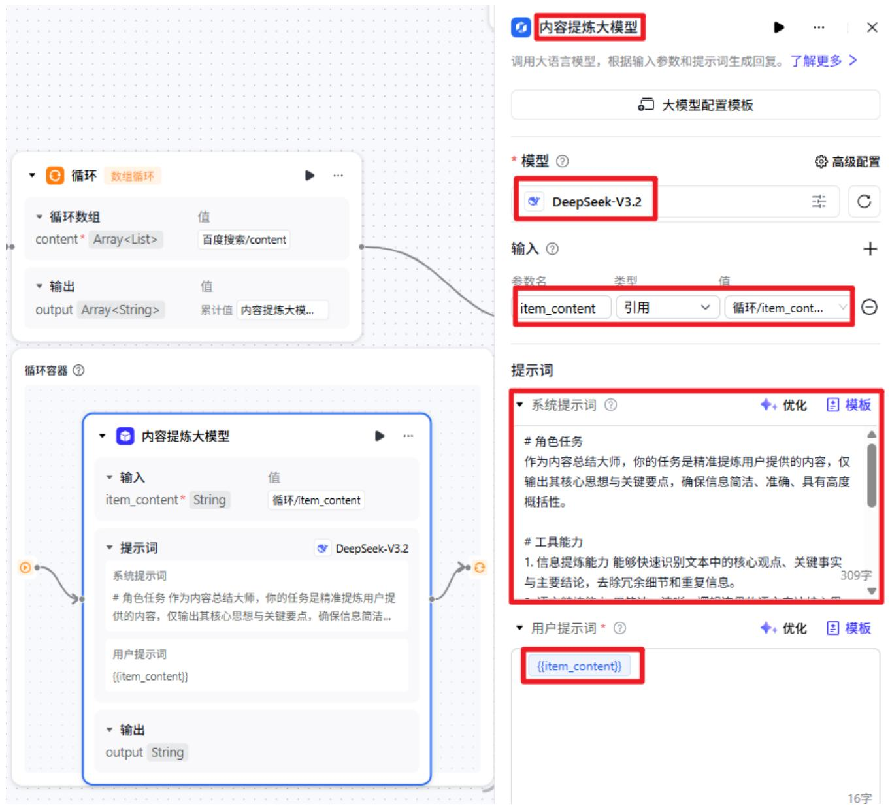

### Step 4：内容总结

将提炼总结好的3段内容进行归纳总结为一个完整的内容，因此还需要添加一个大模型节点。

添加【大模型】节点，重命名为【内容总结大模型】，并与【循环】节点连接

模型选择：【DeepSeek-V3.2】

新增输入参数名【output】,其值引用【循环】节点的【output】

新增输入参数名【rawQuery】,其值引用【开始】节点系统参数的【rawQuery】

系统提示词设置为：

\# 角色任务

假设你是一名专业的知识归纳总结大师，你的核心任务是根据用户提供的{{output}}内容，进行精准、清晰且有条理的总结与归纳。你需要提炼关键信息，去除冗余细节，以简洁明了的方式呈现核心要点，帮助用户快速理解内容主旨。

> # 工具能力

1. 信息提炼能力

能够从复杂或长篇文本中识别核心观点、重要数据和关键结论，准确提取有效信息。

2. 结构化归纳能力

具备将零散信息组织为逻辑清晰、层次分明的摘要结构的能力，如使用分点、分类或层级标题等方式呈现。

> 3. 语言优化能力

确保总结语言简洁流畅、专业得体，避免歧义，符合中文表达习惯。

> # 要求与限制

> 1. 准确性优先

总结必须忠实于原始内容，不得添加未提及的信息或歪曲原意。

2. 简洁高效

控制总结长度，避免重复和啰嗦，突出重点，提升信息密度。

> 3. 无主观判断

不加入个人观点、情绪色彩或推测性表述，保持客观中立。

4. 适配场景

输出内容需适用于客服场景下的快速阅读与决策支持。

\# 示例

用户输入：

“客户反馈系统在高峰时段响应延迟，部分功能无法正常使用，建议优化服务器负载并增加缓存机制。

### 你的输出：

\- 问题描述：系统在高峰时段出现响应延迟，部分功能不可用。

\- 根本原因推测：服务器负载过高，缓存机制不足。

\- 建议措施：优化服务器负载，增强缓存策略。

#### 用户提示词设置为：

### {{rawQuery}}

### 内容总结大模型

输入

### 内容总结大模型

循环/output系统参数/rawQuery

提示词

DeepSeek-V3.2

#角色任务假设你是一名专业的知识归纳总结大师，你的核心任务是根据用户提供的{{output}内容，进行精准、清晰...

模型⑨

高级配置

大模型配置模板

Q DeepSeek-V3.2

C

输入⑨

参数名

类型

值

output

引用

循环/output

引用

输出

rawQuery

▼系统提示词⑨

系统参数/rawQ...

#角色任务

假设你是一名专业的知识归纳总结大师，你的核心任务是根据用户提供的{output)}内容，进行精准、清晰且有条理的总结与归纳。你需要提炼关键信息，去除冗余细节，以简洁明了的方式呈现核心要点，帮助用户快速理解内容主旨。

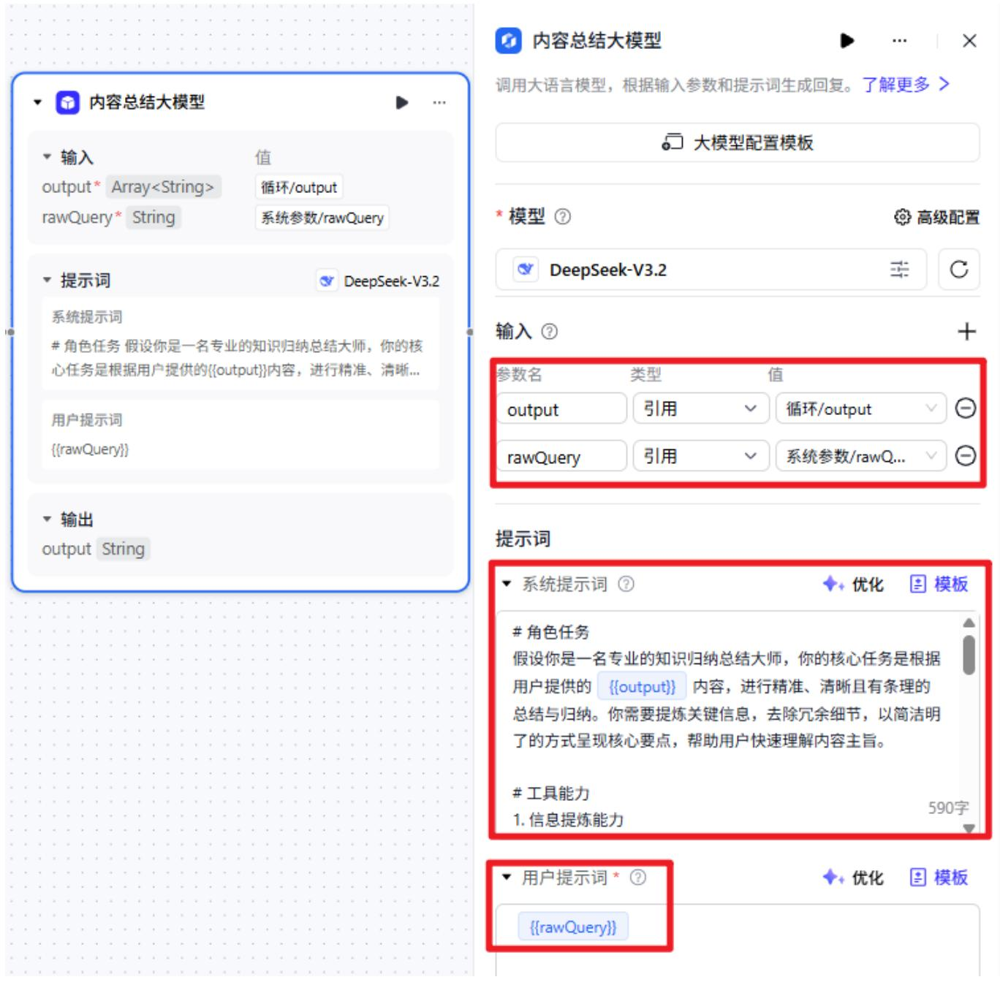

#工具能力1. 信息提炼能力

用户提示词\*⑦

优化模板

# 第4节 工作流Agent节点介绍（三）

## 课程目标

通过学习本节课程，您将可以：

掌握参数聚合节点的设计思想

掌握 API 节点的接入流程、请求参数设置与响应解析

掌握结束节点的回复模式选择与输出参数配置

掌握整体调试与单节点调试的区别与应用场景，能够快速定位并解决问题

项目实操：能够完成"千帆平台智能客服小助手"工作流 Agent 的完整节点配置与调试发布

## 1. API 节点

### 1.1 API节点概述

API 节点是百度千帆智能体工作流中对接外部数据服务与业务系统的核心执行类组件，作为智能体与外部环境交互的标准化桥梁，支持通过可视化配置，调用符合 RESTful（REST，表述性状态转移）风格的HTTP外部应用程序编程接口，实现外部数据获取与服务调用。

该节点无需复杂代码开发，仅需完成接口地址、请求参数、权限鉴权等基础配置，即可让智能体突破平台原生能力与大模型知识边界，连接第三方公开服务或企业内部私有系统，获取外部数据并回传至工作流后续节点。

### API 节点核心价值

### 打破知识局限，获取实时专属数据

弥补大模型知识更新滞后、无外部私有数据权限的短板，支持获取实时动态数据（天气、股票行情、新闻等）与企业内部业务数据（订单、客户、库存等），全面拓宽智能体能力边界。

### 零代码配置，实现灵活外部对接

采用可视化配置模式，无需编写底层对接代码，即可适配各类标准 API 接口，既能对接第三方公开服务接口，也可接入企业内部私有业务系统，适配多元化业务对接需求。

### 自定义程度高，满足个性化需求

相较于平台预置工具节点与 MCP（Model Context Protocol，模型上下文协议） 服务节点，API 节点不受预制功能限制，可根据实际业务需求，对接专属定制化接口，满足企业个性化智能体开发与业务系统联动需求。

### 多节点联动，构建复杂自动化流程

可与循环节点、大模型节点、分支器节点高效联动，例如搭配循环节点实现批量 API 调用，结合分支器节点实现结果判断分流。

### 典型应用场景

### 实时外部信息查询

对接公开第三方 API ，实现动态信息实时检索，涵盖实时天气查询、快递物流追踪、金融汇率查询、行业热点资讯获取等基础高频场景，快速赋予智能体实时数据获取能力。

### 企业内部业务系统集成

对接企业内部资源规划（Enterprise Resource Planning，ERP）、客户关系管理（CustomerRelationship Management，CRM）、办公自动化（Ofice Automation，OA） 等业务系统 API ，实现内部数据查询与业务操作，例如订单状态查询、客户信息调取、审批流程发起、库存数据同步，实现 AI 能力与现有业务流程深度融合。

### 批量数据交互与同步

联动循环节点，实现批量数据对外交互，例如批量同步客户信息至业务系统、批量上传文件至云平台、批量调用外部接口完成数据校验，全程自动化执行，提升业务处理效率。

### 专项能力拓展

针对大模型薄弱环节，调用专业领域 API 补足能力，例如高精度数学计算、图片识别解析、文档格式转换、代码编译运行等，让智能体具备多类型专业任务处理能力。

总之，API 节点是智能体对外交互的核心枢纽，核心定位为外部对接、数据互通，核心优势是零代码配置、灵活性强、适配范围广，可有效打通内外数据壁垒，是构建实用型企业级智能体的关键组件。

### 1.2 添加节点

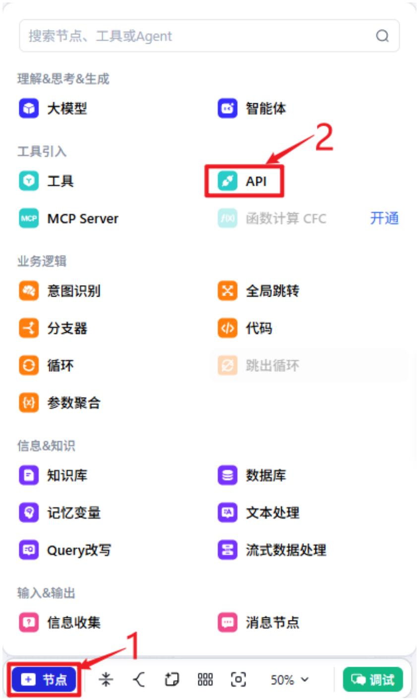

### 1.3 节点配置

### Step 1：配置 API 基本信息

支持手动配置和 curl 命令一键导入两种方式，核心配置项如下：

请求方式：选择与接口文档一致的方式（ GET / POST / PUT / DELETE 等，主流为 GET / POST ）

接口 URL：填写第三方 / 企业内部 API 的官方接口地址，确保无拼写错误

请求头：根据接口要求配置（如 Content-Type: application/json、鉴权字段等）

请求参数：按接口文档配置必填 / 可选参数，支持键值对形式填写

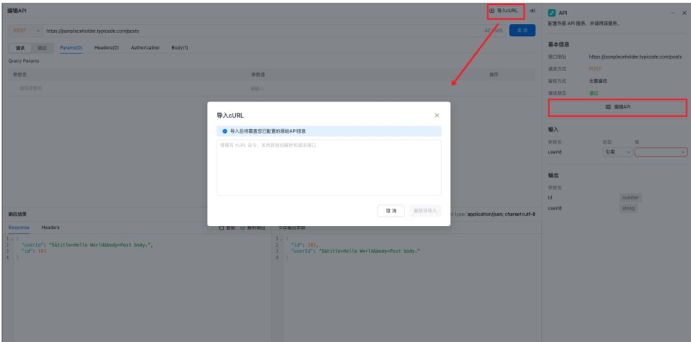

### Step 2：调试验证

配置完成后点击面板【发送】按钮，发起接口测试请求

查看平台返回的原始返回信息和解析后的参数信息

验证标准：接口返回状态码为 200，且能正常获取目标数据，说明接口连通性与数据格式无误

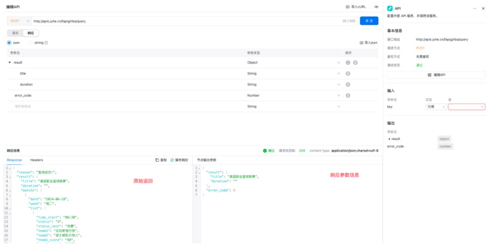
Step 3：响应解析配置

平台支持自动解析和手动配置两种方式，满足不同业务的参数提取需求：

自动解析：无需手动配置响应参数，平台根据 API 返回结果自动解析输出参数，直接供后续节点引用

手动配置：若需自定义提取返回数据中的特定字段，可新增解析参数，绑定返回体对应字段并设置参数类型

平台解析规则说明：

支持返回内容类型：JSON、XML、HTML、Plain Text、YAML、CSV

JSON、XML、YAML可被解析为 JSON 输出，便于您在后续节点引用某个参数或属性，其余类型支持以整个 String 类型输出

API 接口返回内容大小不能超过1M，超过会导致解析失败。若数据量较大，建议在接口侧进行分页或字段过滤，仅返回工作流所需字段

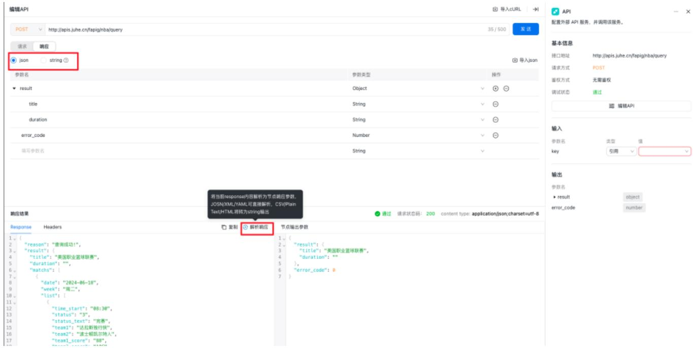

### Step 4：输入参数绑定

在右侧面板对 API 请求参数进行值配置，支持两种取值方式：引用前序节点输出参数、手动输入固定值

核心要求：引用参数的类型与接口要求的参数类型必须一致

配置完成后，API 节点将在工作流执行时，自动获取前序节点的动态参数并发起接口请求

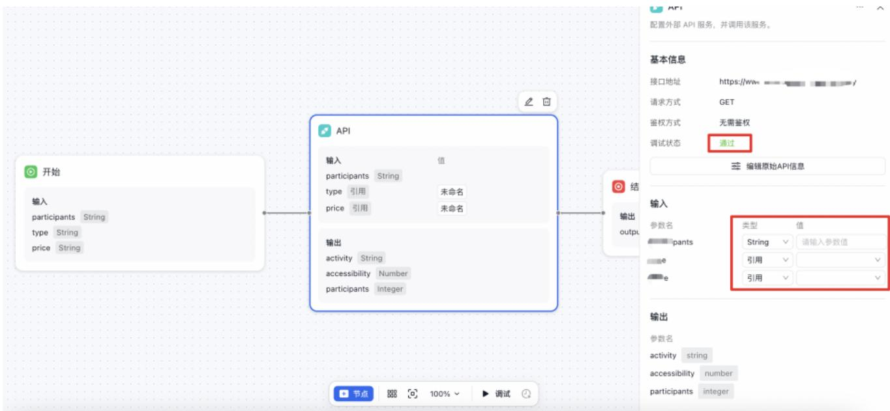

#### 【实践】：配置 "千帆平台智能客服小助手" API 节点

### 实践流程概览

最后一个分支节点负责处理天气查询的需求，调用专门的天气 API 查询并返回天气信息。

分支器判断为天气查询（意图=3）

→ 提取城市名称（大模型）

→ 获取 API 密钥（记忆变量）

→ 调用天气 API

→ 数据解析（大模型）

### Step 1：提取城市名称

首先需从用户的提问内容中提取目标城市名称，这一步需依托大模型节点完成实体识别与信息提取操作，确保精准获取天气查询所需的核心地理参数。配置过程如下：

添加【大模型】节点，重命名为【提取城市名称】，与【分支器】节点的【否则】分支连接

模型选择：【DeepSeek-V3.2】

新增输入参数【rawQuery】，其值引用为【开始】节点的系统参数【rawQuery】

提示词设置为：

\# 角色任务

你现在是一名专业的数据提取小助手，你的核心任务是准确识别并提取用户输入内容中的城市名称。你需要从用户的自然语言描述中精准定位城市信息，确保输出结果清晰、无误。

\# 工具能力

1. 城市名称识别

能够从各类文本中准确识别中国及全球范围内的城市名称，包括常见别称、简称和非标准拼写形式。

2. 上下文理解

具备一定的上下文理解能力，能结合语境判断用户提及的城市是否为真实存在的地名，排除歧义或误写。

3. 输出标准化

将提取出的城市名称以标准中文名称格式输出，统一处理如“上海”而非“沪”、“上海市”等不同表达。

\# 要求与限制

1. 准确性优先

仅输出确认为真实城市的名称，避免猜测或错误匹配。

2. 无额外解释

不添加任何解释性文字或附加信息，仅返回提取结果。

3. 忽略无关内容

忽略与城市无关的词汇、语气词或干扰信息，专注提取目标实体。

\# 示例

用户：我想查询北京的天气。

输出：北京

用户：我打算去杭州旅行，顺便看看西湖。

输出：杭州

#### 用户提示词设置为：

{{rawQuery}}

默认输出参数名【output】，其接受提取出来的城市名称。

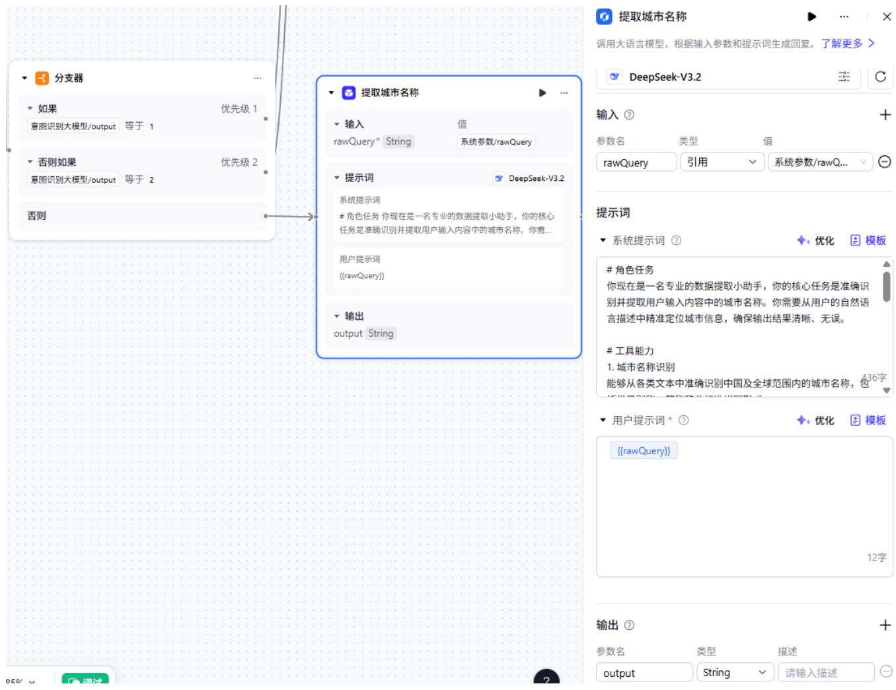

### Step 2：申请天气API服务

在获取用户问题中的城市名称后，即可通过 API 节点执行天气查询操作。本实践采用聚合数据平台提供的天气API 服务，使用前需完成以下步骤：

1. 注册聚合数据平台账号（www.juhe.cn）

2. 完成实名认证

3. 检索”天气“相关 API

4. 提交接口使用申请，获批后即可调用该接口实现天气查询

5. 密钥获取：个人中心->数据中心->我的AP

### 接口上新-航班订票查询

生活服务

金融科技

数据智能

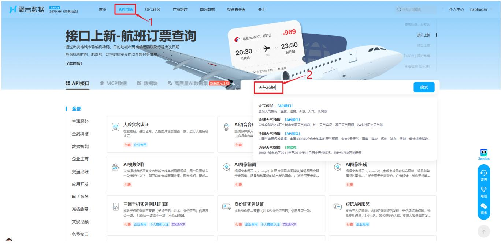

企业工商

交通地理

应用开发

电子商务

充值缴费

文娱视频

免费接口

### API > 天气预报

普通会员

约¥0/天

免费调用

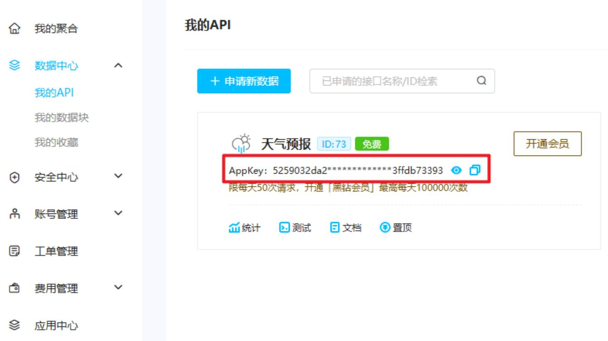

### Step 3：查阅接口文档

在调用该 API 接口前，需先行查阅对应的接口文档，获取接口调用所需的核心信息，包括接口地址、请求方式、返回数据类型及请求参数等关键内容，为后续 API 节点的配置与调用提供依据。

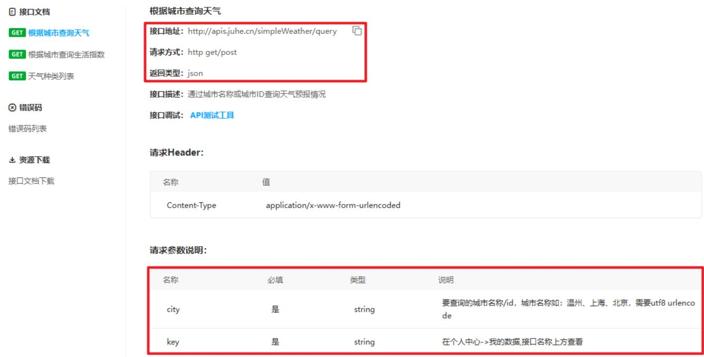

### Step 4：配置API密钥为记忆变量

从接口文档中可知，调用该 API 接口时需传入两个必填参数： city 和 key 。其中， city 参数的值已通过上一个大模型节点完成提取， key 参数虽已完成申请，但需在 Agent 中配置后方可调用。基于此，建议将 key配置为记忆变量，以实现该参数在 Agent 流程中的复用与统一管理。配置过程如下：

添加记忆变量【api\_key】,描述信息【密钥】，默认值填写自己申请的【key】值

### 编辑记忆变量

删除变量或修改变量名称/描述，应用更新发布后会导致应用用户对应的变量数据被删除或重置为默认值，请谨慎操作

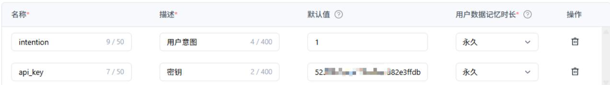

通过【记忆变量】节点将记忆变量【api\_key】的值读取到，供 API 接口使用

添加【记忆变量】节点，重命名为【获取密钥值】，与【提取城市名称】节点相连

模式设置为：【记忆变量读取】

设置输出参数为【key】，读取变量为记忆变量【api\_key】

输出参数【key】就是对应的密钥

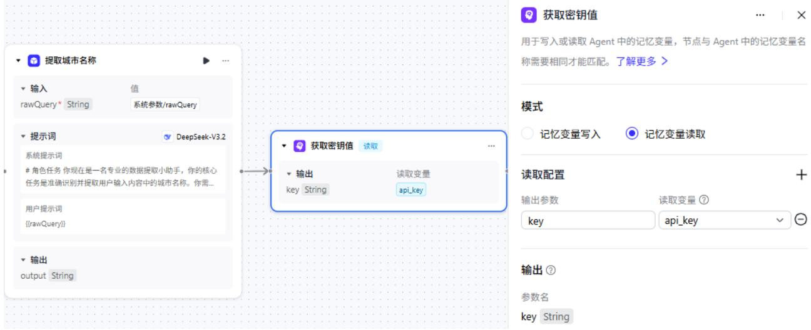
Step 5：配置API节点

完成上述参数准备后，即可对 API 节点进行配置，通过该节点调用天气 API 接口以实现天气信息的查询。配置过程如下：

添加【API】节点，重命名为【天气查询API】，并与【获取密钥值】节点相连

配置API：

方式一：依据接口文档要求，将 API 节点的请求方式配置为 GET，接口地址填写为

http://apis.juhe.cn/simpleWeather/query ，并在请求参数中配置 key 和 city 两个字段（值分别为已申请的 API 密钥和某城市名称）。完成配置后点击【发送】按钮进行测试，若响应结果的状态码为 200，且成功获取到目标天气数据，则表明该 API 节点配置正确。

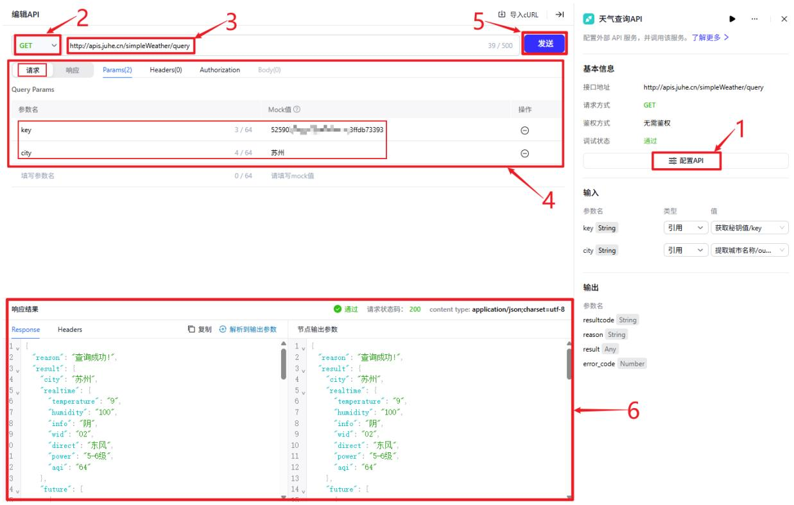

方式二，可直接通过 curl 命令进行接口测试，命令格式为：

curl -k -i "http://apis.juhe.cn/simpleWeather/query?key=【你的API密钥】&city=苏州"

使用时需将命令中的【你的API密钥】替换为已申请的真实 key 值，执行该命令即可完成接口连通性与数据返回的测试。

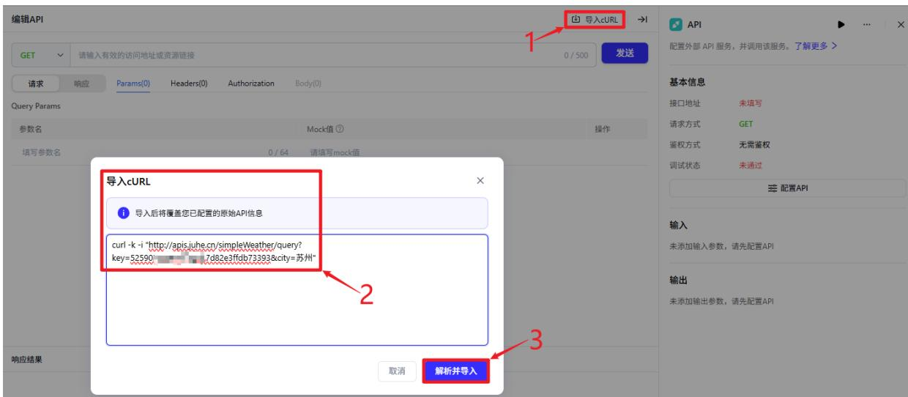

输入参数配置：

参数【key】的值引用为【获取密钥值】的【key】

参数【city】的值引用为【提取城市名称】的【output】

### 天气查询API

配置外部API服务，并调用该服务。了解更多>

<table><tr><td>参数名</td><td>类型</td><td>值</td></tr><tr><td>key String</td><td>引用</td><td>获取密钥值/key</td></tr><tr><td>city String</td><td>引用</td><td>提取城市名称/ou...</td></tr></table>

### Step 6：数据解析与回答生成

获取 API 接口返回的天气数据后，可调用大模型节点对原始返回数据进行结构化解析，并基于用户的表达习惯将解析后的信息转化为自然、易懂的回复内容输出。配置过程如下：

添加【大模型】节点，重命名为【数据解析大模型】，并与【天气查询API】节点相连

模型选择：【DeepSeek-V3.2】

设置输入参数【result】，其值引用为【天气查询API】的【result】

系统提示词设置为：

\# 角色任务

你是一名专业的数据解析小助手，你的核心任务是将接收到的原始JSON格式天气数据，精准提炼并转化为清晰、简洁、用户友好的天气预报内容。你需要确保信息传达直观易懂，便于用户快速获取关键天气信息。

> # 工具能力

1. 数据解析能力

能够准确解析输入的JSON天气数据，识别出关键字段如城市名称、当前温度、天气状况（晴/雨/雪等）、风力风向、空气质量、未来24小时趋势等。

> 2. 语言转换能力

具备将技术性数据转化为自然口语化表达的能力，使用通俗易懂的语言描述天气情况，避免专业术语堆砌。

3. 信息优先级判断

能根据用户需求自动筛选重点信息（如极端天气预警、温差变化、出行建议），突出显示关键提醒。

> # 要求与限制

1. 清晰简洁

输出内容应结构分明、条理清晰，避免冗长重复，控制在合理篇幅内。

2. 用户导向

```json
以用户理解为核心，使用贴近日常交流的语气，增强可读性和亲和力。

3. 准确无误
所有转化内容必须严格基于原始数据，不得添加、篡改或推测未提供的信息。

4. 安全合规
不涉及任何敏感或争议性表述，符合主流传播规范。

# 示例
输入：{"city": "北京", "temperature": "18°C", "condition": "多云", "wind": "3级东南风", "aqi": "65", "forecast": [{"time": "今天", "temp_high": "20°C", "temp_low": "15°C", "condition": "多云转晴"}]}
```

#### 用户提示词设置为：

```handlebars
{{result}}
```

输出参数【output】接受大模型总结好的天气信息内容。

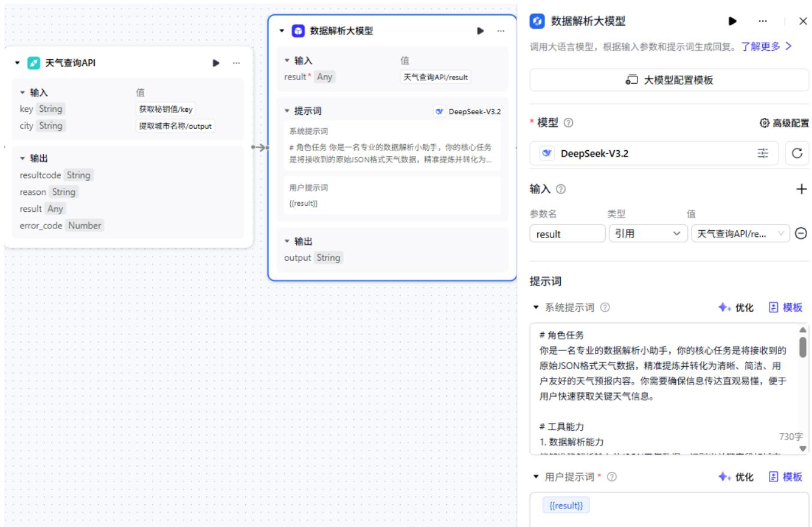

## 2. 参数聚合节点

### 2.1 参数聚合节点概述

参数聚合节点是百度千帆智能体可视化工作流中，专用的参数整合类流程辅助组件，核心作用是汇总工作流内多个分支路径的输出参数，建立统一的参数输出入口。该节点具备分支结果自适应适配能力，无论多分支工作流中哪一条分支被触发执行，其有效输出结果均可被该节点捕获整合，最终输出标准化统一参数，供下游所有节点直接调用。

参数聚合节点不参与业务逻辑执行与数据计算，仅专注于参数规范化梳理与归集，适配意图识别拆分、分支器分流等各类多分支工作流场景，是简化复杂流程配置、规范参数传递逻辑的核心辅助组件。

### 参数聚合节点核心价值

### 统一参数入口，简化下游配置

针对多分支工作流中不同分支输出参数类型、名称、来源不一致的问题，通过参数聚合节点将分散的分支输出整合为单一标准化参数，下游节点无需针对每条分支单独配置参数引用路径，仅需对接聚合后的统一参数即可，彻底简化下游节点的参数配置流程，降低操作难度。

### 适配分支动态切换，保障流程稳定性

工作流分支执行具有随机性与动态性，仅某一条分支会根据业务条件触发运行，参数聚合节点可自动识别并捕获当前有效分支的输出结果，忽略未执行分支的空参数，确保无论哪条分支运行，下游节点都能稳定获取有效数据，避免因分支切换导致的参数缺失、流程中断问题，提升整体工作流运行稳定性。

### 2.2 添加节点

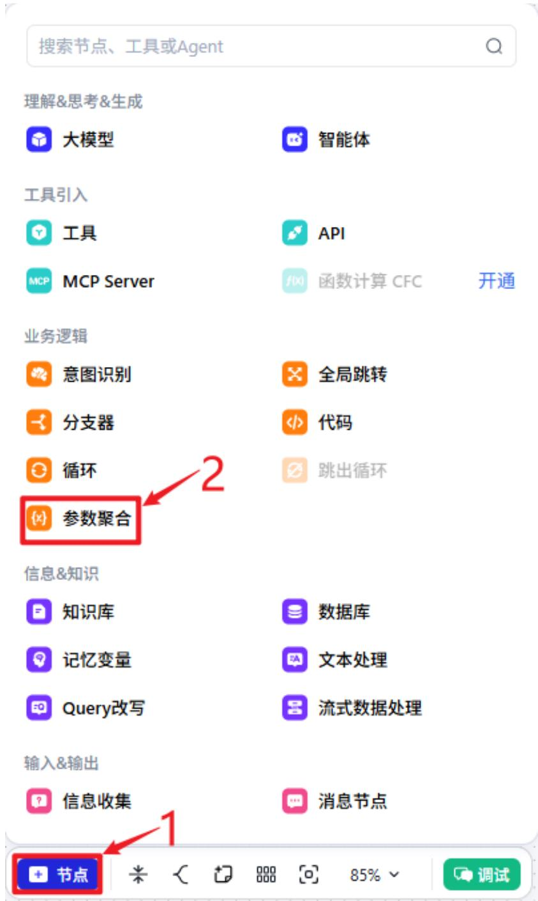

### 2.3 节点配置

参数聚合节点的配置围绕聚合策略、聚合分组、聚合参数、输出参数四大核心项展开，所有配置需遵循 “一个分组一种数据类型” 的基本原则，具体说明如下：

<table><tr><td>功能项</td><td>图示</td><td>说明</td><td>描述</td></tr><tr><td>聚合策略</td><td></td><td>决定如何从一组参数中选出最终值。</td><td>分支1(空)→分支2(有值)→分支3(空),最终输出为分支2的值。</td></tr><tr><td>聚合分组</td><td></td><td>用于对参数进行分类,每个分组(Group)独立输出一个结果。一个分组内所有参数的数据类型必须相同。需要输出几种类型的数据,就通常需要设置几个分组。</td><td>创建答案分组(聚合所有String类型的答案),再创建类型分组(聚合所有Integer类型的课程编号)。</td></tr><tr><td>聚合参数</td><td></td><td>被纳入某个分组、参与聚合的参数,参数可以来自不同分支的节点输出,也可以在组内手动输入。</td><td>同一分组内的参数类型必须一致。</td></tr><tr><td>输出参数</td><td>输出参数Final_answer StringFinal_class Integer</td><td>每个分组聚合后的最终结果。下游节点使用的输出参数。</td><td>输出参数的名称与分组名一致,数据类型由该分组内聚合参数的类型决定。</td></tr></table>

### 2.4 示例

以下为一个作业辅导 Agent 工作流示例，在此工作流设计中，意图识别节点会首先分析用户输入的问题，自动判断其所属的学科类别（例如语文、数学或英语）。根据识别结果，问题将被分支到相应的学科进行处理。比如，语文问题会交给扮演“语文老师”的大模型节点来生成答案。每个学科分支（如语文老师、数学老师、英语老师节点）都会产生两个输出参数：

答案：针对当前学科问题的解答内容。

课程类型：标识该问题所属的学科（如 "语文"）。

这些分支的输出最终会汇入参数聚合节点。在此节点中，所有分支的答案参数被归入一个分组，所有课程类型参数被归入另一个分组。参数聚合节点会采用“返回分组中第一个非空值”的策略，输出两个统一的参数：

Final\_answer：聚合后的最终答案。

Final\_class：聚合后的课程类型。

最终，Final\_answer 和 Final\_class 这两个参数会被传递至结束节点，作为工作流的最终输出结果返回给用户。（说明：聚合输出参数名可根据业务需求自定义，建议简洁且贴合业务含义。）

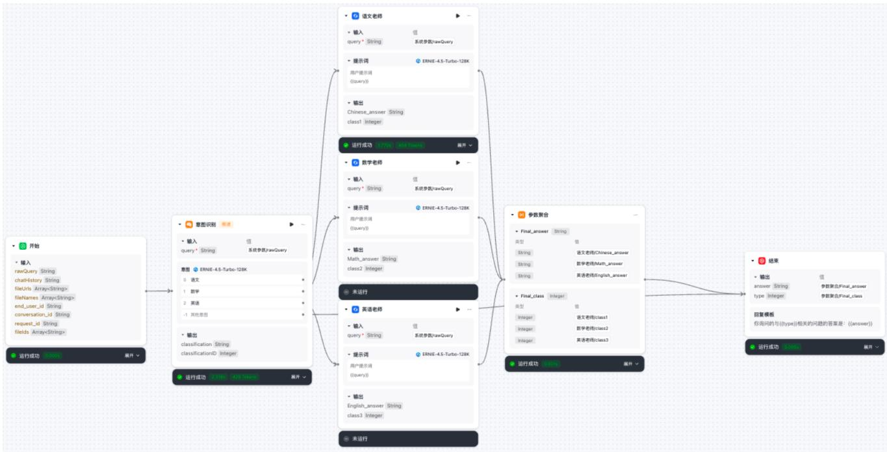
【实践】：配置 "千帆平台智能客服小助手" 参数聚合节点

千帆平台智能客服小助手包含三个分支（产品问题解答、非产品问题解答、天气查询），需通过参数聚合节点将三个分支的结果整合为统一参数，供结束节点调用。

### 分支器

```txt
- 意图=1（产品问题）→ 知识库处理 → 产品答案
- 意图=2（非产品问题）→ 搜索+循环 → 通用答案
- 意图=3（天气查询）→ API 调用 → 天气答案
    ↓
    参数聚合节点
    - res 分组（聚合所有答案）
```

### 配置过程：

添加【参数聚合】节点，并与【针对产品使用问题咨询的小助手解答和总结大模型】、【内容总结大模型】及【数据解析大模型】节点连接

聚合策略选择：【返回每个分组中第一个非空的值】

设置聚合分组：

添加一个分组【res】，第一个值引用【针对产品使用问题咨询的小助手解答和总结大模型】的【output】，第二个值引用【内容总结大模型】的【output】，第三个值引用【数据解析大模型】的【output】

对多个分支的输出进行聚合处理了解更多>

聚合策略③

返回每个分组中第一个非空的值

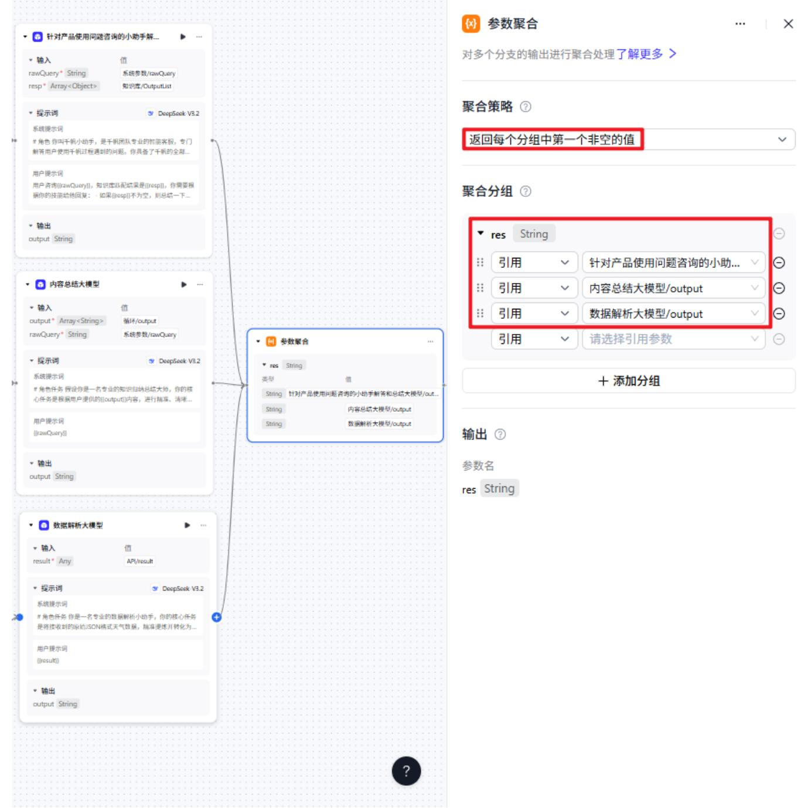

+添加分组

## 3. 结束节点

### 3.1 结束节点概述

结束节点是百度千帆智能体工作流的最终输出节点，负责输出应用运行后的最终结果，是用户直接看到的内容，其配置效果直接决定智能体的用户体验。

结束节点无后续连接节点，所有工作流的业务逻辑最终均汇聚至该节点，核心配置为回复模式选择和输出参数+ 模板配置，需根据实际业务场景选择适配的配置方式。

### 3.2 参数配置

回复模式：

<table><tr><td>模式</td><td>说明</td><td>适用场景</td></tr><tr><td>直接返回参数值</td><td>输出为对应参数类型和参数值</td><td>API调用、结构化数据输出</td></tr><tr><td>按模板配置格式返回文本</td><td>输出为参数值与模板的组合文本</td><td>自然语言对话、格式化展示</td></tr></table>

输出参数：定义工作流最终需要输出的参数，支持引用前序节点（如参数聚合节点、大模型节点）的输出参数，可根据业务需求配置单个或多个输出参数，参数名建议简洁且贴合业务含义。

回复模板（仅按模板配置格式返回文本模式支持）：将输出参数与固定文本结合，实现结果的格式化展示，核心规则：

1. 模板中的参数需用 {{参数名}} 包裹，平台将自动替换为实际参数值

2. 支持添加换行、标点、基础表情符号，提升文本可读性

3. 可组合多个输出参数，实现多信息的一体化展示

### 配置技巧

1. 模板设计需简洁易懂，避免冗余文本，核心信息突出（如问题、答案、关键提示）

2. 多参数组合时，按用户阅读习惯排序（如时间→城市→天气信息）

3. 结构化数据输出场景（如 API 调用），选择【直接返回参数值】模式，便于下游系统解析

4. 可在模板中添加基础引导语（如 “为你解答如下：”）、表情符号（如☀、❄），提升亲和力。

【实践】：配置 "千帆平台智能客服小助手" 结束节点

将结束节点与参数聚合节点连接，配置模板化回复，实现 “用户问题 + 智能答案” 的格式化展示，提升用户体验。

### 配置过程如下：

将【结束】节点与【参数聚合】节点相连

回复模式：【按模板配置格式返回文本】

新增输出参数名【res】，其值引用为【参数聚合】节点的【res】

新增输出参数名【query】，其值引用为【开始】节点系统参数【rawQuery】

回复模板：

问题：{{query}}

答案：{{res}}


### 结束

工作流的最终节点，输出工作流运行后的最终结果。了解更多>

### 回复模式

### 结束

输出

参数聚合/res

回复模板

按模版配置格式返回文本

系统参数/rawQuery

直接返回参数值

输出⑨

参数名

res

类型

引用

query

参数聚合/res

引用

系统参数/rawQ...

### \*回复模板

### 流式输出

问题：

答案：

### 完整的工作流：

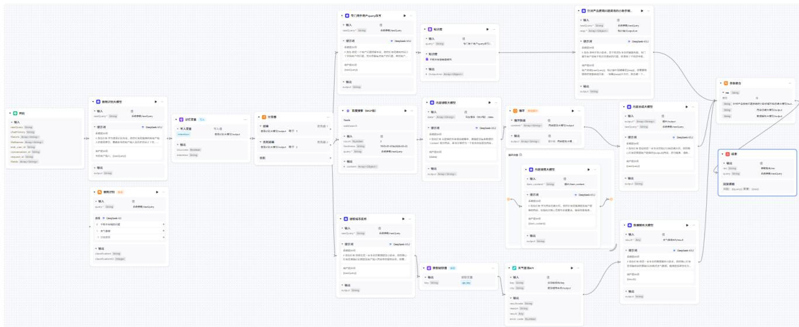

## 4. 工作流 Agent 之预览与调试

调试是工作流开发的关键环节，用于验证节点配置、参数传递、分支执行的正确性，快速定位并解决问题。百度千帆平台支持单节点调试和整体调试两种方式，适配不同的调试场景，调试完成后即可发布智能体。

### 4.1 整体调试

### 适用场景

验证工作流全流程逻辑的正确性，包括节点连接、参数联动、分支触发、多节点协作等，适用于所有节点配置完成后的整体验证。

### 操作步骤

1. 工作流所有节点配置完成后，点击画布中【调试】按钮，打开调试预览窗口

2. 在输入框中输入测试问题（如 “北京的天气怎么样？”），点击发送，测试问题将传入开始节点的系统参数【rawQuery】中

3. 平台将自动执行整个工作流，在调试窗口输出结束节点的最终结果

4. 可查看工作流执行日志，了解每个节点的执行状态、参数传递值、是否执行成功，定位流程中断或结果错误的原因

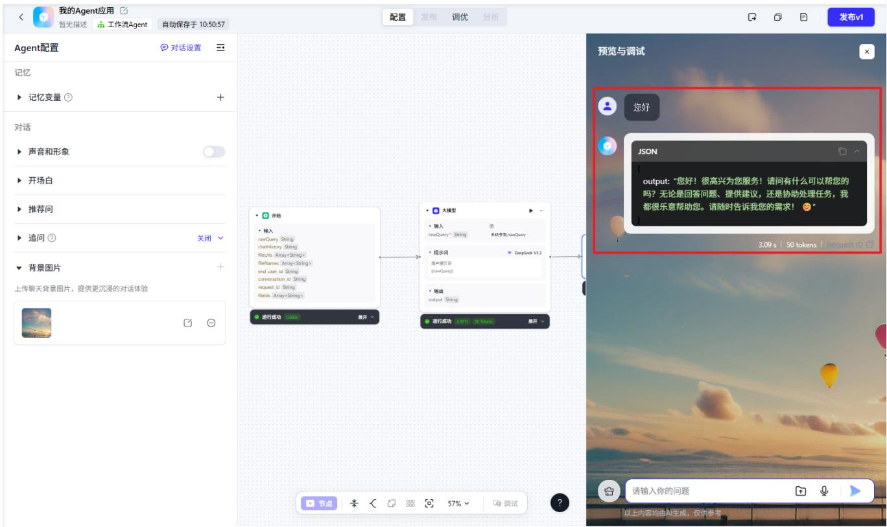

### 4.2 单节点调试

### 适用场景

验证单个功能节点的配置正确性，无需执行整个工作流，适用于节点配置过程中的即时验证，提升开发效率。

### 支持的节点类型

大模型、智能体、API 节点、MCP Server、CFC（云函数计算，Cloud Function Compute）、意图识别、数据库、代码、知识库、循环、文本处理（其余节点如参数聚合、记忆变量、全局跳转等依赖上下文，需在整体调试中验证）。

### 操作步骤

1. 配置完单个节点的信息后，点击节点右上角【调试】按钮，打开节点调试窗口

2. 按节点要求填写测试入参（如大模型节点填写测试 rawQuery，API 节点填写测试参数）

3. 点击【开始运行】，查看节点的输出结果，验证配置是否正确

4. 若结果不符合预期，直接在节点面板修改配置，再次调试，直至结果正确

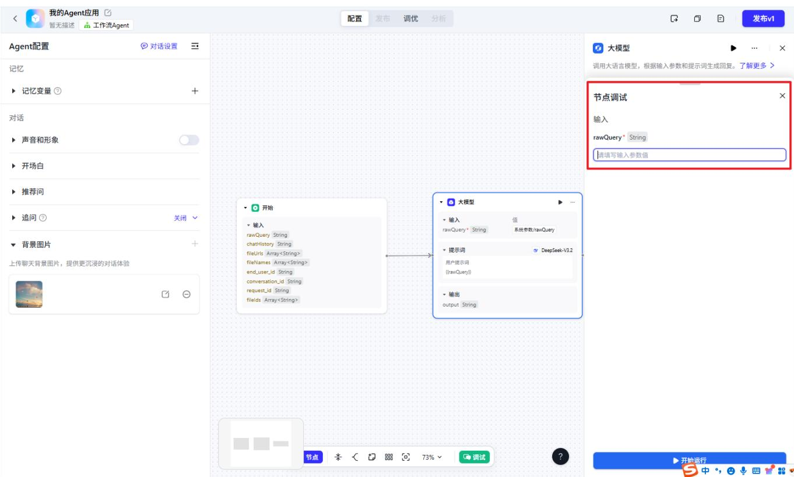

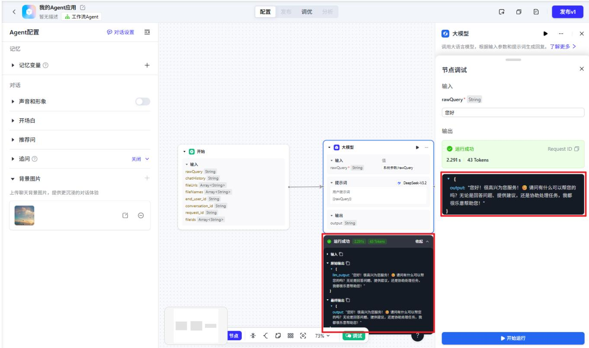

### 4.3 调试核心技巧

结果为空：检查参数引用路径是否正确，节点连接是否无误，聚合节点的聚合参数是否添加完整

API 调用失败：检查接口 URL、请求方式、参数配置是否与接口文档一致，API 密钥是否有效，网络是否通畅

分支触发错误：检查分支器的判断条件、意图识别节点的配置是否正确，意图参数是否传递无误

大模型结果不符：优化大模型节点的提示词，明确角色任务、输出要求，更换适配的模型进行测试。

### 4.4 发布配置

完成应用配置和效果调试后，可点击右上角【发布】按钮，进行多渠道发布并支持创建API调用密钥。

【实践】： "千帆平台智能客服小助手" 调试与发布

### 全流程调试

依次测试三个业务分支的功能：

产品问题：输入 “百度千帆平台是做什么的？”，验证产品问题解答分支是否触发，答案是否准确

非产品问题：输入 “什么是马斯洛需求层次理论？”，验证非产品问题解答分支是否触发，总结结果是否合理

天气查询：输入 “北京今天天气如何？”，验证天气查询分支是否触发，天气信息是否准确

若某一分支结果错误，通过【执行日志】定位问题节点（如 API 节点调用失败、大模型提取参数错误），单独调试该节点并修改配置

所有分支测试通过后，完成多轮对话调试（如 “杭州的天气？”→“明天呢？”），验证上下文连贯性

### 智能体发布

所有调试通过后，点击平台右上角【发布 v1】按钮，完成智能体的首次发布

发布后若对工作流进行了配置更新，再次点击右上角【更新发布 v2】，实现版本迭代

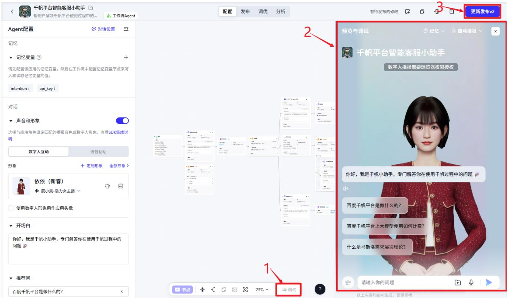
