# 目标检测（Object Detection）

# 一、基本概念

## 1. 什么是目标检测

目标检测（Object Detection）的任务是找出图像中所有感兴趣的目标（物体），确定它们的类别和位置，是计算机视觉领域的核心问题之一。由于各类物体有不同的外观、形状和姿态，加上成像时光照、遮挡等因素的干扰，目标检测一直是计算机视觉领域最具有挑战性的问题。

计算机视觉中关于图像识别有四大类任务：

（1）分类-Classification：解决“是什么？”的问题，即给定一张图片或一段视频判断里面包含什么类别的目标。

（2）定位-Location：解决“在哪里？”的问题，即定位出这个目标的的位置。

（3）检测-Detection：解决“在哪里？是什么？”的问题，即定位出这个目标的位置并且知道目标物是什么。

（4）分割-Segmentation：分为实例的分割（Instance-level）和场景分割（Scene-level），解决“每一个像素属于哪个目标物或场景”的问题。

![[img/8.1.1.png]]

所以，目标检测是一个分类、回归问题的叠加。


## 2. 目标检测的核心问题

（1）分类问题：即图片（或某个区域）中的图像属于哪个类别。

（2）定位问题：目标可能出现在图像的任何位置。

（3）大小问题：目标有各种不同的大小。

（4）形状问题：目标可能有各种不同的形状。


## 3. 目标检测算法分类

基于深度学习的目标检测算法主要分为两类：Two stage和One stage。

### 1）Tow Stage

先进行区域生成，该区域称之为region proposal（简称RP，一个有可能包含待检物体的预选框），再通过卷积神经网络进行样本分类。

任务流程：特征提取 --> 生成RP --> 分类/定位回归。

常见tow stage目标检测算法有：R-CNN、SPP-Net、Fast R-CNN、Faster R-CNN和R-FCN等。

### 2）One Stage

不用RP，直接在网络中提取特征来预测物体分类和位置。

任务流程：特征提取--> 分类/定位回归。

常见的one stage目标检测算法有：OverFeat、YOLOv1、YOLOv2、YOLOv3、SSD和RetinaNet等。


## 4. 目标检测应用

### 1）人脸检测

- 智能门控
- 员工考勤签到
- 智慧超市
- 人脸支付
- 车站、机场实名认证
- 公共安全：逃犯抓捕、走失人员检测

### 2）行人检测

- 智能辅助驾驶
- 智能监控
- 在岗检测、离岗检测、区域入侵检测、安全帽/安全带检测

### 3）车辆检测

- 自动驾驶、辅助驾驶
- 智能交通、违章检测
- 关键通道检测、车流量统计

### 4）遥感检测

- 大地遥感，如土地使用、公路、水渠、河流监控
- 农作物监控
- 军事检测

### 5）工业质检

- 流水生产线产品检测
- 精细产品计数
- 产品内部探伤检测

# 二、目标检测原理

目标检测分为两大系列——RCNN系列和YOLO系列，RCNN系列是基于区域检测的代表性算法，YOLO是基于区域提取的代表性算法，另外还有著名的SSD是基于前两个系列的改进。

## 1. 候选区域产生

很多目标检测技术都会涉及候选框（bounding boxes）的生成，物体候选框获取当前主要使用图像分割与区域生长技术。区域生长(合并)主要由于检测图像中存在的物体具有局部区域相似性(颜色、纹理等)。目标识别与图像分割技术的发展进一步推动有效提取图像中信息。

### 1）滑动窗口

通过滑窗法流程图可以很清晰理解其主要思路：首先对输入图像进行不同窗口大小的滑窗进行从左往右、从上到下的滑动。每次滑动时候对当前窗口执行分类器(分类器是事先训练好的)。如果当前窗口得到较高的分类概率，则认为检测到了物体。对每个不同窗口大小的滑窗都进行检测后，会得到不同窗口检测到的物体标记，这些窗口大小会存在重复较高的部分，最后采用**非极大值抑制**(Non-Maximum Suppression, NMS)的方法进行筛选。最终，经过NMS筛选后获得检测到的物体。
滑窗法简单易于理解，但是不同窗口大小进行图像全局搜索导致效率低下，而且设计窗口大小时候还需要考虑物体的长宽比。所以，对于实时性要求较高的分类器，不推荐使用滑窗法。

![[img/滑动窗口.png]]

### 2）选择性搜索

#### ① 什么是选择性搜索

滑窗法类似穷举进行图像子区域搜索，但是一般情况下图像中大部分子区域是没有物体的。学者们自然而然想到只对图像中最有可能包含物体的区域进行搜索以此来提高计算效率。选择搜索（`selective search`，简称SS）方法是当下最为熟知的图像`bounding boxes`提取算法，由Koen E.A于2011年提出。

选择搜索算法的主要思想：**图像中物体可能存在的区域应该是有某些相似性或者连续性区域的**。因此，选择搜索基于上面这一想法采用子区域合并的方法进行提取bounding boxes。首先，对输入图像进行分割算法产生许多小的子区域。其次，根据这些子区域之间相似性(相似性标准主要有颜色、纹理、大小、填充等等)进行区域合并，不断的进行区域迭代合并。每次迭代过程中对这些合并的子区域做bounding boxes(外切矩形)，这些子区域外切矩形就是通常所说的候选框。

![[img/ss_1.png]]

<center><font size=2>图a:物体间可能存在层级关系；图b:物体可以通过颜色区分；图c:物体可以通过纹理区分，但无法通过颜色区分；图d:轮胎是车的一部分，不是因为颜色相近、纹理相近，而是因为跑车包含在车上</font></center>

![[img/selective search示意图.png]]

<center><font size=2>Selective Search示意图</font></center>

#### ② 选择搜索流程

- step0：生成区域集R
- step1：计算区域集R里每个相邻区域的相似度S={s1, s2,…}
- step2：找出相似度最高的两个区域，将其合并为新集，添加进R
- step3：从S中移除所有与step2中有关的子集
- step4：计算新集与所有子集的相似度
- step5：跳至step2，直至S为空

#### ③ 选择搜索优点

- 计算效率优于滑窗法
- 由于采用子区域合并策略，所以可以包含各种大小的疑似物体框
- 合并区域相似的指标多样性，提高了检测物体的概率


## 2. 数据表示

1）可以将数据表示为向量

$$
y = \left[
\begin{matrix}
p_c \\
b_x \\
b_y \\
b_w \\
b_h \\
C_1 \\
C_2 \\
C_3 \\
\end{matrix}
\right]  , \ \ \ \ y_{true} = \left[
\begin{matrix}
1 \\
40 \\
45 \\
80 \\
60 \\
0 \\
1 \\
0 \\
\end{matrix}
\right]  , \ \ \ \ y_{pred} = \left[
\begin{matrix}
0.88 \\
41 \\
46 \\
82 \\
59 \\
0.01 \\
0.95 \\
0.04 \\
\end{matrix}
\right]
$$

**数据表示的简单示意图：**
![[img/111.png]]
 

其中，$p_c$为预测结果的置信概率，$b_x, b_y, b_w, b_h$为边框坐标，$C_1, C_2, C_3$为属于某个类别的概率。通过预测结果、实际结果，构建损失函数。损失函数包含了分类、回归两部分组成。

2）可以将数据表示为张量

![[img/data_structure_tensor.png]]

## 3. 效果评估

### 1）分类子问题评估

分类子问题使用Precision、Recall、F1等指标来进行评估。

### 2）定位子问题评估

使用IoU（Intersection over Union，交并比）来判断模型定位的好坏。所谓交并比，是指预测边框、实际边框交集和并集的比率，一般约定0.5为一个可以接受的值。

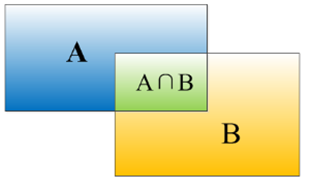

以下是各种比例交并比的直观感受：

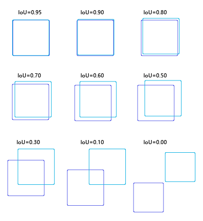

## 4. 非极大值抑制

预测结果中，可能多个预测结果间存在重叠部分，需要保留交并比最大的、去掉非最大的预测结果，这就是非极大值抑制（Non-Maximum Suppression，简写作NMS）。如下图所示，对同一个物体预测结果包含三个概率0.8/0.9/0.95，经过非极大值抑制后，仅保留概率最大的预测结果。

![[img/nms.png]]

## 5. 多尺度检测

### 1）特征金字塔

特征金字塔（Feature Pyramid Network，简称FPN）指由不同大小的特征图构成的层次模型，主要用于在目标检测中实现多尺度检测。大的特征图适合检测较小的目标，小的特征图适合检测大的目标。

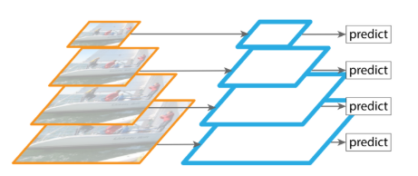

卷积神经网络输出特征图上的像素点，对应在原始图像上所能看到区域的大小称之为“感受野”，卷积层次越深、特征图越小，特征图上每个像素对应的感受野越大，语义信息表征能力越强，但是特征图的分辨率较低，几何细节信息表征能力较弱；特征图越大，特征图上每个像素对应的感受野越小，几何细节信息表征能力强，特征图分辨率较高，但语义表征能力较弱。为了同时获得较大特征图和较小特征图的优点，可以对特征图进行融合。

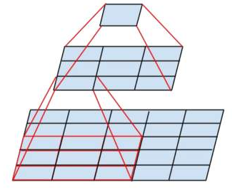

### 2）特征融合

- add：对小的特征图进行上采样，上采样至与大特征图相同大小，进行按元素相加

  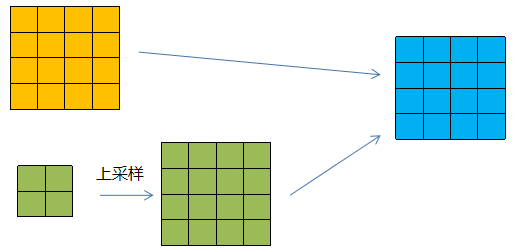

- concat：按照指定的维度进行连接

  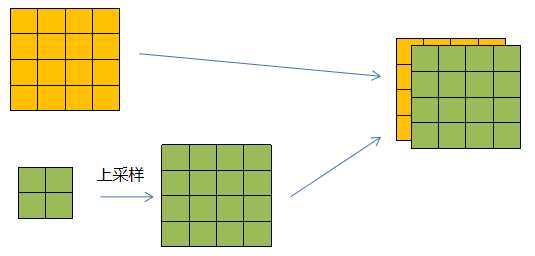

# 三、目标检测模型

## 1. R-CNN系列

### 1）R-CNN

#### ① 定义

R-CNN(全称Regions with CNN features) ，是R-CNN系列的第一代算法，其实没有过多的使用“深度学习”思想，而是将“深度学习”和传统的“计算机视觉”的知识相结合。比如R-CNN pipeline中的第二步和第四步其实就属于传统的“计算机视觉”技术。使用selective search提取region proposals，使用SVM实现分类。

![[img/RCNN.png]]

#### ② 思路

- 给定一张图片，从图片中选出2000个独立的候选区域(Region Proposal)。
- 将每个候选区域输入到预训练好的AlexNet中，提取一个固定长度（4096）的特征向量。
- 对每个目标（类别）训练一SVM分类器，识别该区域是否包含目标。
- 训练一个回归器，修正候选区域中目标的位置：对于每个类，训练一个线性回归模型判断当前框定位是否准确。

#### ③ 训练

- 使用区域生成算法，生成2000个候选区域，这里使用的是Selective search。

- 对生成的2000个候选区域，使用预训练好的AlexNet网络进行特征提取。将候选区域变换到网络需要的尺寸(227×227)。 在进行变换的时候，在每个区域的边缘添加p个像素（即添加边框，设置p=16）。同时，改造预训练好的AlexNet网络，将其最后的全连接层去掉，并将类别设置为21（20个类别，另外一个类别代表背景）。每个候选区域输入到网络中，最终得到4096×21个特征。

  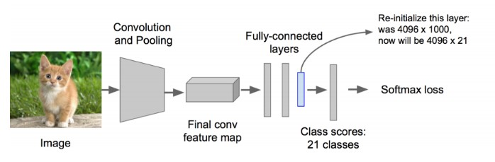

- 利用上面提取到的候选区域的特征，对每个类别训练一个SVM分类器（二分类），判断候选框中物体的类别，输出Positive/Negative。如果该区域与Ground truth的IOU低于某个阈值，就将给区域设置为Negative（阈值设置为0.3）。如下图所示：

  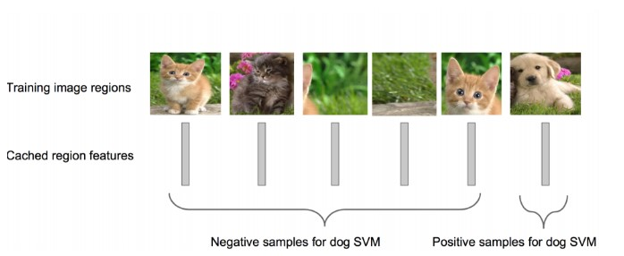

#### ④ 效果

- R-CNN在VOC 2007测试集上mAP达到58.5%，打败当时所有的目标检测算法。

```
TP真正例   FP假正例    FN 假反例  TN真反例

查准率 =  TP / TP + FP   当前类别预测对的个数 / 当前类别预测出来的个数
召回率 =  TP / TP + FN   当前类别预测对的个数 / 当前类别真实的样本个数

通过查准率和召回率计算每个类别的PR曲线

得到每个类别PR曲线下的面积: AP

对所有类别的AP值取平均值：mAP

```

#### ⑤ 缺点

- 重复计算，训练耗时，每个region proposal，都需要经过一个AlexNet特征提取，为所有的RoI（region of interest）提取特征大约花费47秒。
- 训练占用空间，特征文件需要保存到文件，5000张的图片会生成几百G的特征文件。
- selective search方法生成region proposal，对一帧图像，需要花费2秒。
- 三个模块（提取、分类、回归）是分别训练的，并且在训练时候，对于存储空间消耗较大。（非端到端）

> 端到端(end-to-end): 音频输入模型中--->输出文字
> 非端到端:                 音频--->人工提取MFCC特征--->声学模型--->语言模型--->文字
 
### 2）Fast R-CNN

#### ① 定义

Fast R-CNN是基于R-CNN和SPPnets进行的改进。SPPnets，其创新点在于只进行一次图像特征提取（而不是每个候选区域计算一次），然后根据算法，将候选区域特征图映射到整张图片特征图中。

![[img/8.1.7.png]]

```
RoI Pooling,将不同尺寸的RoI的特征图，固定到相同的大小

10x10的原始图像的特征图

1 2 3 4 5 6 7 8 9 10
2 3 4 5 6 7 8 9 10 1
3 4 5 6 7 8 9 10 1 2
4 5 6 7 8 9 10 1 2 3
5 6 7 8 9 10 1 2 3 4
6 7 8 9 10 1 2 3 4 5
7 8 9 10 1 2 3 4 5 6
8 9 10 1 2 3 4 5 6 7
9 10 1 2 3 4 5 6 7 8
10 1 2 3 4 5 6 7 8 9

RoI坐标（1,1,7,7）

目标尺寸:2x2

RoI的尺寸为7x7，需要划分为2x2的网格
四行三列 ，四行四列
三行三列 ，三行四列

RoI的尺寸为9x9,需要划分为2x2的网格
五行四列，五行五列
四行四列，四行五列
```
---
回顾一下 R-CNN：一张图 2000 个候选框 → **每个框都单独过一遍 CNN** → 每张图跑 2000 次卷积。一张图 47 秒，绝大部分时间在重复计算同一张图的底层特征。

```
R-CNN:
图片 ──▶ 候选框1 → CNN ──▶ 特征1
         候选框2 → CNN ──▶ 特征2
         候选框3 → CNN ──▶ 特征3
         ...                 （2000 次重复卷积）
```

**SPPnets 的核心思路**

**整张图只跑一次 CNN**，得到一张完整特征图。然后 2000 个候选框直接在这张特征图上"抠"对应区域的特征——不再需要单独跑 CNN。

```
SPPnets:
图片 ──▶ CNN（只跑一次！）──▶ 整张特征图
                                  │
                    ┌─────────────┬┴──────────────┐
                    ▼             ▼                ▼
               候选框1区域     候选框2区域      候选框3区域
               的特征           的特征            的特征
```

速度从「每张图 47 秒」干到了「每张图不到 1 秒」。

 **"空间金字塔池化"是什么**

候选框大小不一样，抠出来的特征区域尺寸也不同，但全连接层要固定输入。SPP 的做法是：把任意尺寸的特征区域**分成 1×1、2×2、4×4 三个粒度的网格**，每个格子做一次最大值池化，然后把三层的结果拼接起来：

```
任意尺寸的特征区域
      │
      ├── 1×1 网格（1个格子）→ 池化 → 1 个数
      ├── 2×2 网格（4个格子）→ 池化 → 4 个数
      └── 4×4 网格（16个格子）→ 池化 → 16 个数
                                          ↓
                               拼接：1+4+16 = 21 维（×通道数）
                                          ↓
                               固定长度，喂给全连接层
```
---

#### ② 流程

- 使用selective search生成region proposal，大约2000个左右区域候选框

- 使用CNN对图像进行卷积运算，得到整个图像的特征图
- 对于每个候选框，通过RoI Projection映射算法取出该候选框的特征图，再通过RoI池化层形成固定长度的特征向量
- 每个特征向量被送入一系列全连接（fc）层中，最终分支成两个同级输出层 ：一个输出个类别加上1个背景类别的Softmax概率估计，另一个为个类别的每一个类别输出4个定位信息

#### ③ 改进

- 和RCNN相比，训练时间从84小时减少为9.5小时，测试时间从47秒减少为0.32秒。在VGG16上，Fast RCNN训练速度是RCNN的9倍，测试速度是RCNN的213倍；训练速度是SPP-net的3倍，测试速度是SPP-net的3倍
- Fast RCNN在PASCAL VOC 2007上准确率相差无几，约在66~67%之间
- 加入RoI Pooling，采用一个神经网络对全图提取特征
- 在网络中加入了多任务函数边框回归，实现了端到端的训练

#### ④ 缺点

- 依旧采用selective search提取region proposal（耗时2~3秒，特征提取耗时0.32秒）
- 无法满足实时应用，没有真正实现端到端训练测试
- 利用了GPU，但是region proposal方法是在CPU上实现的


### 3）Faster RCNN

经过R-CNN和Fast-RCNN的积淀，Ross B.Girshick在2016年提出了新的Faster RCNN，在结构上将特征抽取、region proposal提取， bbox regression，分类都整合到了一个网络中，使得综合性能有较大提高，在检测速度方面尤为明显。

![[img/faster-rcnn.png]]

#### ① 整体流程

- Conv Layers。作为一种CNN网络目标检测方法，Faster RCNN首先使用一组基础的卷积/激活/池化层提取图像的特征，形成一个特征图，用于后续的RPN层和全连接层。
- Region Proposal Networks（RPN）。RPN网络用于生成候选区域，该层通过softmax判断锚点（anchors）属于前景还是背景，在利用bounding box regression（包围边框回归）获得精确的候选区域。 
- RoI Pooling。该层收集输入的特征图和候选区域，综合这些信息提取候选区特征图（proposal feature maps），送入后续全连接层判定目标的类别。
- Classification。利用取候选区特征图计算所属类别，并再次使用边框回归算法获得边框最终的精确位置。  

#### ② RPN网络

RPN网络全称Region Proposal Network（区域提议网络），是专门用来从特征图生成候选区域的网络。其结构如下所示：

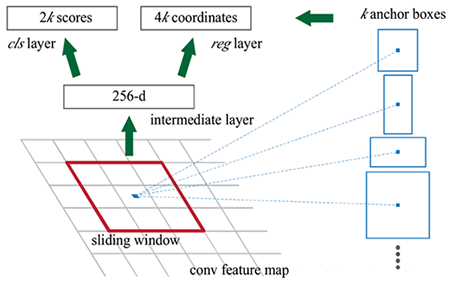

流程步骤：

（1）输入：通过主干网卷积得到的特征图

（2）对于特征图上的每一个点（称之为anchor point，锚点）,生成具有不同 尺度 和 宽高比 的锚点框，这个锚点框的坐标(x,y,w,h)是在原图上的坐标

（3）然后将这些锚点框输入到两个网络层中去，一个（rpn_cls_score ）用来分类，即这个锚点框里面的特征图是否属于前景；另外一个（rpn_bbox_pred）输出四个位置坐标（相对于真实物体框的偏移）

（4）将锚点框与Ground Truth中的标签框进行 IoU 对比，如果其 IoU 高于某个阈值，则该锚点框标定为前景框，否则属于背景框；对于前景框，还要计算其与真实标签框的4个位置偏移；将这个标注好的锚点框（带有 前背景类别 和 位置偏移 标注）与3中卷积网络层的两个输出进行loss比较(类别：CrossEntrpy loss 和 位置回归：smooth L1 loss)，从而学习到如何提取前景框

（5）学习到如何提取前景框后，就根据 rpn_cls_score 层的输出概率值确定前景框；位置偏移值则被整合到锚点框的坐标中以得到实际的框的坐标；这样子就得到了前景框，起到了selective search的作用。RPN生成的proposal就称为 Region of Interest.由于他们具有不同的尺度和长度，因此需要通过一个 ROI pooling层获得统一的大小

**RPN网络学习提取RP区域的过程：**
![[img/RPN.png]]

#### ③ Anchors

Anchors（锚点）指由一组矩阵，每个矩阵对应不同的检测尺度大小。如下矩阵：

```python
[[ -84.  -40.  99.  55.]
 [-176.  -88. 191. 103.]
 [-360. -184. 375. 199.]
 [ -56.  -56.  71.  71.]
 [-120. -120. 135. 135.]
 [-248. -248. 263. 263.]
 [ -36.  -80.  51.  95.]
 [ -80. -168.  95. 183.]
 [-168. -344. 183. 359.]]
```

其中每行4个值（$x_1, y_1, x_2, y_2$），对应矩形框左上角、右下角相对于中心点的偏移量。9个矩形共有三种形状，即1:1, 1:2, 2:1，即进行多尺度检测。

![[img/anchors示意图.png]]

例如，一张800 * 600的原始图片，经过VGG下采样后(生成特征矩阵)缩小16倍，大小变为50 * 38，每个点设置9个anchor，则总数为： 

```python
ceil(800 / 16) * ceil(600 / 16) * 9 = 50 * 38 * 9 = 17100
```

RPN 并不对全部 17,100 个 anchor 算损失。它每张图只**采样 256 个 anchor**组成一个 mini-batch：

```
17,100 个 anchor
     │
     ├── 正样本（IoU > 0.7 + 补齐）：取 128 个
     ├── 负样本（IoU < 0.3）：取 128 个  
     └── 中立样本（0.3 ≤ IoU ≤ 0.7）：丢弃，不参与训练
                           ↓
                     只有 256 个进损失函数
```

#### ④ Bounding box regression

物体识别完成后，通过一种方式对外围框进行调整，使得和目标物体更加接近。

#### ⑤ 损失函数

对一个图像的损失函数，是一个分类损失函数与回归损失函数的叠加：
$$
L(\{p_i\},\{t_i\}) = \frac{1}{N_{cls}}\sum{L_{cls}(p_i, p_i^*)} + \lambda\frac{1}{N_{reg}}\sum{p_i^*L_{reg}(t_i, t_i^*)}
$$

- i是一个mini-batch中anchor的索引
- $p_i$是anchor i 为目标的预测概率
- ground truth标签$p_i^*$就是1，如果anchor为负，$p_i^*$就是0
- $t_i$是一个向量，表示预测的包围盒的4个参数化坐标
- $N_{cls}$是与正anchor对应的ground truth的坐标向量
- $N_{reg}$为anchor位置的数量（大约2400），$\lambda$=10

分类损失函数：
$$
L_{cls}(p_i, p_i^*) = -log[p_i^*p_i + (1-p_i^*)(1-p_i)]
$$
位置损失函数：
$$
L_{reg}(t_i, t_i^*) = R(t_i - t_i^*)
$$
其中：
$$
R = smooth_{L1}(x) = \begin{cases}{0.5x^2} \ \ if |x| < 1\\ |x|-0.5 \ \ otherwise \end{cases}
$$

#### ⑥ 改进

- 在VOC2007测试集测试mAP达到73.2%，目标检测速度可达5帧/秒
- 提出Region Proposal Network(RPN)，取代selective search，生成待检测区域，时间从2秒缩减到了10毫秒
- 真正实现了一个完全的End-To-End（端对端）的CNN目标检测模型
- 共享RPN与Fast RCNN的特征 

#### ⑦ 缺点

- 还是无法达到实时检测目标
- 获取region proposal， 再对每个proposal分类计算量还是较大


## 2. YOLO系列

### 1）YOLOv1（2015）

作者：Joseph Redmon和 Ali Farhadi等 人（华盛顿大学） 

#### ① 基本思想

YOLO（You Only Look Once ）是继RCNN，fast-RCNN和faster-RCNN之后，Ross Girshick针对DL目标检测速度问题提出的另一种框架，其核心思想是生成RoI+目标检测两阶段（two-stage）算法用一套网络的一阶段（one-stage）算法替代，直接在输出层回归bounding box的位置和所属类别。  

之前的物体检测方法首先需要产生大量可能包含待检测物体的先验框, 然后用分类器判断每个先验框对应的边界框里是否包含待检测物体，以及物体所属类别的概率或者置信度，同时需要后处理修正边界框，最后基于一些准则过滤掉置信度不高和重叠度较高的边界框，进而得到检测结果。这种基于先产生候选区再检测的方法虽然有相对较高的检测准确率，但运行速度较慢。

YOLO创造性的将物体检测任务直接当作回归问题（regression problem）来处理，将候选区和检测两个阶段合二为一。只需一眼就能知道每张图像中有哪些物体以及物体的位置。下图展示了各物体检测系统的流程图。

![[img/YOLOv1-01.png]]

实际上，YOLO并没有真正去掉候选区，而是采用了预定义候选区的方法，也就是将图片划分为7\*7个网格，**每个网格允许预测出2个边框**，总共49\*2个bounding box，可以理解为98个候选区域，它们很粗略地覆盖了图片的整个区域。YOLO以降低mAP为代价，大幅提升了时间效率。


每个网格单元预测这些框的2个边界框和置信度分数。这些置信度分数反映了该模型对框是否包含目标的可靠程度，以及它预测框的准确程度。置信度定义为：
$$
\Pr(\textrm{Object})\ *\ \textrm{IOU}_{\textrm{pred}}^{\textrm{truth}}
$$
如果该单元格中不存在目标，则置信度分数应为零。否则，我们希望置信度分数等于预测框与真实值之间联合部分的交集（IOU）。

每个边界框包含5个预测：$x$，$y$，$w$，$h$和置信度。$(x，y)$坐标表示边界框相对于网格单元边界框的中心。宽度和高度是相对于整张图像预测的。最后，置信度预测表示预测框与实际边界框之间的IOU。


每个网格单元还预测$C$个条件类别概率$\Pr(\textrm{Class}_i | \textrm{Object})$。这些概率以包含目标的网格单元为条件。每个网格单元我们只预测的一组类别概率，而不管边界框的的数量$B$是多少。

#### ② 网络结构

YOLOv1网络有24个卷积层，后面是2个全连接层。我们只使用$1 \times 1$降维层，后面是$3 \times 3$卷积层。如下图所示：


为了快速实现快速目标检测，YOLOV1还训练了快速版本。快速YOLO使用具有较少卷积层（9层而不是24层）的神经网络，在这些层中使用较少的滤波器。除了网络规模之外，YOLO和快速YOLO的所有训练和测试参数都是相同的。网络的最终输出是7\*7\*30(1470)的预测张量。

#### ③ 训练过程与细节

（1）预训练。采用前20个卷积层、平均池化层、全连接层进行了大约一周的预训练；

（2）输入。输入数据为224\*224和448\*448大小的图像；

（3）损失函数

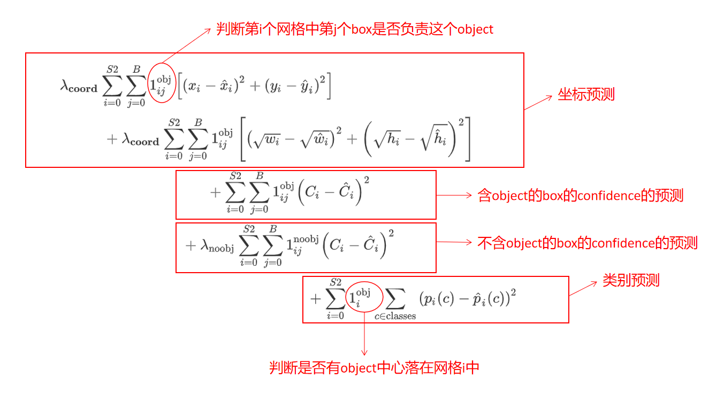

- 损失函数由坐标预测、是否包含目标物体置信度、类别预测构成；
- 其中$1_i^{obj}$表示目标是否出现在网格单元$i$中，表示$1_{ij}^{obj}$网格单元$i$中的第$j$个边界框预测器“负责”该预测；
- 如果目标存在于该网格单元中（前面讨论的条件类别概率），则损失函数仅惩罚分类错误；
- 如果预测器“负责”实际边界框（即该网格单元中具有最高IOU的预测器），则它也仅惩罚边界框坐标错误。

（5）学习率。第一个迭代周期，慢慢地将学习率从$10^{-3}$提高到$10^{-2}$；然后继续以$10^{-2}$的学习率训练75个迭代周期，用$10^{-3}$的学习率训练30个迭代周期，最后用$10^{-4}$的学习率训练30个迭代周期。

（6）避免过拟合策略。使用dropout和数据增强来避免过拟合。

#### ④  优点与缺点

（1）优点
- YOLO检测物体速度非常快，其增强版GPU中能跑45fps（frame per second），简化版155fps
- YOLO在训练和测试时都能看到一整张图的信息（而不像其它算法看到局部图片信息），因此YOLO在检测物体是能很好利用上下文信息，从而不容易在背景上预测出错误的物体信息
- YOLO可以学到物体泛化特征

（2）缺点
- 精度低于其它`state-of-the-art`(sota，类似于行业标杆)的物体检测系统
- 容易产生定位错误
- 对小物体检测效果不好，尤其是密集的小物体，因为一个栅格只能检测2个物体
- 由于损失函数的问题，定位误差是影响检测效果的主要原因，尤其是大小物体处理上还有待加强


### 2）YOLOv2（2016）

作者：Joseph Redmon和Ali Farhadi等人（华盛顿大学）

Ross Girshick吸收fast-RCNN和SSD算法，设计了YOLOv2（论文原名《YOLO9000: Better, Faster, Stronger 》），在精度上利用一些列训练技巧，在速度上应用了新的网络模型`DarkNet19`，在分类任务上采用联合训练方法，结合wordtree等方法，使YOLOv2的检测种类扩充到了上千种，作者在论文中称可以检测超过9000个目标类别，所以也称YOLO9000. YOLOv2模型 可以以不同的尺寸运行，从而在速度和准确性之间提供了一个简单的折衷，在67FPS时，YOLOv2在VOC 2007上获得了76.8 mAP。在40FPS时，YOLOv2获得了78.6 mAP，比使用ResNet的Faster R-CNN和SSD等先进方法表现更出色，同时仍然运行速度显著更快。

#### ① 改进策略

YOLOv2对YOLOv1采取了很多改进措施，以提高模型mAP，如下图所示：

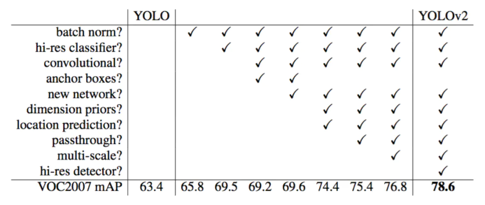

**（1）Batch Normalization（批量正则化）**。YOLOv2中在每个卷积层后加Batch Normalization(BN)层，去掉dropout. BN层可以起到一定的正则化效果，能提升模型收敛速度，防止模型过拟合。YOLOv2通过使用BN层使得mAP提高了2%。

**（2）High Resolution Classifier（高分辨率分类器）**---==分类预训练阶段==。原来的YOLO网络在预训练的时候采用的是224\*224的输入（这是因为一般预训练的分类模型都是在ImageNet数据集上进行的），然后在detection的时候采用448\*448的输入，这会导致从分类模型切换到检测模型的时候，模型还要适应图像分辨率的改变。而YOLOv2则将预训练分成两步：先用224\*224的输入从头开始训练网络，大概160个epoch（表示将所有训练数据循环跑160次），然后再将输入调整到448\*448，再训练10个epoch。注意这两步都是在ImageNet数据集上操作。最后再在检测的数据集上`fine-tuning`，也就是detection的时候用448\*448的图像作为输入就可以顺利过渡了。作者的实验表明这样可以提高几乎4%的mAP。
 
**（3）Convolutional With Anchor Boxes** ---==检测训练阶段==。 YOLOv1利用全连接层直接对边界框进行预测，导致丢失较多空间信息，定位不准。YOLOv2去掉了YOLOv1中的全连接层，使用Anchor Boxes预测边界框，同时为了得到更高分辨率的特征图，YOLOv2还去掉了一个池化层。由于图片中的物体都倾向于出现在图片的中心位置，若特征图恰好有一个中心位置，利用这个中心位置预测中心点落入该位置的物体，对这些物体的检测会更容易。所以总希望得到的特征图的宽高都为奇数。YOLOv2通过缩减网络，使用416\*416的输入，模型下采样的总步长为32，最后得到13\*13的特征图，然后对13\*13的特征图的每个cell预测5个anchor boxes，对每个anchor box预测边界框的位置信息、置信度和一套分类概率值。使用anchor boxes之后，YOLOv2可以预测13\*13\*5=845个边界框，模型的召回率由原来的81%提升到88%，mAP由原来的69.5%降低到69.2%.召回率提升了7%，准确率下降了0.3%。

**（4）Dimension Clusters（维度聚类）**。在Faster R-CNN和SSD中，先验框都是手动设定的，带有一定的主观性。YOLOv2采用k-means聚类算法对训练集中的边界框做了聚类分析，选用boxes之间的IOU值作为聚类指标。综合考虑模型复杂度和召回率，最终选择5个聚类中心，得到5个先验框，发现其中中扁长的框较少，而瘦高的框更多，更符合行人特征。通过对比实验，发现用聚类分析得到的先验框比手动选择的先验框有更高的平均IOU值，这使得模型更容易训练学习。  
   
```
1.数据准备
  对训练集中的所有的真实边框的宽度和高度
  
2.k-means的相似度判断指标:IoU
  对收集到真实的边界框的尺寸(宽度和高度),执行K-means聚类
  
  聚类的目的就是为了找到一组聚类中心,聚类中心代表了数据中最常见的边界框的形状和尺寸
  
3.确定锚点框尺寸
  每个聚类中心的宽度和高度代表了一个推荐的锚点框的尺寸
```


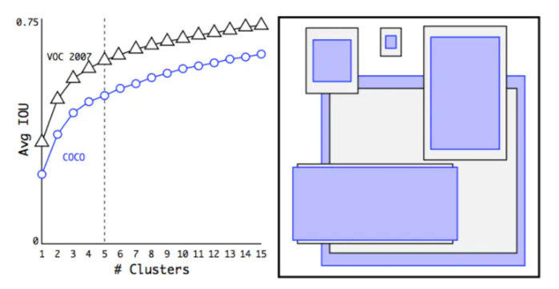

<center><font size=2>VOC和COCO的聚类边界框尺寸。我们对边界框的维度进行k-means聚类，以获得我们模型的良好先验。左图显示了我们通过对k的各种选择得到的平均IOU。我们发现k=5给出了一个很好的召回率与模型复杂度的权衡。右图显示了VOC和COCO的相对中心。这两种先验都赞成更薄更高的边界框，而COCO比VOC在尺寸上有更大的变化。</font></center>


**（5）New Network（新的网络）**。 YOLOv2采用`Darknet-19`，其网络结构如下图所示，包括19个卷积层和5个max pooling层，主要采用3\*3卷积和1\*1卷积，这里1\*1卷积可以压缩特征图通道数以降低模型计算量和参数，每个卷积层后使用BN层以加快模型收敛同时防止过拟合。最终采用global avg pool 做预测。采用YOLOv2，模型的mAP值没有显著提升，但计算量减少了。

![[img/YOLOv2-02.png]]

**（6）直接定位预测（Direct location Prediction）**。 Faster R-CNN使用anchor boxes预测边界框相对先验框的偏移量，由于没有对偏移量进行约束，每个位置预测的边界框可以落在图片任何位置，会导致模型不稳定，加长训练时间。YOLOv2沿用YOLOv1的方法，根据所在网格单元的位置来预测坐标,则Ground Truth的值介于0到1之间。网络中将得到的网络预测结果再输入sigmoid函数中，让输出结果介于0到1之间。设一个网格相对于图片左上角的偏移量是$c_x，c_y$。先验框的宽度和高度分别是$p_w$和$p_h$，则预测的边界框相对于特征图的中心坐标$(b_x，b_y)$和宽高$b_w，b_h$的计算公式如下图所示。
 
![[img/YOLOv2-03.png]]

其中，$\sigma$为sigmoid函数；$t_x,t_y$是**预测**的坐标偏移值（中心点坐标）；$t_w, t_h$是尺度缩放，分别经过sigmoid，输出0-1之间的偏移量，与$c_x, c_y$相加后得到bounding box中心点的位置。

**（7）细粒度特征（Fine-Grained Features）**。 YOLOv2借鉴`SSD`使用多尺度的特征图做检测，提出`pass through`层将高分辨率的特征图与低分辨率的特征图联系在一起，从而实现多尺度检测。YOLOv2提取`Darknet-19`最后一个`max pool`层的输入，得到26\*26\*512的特征图。经过1\*1\*64的卷积以降低特征图的维度，得到26\*26\*64的特征图，然后经过`pass through`层的处理变成13\*13\*256的特征图（抽取原特征图每个2\*2的局部区域组成新的channel，即原特征图大小降低4倍，channel增加4倍），再与13\*13\*1024大小的特征图连接，变成13\*13\*1280的特征图，最后在这些特征图上做预测。使用Fine-Grained Features，YOLOv2的性能提升了1%。

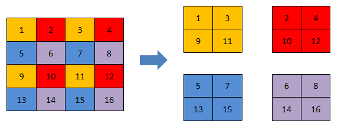

![[img/YOLOv2-04.png]]

**（8）多尺度训练（Multi-Scale Training）**。 YOLOv2中使用的Darknet-19网络结构中只有卷积层和池化层，所以其对输入图片的大小没有限制。YOLOv2采用多尺度输入的方式训练，在训练过程中每隔10个batches,重新随机选择输入图片的尺寸，由于Darknet-19下采样总步长为32，输入图片的尺寸一般选择32的倍数{320,352,…,608}（最小的选项是320×320，最大的是608×608。我们调整网络的尺寸并继续训练）。采用Multi-Scale Training, 可以适应不同大小的图片输入，当采用低分辨率的图片输入时，mAP值略有下降，但速度更快，当采用高分辨率的图片输入时，能得到较高mAP值，但速度有所下降。


<center><font size=2>YOLOv2比先前的检测方法更快，更准确。它也可以以不同的分辨率运行，以便在速度和准确性之间进行简单折衷</font></center>
 
#### ② 训练过程

- 第一阶段：现在ImageNet分类数据集上训练Darknet-19,此时模型输入为224\*224，共训练160轮
- 第二阶段：将网络输入调整为448\*448，继续在ImageNet分类数据集上训练细调模型，共10轮，此时分类模型top-1准确率为76.5%，而top-5准确度为93.3%
- 第三阶段：**修改Darknet-19分类模型为检测模型**，并在检测数据集上继续细调网络

#### ③ 优点与缺点

（1）优点

- YOLOv2使用了一个新的分类器作为特征提取部分，较多使用了3\*3卷积核，在每次池化后操作后把通道数翻倍。网络使用了全局平均池化，把1\*1卷积核置于3\*3卷积核之间，用来压缩特征。也用了batch normalization稳定模型训练
- 最终得出的基础模型就是Darknet-19，包含19个卷积层，5个最大池化层，运算次数55.8亿次，top-1图片分类准确率72.9%，top-5准确率91.2%
- YOLOv2比VGG16更快，精度略低于VGG16

（2）缺点

- YOLOv2检测准确率不够，比SSD稍差
- 不擅长检测小物体
- 对近距离物体准确率较低

### 3）YOLOv3（2018）

作者：Joseph Redmon和Ali Farhadi等人（华盛顿大学）

YOLOv3总结了自己在YOLOv2的基础上做的一些尝试性改进，有的尝试取得了成功，而有的尝试并没有提升模型性能。其中有两个值得一提的亮点，一个是使用残差模型，进一步加深了网络结构；另一个是使用FPN架构实现多尺度检测。

#### ① 改进

- 新网络结构：DarkNet-53；
- 用逻辑回归替代softmax作为分类器；
- 融合FPN（特征金字塔网络），实现多尺度检测。

#### ② 多尺度预测

YOLOv3在基本特征提取器上添加几个卷积层，其中最后一个卷积层预测了一个三维张量——边界框，目标和类别预测。 在COCO实验中，为每个尺度预测3个框，所以对于4个边界框偏移量，1个目标预测和80个类别预测，张量的大小为N×N×\[3\*(4 + 1 + 80）]。接下来，从前面的2个层中取得特征图，并将其上采样2倍。

YOLOv3还从网络中的较前的层中获取特征图，并使用按元素相加的方式将其与上采样特征图进行合并。这种方法使得能够从上采样的特征图中获得更有意义的语义信息，同时可以从更前的层中获取更细粒度的信息。然后，再添加几个卷积层来处理这个组合的特征图，并最终预测出一个类似的张量，虽然其尺寸是之前的两倍。

最后，再次使用相同的设计来预测最终尺寸的边界框。因此，第三个尺寸的预测将既能从所有先前的计算，又能从网络前面的层中的细粒度的特征中获益。

**下采样：把特征图缩小**

常见方法：
- 3x3，步长为2的卷积
- 最大池化
- 平均池化
在 YOLOv3 中，主要使用**步长为2的卷积**进行下采样。

**作用**
假设最开始一个特征点只能看到原图中的小块区域。不断下采样后，一个特征点可以看到更大的区域，即**感受野增大**。
因此，下采样后的特征图：
- 尺寸更小
- 计算量更低
- 位置细节减少
- 语义信息更强
- 更容易判断“这是一辆汽车”
- 更适合检测大目标

**上采样：把特征图放大**

常见方法：
- 最近邻插值
- 双线性插值
- 转置卷积
- 像素重排
YOLOv3 通常使用**最近邻插值**将特征图放大2倍。

**作用**
上采样后的特征图尺寸更大，可以：
- 与浅层的高分辨率特征图融合
- 获得更多位置、边缘和纹理信息
- 提高小目标检测能力

**重要提醒**
上采样只是把特征图放大，**不会自动恢复下采样过程中丢失的信息**。
例如把一张模糊的图片从100×100放大成200×200，图片虽然变大了，但不会凭空出现更多真实细节。
所以 YOLOv3 在上采样后，还需要和浅层特征进行 `concat`：
```
深层特征 → 上采样 ─┐
                  ├→ concat → 融合特征
浅层特征 ──────────┘

```

#### ③ 网络结构

YOLOv3在之前Darknet-19的基础上引入了残差块，并进一步加深了网络，改进后的网络有53个卷积层，取名为Darknet-53，网络结构如下图所示（以256\*256的输入为例）：
  
![[img/DarkNet53.png]]

以下是YOLOv3结构图：

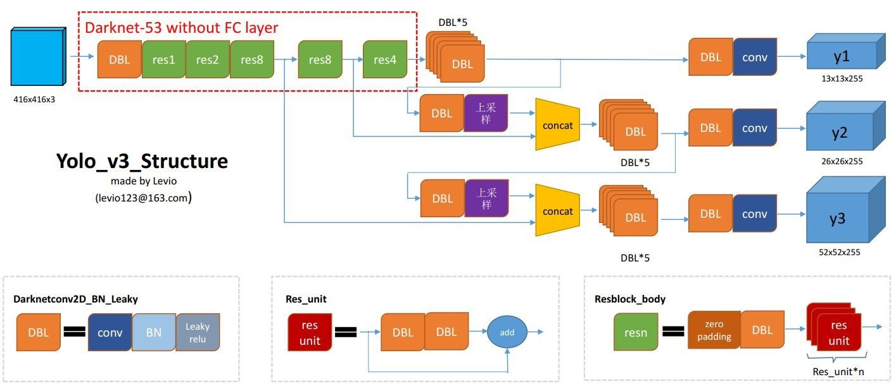

从YOLOv1到YOLOv2再到YOLO9000、YOLOv3, YOLO经历三代变革，在保持速度优势的同时，不断改进网络结构，同时汲取其它优秀的目标检测算法的各种trick，先后引入anchor box机制、引入FPN实现多尺度检测等。

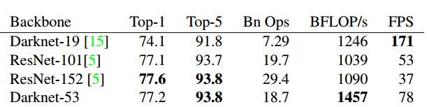

<center><font size=2>不同backbone的各种网络在准确度，billions of operations，billion floating point operations per second和FPS上的比较</font></center>
每个网络都使用相同的设置进行训练，并在256×256的图像上进行单精度测试。 运行时间是在Titan X上用256×256图像进行测量的。因此，Darknet-53可与最先进的分类器相媲美，但浮点运算更少，速度更快。 Darknet-53比ResNet-101更好，且速度快1.5倍。 Darknet-53与ResNet-152具有相似的性能，但速度快2倍。

Darknet-53也实现了最高的每秒浮点运算测量。 这意味着网络结构可以更好地利用GPU，使它的评测更加高效，更快。 这主要是因为ResNet的层数太多，效率不高。

#### ④ 效果

（1）兼顾速度与准确率。在COCO数据机上，mAP指标与SSD模型相当，但速度提高了3倍；mAP指标比RetinaNet模型差些，但速度要高3.8倍。

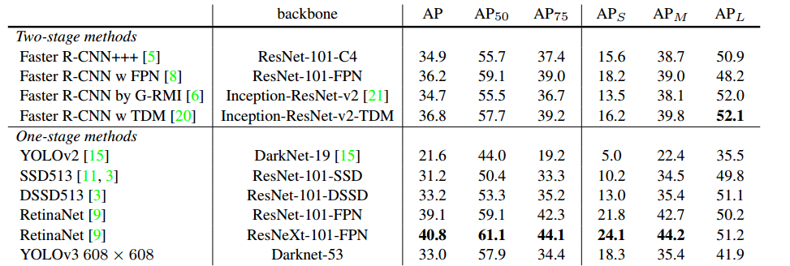

（2）小目标检测有所提升，但中等和更大尺寸的物体上的表现相对较差。


当然，YOLOv3也有些失败的尝试，并未起到有效作用，请自行查阅原始论文。


### 4）YOLOv4（2020年4月）

作者：Alexey Bochkovskiy和Chien-Yao Wang等人 

YOLOv4 将最近几年 CV 界大量的研究成果集中在一套模型中，从检测速度、精度、定位准确率上有了明显改善（相对于YOLOv3，AP值和FPS分别上涨了10%和12%）。YOLOv4主要改进点有：

- 输入端。采用更大的输入图像，采用新的样本增强方法；
- 骨干网。采用新的、改进的骨干网CSPDarknet53；新的激活函数和dropout策略；
- 特征融合部分。==插入SPP，FPN+PAN等新的结构==；[[SPP、FPN与PAN详细学习笔记]]
- 输出端。采用改进的损失函数。

#### ① Backbone, Neck, Head

首先，作者提出了一个目标检测的通用框架，将一个目标检测框架分为Input，Backbone，Neck，Head几个部分：

- Input（输入）：输入部分，如图像、批次样本、图像金字塔
- Backbone（骨干网）：各类CNN，主要作用是对图像中的特征做初步提取
- Neck（脖子）：特征融合部分，主要作用是实现多尺度检测
- Head（头）：产生预测结果

YOLOv4从以上几个结构部分均进行了优化和改进，取得了较好的综合效果。

#### ② 模型结构

YOLOv4模型结构如下图所示：

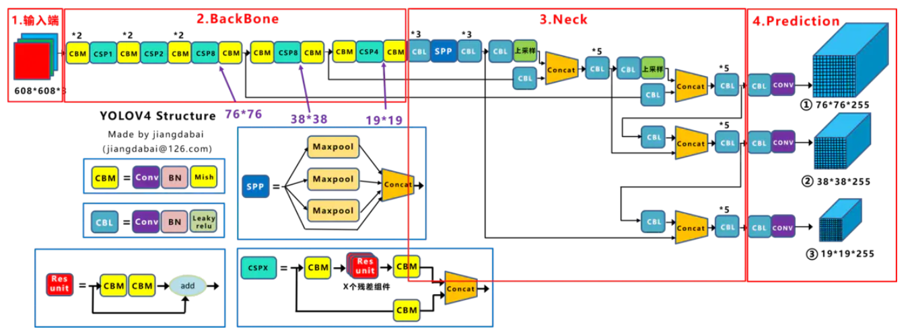

#### ③ 主要改进

- 输入端

  （1）Mosaic数据增强。Mosaic是参考2019年提出的CutMix数据增强的方式，但CutMix只使用了两张图片进行拼接，而Mosaic数据增强则采用了4张图片，随机缩放，随机裁剪，随机排布的方式进行拼接 。这样使得模型更获得更多相关或不相关的上下文信息，学习到更加鲁棒的特征。

  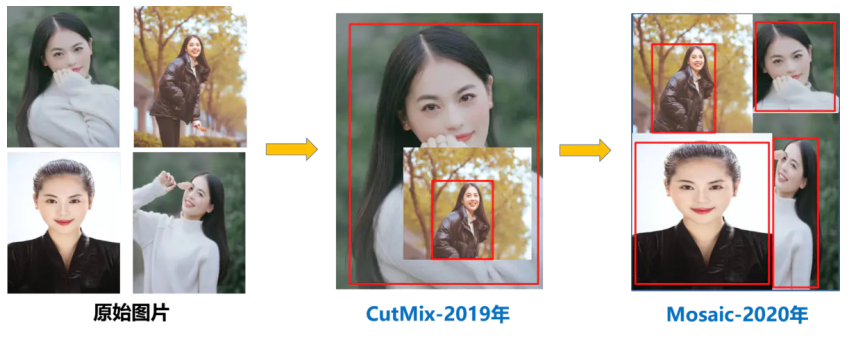

  （2）自对抗训练（SAT，Self Adversarial Trainning）。自对抗训练代表了一种新的数据增强技术，操作在两个向前后阶段。在第一阶段，神经网络改变原始图像而不是网络权值。通过这种方式，神经网络对自己进行了对抗性的攻击，改变原始图像来制造图像上没有需要的对象的假象。在第二阶段，训练神经网络以正常的方式在修改后的图像上检测目标。

  ```
  第一阶段:
  在原始图像上进行微小的改变(精心设计的改变),目的就是为了让模型在识别这些改变之后的图像中遇到困难,甚至预测错了.这种方式就是对自己进行对抗性的攻击,使用自我欺骗的行为揭示模型在处理当前图像中的脆弱点
  
  第二阶段:
  训练模型在这些修改后的图像上能够去正确的识别目标.意味着模型需要学会忽略那些故意添加的微小的干扰,并专注于图像中真正的重要的特征
  ```

  

  （3）CmBN（交叉小批量归一化）。BN策略可以缓解梯度消失、过拟合，增加模型稳定性。BN在计算时仅仅利用当前迭代批次样本进行计算，而CBN在计算当前时刻统计量时候会考虑前k个时刻统计量，从而实现扩大batch size操作。CmBN是CBN的修改版，CBN在第t时刻，也会考虑前3个时刻的统计量进行汇合。

- Backbone部分

  (1) DenseNet（稠密连接网络）是由Cornell大学的Gao Huang等人于2017年在CVPR顶会上发表的一篇论文，提出DenseNet（稠密连接网络）深度学习网络架构 。它的设计灵感来自于ResNet（残差网络） 的思想。

  

  在深度卷积神经网络中，通常存在梯度消失或梯度爆炸等问题，尤其是随着网络层数的增加，这种问题变得尤为严重，上篇讲到的残差网络引入了残差连接（跨层连接）来解决了这些问题，从而允许网络更深地训练，但是，ResNet中的跨层连接是通过相加的方式实现的，这意味着每一层只能直接访问前一层的输出。

  ![[img/RestNet简单示意图.png]]

  

  DenseNet（密集卷积网络）的核心思想（创新之处）是密集连接，使得每一层都与所有之前的层直接连接，即某层的输入除了包含前一层的输出外还包含前面所有层的输出。 

  ![[img/DenseNet.png]]

  

  (2) CSPNet:（Cross Stage Partial Network，跨阶段局部网络）主要用来提高学习能力同时，降低模型对资源的消耗。主要思想：在输入block之前，将输入分为两个部分，其中一部分通过block进行计算，另一部分直接通过一个CBM进行Concat

   ![[img/CSP中的Dense.png]]

  ---------

  ![[img/CSP.png]]

  

  (3) CSPDarknet53。CSPDarknet53是在YOLOv3主干网络Darknet53的基础上，借鉴2019年的CSPNet的经验，产生的Backbone结构，其中包含了5个CSP模块。 其结构如下图所示：

  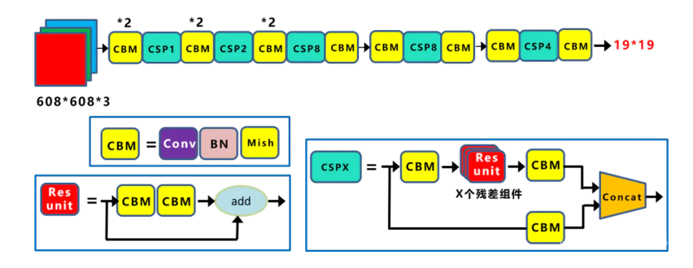

  每个CSPX中包含3+2 × X个卷积层，因此整个主干网络Backbone中一共包含
  2+（3+2×1）+2+（3+2×2）+2+（3+2×8）+2+（3+2×8）+2+（3+2×4）+1=72 个卷积层。每个CSP模块前面的卷积核大小都是3x3，步长为2，因此可以起到下采样的作用。因为Backbone有5个CSP模块，输入图像是608 x 608，所以特征图的变化规律是：608->304->152->76->38->19经过5次CSP模块后得到19*19大小的特征图。Backbone采用Mish激活函数。 

  (4) Mish激活函数。一种新的、非单调、平滑激活函数，其表达式为$f(x) = x*tanh(log(1+e^x))$,更适合于深度模型。根据论文实验，精度比ReLU略高。

  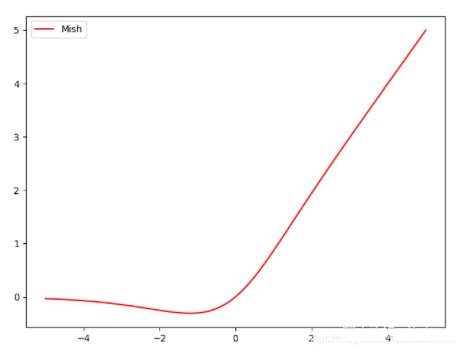

  (5) Dropblock策略。Dropblock是一种针对卷积层的正则化方法，实验在ImageNet分类任务上，使用Resnet-50结构，能够将分类精度提高1.6%，在COCO检测任务上，精度提升1.6%。其原理是在特征图上通过dropout一部分相邻的区域，使得模型学习别的部位的特征，从而表现出更好的泛化能力。

  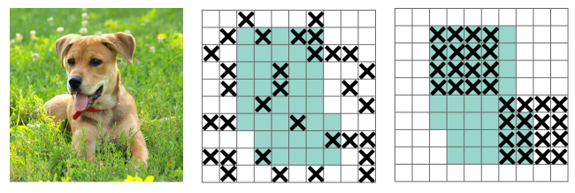

  Dropblock模块主要有两个参数，block_size和γ。其中，block_size表示区域的大小，正常可以取3，5, 7，当block_size=1时，dropout退化为传统的dropout。

- Neck部分

  （1）SPP模块。SPP模块位于Backbone网络之后，使用k={1x1, 5 x 5, 9 x 9, 13 x 13}最大池化操作，再将不同尺度的特征图进行Concat融合。

  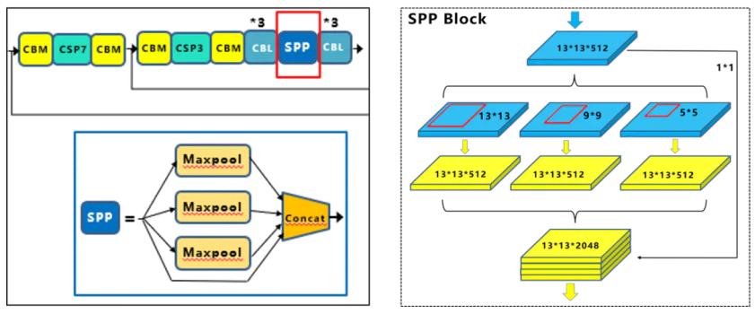

  （2）FPN + PAN. FTP指特征金字塔，其思想是将高层次卷积得到的较小特征图进行上采样，和低层次较大的特征图进行特征融合（自顶向下），这样做的优点是将高层次较强的语义特征传递下来。而PAN结构借鉴2018年图像分割领域PANet（Path Aggregation Network，路径聚合网络）的创新点，FPN的后面添加一个自底向上的特征金字塔，将低层次强定位特征传递上来（自底向上），从而形成对FPN的补充。如下图所示：

  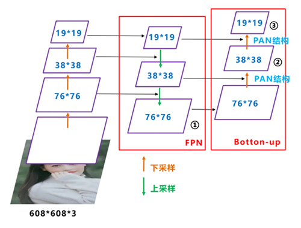

- Head部分

  （1）CIOU_loss。IOU用来度量预测定位是否准确，但存在一定的问题，如下图所示：

  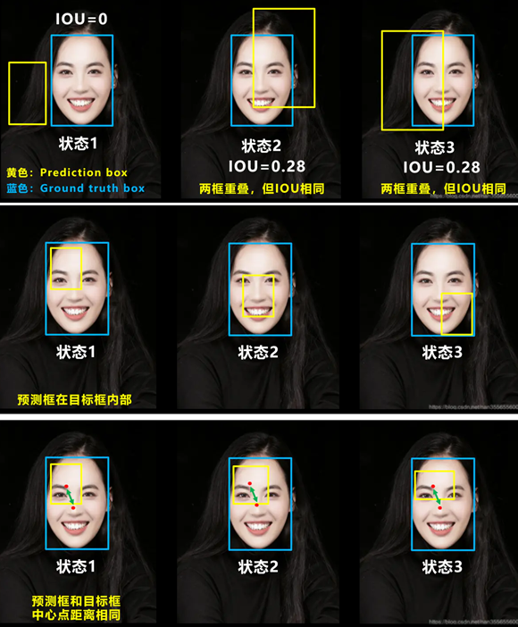

  针对以上问题，出现了几个IOU的改进策略：

  1. GIOU_loss：在IOU的基础上，解决了边界框不重合的问题

  $$
  \begin{aligned}
  GIoU &= IoU - \frac{C-U}{C}\\[4pt]
  GIoU_{loss} &= 1 - GIoU
  \end{aligned}
  $$

  其中，$C$ 表示预测框和真实框的最小闭合区域的面积，$U$ 表示预测框和真实框的并集。

  2. DIOU_loss：在IOU和GIOU的基础上，考虑了边界框中心点距离的信息（yolo v4使用的）
  $$
  \begin{aligned}
  DIoU &= IoU - \frac{\rho^2(b, b^{gt})}{c^2}\\[4pt]
  DIoU_{loss} &= 1 - DIoU
  \end{aligned}
  $$

  其中，$\rho^2(b, b^{gt})$ 表示预测框的中心点到真实框中心的欧式距离的平方，$c$ 表示预测框和真实框的最小外切矩形的对角线长度。
  
  3. CIOU_Loss: 在DIOU的基础上，考虑边界框宽高比的尺度信（yolo v5、v8、v11使用的）

  所以，CIOU_loss在定义预测box、真实box损失值时，考虑了重叠面积大小、中心点距离、长宽比例，定位更加精确。CIOU_loss定义如下：
  $$
  CIoU = IoU - \frac{\rho^2(b, b^{gt})}{c^2} - \alpha v\\
    CIoU_{loss} = 1 - CIoU
  $$
  其中，$\rho$表示欧式距离，c表示覆盖两个box的最小封闭盒子对角线长度，$\alpha$是一个正的权衡参数，v衡量长宽比的一致性，分别定义为：
  $$
  v = \frac{4}{\pi ^2}(arctan \frac{w^{gt}}{h^{gt}} - arctan \frac{w}{h})^2
  $$
  $$
  \alpha = \frac{v}{(1 - IoU) + v}
  $$

  （2）DIOU_NMS。NMS主要用于预测框的筛选，YOLOv4使用DIOU来进行NMS（即选择DIOU最大的值），实验证明在重叠目标的检测中，DIOU_NMS的效果优于传统的NMS。如下图所示：

  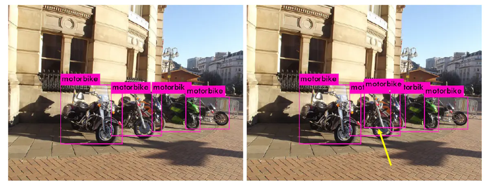

  #### ④ 效果

  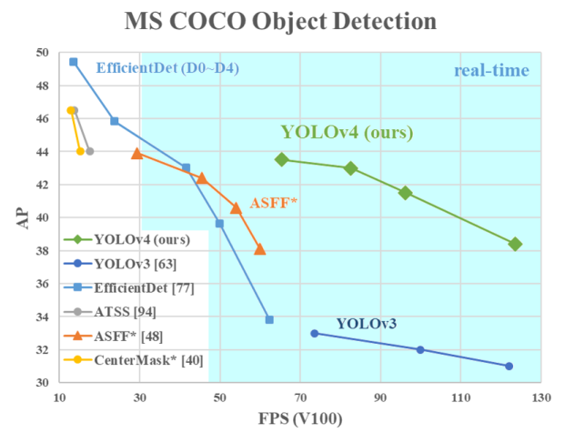

  

### 5）YOLOv5（2020年6月）

作者：Ultralytics公司

YOLOv5在YOLOv4基础上，做了一些工程和代码方面的优化。YOLOv5是否为一个独立的版本，目前还存在争议，有些人认为其创新度不够，不能称为一个独立的版本.YOLOv5没有发表论文，通过对其代码（[https://github.com/ultralytics/yolov5](https://github.com/ultralytics/yolov5)）进行分析，可以总结出一些改进优化之处。

YOLOv5提供了四个版本：Yolov5s，Yolov5m，Yolov5l，Yolov5x。其中，Yolov5s是Yolov5系列中深度最小，特征图的宽度最小的网络，后面的3种都是在此基础上不断加深，不断加宽，从而增加模型性能。

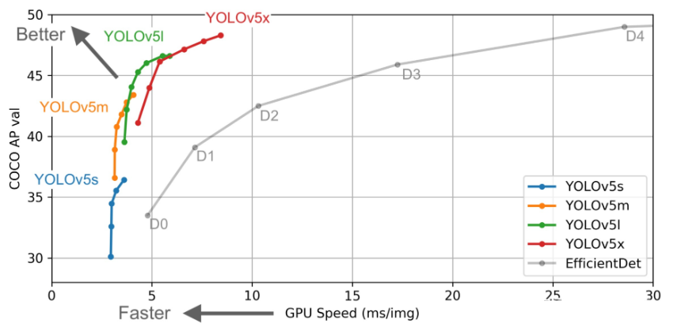

#### ① 改进

- 采用自适应锚框计算。YOLOv5针对不同数据集，采用不同配置的Anchors，每次训练时，自适应的计算不同训练集中的最佳锚框值；

- 自适应图片缩放。在常用的目标检测算法中，不同的图片长宽都不相同，因此常用的方式是将原始图片统一缩放到一个标准尺寸，再送入检测网络中。Yolov5代码中对此进行了改进，作者认为，在项目实际使用时，很多图片的长宽比不同，因此缩放填充后，两端的黑边大小都不同，而如果填充的比较多，则存在信息冗余，影响推理速度。YOLOv5对原始图像进行计算，自适应对图像添加最少的边沿部分；

  ```
  原始图像的尺寸: src_w,src_h
  目标图像的尺寸: dst_w,dst_h
  
  第一种情况: 原始图像的宽度和高度,都小于目标图像的宽度和高度,直接进行填充
  src_w:600  src_h:600
  dst_w:640  dst_h:640
  计算未匹配的边需要填充的像素数: 
  (dst_w - src_w) / 2 = (640-600) / 2 = 20
  (dst_h - src_h) / 2 = (640-600) / 2 = 20
  
  ----------------
  第二种情况:原始图像的宽度和高度,至少有一边大于目标图像的宽度和高度
  src_w:720  src_h:600
  dst_w:640  dst_h:640
  分别计算水平方向和垂直方向的缩放因子
  w = dst_w / src_w = 640 / 720 = 8/9
  h = dst_h / src_h = 640 / 600 = 16/15
  选择比较小的缩放因子
  src_w * 比较小的缩放因子 = 720 * 8/9 = 640
  src_h * 比较小的缩放因子 = 600 * 8/9 = 533
  
  对于未匹配的边进行填充
  (640 - 533) / 2 = 53.5 (上边填充54,下边填充53)
  ```

  

- 加入Focus结构。YOLO5在骨干网部分加入了Focus结构，采用切片操作，将大图像降采样为通道数更多的小图像，然后进行卷积运算，提取特征，如下图所示：

  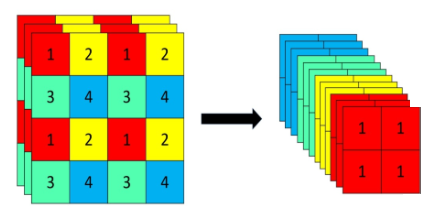

- 两种结构的CSP模块，加强网络特征融合的能力，如下图所示：

  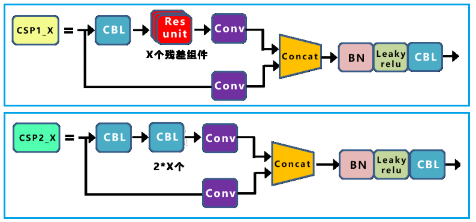

#### ② 整体结构

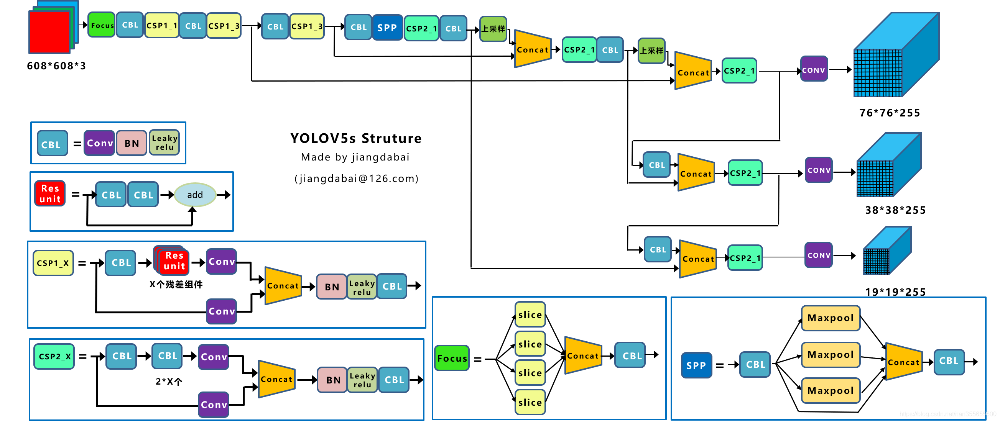

#### ③ 不同深度与宽度

以下是不同结构的深度差异：

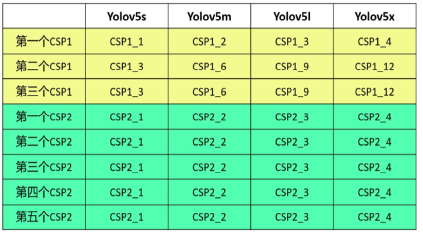

以下是不同模型的宽度差异：

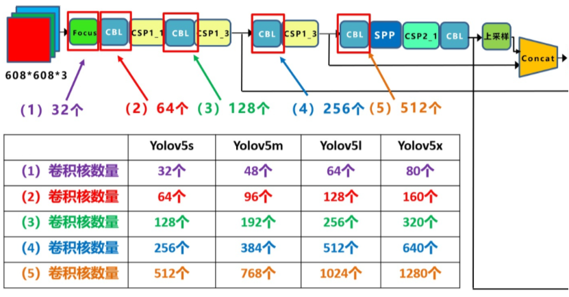

#### ④ 结论

YOLOv5虽然创新性不足，但在代码和工程方面做了很多优化，模型参数更少（YOLOv5大小仅有27M，YOLOv4为244M，两者性能相当），使用配置更加方便，更适合移动端使用，是继YOLOv3之后的又一个主流版本。


### 7）YOLOv7（2022年）

作者：Alexey Bochkovskiy和Chien-Yao Wang等人 

针对于YOLOv4、YOLOv5进行升级更新。

结构示意图：

![[img/Yolov7结构图.jpg]]


#### ① Input

input: 整体复用yolov5的预处理方式，主要在640*640和1280*1280分辨率上进行算法训练 

Mosaic数据增强 、自适应锚框计算、自适应图片缩放

#### ② Backbone

backbone:  ELAN（E-ELAN） + MP结构 

- ELAN

ELAN网络是在CSPnet的基础上改进的一个网络，它的网络结构具备更多的分支以及更少的卷积核，论文作者通过实验证明了这种方式是有效的。 

在深度学习中，不同层的特征图包含了不同尺度和语义级别的信息。浅层特征图通常包含更多的细节和边缘信息，而深层特征图则包含更丰富的语义和上下文信息。ELAN通过设计特定的聚合模块，将不同层的特征图进行有效地融合，从而使模型能够同时利用到这些不同尺度和语义级别的信息，提高检测性能。 

![[img/ELAN.png]]

其中图( c ) 为ELAN网络的具体结构。ELAN它消除了网络中的1x1卷积concat的操作，转换成了3x3卷积直接输出，在最后再进行concat的方式，从直观上看来，它保留了残差连接，但卷积数减少了。且论文作者提出这种方式会带来更少更长的梯度路径，更容易收敛。


Partial Convolution （部分卷积）:部分卷积是一种特殊的卷积操作，它在处理图像数据时，只关注有效区域（即非零或非掩码区域）的像素值，并据此进行卷积计算。这种操作方式使得部分卷积在处理具有不规则形状或缺失数据的图像时表现出色。 

![[img/ELAN代码图.png]]

- E-ELAN

作者还提出了E-ELAN，是ELAN的扩展版本。 

![[img/E-ELAN.png]]

它是将俩个ELAN网络合并了，通过俩个一样的ELAN网络最后用add的方式合并输出。 


![[img/E-ELAN代码图.png]]

从上图可以发现，第2层至第23层为E-ELAN网络，其中第3层-第11层为第一个ELAN网络，第13层-第22层为第2个ELAN网络，最后用add方式叠加输出。ELAN网咯中，3x3的卷积多了俩个，同时最后concat时变成了5个，这与论文给的图是不一致的，论文图中的E-ELAN只用了4个分支，这里用了5个。


- MP模型

MP模块是YOLOv7中用于下采样的一个模块，它通过对输入特征图进行下采样操作，从而生成具有更小空间分辨率但更丰富语义信息的特征图。 

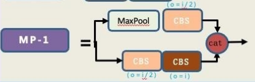

下采样我们通常最开始使用maxpooling，之后大家又都选用stride = 2的3*3卷积。这里作者充分发挥：“小孩子才做选择，成年人都要”的原则，同时使用了max pooling 和 stride=2的conv。  


- SiLU（Swish）激活函数

公式：$f(x) = x * sigmoid(x) $

1) SiLU激活函数图像如下，相对于ReLU激活函数，它在x轴的负半轴有段向下的曲线：

2) 正数区域内，SiLU 函数的输出与 ReLU 函数的输出相同。

3) 在负数区域内，SiLU 函数的输出与 sigmoid 函数的输出相同。

4) SiLU 函数在整个定义域内都是可微的，这使得在反向传播过程中的梯度计算更加稳定。

![[img/SiLU.png]]


#### ③ Neck

- SPPCSPC

SPPCSPC结合了Spatial Pyramid Pooling（SPP）和Cross Stage Partial Networks（CSPN）的概念 。SPPCSPC模块的主要功能是提取和整合多尺度特征，提高模型对目标位置和大小变化的鲁棒性，同时保持较高的计算效率。 

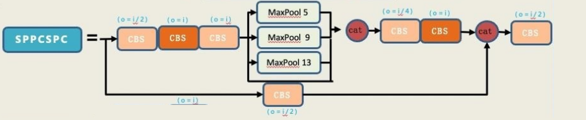

SPPCSPC模块通常由多个卷积层、SPP层和CSP结构组成。其中，SPP层用于整合不同尺度的上下文信息，CSP结构则用于减少计算量并保持模型的表达能力 。

```
SPP的作用是能够增大感受野，使得算法适应不同的分辨率图像，它是通过最大池化来获得不同感受野。
在第一条分支中，经理了maxpool的有四条分支。分别是5，9，13，1，这四个不同的maxpool就代表着他能够处理不同的对象。也就是说，它这四个不同尺度的最大池化有四种感受野，用来区别于大目标和小目标
比如一张照片中的狗和行人以及车，他们的尺度是不一样的，通过不同的maxpool，这样子就能够更好的区别小目标和大目标。
CSP模块，首先将特征分为两部分，其中的一个部分进行常规的处理，另外一个部分进行SPP结构的处理，最后把这两个部分合并在一起，这样子就能够减少一半的计算量，使得速度变得快，精度反而会提升。
```

- ELAN-W

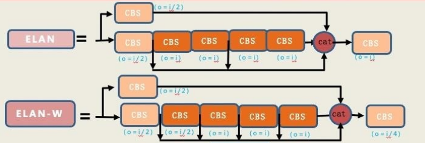

对于ELAN-W模块，它跟ELAN模块是非常的相似，所略有不同的就是它在第二条分支的时候选取的输出数量不同。ELAN模块选取了三个输出进行最后的相加。ELAN-W模块选取了五个进行相加。


#### ④ Head

- RepConv

RepConv（re- parameterization VGG重参数化Conv） 是由旷视科技团队于 2021 年提出的深度卷积神经网络架构，它通过重参数化(重参数化通常涉及将一个复杂的参数表达形式转换为一个更简单或更易于处理的表达形式）Conv 架构，显著提高了模型的性能和效率。

对于RepConv来说，就是在训练阶段会训练一个多分支模型，然后利用重参数化将多分支模型等价转换为单路模型，最后在推理时使用单路模型。为什么要这样做呢？因为在训练过程中往往多分支的结构会得到更高的性能收益，即在训练时采用多分支结构来提升网络性能，在推理时，将多分支结构转化为单路结构，这样会使推理速度大大加快。

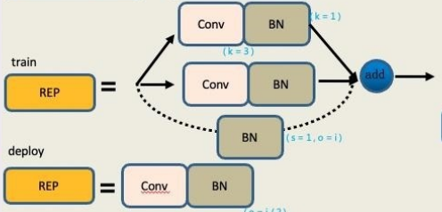


RepVGG推理模型具有一个类似于VGG的拓扑结构，没有任何分支，推理模型只采用了3x3的卷积核和Relu激活函数。 

![[img/RepVGG训练.png]]

从上图我们可以看出，在RepVGG的训练阶段，其结构借鉴了ResNet，同时引入了残差结构和1x1的卷积分支，在论文中也证明了加入残差结构和1x1的卷积均可以提升网络的性能，如下图所示： ![[img/RepVGG精度.png]]


多路模型转单路模型：re- parameterization（重参数化）要做的其实就是要将多路模型转成单路模型。 多路模型指的就是在训练阶段的模型，而单路模型指的是在推理阶段的模型 。

![[img/RepVGG多路转单路.png]]


下图描述了多路模型转换成单路模型的过程，从①到②涉及到了将3x3卷积和BN层的合并、1x1卷积转换为3x3卷积及残差模块等效为特殊权重的卷积层。 

![[img/Rep多路转单路示意图.png]]

**从①到②的转换**

1) 3x3卷积和BN层的合并

![[img/CONV和BN合并.png]]

2) 1x1卷积转换为3x3卷积

对于1x1卷积核，为了将其转换为3x3卷积核，可以在其原始权重周围补一圈零。这样，1x1卷积核就变成了3x3卷积核，但其中只有中心的一个元素是原始的权重，其余元素均为零。


3) 残差模块转换为3x3卷积

残差模块就是一个恒等映射，即要求输入等于输出。使用卷积核权重为1的1x1卷积，因为这样的卷积核不会改变输入特征图的值，这样就可以将残差模块等效为1x1的卷积操作了。之后再利用第2步将1x1的卷积转化成3x3的卷积。 


**从②到③的转换**：将含有3路3x3卷积的结构变换成只有1路3x3卷积的结构

1）卷积的可加性原理：如果几个大小兼容的二维核在相同的输入上以相同的步幅操作以产生相同分辨率的输出，并且它们的输出被求和，我们可以将这些核在相应的位置相加，从而得到一个产生相同输出的等效核。

![[img/卷积原理可加性1.png]]

![[img/卷积原理可加性2.png]]

不管是先进行卷积得到结果后再进行Add操作，还是先将卷积核的值先相加得到新的卷积核，然后再进行卷积，所得到的结果是一样的，这就是卷积的可加性。 

由此可知，我们将②变为③其实只需要将三个3x3的卷积核的值进行相加即可 。

====

#### ⑤ loss

$\text{LocLoss} = \sum_{i=0}^{S^2} \sum_{j=0}^{B} \mathbb{1}_{ij}^{\text{obj}} \left[ (x_i - \hat{x}_i)^2 + (y_i - \hat{y}_i)^2 + (w_i - \hat{w}_i)^2 + (h_i - \hat{h}_i)^2 \right]$

其中 :$ S^2 $ 是网格单元的数量。
$ B $ 是每个网格单元预测的边界框数量。
$ \mathbb{1}_{ij}^{\text{obj}} $ 表示第 $ i $ 个网格单元的第 $ j $ 个边界框是否负责预测某个目标（1表示负责，0表示不负责）。
$ (x_i, y_i, w_i, h_i) $ 是真实边界框的中心坐标和宽高。
$ (\hat{x}_i, \hat{y}_i, \hat{w}_i, \hat{h}_i) $ 是预测边界框的中心坐标和宽高。


$\text{ObjLoss} = \sum_{i=0}^{S^2} \sum_{j=0}^{B} \mathbb{1}_{ij}^{\text{obj}} \left( C_i - \hat{C}_i \right)^2 + \lambda_{\text{noobj}} \sum_{i=0}^{S^2} \sum_{j=0}^{B} \mathbb{1}_{ij}^{\text{noobj}} \left( C_i - \hat{C}_i \right)^2$

其中：
 $ C_i $ 是真实置信度（如果边界框包含目标则为1，否则为0）。
 $ \hat{C}_i $ 是预测置信度。
$ \lambda_{\text{noobj}} $ 是无目标边界框的权重（通常小于1，以减少对无目标边界框的关注）。
$ \mathbb{1}_{ij}^{\text{noobj}} $ 表示第 $ i $ 个网格单元的第 $ j $ 个边界框是否不负责预测某个目标。


$\text{ClassLoss} = \sum_{i=0}^{S^2} \mathbb{1}_{i}^{\text{obj}} \sum_{c \in \text{classes}} \left( p_i(c) - \hat{p}_i(c) \right)^2$

其中：
$ \mathbb{1}_{i}^{\text{obj}} $ 表示第 $ i $ 个网格单元是否负责预测某个目标。
$ p_i(c) $ 是真实类别概率（对于类别 $ c $）。
$ \hat{p}_i(c) $ 是预测类别概率（对于类别 $ c $）。


$\text{TotalLoss} = \lambda_{\text{loc}} \cdot \text{LocLoss} + \lambda_{\text{obj}} \cdot \text{ObjLoss} + \lambda_{\text{cls}} \cdot \text{ClassLoss}$

其中:$ \lambda_{\text{loc}} $、$ \lambda_{\text{obj}} $ 和 $ \lambda_{\text{cls}} $ 是各个损失函数的权重。这些权重通常通过实验进行调优，以在特定数据集上获得最佳性能。 

#### ⑥ 结论

在 5FPS 到 160 FPS的范围内，YOLOv7 的速度和精度都超过了所有已知的目标检测器。在 V100 上所有已知的 30 FPS或更快的实时目标检测器中，YOLOv7 的准确率最高，AP 达到 56.8%。YOLOv7-E6 目标检测器 (56 FPS， 55.9% AP)，相比基于 transformer 的检测器 SWIN-L Cascade-Mask R-CNN (9.2 FPS, 53.9% AP)，在速度上要高出 509%，在精度上高出 2%；相比于基于 卷积 的检测器 ConvNeXt-XL Cascade-Mask R-CNN (A100 上 8.6 FPS, 55.2% AP)，在速度上高出 551%，在精度上高出 0.7%。 

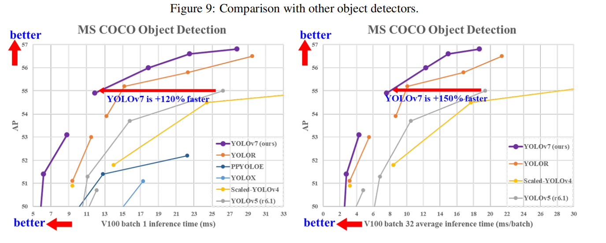

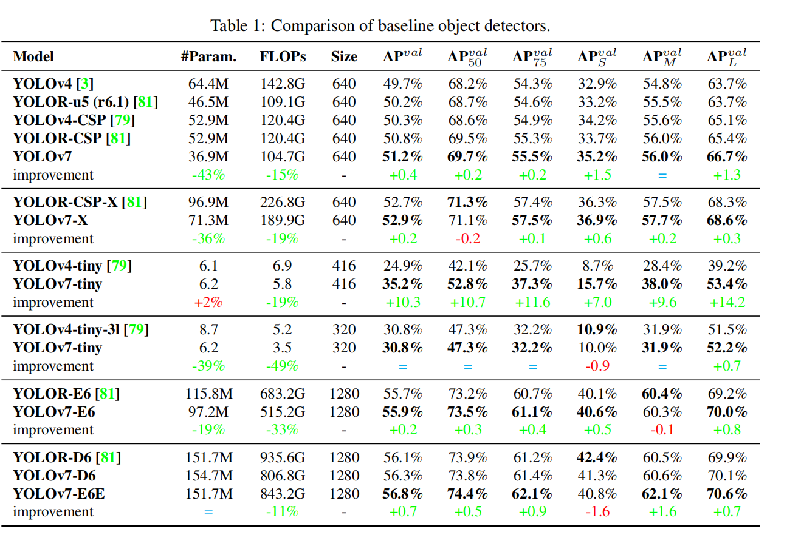


### 8）YOLOv8（2023年）

作者：Ultralytics公司

2023年Ultralytics公司发布了YOLO的最新版本YOLOv8是结合前几代YOLO的基础上的一个融合改进版。 YOLOv8是基于YOLOv5等多个前代模型进行改进和优化而来的，同时也借鉴了YOLOv7等模型的设计优点。 

![[img/YOLOv8网络结构.png]]


#### ① Backbone

- 卷积模块(Conv)

主要结构为一个2D的卷积一个BatchNorm2d和一个SiLU激活函数 

![[img/YOLOv8中的卷积.png]]

整个卷积模块的作用 :

1. 降采样：每个卷积模块中的卷积层都采用步长为2的卷积核进行降采样操作，以减小特征图的尺寸并增加通道数。

2. 非线性表示：每个卷积层之后都添加了Batch Normalization（批标准化）层和SiLU激活函数，以增强模型的非线性表示能力。

   

- C2f模块(CSPLayer_2Conv)

在YOLOv8的网络结构中C2f模块算是YOLOv8的一个较大的改变，与YOLOv5的C3模块相比，C2f模块具有更少的参数量和更优秀的特征提取能力。 

![[img/yoloV8_c2f.png]]

在C2f模块中我们可以看到输入首先经过**一个k=1，s=1，p=0，c=c_out**的卷积模块进行了处理，然后经过一个split处理**(在这里split和后面的concat的组成其实就是所谓的残差模块处理)**经过数量为n的DarknetBottleneck模块处理以后将残差模块和主干模块的结果进行Concat拼接在经过一个卷积模块处理进行输出。  在C2f模块中用到的DarknetBottleneck模块其中使用多个3x3卷积核进行卷积操作，提取特征信息。同时其具有add是否进行残差链接的选项。 

作用(整个C2f模块就是一个改良版本的Darknet)：

1. 首先，使用1x1卷积核将输入通道数减少到原来的1/2，以减少计算量和内存消耗。
2. 然后，使用多个3x3卷积核进行卷积操作，提取特征信息。
3. 接着，使用残差链接，将输入直接加到输出中，从而形成了一条跨层连接。
4. 最后，再次使用1x1卷积核恢复特征图的通道数。


- SPPF模块 

  YOLOv8的SPPF模块相对于YOLOv5的SPPF模块并没有任何的改变。 

  

```
backbone:
  # [from, repeats, module, args]
  - [-1, 1, Conv, [64, 3, 2]]   输出通道数为64，卷积核大小为3x3，步长为2
  - [-1, 1, Conv, [128, 3, 2]]  输出通道数为128，卷积核大小为3x3，步长为2
  - [-1, 3, C2f, [128, True]]   输出通道数为128
  - [-1, 1, Conv, [256, 3, 2]]  输出通道数为256，卷积核大小为3x3，步长为2
  - [-1, 6, C2f, [256, True]]   输出通道数为256
  - [-1, 1, Conv, [512, 3, 2]]  输出通道数为512，卷积核大小为3x3，步长为2
  - [-1, 6, C2f, [512, True]]	输出通道数为512
  - [-1, 1, Conv, [1024, 3, 2]] 输出通道数为1024，卷积核大小为3x3，步长为2
  - [-1, 3, C2f, [1024, True]]	输出通道数为1024
  - [-1, 1, SPPF, [1024, 5]]	可能表示输出通道数为1024，5表示金字塔的层数
  
  YOLOv8的yaml文件的Backbone部分，可以看到其由5个Conv模块，四个C2f模块以及一个SPPF模块组成

[from, repeats, module, args]：输入，重复的次数，模块类型，参数列表

```

 

#### ② Neck 

-  特征金字塔网络（Feature Pyramid Network, FPN） 

YOLOv8的Neck部分通常采用特征金字塔网络结构，用于处理来自Backbone的多尺度特征图。FPN + PAN. FTP指特征金字塔，其思想是将高层次卷积得到的较小特征图进行上采样，和低层次较大的特征图进行特征融合（自顶向下），这样做的优点是将高层次较强的语义特征传递下来。而PAN结构借鉴2018年图像分割领域PANet（Path Aggregation Network，路径聚合网络）的创新点，FPN的后面添加一个自底向上的特征金字塔，将低层次强定位特征传递上来（自底向上），从而形成对FPN的补充。

![[img/PAN.png]]


#### ③ Head

![[img/YOLOV8_head.png]]


- 

   

- 解耦头(Decoupled-Head) 

将原先的一个检测头分解成两个部分。 

检测头的结构如下图所示其中包含4个3×3卷积与2个1×1卷积，同时在检测头的回归分支中添加WIOU损失函数如图所示，回归头部需要计算预测框与真实框之间的位置偏移量，然后将偏移量送入回归头部进行损失计算，然后输出一个四维向量，分别表示目标框的左上角坐标x、y和右下角坐标x、y。分类头部针对于每个Anchor Free提取的候选框对其进行RoI Pooling和卷积操作得到一个分类器输出张量每个位置上的值表示该候选框属于每个类别的概率，在最后通过极大值抑制方式筛选出最终的检测结果。

![[img/YOLOv8解耦头.png]]


- Anchor-Free 

  1） Anchor-Base 

  使用预定义的锚框（Anchor Box）来匹配真实的目标框。锚框是在训练之前，通过聚类等方法在训练集上得到的一组矩形框，代表数据集中目标的主要分布和长宽尺度。

  

  预测方式：

  1.在特征图上滑动锚框，生成多个候选框。

  2.对每个候选框进行分类和回归，判断其是否包含目标以及目标的精确位置。

  3.回归过程通常是调整锚框的四个偏移量（x, y, w, h）来匹配真实的目标框。

  

  **优点：**可以产生密集的锚框，使得网络可以直接进行目标分类和边界框回归，提高了目标的召回能力。

  **缺点：**需要设定很多超参数（如尺度、长宽比等），这些参数很难设计并且会影响检测性能。同时，会产生很多冗余的框，增加了计算量和内存消耗。

  **适用场景：**适用于物体尺寸变化较小和数量较稀少的情况。

  ​	

  2） Anchor-Free 

  不需要预设的锚框。直接从特征图中推断物体的位置和大小。

  

  预测方式：

  1.避免了锚框的引入，直接预测目标的位置和大小。

  2.通常通过预测目标中心点的位置和目标的宽高来实现目标检测。另一种方式是预测目标的四个角点来确定目标的位置和大小。也可以预测中心点到目标框四条边的距离来确定目标框的位置。

  

  **优点**：不需要预设锚框，简化了模型的设计和训练过程。避免了由于锚框设置不合理导致的漏检或重复检测问题。通常具有更高的灵活性和准确性。

  **缺点**：在目标密集区域，检测结果可能会产生重叠或重复检测的问题。需要一些特殊的损失函数或结构来提高精度和稳定性。

  **适用场景**：适用于物体尺寸变化较大和数量较密集的情况。

  


- **损失函数：**$(L_{total} = \lambda_{cls} L_{cls} + \lambda_{box} L_{box} + \lambda_{dfl} L_{dfl})$

  - $(L_{cls})：分类损失（二元交叉熵 BCE）$

    - 采用逐类别独立二分类，不使用 Softmax 多分类，支持同一目标多标签场景； 每个网格点对所有类别单独计算损失，只对正样本网格计算分类损失，背景网格不参与分类回传。 
    - $L_{cls}=−\frac{1}{N_{pos}}\sum{}_{pos}\sum{}_{c=0}^{nc−1}[y_clog(σ(p_c))+(1−y_c)log(1−σ(p_c))] $
      - $(N_{pos})$：一张图中正样本网格总数
      - $(y_c)$：类别真实标签（0/1）
      - $(p_c)$：网络原始分类输出 logits，$(\sigma)$ 为 sigmoid 激活

  - $(L_{box})$：边界框回归损失（CIoU Loss）

    - $ L_{CIOU} = 1 - IoU + \frac{\rho^2(b, b^{gt})}{c^2} + \alpha v$

  - $(L_{dfl})$：分布聚焦损失 DFL

    YOLOv8 是 Anchor-Free，不直接输出 xywh，而是把每个坐标拆分为 `reg_max=16` 段离散分布：

    1. $网络输出通道：(4 \times reg_{max})，x/y/w/h 各 16 个概率；$ 
    	. $DFL 目标：让真实坐标附近区间概率尽可能大；$		 

    $L_{dfl}=−∑_{pos}[y_i log(p_i)+(1−y_i)log(1−p_i)] $
    - $(y_i)：真实坐标对应的离散区间标签； $
    - $(p_i)：网络预测该区间概率； $

  - 推理时用加权求和得到最终坐标： 

    - $coord=∑_{i=0}^{regmax−1}i⋅p_i $

  - $(\lambda_{cls},\lambda_{box},\lambda_{dfl})：平衡各损失权重超参$

  ```python
  # Ultralytics YOLOv8 默认权重
  lambda_cls = 0.5
  lambda_box = 7.5
  lambda_dfl = 1.5
  ```

  


### 11） YOLOv11（2024）

Ultralytics 于 2024 年 9 月 10 日发布了 YOLO11，它拥有卓越的准确性、速度和效率。YOLO11 在前代 YOLO 的显著进步基础上，对架构和训练方法进行了重大改进，使其成为各种计算机视觉任务的理想选择。

![[img/yolo11-1784452985181.jpeg]]

 #### ① 主要改进

- 增强特征提取： YOLO11 采用改进的主干网和颈部架构，增强了特征提取能力，从而实现更精确的目标检测。
- 优化效率和速度：改进的架构设计和优化的训练流程可实现更快的处理速度，同时保持准确性和性能之间的平衡。
- 参数更少，精度更高： YOLO11m 在 COCO 数据集上实现了更高的平均精度(mAP)，参数比 YOLOv8m 少 22%，因此在不影响精度的前提下，计算效率更高。
- 跨环境适应性： YOLO11 可以部署在各种环境中，包括边缘设备、云平台和支持 NVIDIA GPU 的系统。
- 支持的任务范围广泛： YOLO11 支持各种计算机视觉任务，例如目标检测、实例分割、图像分类、姿态估计和定向目标检测 (OBB)。

#### ② Backbone

- C3k2全新残差模块（替代C2f）

  ![[img/c3k2.png]]

  - C2f：单层 Bottleneck 串行 ,而C3k2：双层 Bottleneck 多尺度特征更丰富 
  - C3k2 特征聚合路径更短，参数量比 C2f 减少约 22% 
  - 浅层 c3k=False：轻量化，保留边缘细节 
  - 深层 c3k=True：C3k 大卷积核，强化全局语义 
  - 多层残差叠加，缓解深层网络梯度消失，小目标 AP 提升 3.2% 

  

- C2PSA （Cross-stage Partial Spatial Attention） 跨阶段部分空间注意力

  ![[img/C2PSApng.png]]

  计算流程：

  1. 输入[N, C, H, W]

  2. conv1(1×1 Conv+BN+SiLU) 通道压缩翻倍：输出 [N, 2c, H, W] 

  3. split通道切分两路： 

     支路A（直连残差）：a = [N, C, H, W] 原始特征直接保留，不做变换 

     支路B（注意力增强支路）：b = [N, C, H, W] ，支路B串行堆叠 n 个 PSABlock（默认n=2） 

  4. concat(a, b) 两路特征通道拼接 → [N, 2C, H, W] 

  5. conv2(1×1 Conv+BN+SiLU) 通道恢复为 C

  ```python
  # C2PSA 前向传播核心
  def forward(self, x):
      a, b = self.cv1(x).split((self.c, self.c), dim=1)
      b = self.m(b) # m = 堆叠PSABlock
      return self.cv2(torch.cat((a, b), 1))
  ```

  ![[img/PSA.png]]

  

- PSA（Pyramid Split Attention 金字塔拆分注意力 ）

  计算流程：

  1. 输入张量尺寸：\(B, C, H, W])

  2. 将输入总通道C平均切分为 S 组（ 0、1、…、S-1），每组通道数为 \(C'\) 

     - 对每一组分组特征，使用**不同尺寸卷积核**并行提取多尺度空间特征： 
       - 分组 0：小卷积核（3×3）捕捉微小细节、小目标纹理
       - 分组 1：中等卷积核（5×5）捕捉中等物体轮廓
       - 分组 S-1：大卷积核（7×7/9×9）捕捉全局大目标、远距离上下文

     一步完成**多尺度空间信息提取**，不用堆叠池化，同时把通道按尺度分组，为后续注意力加权做铺垫。 

  3. SE Weight module 分组通道权重计算 

     - 对 SPC 输出的 S 组特征，每组单独送入轻量化 SE 压缩激励模块： 
       - 全局平均池化 GAP：每组$\\([B,C',H,W] \rightarrow [B,C',1,1])$，压缩空间维度，只保留通道信息 
       - 两层 1×1 卷积 + 激活：学习该尺度分组的重要性权重
       - 输出 S 个一维权重向量，对应图上方 0~S-1 的彩色条

  4. Softmax 尺度权重归一化 

     - 将 S 组 SE 输出的权重全部送入 Softmax： 
       - 把 S 个权重映射到区间\([0,1]\)，所有权重之和 = 1； 
       - 含义：动态分配不同尺度分组的重要程度： 
         - 画面多小目标 → 小卷积分组 0 权重拉高 
         - 画面多大型遮挡物体 → 大卷积分组 S-1 权重拉高 解决固定卷积核无法自适应目标尺度的缺陷。 

  5. 逐元素相乘 element-wise product（⊗） 

     - 归一化后的 S 组尺度权重，分别和 SPC 输出的对应分组特征做广播逐像素相乘：
     - 权重高的分组特征做增强，权重低的背景 / 无效尺度特征做抑制； 
     - 实现：**自适应多尺度特征筛选**，自动强化当前图像匹配目标尺寸的特征，弱化无关尺度噪声。 

  6. 输出 Output 

     加权后的 S 组特征直接拼接，得到 PSA 最终输出张量 \([B, C, H, W]\)  


​	**多头 PSA 注意力**：对特征图每个像素做全局空间关联建模，自动给目标物体区域分配高权重、背景分配低权重；内置可学习位置编码，强化坐标感知，解决遮挡、密集小目标特征淹没问题。 


#### ③ Neck

- 保持 FPN 自上而下 + PAN 自下而上双向融合架构 
- 上采样使用 nearest 插值、下采样使用 stride=2 Conv 
- 三层特征 P3/P4/P5 独立融合后送入 Head 


#### ④ Head 

- YOLOv11 与 YOLOv8 均为 **Anchor-Free 无锚框解耦检测头**，整体结构框架一致 。
  - YOLOv8：分类分支使用普通 3×3 卷积，计算量大；
  - YOLOv11：Cls 分支全部替换 DWConv 深度可分离卷积，Head 整体 FLOPs 下降约 15%，推理提速。


- 损失函数（DFL 损失策略 ）
  - YOLOv8：DFL 权重 `λ_dfl=1.5` 全程固定不变，整个训练 epoch 不做任何调整； 
  - YOLOv11 新增自适应权重策略：训练前期加大 DFL 权重，侧重坐标学习；后期降低 DFL 权重，侧重分类收敛。 
  - $L_{total} = \lambda_{cls} L_{cls} + \lambda_{box} L_{box} + \lambda_{dfl}(epoch) L_{dfl}$
    - 训练前 60% epoch（坐标学习期） 
      - $λ_{dfl}=dfl_{base}×(1+0.4×(1−\frac{epoch}{0.6×total_{epochs}})) $
        - $基础值 (dfl_{base}=1.5)； $	
        - $初始最大权重：(1.5 \times 1.4 = 2.1)； $
        - 作用：放大 DFL 损失梯度，强制模型优先学习坐标离散分布，精准回归物体边缘、小目标偏移。 
    - 训练后 40% epoch（分类收敛期） 
      - $λ_{dfl}=dfl_{base}×(1+0.4×(1−\frac{epoch}{0.6×total_{epochs}})) $
        - 权重线性下降，最终收敛至 `1.5`； 
        - 同时相对提升 `λ_cls` 分类损失的占比，模型重心转向区分物体类别、抑制背景误检。 


### 12） YOLO26（2026） 

YOLO26 是Ultralytics 描述的一系列统一的实时视觉模型。它引入了原生端到端推理、更轻量级的检测头、更新的训练方案以及针对特定任务的检测头，例如检测、分割、姿态估计、分类和方向检测。

![[img/Ultralytics-YOLO26-Benchmark-E2E.jpg]]

#### ①Input

 完全保留YOLO11的基础逻辑，自适应图像缩放，默认 640 输入尺寸 ，Mosaic 四图拼接，HSV 色域扰动、随机翻转 等数据增强手段。

1. 统一渐进式多尺度训练 ：训练前期使用小分辨率稳定收敛，训练中后期逐步提升 960/1280 大分辨率采样权重，远距离微小目标泛化能力提升。 
2. 推理预处理算子融合轻量化 ：将归一化、通道转换、图像缩放等 CPU 算子合并，图片预处理耗时降低约 18%，嵌入式读图速度更快。 


#### ②Backbone

全继承 YOLO11 整套基础架构 


#### ③Neck

100% 沿用 YOLO11 双向融合拓扑，无新增 / 删除模块 


#### ④Head

1. Dual-Head 双分支检测头：引入训练与推理分离的双头架构，实现端到端无 NMS 推理。

2. 彻底移除 DFL 分布回归：简化模型，大幅提升边缘设备推理速度与兼容性。
3. Progressive Loss 渐进动态损失：动态调整训练重点，使模型收敛更平滑、泛化能力更强。


- **Dual-Head 双分支检测头**

  YOLO26 的 Head 在训练时拥有两个分支，它们共享来自 Neck 的特征，但输出和用途不同 。

  - One-to-Many 分支 (仅训练使用) 

    - 一张图 8400 个网格预测点，1 个真实物体 GT 会匹配多个网格作为正样本； 

    ```
    采用 STAL 标签分配，同一个真实物体 GT，会把周围多个网格全部设为正样本
    画面里 1 只猫（1 个 GT 框），周围 5 个网格都负责预测这只猫，5 个网格都是正样本。
    
    优点：精度高，训练初期收敛快、小目标召回高，Backbone/Neck 能充分学习物体纹理；
    缺点：推理会输出成千上万个重叠候选框，必须 NMS 过滤。
    ```

    - 推理输出大量重叠冗余框； 

    - 必须额外写 NMS 后处理代码剔除重叠框； 

    - NMS 是串行逻辑，CPU / 单片机延迟波动大、部署复杂，量化 / ONNX 导出容易算子不兼容。 

      

  - One-to-One 分支 (默认训练 + 推理，端到端) 

    - 输出张量 shape : [N,300,6]
      - 300：单张图最多输出 300 个目标（工业 / 日常场景完全够用）
      - 6：固定 6 个值 `[x1, y1, x2, y2, conf, class_id]` 左上右下坐标 + 置信度 + 类别 
    - 训练使用匈牙利二分图匹配，计算所有预测框与所有 GT 的匹配代价
      - $Cost_{i,j}=λ_{cls}⋅L_{cls}(i,j)+λ_{box}⋅L_{CIoU}(i,j)$ 
      -  对每个真实物体，只全局选出**代价最小、匹配最优的 1 个预测网格**作为唯一正样本；
      - 强制约束：1 个预测网格只能匹配 1 个 GT，不存在多对一、一对多；
      - 训练阶段就从根源消除 “同一物体多个重叠预测框”。
    - 模型直接输出筛选完毕、无重复重叠的检测框，后处理只需要**置信度阈值过滤**，省去 NMS 串行计算，CPU 推理最高提速 43%。 

    | 对比维度     | One-to-Many 一对多头 (O2M) | One-to-One 一对一头 (O2O)    |
    | ------------ | -------------------------- | ---------------------------- |
    | 输出尺寸     | [B, nc+4, 8400] 海量候选   | [B, 300, 6] 固定少量最终框   |
    | GT 匹配规则  | 1 个 GT → 多个网格正样本   | 1 个 GT → 仅 1 个最优网格    |
    | 是否需要 NMS | 是，大量重叠框必须过滤     | 否，仅置信度过滤即可         |
    | 主要使用阶段 | 仅训练辅助                 | 训练 + 推理 + 导出默认启用   |
    | 核心作用     | 稠密监督，提升训练精度     | 轻量化、无后处理、低延迟部署 |

     

- **移除 DFL 分布回归** 

  - 在 YOLO11中，模型并不直接预测边界框的坐标 `(x, y, w, h)`。它会为每个坐标预测一个离散的概率分布（将坐标范围划分为 16 个区间），然后通过 DFL 损失函数来学习这个分布，最后在推理时通过加权求和得到最终的坐标值。 

    **优点**：DFL 有助于实现更精细的像素级定位。 

    **缺点**：

    - 计算复杂：引入了大量的 softmax 运算，增加了模型的计算量。

    - 部署困难：复杂的分布解码逻辑在低功耗的 CPU 或单片机上实现起来较为困难，且与一些推理框架（如 ONNX, TensorRT）的兼容性不佳，效率低下。

      

  - 移除 DFL 相关计算 ，**直接输出 (x, y, w, h)**：回归分支直接输出四个连续的浮点数值，分别代表边界框的中心点坐标和宽高 

  

  - **速度大幅提升**：移除了大量的 softmax 和加权求和计算，使得 Head 部分的计算量显著降低。官方实测，YOLO26n 在 Xeon CPU 上的 ONNX 推理速度相比 YOLO11n 提升了 **43%**。 
  - **部署兼容性增强**：模型结构更简单，没有复杂的算子，导出为 ONNX、TensorRT 等格式时更加顺畅，对边缘设备和单片机的友好度大大提高。 

  

- **Progressive Loss 渐进动态损失** 

  YOLO11 的总损失由三部分组成：分类损失 (BCE)、框回归损失 (CIoU) 和 DFL 损失。并且，DFL 损失的权重是分阶段自适应调整的。 随着 DFL 的移除，YOLO26 的总损失简化为两部分：分类损失 (BCE) 和框回归损失 (CIoU)。Progressive Loss 的核心在于动态调整这两部分损失的权重： 

  - 训练前期：模型对目标的位置还不敏感，此时 **加大框回归损失 (CIoU) 的权重**。这迫使模型优先学习如何准确地定位目标。 
  - 训练后期：当模型的定位能力已经足够好时，**逐步提升分类损失 (BCE) 的权重**。这使得模型的学习重心转向区分不同的物体类别，并抑制背景误检。

  这种动态权重调整策略使得训练过程更符合模型的学习规律。 

  

 

### 13）ultralytics框架

Ultralytics框架是一个开源的计算机视觉和深度学习框架，旨在简化训练、评估和部署视觉模型的过程。 

1.安装环境

```
sudo pip install ultralytics -i https://pypi.tuna.tsinghua.edu.cn/simple/
```

也可以在github上搜索ultralytics，下载压缩包


#### 1) 训练模型

官网教程:https://docs.ultralytics.com/modes/train/#__tabbed_1_1

- 方式一

我们可以通过命令直接进行训练在其中指定参数，但是这样的方式，我们每个参数都要在其中打出来。 

```
# 从YAML文件构建新模型，并从零开始训练
yolo detect train data=coco8.yaml model=yolo11n.yaml epochs=100 imgz=640

# 从预训练的*.pt模型开始训练
yolo detect train data=coco8.yaml model=yolo11n.pt epochs=100 imgz=640

# 从YAML文件构建新模型，将预训练权重迁移到新模型并开始训练
yolo detect train data=coco8.yaml model=yolo11n.yaml pretrained=yolo11n.pt epochs=100 imgz=640
```

- 方式二

通过创建py文件来进行训练 

```python

from ultralytics import YOLO


def main():
    # 加载模型
    model = YOLO("yolo11n.yaml")  # 从YAML文件构建新模型
    model = YOLO("yolo11n.pt")  # 加载预训练模型（训练时推荐使用）
    model = YOLO("yolo11n.yaml").load("yolo11n.pt")  # 从YAML文件构建模型并迁移预训练权重

    # 训练模型
    results = model.train(data="coco8.yaml", epochs=100, imgsz=640)  # 使用指定数据集、训练周期和图像尺寸进行训练


if __name__ == '__main__':
    main()

```


模型训练有关的参数及其解释如下 ：

| 参数名 | 输入类型      | 参数解释              |                                                              |
| ------ | ------------- | --------------------- | ------------------------------------------------------------ |
| 0      | task          | str                   | YOLO模型的任务选择，选择你是要进行检测、分类等操作           |
| 1      | mode          | str                   | YOLO模式的选择，选择要进行训练、推理、输出、验证等操作       |
| 2      | model         | str/optional          | 模型的文件，可以是官方的预训练模型，也可以是训练自己模型的yaml文件 |
| 3      | data          | str/optional          | 模型的地址，可以是文件的地址，也可以是配置好地址的yaml文件   |
| 4      | epochs        | int                   | 训练的轮次，将你的数据输入到模型里进行训练的次数             |
| 5      | patience      | int                   | 早停机制，当你的模型精度没有改进了就提前停止训练             |
| 6      | batch         | int                   | 我们输入的数据集会分解为多个子集，一次向模型里输入多少个子集 |
| 7      | imgsz         | int/list              | 输入的图片的大小，可以是整数就代表图片尺寸为int*int，或者list分别代表宽和高[w，h] |
| 8      | save          | bool                  | 是否保存模型以及预测结果                                     |
| 9      | save_period   | int                   | 在训练过程中多少次保存一次模型文件,就是生成的pt文件          |
| 10     | cache         | bool                  | `参数cache`用于控制是否启用缓存机制。                        |
| 11     | device        | int/str/list/optional | GPU设备的选择：cuda device=0 or device=0,1,2,3 or device=cpu |
| 12     | workers       | int                   | 工作的线程，Windows系统一定要设置为0否则很可能会引起线程报错 |
| 13     | name          | str/optional          | 模型保存的名字，结果会保存到'project/name' 目录下            |
| 14     | exist_ok      | bool                  | 如果模型存在的时候是否进行覆盖操作                           |
| 15     | prepetrained  | bool                  | 参数pretrained用于控制是否使用预训练模型。                   |
| 16     | optimizer     | str                   | 优化器的选择choices=[SGD, Adam, Adamax, AdamW, NAdam, RAdam, RMSProp, auto] |
| 17     | verbose       | bool                  | 用于控制在执行过程中是否输出详细的信息和日志。               |
| 18     | seed          | int                   | 随机数种子，模型中涉及到随机的时候，根据随机数种子进行生成   |
| 19     | deterministic | bool                  | 用于控制是否启用确定性模式，在确定性模式下，算法的执行将变得可重复，即相同的输入将产生相同的输出 |
| 20     | single_cls    | bool                  | 是否是单标签训练                                             |
| 21     | rect          | bool                  | 当 `rect` 设置为 `True` 时，表示启用矩形训练或验证。矩形训练或验证是一种数据处理技术，其中在训练或验证过程中，输入数据会被调整为具有相同宽高比的矩形形状。 |
| 22     | cos_lr        | bool                  | 控制是否使用余弦学习率调度器                                 |
| 23     | close_mosaic  | int                   | 控制在最后几个 epochs 中是否禁用马赛克数据增强               |
| 24     | resume        | bool                  | 用于从先前的训练检查点（checkpoint）中恢复模型的训练。       |
| 25     | amp           | bool                  | 用于控制是否进行自动混合精度                                 |
| 26     | fraction      | float                 | 用于指定训练数据集的一部分进行训练的比例。默认值为 1.0       |
| 27     | profile       | bool                  | 用于控制是否在训练过程中启用 ONNX 和 TensorRT 的性能分析     |
| 28     | freeze        | int/list/optinal      | 用于指定在训练过程中冻结前 `n` 层或指定层索引的列表，以防止它们的权重更新。这对于迁移学习或特定层的微调很有用。 |

#### 2) 测试模型

官网教程:https://docs.ultralytics.com/modes/val/

- 方式一

```
yolo detect val model=yolo11n.pt  # 验证官方模型
yolo detect val model=path/to/best.pt  # 验证自定义模型
```

- 方式一

```python
from ultralytics import YOLO

def main():
    # 加载模型
    model = YOLO("./best.pt")  # 加载官方模型
    # 验证模型
    metrics = model.val(data='E:\Development Environment\PycharmProject\AIDTN2603\PRS_data\data.yaml')  # 无需传入参数，数据集和设置已保存
    print(metrics.box.map)  # mAP（mean Average Precision）50%-95%
    # metrics.box.map50  # mAP50（IoU阈值为0.5时的mAP）
    # metrics.box.map75  # mAP75（IoU阈值为0.75时的mAP）
    # metrics.box.maps  # 包含每个类别50%-95% mAP的列表

if __name__ == '__main__':
    main()
```

模型测试有关的参数及其解释如下 ：

| 参数名 | 类型        | 参数讲解       |                                                              |
| ------ | ----------- | -------------- | ------------------------------------------------------------ |
| 1      | val         | bool           | 用于控制是否在训练过程中进行验证/测试。                      |
| 2      | split       | str            | 用于指定用于验证/测试的数据集划分。可以选择 'val'、'test' 或 'train' 中的一个作为验证/测试数据集 |
| 3      | save_json   | bool           | 用于控制是否将结果保存为 JSON 文件                           |
| 4      | save_hybird | bool           | 用于控制是否保存标签和附加预测结果的混合版本                 |
| 5      | conf        | float/optional | 用于设置检测时的目标置信度阈值                               |
| 6      | iou         | float          | 用于设置非极大值抑制（NMS）的交并比（IoU）阈值。             |
| 7      | max_det     | int            | 用于设置每张图像的最大检测数。                               |
| 8      | half        | bool           | 用于控制是否使用半精度（FP16）进行推断。                     |
| 9      | dnn         | bool           | ，用于控制是否使用 OpenCV DNN 进行 ONNX 推断。               |
| 10     | plots       | bool           | 用于控制在训练/验证过程中是否保存绘图结果。                  |

#### 3) 推理预测

sudo apt-get install curl

```python
from ultralytics import YOLO


def main():
    model = YOLO("./best.pt")
    # 降低置信度阈值，尽可能输出所有候选框
    # 对图像列表进行批量推理
    results = model(["image1.jpg", "image2.jpg"])  # 返回一个Results对象列表

    # 处理结果列表
    for result in results:
        boxes = result.boxes  # 边界框输出的Boxes对象

        result.show()  # 在屏幕上显示结果
        result.save(filename="result.jpg")  # 将结果保存到磁盘


if __name__ == '__main__':
    main()
```

模型推理有关的参数及其解释如下 ：

| 参数名 | 类型          | 参数讲解               |                                                           |
| ------ | ------------- | ---------------------- | --------------------------------------------------------- |
| 0      | source        | str/optinal            | 用于指定图像或视频的目录                                  |
| 1      | show          | bool                   | 用于控制是否在可能的情况下显示结果                        |
| 2      | save_txt      | bool                   | 用于控制是否将结果保存为 `.txt` 文件                      |
| 3      | save_conf     | bool                   | 用于控制是否在保存结果时包含置信度分数                    |
| 4      | save_crop     | bool                   | 用于控制是否将带有结果的裁剪图像保存下来                  |
| 5      | show_labels   | bool                   | 用于控制在绘图结果中是否显示目标标签                      |
| 6      | show_conf     | bool                   | 用于控制在绘图结果中是否显示目标置信度分数                |
| 7      | vid_stride    | int/optional           | 用于设置视频的帧率步长                                    |
| 8      | stream_buffer | bool                   | 用于控制是否缓冲所有流式帧（True）或返回最新的帧（False） |
| 9      | line_width    | int/list[int]/optional | 用于设置边界框的线宽度，如果缺失则自动设置                |
| 10     | visualize     | bool                   | 用于控制是否可视化模型的特征                              |
| 11     | augment       | bool                   | 用于控制是否对预测源应用图像增强                          |
| 12     | agnostic_nms  | bool                   | 用于控制是否使用无关类别的非极大值抑制（NMS）             |
| 13     | classes       | int/list[int]/optional | 用于按类别筛选结果                                        |
| 14     | retina_masks  | bool                   | 用于控制是否使用高分辨率分割掩码                          |
| 15     | boxes         | bool                   | 用于控制是否在分割预测中显示边界框。                      |

模型进行推理的时候可以选择照片也可以选择一个视频的格式都可以。支持的视频格式有  

```
MP4（.mp4）：这是一种常见的视频文件格式，通常具有较高的压缩率和良好的视频质量

AVI（.avi）：这是一种较旧但仍广泛使用的视频文件格式。它通常具有较大的文件大小

MOV（.mov）：这是一种常见的视频文件格式，通常与苹果设备和QuickTime播放器相关

MKV（.mkv）：这是一种开放的多媒体容器格式，可以容纳多个视频、音频和字幕轨道

FLV（.flv）：这是一种用于在线视频传输的流式视频文件格式
```


#### 4) 输出模型

- 方式一

```
yolo export model=yolo11n.pt format=onnx  # 导出官方模型为ONNX格式
yolo export model=path/to/best.pt format=onnx  # 导出自定义训练模型为ONNX格式
```


- 方式二

```python
from ultralytics import YOLO


def main():
    # 加载模型
    model = YOLO("yolo11n.pt")  # 加载官方模型
    model = YOLO("path/to/best.pt")  # 加载自定义训练模型

    # 导出模型
    model.export(format="onnx")  # 将模型导出为ONNX格式


if __name__ == '__main__':
    main()
```

支持输出的格式：

```
1. ONNX（Open Neural Network Exchange）：ONNX 是一个开放的深度学习模型表示和转换的标准。它允许在不同的深度学习框架之间共享模型，并支持跨平台部署。导出为 ONNX 格式的模型可以在支持 ONNX 的推理引擎中进行部署和推理。

2. TensorFlow SavedModel：TensorFlow SavedModel 是 TensorFlow 框架的标准模型保存格式。它包含了模型的网络结构和参数，可以方便地在 TensorFlow 的推理环境中加载和使用。

3. PyTorch JIT（Just-In-Time）：PyTorch JIT 是 PyTorch 的即时编译器，可以将 PyTorch 模型导出为优化的 Torch 脚本或 Torch 脚本模型。这种格式可以在没有 PyTorch 环境的情况下进行推理，并且具有更高的性能。

4. Caffe Model：Caffe 是一个流行的深度学习框架，它使用自己的模型表示格式。导出为 Caffe 模型的文件可以在 Caffe 框架中进行部署和推理。

5. TFLite（TensorFlow Lite）：TFLite 是 TensorFlow 的移动和嵌入式设备推理框架，支持在资源受限的设备上进行高效推理。模型可以导出为 TFLite 格式，以便在移动设备或嵌入式系统中进行部署。

6. Core ML（Core Machine Learning）：Core ML 是苹果的机器学习框架，用于在 iOS 和 macOS 上进行推理。模型可以导出为 Core ML 格式，以便在苹果设备上进行部署。

这些格式都提供了不同的优势和适用场景。选择合适的导出格式应该考虑到目标平台和部署环境的要求，以及所使用的深度学习框架的支持情况。
```

模型输出的参数有如下 :

| 参数名 | 类型      | 参数解释     |                                                              |
| ------ | --------- | ------------ | ------------------------------------------------------------ |
| 0      | format    | str          | 导出模型的格式                                               |
| 1      | keras     | bool         | 表示是否使用Keras                                            |
| 2      | optimize  | bool         | 用于在导出TorchScript模型时进行优化，以便在移动设备上获得更好的性能 |
| 3      | int8      | bool         | 用于在导出CoreML或TensorFlow模型时进行INT8量化               |
| 4      | dynamic   | bool         | 用于在导出CoreML或TensorFlow模型时进行INT8量化               |
| 5      | simplify  | bool         | 用于在导出ONNX模型时进行模型简化                             |
| 6      | opset     | int/optional | 用于指定导出ONNX模型时的opset版本                            |
| 7      | workspace | int          | 用于指定TensorRT模型的工作空间大小，以GB为单位               |
| 8      | nms       | bool         | 用于在导出CoreML模型时添加非极大值抑制（NMS）                |


ultralytics项目及数据集公开网站：https://universe.roboflow.com/


# 三、目标检测数据集

## 1. PASCAL VOC

VOC数据集是目标检测经常用的一个数据集，自2005年起每年举办一次比赛，最开始只有4类，到2007年扩充为20个类，共有两个常用的版本：2007和2012。学术界常用5k的train/val 2007和16k的train/val 2012作为训练集，test 2007作为测试集，用10k的train/val 2007+test 2007和16k的train/val 2012作为训练集，test2012作为测试集，分别汇报结果。

## 2. MS COCO

COCO数据集是微软团队发布的一个可以用来图像recognition+segmentation+captioning 数据集，该数据集收集了大量包含常见物体的日常场景图片，并提供像素级的实例标注以更精确地评估检测和分割算法的效果，致力于推动场景理解的研究进展。依托这一数据集，每年举办一次比赛，现已涵盖检测、分割、关键点识别、注释等机器视觉的中心任务，是继ImageNet Challenge以来最有影响力的学术竞赛之一。

相比ImageNet，COCO更加偏好目标与其场景共同出现的图片，即non-iconic images。这样的图片能够反映视觉上的语义，更符合图像理解的任务要求。而相对的iconic images则更适合浅语义的图像分类等任务。

COCO的检测任务共含有80个类，在2014年发布的数据规模分train/val/test分别为80k/40k/40k，学术界较为通用的划分是使用train和35k的val子集作为训练集（trainval35k），使用剩余的val作为测试集（minival），同时向官方的evaluation server提交结果（test-dev）。除此之外，COCO官方也保留一部分test数据作为比赛的评测集。

## 3. Google Open Image

Open Image是谷歌团队发布的数据集。最新发布的Open Images V4包含190万图像、600个种类，1540万个bounding-box标注，是当前最大的带物体位置标注信息的数据集。这些边界框大部分都是由专业注释人员手动绘制的，确保了它们的准确性和一致性。另外，这些图像是非常多样化的，并且通常包含有多个对象的复杂场景（平均每个图像 8 个）。

## 4. ImageNet

ImageNet是一个计算机视觉系统识别项目， 是目前世界上图像识别最大的数据库。ImageNet是美国斯坦福的计算机科学家，模拟人类的识别系统建立的。能够从图片识别物体。ImageNet数据集文档详细，有专门的团队维护，使用非常方便，在计算机视觉领域研究论文中应用非常广，几乎成为了目前深度学习图像领域算法性能检验的“标准”数据集。ImageNet数据集有1400多万幅图片，涵盖2万多个类别；其中有超过百万的图片有明确的类别标注和图像中物体位置的标注。


# 五、常用图像标注工具

## 1. LabelImg

1）LabelImg 是一款开源的图像标注工具，标签可用于分类和目标检测，它是用 Python 编写的，并使用Qt作为其图形界面，简单好用。注释以 PASCAL VOC 格式保存为 XML 文件，这是 ImageNet 使用的格式。 此外，它还支持 COCO 数据集格式。

2）前置条件：安装Python3以上版本，安装Pyqt5。PyQt5安装指令如下：

```shell
pip3 install  --user PyQt5==5.14.1 --index-url https://pypi.tuna.tsinghua.edu.cn/simple/  --trusted-host https://pypi.tuna.tsinghua.edu.cn
```

3）安装方法：
第一步：下载安装包
第二步：使用Pycharm打开项目，运行labelImg.py文件；或直接运行labelImg.py文件

4）常见错误处理：

① 报错：ModuleNotFoundError: No module named 'libs.resources'

- 处理方式：   
  - 将python下scripts添加到环境变量path中
  - 在labelImg目录下执行命令：pyrcc5 -o resources.py resources.qrc
  - 将生成的resources.py拷贝到labelImg/libs/下
  - 执行labelImg.py程序

## 2. Labelme

labelme 是一款开源的图像/视频标注工具，标签可用于目标检测、分割和分类。灵感是来自于 MIT 开源的一款标注工具 Labelme。Labelme具有的特点是：

- 支持图像的标注的组件有：矩形框，多边形，圆，线，点（rectangle, polygons, circle, lines, points）
- 支持视频标注
- GUI 自定义
- 支持导出 VOC 格式用于 semantic/instance segmentation
- 支出导出 COCO 格式用于 instance segmentation

## 3. Labelbox

Labelbox 是一家为机器学习应用程序创建、管理和维护数据集的服务提供商，其中包含一款部分免费的数据标签工具，包含图像分类和分割，文本，音频和视频注释的接口，其中图像视频标注具有的功能如下：

- 可用于标注的组件有：矩形框，多边形，线，点，画笔，超像素等（bounding box, polygons, lines, points，brush, subpixels）
- 标签可用于分类，分割，目标检测等
- 以 JSON / CSV / WKT / COCO / Pascal VOC 等格式导出数据
- 支持 Tiled Imagery (Maps)
- 支持视频标注 （快要更新）

## 4. RectLabel

RectLabel 是一款在线免费图像标注工具，标签可用于目标检测、分割和分类。具有的功能或特点：

- 可用的组件：矩形框，多边形，三次贝塞尔曲线，直线和点，画笔，超像素
- 可只标记整张图像而不绘制
- 可使用画笔和超像素
- 导出为YOLO，KITTI，COCO JSON和CSV格式
- 以PASCAL VOC XML格式读写
- 使用Core ML模型自动标记图像
- 将视频转换为图像帧

## 5. CVAT

CVAT 是一款开源的基于网络的交互式视频/图像标注工具，是对加州视频标注工具（Video Annotation Tool） 项目的重新设计和实现。OpenCV团队正在使用该工具来标注不同属性的数百万个对象，许多 UI 和 UX 的决策都基于专业数据标注团队的反馈。具有的功能

- 关键帧之间的边界框插值
- 自动标注（使用TensorFlow OD API 和 Intel OpenVINO IR格式的深度学习模型）

## 6. VIA

VGG Image Annotator（VIA）是一款简单独立的手动注释软件，适用于图像，音频和视频。 VIA 在 Web 浏览器中运行，不需要任何安装或设置。 页面可在大多数现代Web浏览器中作为离线应用程序运行。

- 支持标注的区域组件有：矩形，圆形，椭圆形，多边形，点和折线


# 附录：术语表

| 英文全写                   | 英文简写 | 中文名称                                                  |
| -------------------------- | -------- | --------------------------------------------------------- |
| one stage                  |          | 一阶段检测                                                |
| two stage                  |          | 两阶段检测                                                |
| region proposal            | RP       | 候选区域（一个有可能包含待检物体的预选框）                |
| bounding boxes             | bb       | 候选框                                                    |
| Non-Maximum Suppression    | NMS      | 非极大值抑制                                              |
| selective search           | SS       | 选择搜索                                                  |
| Regions with CNN features  | R-CNN    |                                                           |
| region of interest         | RoI      | 感兴趣区域（候选区域）                                    |
| You Only Look Once         | YOLO     |                                                           |
| frame per second           | fps      | 帧每秒                                                    |
| High Resolution Classifier |          | 高分辨率分类器                                            |
| Batch Normalization        | BN       | 批量正则化                                                |
| Mean Average Precision     | mAP      | 平均精度均值                                              |
| Intersection over Union    | IOU      | 交并比（“预测的边框” 和 “真实的边框” 的交集和并集的比值） |
| Fine-Grained Features      |          | 细粒度特征                                                |
| Feature Pyramid Network    | FPN      | 特征金字塔网络                                            |

