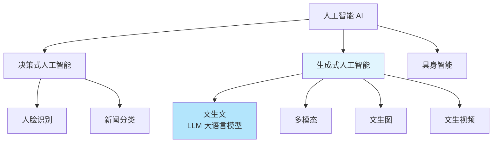
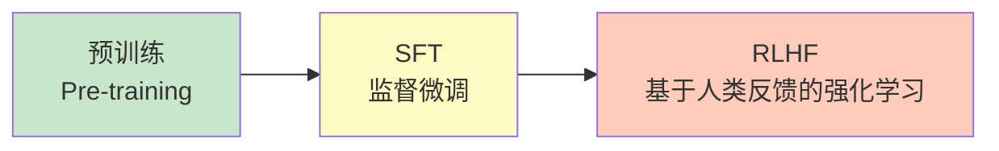
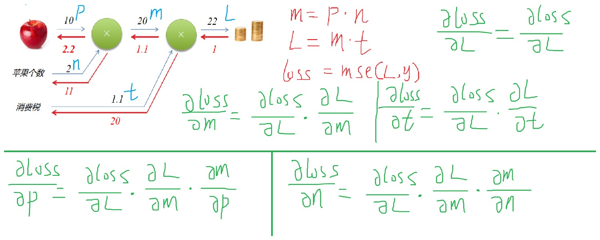
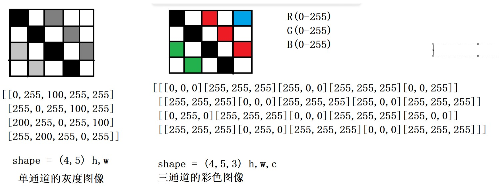

# 一、深度学习概述

## 1.1 核心三要素

深度学习可以用一个厨房比喻来理解：

| 要素 | 比喻 | 说明 |
|------|------|------|
| 算力 | 灶台 | GPU/TPU 等硬件提供计算能力 |
| 数据 | 食材 | **最重要**，数据的质量和数量决定模型上限 |
| 算法 | 菜谱 | 网络结构、优化策略等 |

大模型中的 **B** 表示 **Billion（十亿）**，用来描述模型参数量级。比如 Llama-3-8B 就是 80 亿参数。

---

## 1.2 主要应用领域

### 1.2.1 计算机视觉（Computer Vision, CV）
让机器能够理解图像中的内容，包括：
- 图像分类
- 目标检测
- 图像分割
- ……

### 1.2.2 自然语言处理（Natural Language Processing, NLP）
让机器能够理解人类所说的话和人类写的文字。

---

## 1.3 人工智能的分类



- **决策式人工智能**：对输入进行分类或预测，如人脸识别、新闻分类
- **生成式人工智能**：根据输入生成新内容
  - 文生文（LLM, Large Language Model）
  - 多模态（文本+图像+语音等）
  - 文生图、文生视频
- **具身智能**：将 AI 与物理实体（机器人）结合

---

# 二、机器学习 vs 深度学习

| 维度 | 传统机器学习 | 深度学习 |
|------|-------------|---------|
| 核心驱动 | 以算法为核心 | **以数据为核心** |
| 特征工程 | 人工设计特征 | 自动学习特征 |
| 代表方法 | SVM、决策树、随机森林 | CNN、RNN、Transformer |

> [!PDF|yellow] [[深度学习/01_AID_Deeplearning_base-2026.pdf#page=5&selection=33,7,42,1&color=yellow|01_AID_Deeplearning_base-2026, p.5]]
> > "深度学习"（Deep Learning）也有强化学习在里面，设定奖惩

---

# 三、大模型训练流程

## 3.1 三阶段训练



### 3.1.1 预训练（Pre-training）
在海量无标注数据上训练基础模型，让模型学会语言的统计规律。

### 3.1.2 SFT 监督微调（Supervised Fine-Tuning）
用高质量的问答对进行有监督训练，让模型学会对话格式：
- Q: 你是谁？
- R: 我是 xxx

### 3.1.3 RLHF 基于人类反馈的强化学习（Reinforcement Learning from Human Feedback）
引入人类偏好打分，让模型的输出更符合人类的价值观和偏好。

---

## 3.2 关键概念

### 3.2.1 自回归（Autoregressive）

模型逐个预测下一个 token。例如：

> I love deep \_\_\_\_\_

模型会计算词汇表中每个词作为下一个词的概率，选择概率最高的词（如 "learning"）作为输出。**GPT 系列就是典型的自回归模型。**

### 3.2.2 CoT 思维链（Chain of Thought）

让模型在给出最终答案之前，先一步一步推理。通过提示词引导模型「展示你的思考过程」，可以显著提升复杂推理任务的准确率。

---

# 四、深度学习基础

## 4.1 神经网络的基础知识

- 神经网络的输入数据必须是**二维数据**，但样本的特征必须是**一维特征**
- 感知机（Perceptron）本质上就是线性模型

### 4.1.1 感知机 = 线性模型

感知机是对生物神经元的数学抽象：

![[深度学习/img/生物神经元.png]]

- 输入信号加权求和后，通过激活函数输出
- 单层感知机只能解决**线性可分**问题
- 多层感知机（MLP）通过叠加非线性激活函数，可以拟合任意复杂函数

#### 补充：逻辑门详解 —— 为什么 XOR 逼出了多层网络

以上说"单层感知机只能解决线性可分问题"，这句话到底什么意思？得从逻辑门讲起。

**逻辑门是什么**

逻辑门就是把两个输入信号（0 或 1）按某种规则变成一个输出信号（0 或 1）。你可以理解成一个判断题开关——给两个条件，门电路判断"满足还是不满足"，输出 1（满足）或 0（不满足）。

```
 A ───┬─── 逻辑门 ─── Y
      │
 B ───┘
```

**六种基本逻辑门**

约定：输入 $A$ 和 $B$，输出 $Y$。每个门的名字暗示了它的规则。

| 门 | 口诀 | 输出为 1 的条件 | 符号 |
|:--:|:------|:----------------|:----:|
| AND（与门） | 全 1 才 1 | $A=1$ **且** $B=1$ | $Y = A \cdot B$ |
| OR（或门） | 有 1 就 1 | $A=1$ **或** $B=1$ | $Y = A + B$ |
| NOT（非门） | 反过来 | （单输入）$A=0$ | $Y = \bar{A}$ |
| NAND（与非门） | AND 取反 | 不是两个都是 1 | $Y = \overline{A \cdot B}$ |
| NOR（或非门） | OR 取反 | 两个都是 0 | $Y = \overline{A + B}$ |
| XOR（异或门） | 不同才 1 | $A \neq B$ | $Y = A \oplus B$ |

各门真值表（0/1 代表假/真）：

| $A$ | $B$ | AND | OR | NAND | NOR | XOR |
|:---:|:---:|:---:|:--:|:----:|:---:|:---:|
| 0 | 0 | 0 | 0 | 1 | 1 | 0 |
| 0 | 1 | 0 | 1 | 1 | 0 | **1** |
| 1 | 0 | 0 | 1 | 1 | 0 | **1** |
| 1 | 1 | 1 | 1 | 0 | 0 | 0 |

> **NAND（与非门）在数字电路中极其重要** —— 你可以只用 NAND 门搭出其他所有逻辑门，这叫 NAND 的完备性。

**为什么 XOR 是感知机的"死穴"**

把 XOR 的四个点画在坐标上（● = 输出 1，○ = 输出 0）：

```
  x₂
  ↑
  1  ●(0,1)          ○(1,1)
   │
  0  ○(0,0)          ●(1,0)
   └────────────────────────→ x₁
      0                   1
```

你**无法用一条直线**把 ● 和 ○ 分开。这就是**线性不可分（Linearly Inseparable）**。单层感知机本质上就是画一条直线做分类，所以它解不了 XOR。

Minsky 和 Papert 在 1969 年指出感知机的这个局限，直接导致了第一次 **AI Winter** —— 神经网络研究陷入低谷。

**那怎么解决？—— 加隐藏层**

XOR 可以拆成两个基本逻辑的组合：

$$
\text{XOR}(x_1, x_2) = \text{AND}\big(\ \text{OR}(x_1, x_2),\ \text{NAND}(x_1, x_2)\ \big)
$$

具体来说，用一个两层的 MLP：

| 隐藏层神经元 | 学的是什么 |
|:--:|:--|
| 神经元 1 | $x_1$ OR $x_2$（只要有一个 1 就激活） |
| 神经元 2 | $x_1$ NAND $x_2$（不是两个都是 1 就激活） |
| 输出层 | 对上面两个结果做 AND |

**代码实现：用感知机搭建逻辑门**

下面这段代码用 Python 实现了 AND 和 OR 两个单层感知机，然后**把 XOR 拆解为 AND(NAND, OR) 的组合**，正好对应上面表格中的 MLP 结构。注意每个门的阈值 $\theta$ 不同——这正是"学习"要找的参数。

```python
# 实现逻辑与（AND）
def AND(x1, x2):
    w1, w2, theta = 0.5, 0.5, 0.7
    tmp = x1 * w1 + x2 * w2
    if tmp <= theta:
        return 0
    else:
        return 1

print(AND(1, 1))  # 1
print(AND(1, 0))  # 0

# 实现逻辑或（OR）
def OR(x1, x2):
    w1, w2, theta = 0.5, 0.5, 0.2
    tmp = x1 * w1 + x2 * w2
    if tmp <= theta:
        return 0
    else:
        return 1

print(OR(0, 1))   # 1
print(OR(0, 0))   # 0

# 实现异或（XOR）—— 用 AND + OR + NAND 拼出来
def XOR(x1, x2):
    s1 = not AND(x1, x2)   # 与非门：AND 取反
    s2 = OR(x1, x2)         # 或门
    y = AND(s1, s2)         # 对上面两个结果做 AND
    return y

print(XOR(1, 0))   # 1
print(XOR(0, 1))   # 1
print(XOR(1, 1))   # 0
print(XOR(0, 0))   # 0
```

**代码逻辑走一遍**：以 `XOR(1, 0)` 为例——
- `s1 = not AND(1, 0) = not 0 = True（即 1）` ← NAND 门
- `s2 = OR(1, 0) = 1` ← OR 门
- `y = AND(1, 1) = 1` ← 输出层，与上表完全吻合

> `not AND` 利用了 Python 中 `not 0 = True`、`not 1 = False` 的特性，`True`/`False` 在算术运算中自动当作 `1`/`0`，恰好就是 NAND 的真值表。更严谨的写法是像 AND/OR 那样单独定义一个 NAND 函数（调整阈值），但这里的重点在于展示 **XOR = AND(NAND, OR)** 这个组合关系。

第一层把原始空间变到一个新空间，在这个新空间里数据变得线性可分了。这就是**加"深度"的意义**：单层只能画直线，多层可以学任意复杂的决策边界。深度学习里所有复杂模型（MLP、CNN、Transformer），本质上都是这个思路的不断推广。

如果你想了解感知机如何具体学习 AND/OR/NAND 的权重，可以参考 [[AMA564 DEEP LEARNING/Lecture 01 - 课程介绍、深度学习概览与 MLP 基础]] 的 XOR 部分。

---


### 4.1.2 矩阵相乘

- A矩阵的所有行 * B矩阵的所有列,对应位置相乘之后再相加
- A的列数 = B的行数,才能相乘
- 结果的shape = (A的行数,B的列数)
- 权重w的初始值一般为期望值为0,标准差为1的随机正态分布的数据
- 偏置b的初始值一般是0或者1


> [!PDF|yellow] [[深度学习/01_AID_Deeplearning_base-2026.pdf#page=67&selection=20,0,32,15&color=yellow|01_AID_Deeplearning_base-2026, p.67]]
> > 如果一个多层网络，使用连续函数作为激活函数的多层网络，称之为"神经网络"，否则称为"多层感知机"。所以，激活函数是区别多层感知机和神经网络的依据。
> 


```python
'''
使用python代码通过矩阵相乘的方式实现全连接神经网络的正向传播
'''

import numpy as np

x = np.array([[5.0,6.0]],dtype='float32') #(1,2)

#第一层
#权重w的初始值一般为期望值为0,标准差为1的随机正态分布的数据
#偏置b的初始值一般为0 or 1
w1 = np.random.normal(0,1,(2,3))
b1 = np.zeros(shape=(3,))
y1 = x @ w1 + b1 #(1,3)
y1 = 1.0 / (1.0+np.exp(-y1)) #sigmoid

#第二层
w2 = np.random.normal(0,1,(3,2))
b2 = np.zeros(shape=(2,))
y2 = y1 @ w2 + b2 #(1,2)
y2 = 1.0 / (1.0+np.exp(-y2))

#第三层
w3 = np.random.normal(0,1,(2,2))
b3 = np.zeros(shape=(2,))
y = y2 @ w3 + b3 #(1,2)
print(y)
```


> [!PDF|yellow] [[深度学习/01_AID_Deeplearning_base-2026.pdf#page=68&selection=16,0,24,2&color=yellow|01_AID_Deeplearning_base-2026, p.68]]
> > 阶跃函数（Step Function）是一种特殊的连续时间函数，是一个从0跳变到1的过程
> 
> 

这里要区分连续时间函数和连续函数：

|概念|英文|含义|阶跃函数|
|---|---|---|---|:-:|
|连续时间函数|Continuous-time function|定义域是连续的实数（不是离散点）|✅|
|连续函数|Continuous function|函数图像没有断点/跳变|❌|
**「连续时间」说的是横轴，「连续函数」说的是曲线本身有没有断。** ==阶跃函数==横轴连续但曲线断了，所以不属于 PDF 里说的「用连续函数作为激活函数」的神经网络，而是==多层感知机==。

### 4.1.3 激活函数

参照  [[01_AID_Deeplearning_base-2026.pdf]]  与  [[../AI知识汇总/激活函数迭代史：从Sigmoid到SwiGLU|激活函数迭代史：从Sigmoid到SwiGLU]]

1. sigmoid, Relu, Tanh常用于隐含层,Relu常用与图像模型,Tanh常用于NLP模型
2. softmax用于分类模型的输出层
3. 交叉熵度量两个概率之间的差异信息,预测概率:softmax 真实概率:独热编码

#### ① 交叉熵公式

两个概率分布 $P$（真实）和 $Q$（预测）的交叉熵：

$$
H(P, Q) = -\sum_{i} P(i) \cdot \log Q(i)
$$

翻译：**把真实概率当权重，去加权每个预测概率的负对数。**

#### ② 独热编码下的「坍缩」

因为真实分布 $P$ 是独热编码——真实类别位置为 1，其余全是 0，以狗为例：

$$
\begin{aligned}
H(P, Q) &= -\Big(0 \cdot \log Q(\text{猫}) + \mathbf{1} \cdot \log Q(\text{狗}) + 0 \cdot \log Q(\text{鸟})\Big) \\[4pt]
&= -\log Q(\text{真实类别})
\end{aligned}
$$

> **关键洞察：独热编码让交叉熵从求和退化成一个取负对数的操作**——只关心真实类别那个位置的 $-\log(\text{预测概率})$。预测越确信答案正确（概率接近 1），loss 越接近 0；预测越离谱（概率接近 0），loss 往无穷大飙。

$$
\begin{cases}
\text{预测概率} = 0.90 &\Rightarrow -\log(0.90) = \mathbf{0.105}\ \text{✅}\\[4pt]
\text{预测概率} = 0.01 &\Rightarrow -\log(0.01) = \mathbf{4.605}\ \text{❌}
\end{cases}
$$

```python
'''
交叉熵
'''
import numpy as np

#0,1,2,3,4
y_true = [0,0,0,1,0] # 3
pred_y1 = [0.1,0.1,0.1,0.6,0.1] # 3,60%
pred_y2 = [0.1,0.1,0.05,0.7,0.05] # 3,70%
pred_y3 = [0.1,0.05,0.02,0.8,0.03] # 3,80%

total_entropy1 = 0.0
total_entropy2 = 0.0
total_entropy3 = 0.0

for i in range(len(y_true)):
	total_entropy1 += y_true[i] * np.log(pred_y1[i])
	total_entropy2 += y_true[i] * np.log(pred_y2[i])
	total_entropy3 += y_true[i] * np.log(pred_y3[i])

print('交叉熵1:',-total_entropy1)
print('交叉熵2:',-total_entropy2)
print('交叉熵3:',-total_entropy3)
```


---

### 4.1.4 损失函数


### 4.1.5 梯度下降


### 4.1.6 反向传播算法

[[../机器、深度学习额外笔记/反向传播过程.pdf|反向传播过程]]




## 4.2 神经网络的改进

### 4.2.1 卷积神经网络

直观感受：

![[AMA564 DEEP LEARNING/Lecture4.pdf#page=80&rect=3,54,716,474&color=yellow|Lecture4, p.80]]
![[AMA564 DEEP LEARNING/Lecture4.pdf#page=81&rect=5,76,716,427&color=yellow|Lecture4, p.81]]


图像理解：

1. 灰度图像和彩色图像的量化表示
2. 卷积核的尺寸一般都是奇数,尺寸为nxn
3. 输入图像的尺寸(w,h) 通过卷积之后,特征图的尺寸和输入图像的尺寸一致,叫做同维卷积
4. 有几个卷积核,就有几个通道的输出
5. 卷积层中权重的个数: 输入通道数 x 卷积核尺寸x 卷积核的个数
6. 有几个卷积核就有几个偏置





**卷积核的核心规则**

三句话概括卷积层的工作方式：

> - 一个卷积核负责生成**一个**输出通道
> - 卷积核的深度**必须等于**输入通道数
> - 卷积核的**个数**决定输出通道数

---

**5×5 标准卷积：空间 + 通道同时融合**

![[AMA564 DEEP LEARNING/Lecture4.pdf#page=63&rect=18,104,676,466|Lecture4, p.63]]


输入是一张 $32 \times 32$ 的 RGB 图像（3 通道）：

```
输入: 32 × 32 × 3
       ↓  6 个 5×5×3 卷积核（6 filters）
输出: 28 × 28 × 6
```

每个卷积核的维度是 $5 \times 5 \times 3$：$5 \times 5$ 是空间窗口，$3$ 对应输入通道数。6 个卷积核 $\Rightarrow$ 6 个输出通道。

空间尺寸从 32 缩小到 28，是因为 $5 \times 5$ 卷积核无 padding、stride=1：

$$
\text{输出尺寸} = 32 - 5 + 1 = 28
$$

第二层同理，输入变成 $28 \times 28 \times 6$：

```
输入: 28 × 28 × 6
       ↓  10 个 5×5×6 卷积核
输出: 24 × 24 × 10
```

注意卷积核深度自动变成了 6，匹配上一层输出通道数。

---

**1×1 卷积：只看当前位置，只混合通道**

![[AMA564 DEEP LEARNING/Lecture4.pdf#page=65&rect=30,42,691,415|Lecture4, p.65]]


输入 $56 \times 56 \times 64$（64 个通道），用 32 个卷积核：

```
输入: 56 × 56 × 64
       ↓  32 个 1×1×64 卷积核
输出: 56 × 56 × 32
```

每个卷积核是 $1 \times 1 \times 64$：空间上看单个像素，但通道维度上是完整的 64 维向量。一个卷积核做的是：

$$
x_1 w_1 + x_2 w_2 + \cdots + x_{64} w_{64} + b
$$

即 64 个通道的加权求和，得到一个数。32 个卷积核 $\Rightarrow$ 每个位置输出 32 个数。

空间尺寸不变（$56 - 1 + 1 = 56$），所以 $1 \times 1$ 卷积的本质是：

> **不混合空间邻居，只在通道维度上做线性组合。** 可以理解成对每个像素位置的 64 维向量做一次全连接，压缩（或升维）到 32 维。

这也是为什么 $1 \times 1$ 卷积在 GoogLeNet、ResNet 里大量出现——它能灵活控制通道数，几乎不增加计算量。


![[深度学习/01_AID_Deeplearning_base-2026.pdf#page=134&rect=58,40,641,318&color=yellow|01_AID_Deeplearning_base-2026, p.134]]


---

**两种卷积对比**

| | 5×5 卷积 | 1×1 卷积 |
|---|:---:|:---:|
| 空间感受野 | 5×5 邻域 | 单个像素（不看邻居） |
| 通道操作 | 融合所有输入通道 | 融合所有输入通道 |
| 空间尺寸 | 缩小 | 不变 |
| 用途 | 提取空间特征 | 通道压缩/升维/融合 |

#### ① 计算机视觉任务概述

计算机视觉的核心目标是**让机器理解图像中的内容**，主要包含三大任务：

| 任务 | 粒度 | 说明 |
|------|------|------|
| 图像分类 | 整张图 | 判断图像属于哪个类别 |
| 目标检测 | 局部区域 | 对局部区域分类 **+** 定位（画框） |
| 图像分割 | 像素级 | 对每个像素进行分类 |

---

**纯图像 vs 深度学习中的卷积**

| | 纯图像处理（OpenCV） | 深度学习 |
|---|---|---|
| 谁来理解图像 | 人 | 模型 |
| 卷积核权重 | **人为设定** | **模型自己学习** |
| 典型操作 | 边缘检测、模糊、锐化 | 自动提取特征 |

一句话总结：**纯图像是人写规则、机器执行；深度学习是人给数据、机器自己学规则。**

---

无论图像分类、目标检测还是图像分割，**都需要通过卷积提取特征**。随着网络层数加深，卷积核数量通常逐层翻倍——浅层学边缘纹理，深层学语义概念。

![[assets/深度学习课堂笔记/file-20260709104744231.png]]
![[assets/深度学习课堂笔记/file-20260709105125522.png]]

---

#### ② LeNet-5

![[深度学习/01_AID_Deeplearning_base-2026.pdf#page=148&rect=38,52,674,389&color=yellow|01_AID_Deeplearning_base-2026, p.148]]

---

#### ③ AlexNet

![[深度学习/01_AID_Deeplearning_base-2026.pdf#page=150&rect=35,48,702,392&color=yellow|01_AID_Deeplearning_base-2026, p.150]]
![[深度学习/01_AID_Deeplearning_base-2026.pdf#page=151&rect=38,110,672,337&color=yellow|01_AID_Deeplearning_base-2026, p.151]]
![[AMA564 DEEP LEARNING/Lecture5.pdf#page=22&rect=90,30,649,204&color=yellow|Lecture5, p.22]]


**这里采用的是分布式训练！**

当单卡显存放不下模型或训练太慢时，需要多卡协同，分为两种策略：

**数据并行（Data Parallelism）**

```
┌─────────────────────────────────────────────┐
│  GPU 0          GPU 1          GPU 2        │
│  ┌──────┐       ┌──────┐       ┌──────┐     │
│  │完整模型│      │完整模型│      │完整模型│     │
│  └──────┘       └──────┘       └──────┘     │
│    ↓              ↓              ↓          │
│  数据A的梯度    数据B的梯度    数据C的梯度    │
│    └──────────┼──────────────┘              │
│               ↓ 通信聚合梯度                 │
│         统一更新一套模型参数                  │
└─────────────────────────────────────────────┘
```

- 每张卡存放**完整模型**
- 训练数据拆成多份，每张卡只拿一部分做前向 + 反向传播
- 所有卡算完梯度后，通信聚合，统一更新参数

**模型并行（Model Parallelism）**

模型太大，一张卡放不下，把模型本身拆开：

- **张量并行**：同一层内部的权重矩阵切分到多张卡（比如一个大矩阵切两半，各放一张卡）
- **流水线并行**：按层拆分——卡1放前几层，卡2放后几层。数据完整流过所有卡，完成整体计算

| 对比维度 | 数据并行 | 模型并行 |
|---------|:------:|:------:|
| 拆分对象 | 数据 | 模型 |
| 每卡持有 | 完整模型 | 部分模型 |
| 适用场景 | 模型不大、数据量大 | 模型太大、单卡放不下 |
| 通信开销 | 聚合梯度 | 传递中间激活值 |


---

#### ④ VGG

> [!PDF|yellow] [[深度学习/01_AID_Deeplearning_base-2026.pdf#page=153&selection=8,0,44,4&color=yellow|01_AID_Deeplearning_base-2026, p.153]]
> > 典型CNN介绍（VGG） • 概要介绍 VGG是Visual Geometry Group, Department of Engineering Science, University of Oxford（牛津大学工程科学系视觉几何组）的缩写，2014年参加ILSVRC （ImageNet Large Scale Visual Recognition Challenge） 2014大赛获得亚军（当年冠军为GoogLeNet，但因为VGG结构简单，应用性强，所以很多技术人员都喜欢使用基于VGG的网络）

VGG 的核心特点：
- 全部使用 **3×3 小卷积核**堆叠，替代大卷积核
- 结构简单规整，易于理解和迁移
- 虽然参数量大、计算量高，但因简洁性成为最广泛使用的 backbone 之一

![[assets/深度学习课堂笔记/file-20260709141741199.png]]

---

#### ⑤ GoogLeNet

<iframe src="https://player.bilibili.com/player.html?bvid=BV1zM24BRE1r&page=1&autoplay=0" scrolling="no" border="0" frameborder="no" framespacing="0" allow="fullscreen; picture-in-picture" allowfullscreen="true" style="height:100%;width:100%; aspect-ratio: 16 / 9;"> </iframe>
> 🎬 参考视频：[大白话讲明白GoogleNet的Inception模块](https://www.bilibili.com/video/BV1zM24BRE1r/)


> [!PDF|yellow] [[深度学习/01_AID_Deeplearning_base-2026.pdf#page=156&selection=8,0,19,6&color=yellow|01_AID_Deeplearning_base-2026, p.156]]
> > 典型CNN介绍（GoogLeNet） • GoogLeNet包含大量Inception并行卷积结构

GoogLeNet 的核心创新是 **Inception 模块**——在同一层并行跑多个不同尺寸的卷积（1×1、3×3、5×5），然后把结果 concat 在一起，让网络自己选择用哪个尺度的特征。

![[assets/深度学习课堂笔记/file-20260709142608777.png]]

> [!NOTE]
> 这里使用不同的卷积核尺寸是因为要让模型学习不同的感受野！！
> 
> **感受野（Receptive Field）**：特征图上一个特征值，对应原始图像中多大区域的像素。
> 
> - **感受野大** → 能看到物体的更大范围，语义理解强，但细节信息损失多
> - **感受野小** → 看到的范围小，但细节表达清晰
> - 卷积核尺寸越大，感受野越大；层数越深，感受野也越大

**为什么要用1x1卷积核？**

Inception 里大量用了 **1×1 卷积先降维再卷积**，计算量对比一目了然：

**方案 A：直接 5×5 卷积**

| 步骤 | 参数 |
|------|------|
| 输入数据 | 100 × 100 × 128 |
| 卷积核 | 5×5, stride=1, pad=2, 256 个 |
| 输出尺寸 | 100 × 100 × 256 |
| 权重数量 | 128 × 5 × 5 × 256 = **819,200** |

**方案 B：先 1×1 降维，再 5×5 卷积**

第一步（1×1 卷积）：

| 步骤 | 参数 |
|------|------|
| 输入数据 | 100 × 100 × 128 |
| 卷积核 | 1×1, stride=1, 32 个 |
| 输出尺寸 | 100 × 100 × 32 |
| 权重数量 | 128 × 1 × 1 × 32 = 4,096 |

第二步（5×5 卷积）：

| 步骤 | 参数 |
|------|------|
| 输入数据 | 100 × 100 × 32 |
| 卷积核 | 5×5, stride=1, pad=2, 256 个 |
| 输出尺寸 | 100 × 100 × 256 |
| 权重数量 | 32 × 5 × 5 × 256 = 204,800 |

**方案 B 总权重**：$4{,}096 + 204{,}800 = 208{,}896$

**计算量对比**：

$$
\frac{208{,}896}{819{,}200} \approx 25.5\%
$$

先用 1×1 卷积把通道从 128 压到 32，再做 5×5 卷积——**输出尺寸完全一样，参数量却砍掉了近 75%**。这也是为什么 Inception 和 ResNet 里到处都有 1×1 卷积。


#### ⑥ ResNet

> [!PDF|yellow] [[深度学习/01_AID_Deeplearning_base-2026.pdf#page=157&selection=8,0,13,1&color=yellow|01_AID_Deeplearning_base-2026, p.157]]
> > 典型CNN介绍（ResNet）
> 
> 


![[AMA564 DEEP LEARNING/Lecture5.pdf#page=40&rect=19,49,714,464&color=yellow|Lecture5, p.40]]


详细阅读该笔记：
[[../机器、深度学习额外笔记/残差网络 ResNet 的核心思想|残差网络 ResNet 的核心思想]]

**后续学习内容：**
ResNet 的高效残差块 -> 初始化为什么重要 -> Xavier/He 初始化 -> Batch Normalization -> 后续 CNN 架构 DenseNet 和 GoogleNet。

参考资料  [[../assets/lecture5_44_64_annotated.html|lecture5_44_64_annotated]]


### 4.2.2 循环神经网络

词嵌入可视化 https://ronxin.github.io/wevi/
词向量可视化 https://projector.tensorflow.org

#### ① RNN

<iframe src="https://player.bilibili.com/player.html?bvid=BV1ZjawzwELN&page=1&autoplay=0" scrolling="no" border="0" frameborder="no" framespacing="0" allow="fullscreen; picture-in-picture" allowfullscreen="true" style="height:100%;width:100%; aspect-ratio: 16 / 9;"> </iframe>
> 🎬 参考视频：[一个故事讲明白RNN循环神经网络](https://www.bilibili.com/video/BV1ZjawzwELN/)

<iframe src="https://player.bilibili.com/player.html?bvid=BV1MNoRYEEVM&page=1&autoplay=0" scrolling="no" border="0" frameborder="no" framespacing="0" allow="fullscreen; picture-in-picture" allowfullscreen="true" style="height:100%;width:100%; aspect-ratio: 16 / 9;"> </iframe>
> 🎬 参考视频：[从 RNN 到 Transformer【AI入门05】](https://www.bilibili.com/video/BV1MNoRYEEVM/)

<iframe src="https://player.bilibili.com/player.html?bvid=BV1YK411F7Tg&page=1&autoplay=0" scrolling="no" border="0" frameborder="no" framespacing="0" allow="fullscreen; picture-in-picture" allowfullscreen="true" style="height:100%;width:100%; aspect-ratio: 16 / 9;"> </iframe>
> 🎬 参考视频：[揭开循环神经网络RNN模型的面纱](https://www.bilibili.com/video/BV1YK411F7Tg/)

<iframe src="https://player.bilibili.com/player.html?bvid=BV1UH4y1A7Bg&page=1&autoplay=0" scrolling="no" border="0" frameborder="no" framespacing="0" allow="fullscreen; picture-in-picture" allowfullscreen="true" style="height:100%;width:100%; aspect-ratio: 16 / 9;"> </iframe>
> 🎬 参考视频：[RNN循环神经网络 — 理解梯度消失和梯度爆炸](https://www.bilibili.com/video/BV1UH4y1A7Bg/)

#### ② LSTM

<iframe src="https://player.bilibili.com/player.html?bvid=BV1zD421N7nA&page=1&autoplay=0" scrolling="no" border="0" frameborder="no" framespacing="0" allow="fullscreen; picture-in-picture" allowfullscreen="true" style="height:100%;width:100%; aspect-ratio: 16 / 9;"> </iframe>
> 🎬 参考视频：[LSTM（长短期记忆神经网络）最简单清晰的解释来了！](https://www.bilibili.com/video/BV1zD421N7nA/)


