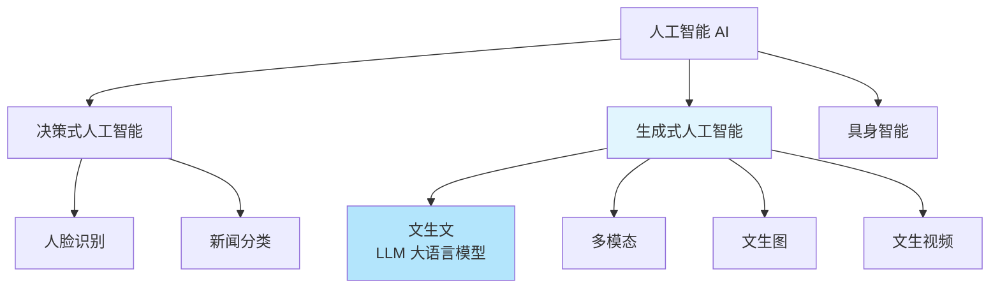
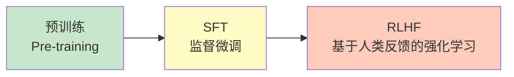

# 一、深度学习概述

## 1. 核心三要素

深度学习可以用一个厨房比喻来理解：

| 要素 | 比喻 | 说明 |
|------|------|------|
| 算力 | 灶台 | GPU/TPU 等硬件提供计算能力 |
| 数据 | 食材 | **最重要**，数据的质量和数量决定模型上限 |
| 算法 | 菜谱 | 网络结构、优化策略等 |

大模型中的 **B** 表示 **Billion（十亿）**，用来描述模型参数量级。比如 Llama-3-8B 就是 80 亿参数。

---

## 2. 主要应用领域

### 计算机视觉（Computer Vision, CV）
让机器能够理解图像中的内容，包括：
- 图像分类
- 目标检测
- 图像分割
- ……

### 自然语言处理（Natural Language Processing, NLP）
让机器能够理解人类所说的话和人类写的文字。

---

## 3. 人工智能的分类



- **决策式人工智能**：对输入进行分类或预测，如人脸识别、新闻分类
- **生成式人工智能**：根据输入生成新内容
  - 文生文（LLM, Large Language Model）
  - 多模态（文本+图像+语音等）
  - 文生图、文生视频
- **具身智能**：将 AI 与物理实体（机器人）结合

---

# 二、机器学习 vs 深度学习

| 维度 | 传统机器学习 | 深度学习 |
|------|-------------|---------|
| 核心驱动 | 以算法为核心 | **以数据为核心** |
| 特征工程 | 人工设计特征 | 自动学习特征 |
| 代表方法 | SVM、决策树、随机森林 | CNN、RNN、Transformer |

> [!PDF|yellow] [[深度学习/01_AID_Deeplearning_base-2026.pdf#page=5&selection=33,7,42,1&color=yellow|01_AID_Deeplearning_base-2026, p.5]]
> > "深度学习"（Deep Learning）也有强化学习在里面，设定奖惩

---

# 三、大模型训练流程

## 1. 三阶段训练



### 阶段 1：预训练（Pre-training）
在海量无标注数据上训练基础模型，让模型学会语言的统计规律。

### 阶段 2：SFT 监督微调（Supervised Fine-Tuning）
用高质量的问答对进行有监督训练，让模型学会对话格式：
- Q: 你是谁？
- R: 我是 xxx

### 阶段 3：RLHF 基于人类反馈的强化学习（Reinforcement Learning from Human Feedback）
引入人类偏好打分，让模型的输出更符合人类的价值观和偏好。

---

## 2. 关键概念

### 自回归（Autoregressive）

模型逐个预测下一个 token。例如：

> I love deep \_\_\_\_\_

模型会计算词汇表中每个词作为下一个词的概率，选择概率最高的词（如 "learning"）作为输出。**GPT 系列就是典型的自回归模型。**

### CoT 思维链（Chain of Thought）

让模型在给出最终答案之前，先一步一步推理。通过提示词引导模型「展示你的思考过程」，可以显著提升复杂推理任务的准确率。

---

# 四、深度学习基础

## 1. 神经网络的基础知识

- 神经网络的输入数据必须是**二维数据**，但样本的特征必须是**一维特征**
- 感知机（Perceptron）本质上就是线性模型

### 1.1 感知机 = 线性模型

感知机是对生物神经元的数学抽象：

![[深度学习/img/生物神经元.png]]

- 输入信号加权求和后，通过激活函数输出
- 单层感知机只能解决**线性可分**问题
- 多层感知机（MLP）通过叠加非线性激活函数，可以拟合任意复杂函数

#### 补充：逻辑门详解 —— 为什么 XOR 逼出了多层网络

以上说"单层感知机只能解决线性可分问题"，这句话到底什么意思？得从逻辑门讲起。

#### 逻辑门是什么

逻辑门就是把两个输入信号（0 或 1）按某种规则变成一个输出信号（0 或 1）。你可以理解成一个判断题开关——给两个条件，门电路判断"满足还是不满足"，输出 1（满足）或 0（不满足）。

```
 A ───┬─── 逻辑门 ─── Y
      │
 B ───┘
```

#### 六种基本逻辑门

约定：输入 $A$ 和 $B$，输出 $Y$。每个门的名字暗示了它的规则。

| 门 | 口诀 | 输出为 1 的条件 | 符号 |
|:--:|:------|:----------------|:----:|
| AND（与门） | 全 1 才 1 | $A=1$ **且** $B=1$ | $Y = A \cdot B$ |
| OR（或门） | 有 1 就 1 | $A=1$ **或** $B=1$ | $Y = A + B$ |
| NOT（非门） | 反过来 | （单输入）$A=0$ | $Y = \bar{A}$ |
| NAND（与非门） | AND 取反 | 不是两个都是 1 | $Y = \overline{A \cdot B}$ |
| NOR（或非门） | OR 取反 | 两个都是 0 | $Y = \overline{A + B}$ |
| XOR（异或门） | 不同才 1 | $A \neq B$ | $Y = A \oplus B$ |

各门真值表（0/1 代表假/真）：

| $A$ | $B$ | AND | OR | NAND | NOR | XOR |
|:---:|:---:|:---:|:--:|:----:|:---:|:---:|
| 0 | 0 | 0 | 0 | 1 | 1 | 0 |
| 0 | 1 | 0 | 1 | 1 | 0 | **1** |
| 1 | 0 | 0 | 1 | 1 | 0 | **1** |
| 1 | 1 | 1 | 1 | 0 | 0 | 0 |

> **NAND（与非门）在数字电路中极其重要** —— 你可以只用 NAND 门搭出其他所有逻辑门，这叫 NAND 的完备性。

#### 为什么 XOR 是感知机的"死穴"

把 XOR 的四个点画在坐标上（● = 输出 1，○ = 输出 0）：

```
  x₂
  ↑
  1  ●(0,1)          ○(1,1)
   │
  0  ○(0,0)          ●(1,0)
   └────────────────────────→ x₁
      0                   1
```

你**无法用一条直线**把 ● 和 ○ 分开。这就是**线性不可分（Linearly Inseparable）**。单层感知机本质上就是画一条直线做分类，所以它解不了 XOR。

Minsky 和 Papert 在 1969 年指出感知机的这个局限，直接导致了第一次 **AI Winter** —— 神经网络研究陷入低谷。

#### 那怎么解决？—— 加隐藏层

XOR 可以拆成两个基本逻辑的组合：

$$
\text{XOR}(x_1, x_2) = \text{AND}\big(\ \text{OR}(x_1, x_2),\ \text{NAND}(x_1, x_2)\ \big)
$$

具体来说，用一个两层的 MLP：

| 隐藏层神经元 | 学的是什么 |
|:--:|:--|
| 神经元 1 | $x_1$ OR $x_2$（只要有一个 1 就激活） |
| 神经元 2 | $x_1$ NAND $x_2$（不是两个都是 1 就激活） |
| 输出层 | 对上面两个结果做 AND |

#### 代码实现：用感知机搭建逻辑门

下面这段代码用 Python 实现了 AND 和 OR 两个单层感知机，然后**把 XOR 拆解为 AND(NAND, OR) 的组合**，正好对应上面表格中的 MLP 结构。注意每个门的阈值 $\theta$ 不同——这正是"学习"要找的参数。

```python
# 实现逻辑与（AND）
def AND(x1, x2):
    w1, w2, theta = 0.5, 0.5, 0.7
    tmp = x1 * w1 + x2 * w2
    if tmp <= theta:
        return 0
    else:
        return 1

print(AND(1, 1))  # 1
print(AND(1, 0))  # 0

# 实现逻辑或（OR）
def OR(x1, x2):
    w1, w2, theta = 0.5, 0.5, 0.2
    tmp = x1 * w1 + x2 * w2
    if tmp <= theta:
        return 0
    else:
        return 1

print(OR(0, 1))   # 1
print(OR(0, 0))   # 0

# 实现异或（XOR）—— 用 AND + OR + NAND 拼出来
def XOR(x1, x2):
    s1 = not AND(x1, x2)   # 与非门：AND 取反
    s2 = OR(x1, x2)         # 或门
    y = AND(s1, s2)         # 对上面两个结果做 AND
    return y

print(XOR(1, 0))   # 1
print(XOR(0, 1))   # 1
print(XOR(1, 1))   # 0
print(XOR(0, 0))   # 0
```

**代码逻辑走一遍**：以 `XOR(1, 0)` 为例——
- `s1 = not AND(1, 0) = not 0 = True（即 1）` ← NAND 门
- `s2 = OR(1, 0) = 1` ← OR 门
- `y = AND(1, 1) = 1` ← 输出层，与上表完全吻合

> `not AND` 利用了 Python 中 `not 0 = True`、`not 1 = False` 的特性，`True`/`False` 在算术运算中自动当作 `1`/`0`，恰好就是 NAND 的真值表。更严谨的写法是像 AND/OR 那样单独定义一个 NAND 函数（调整阈值），但这里的重点在于展示 **XOR = AND(NAND, OR)** 这个组合关系。

第一层把原始空间变到一个新空间，在这个新空间里数据变得线性可分了。这就是**加"深度"的意义**：单层只能画直线，多层可以学任意复杂的决策边界。深度学习里所有复杂模型（MLP、CNN、Transformer），本质上都是这个思路的不断推广。

如果你想了解感知机如何具体学习 AND/OR/NAND 的权重，可以参考 [[AMA564 DEEP LEARNING/Lecture 01 - 课程介绍、深度学习概览与 MLP 基础]] 的 XOR 部分。

---


### 1.2 矩阵相乘

- A矩阵的所有行 * B矩阵的所有列,对应位置相乘之后再相加
- A的列数 = B的行数,才能相乘
- 结果的shape = (A的行数,B的列数)
- 权重w的初始值一般为期望值为0,标准差为1的随机正态分布的数据
- 偏置b的初始值一般是0或者1


> [!PDF|yellow] [[深度学习/01_AID_Deeplearning_base-2026.pdf#page=67&selection=20,0,32,15&color=yellow|01_AID_Deeplearning_base-2026, p.67]]
> > 如果一个多层网络，使用连续函数作为激活函数的多层网络，称之为"神经网络"，否则称为"多层感知机"。所以，激活函数是区别多层感知机和神经网络的依据。
> 

> [!PDF|yellow] [[深度学习/01_AID_Deeplearning_base-2026.pdf#page=68&selection=16,0,24,2&color=yellow|01_AID_Deeplearning_base-2026, p.68]]
> > 阶跃函数（Step Function）是一种特殊的连续时间函数，是一个从0跳变到1的过程
> 
> 

这里要区分连续时间函数和连续函数：

|概念|英文|含义|阶跃函数|
|---|---|---|---|:-:|
|连续时间函数|Continuous-time function|定义域是连续的实数（不是离散点）|✅|
|连续函数|Continuous function|函数图像没有断点/跳变|❌|
**「连续时间」说的是横轴，「连续函数」说的是曲线本身有没有断。** ==阶跃函数==横轴连续但曲线断了，所以不属于 PDF 里说的「用连续函数作为激活函数」的神经网络，而是==多层感知机==。

### 1.3 激活函数

参照  [[01_AID_Deeplearning_base-2026.pdf]]  与  [[../AI知识汇总/激活函数迭代史：从Sigmoid到SwiGLU|激活函数迭代史：从Sigmoid到SwiGLU]]

1. sigmoid, Relu, Tanh常用于隐含层,Relu常用与图像模型,Tanh常用于NLP模型
2. softmax用于分类模型的输出层
3. 交叉熵度量两个概率之间的差异信息,预测概率:softmax 真实概率:独热编码

#### 交叉熵公式

两个概率分布 $P$（真实）和 $Q$（预测）的交叉熵：

$$
H(P, Q) = -\sum_{i} P(i) \cdot \log Q(i)
$$

翻译：**把真实概率当权重，去加权每个预测概率的负对数。**

#### 独热编码下的「坍缩」

因为真实分布 $P$ 是独热编码——真实类别位置为 1，其余全是 0，以狗为例：

$$
\begin{aligned}
H(P, Q) &= -\Big(0 \cdot \log Q(\text{猫}) + \mathbf{1} \cdot \log Q(\text{狗}) + 0 \cdot \log Q(\text{鸟})\Big) \\[4pt]
&= -\log Q(\text{真实类别})
\end{aligned}
$$

> **关键洞察：独热编码让交叉熵从求和退化成一个取负对数的操作**——只关心真实类别那个位置的 $-\log(\text{预测概率})$。预测越确信答案正确（概率接近 1），loss 越接近 0；预测越离谱（概率接近 0），loss 往无穷大飙。

$$
\begin{cases}
\text{预测概率} = 0.90 &\Rightarrow -\log(0.90) = \mathbf{0.105}\ \text{✅}\\[4pt]
\text{预测概率} = 0.01 &\Rightarrow -\log(0.01) = \mathbf{4.605}\ \text{❌}
\end{cases}
$$

---

## 2. 深度神经网络

![[深度学习/img/深度神经网络.png]]

深度神经网络（DNN）由多个隐藏层堆叠而成：
- **输入层**：接收原始数据
- **隐藏层**：逐层提取越来越抽象的特征
- **输出层**：产生最终预测

核心思想：**层次化特征学习**——低层学习简单模式（边缘、纹理），高层学习复杂语义（物体部件、完整物体）。
